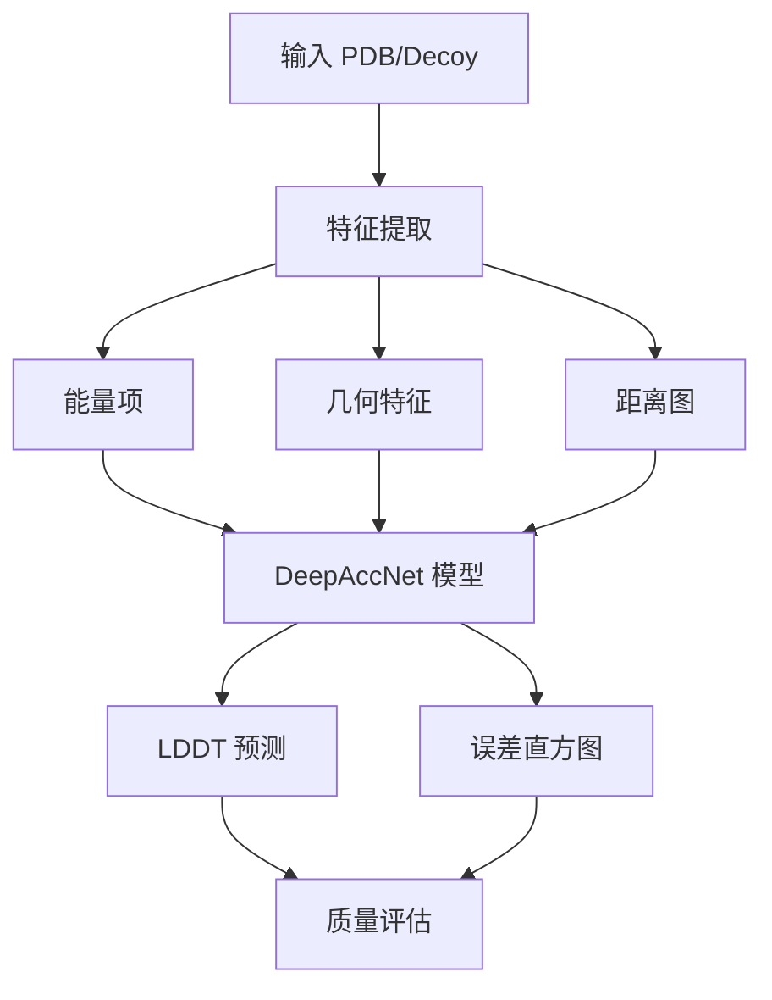

---
slug:18-deepaccnet-error-prediction
blog_type:normal
---


DeepAccNet 是一个复杂的神经网络系统，旨在通过估算局部距离差异测试（LDDT）分数和生成距离误差预测来预测蛋白质结构模型的准确性。该模块与 RoseTTAFold 流水线无缝集成，为预测结构提供质量评估。

## 架构概述

DeepAccNet 采用多轨道神经架构，处理来自蛋白质模型的结构和能量特征：



系统在 `DAN-msa/` 目录中的多个关键模块中实现，核心神经网络架构位于 [`pyErrorPred/model.py`](DAN-msa/pyErrorPred/model.py#L17)，特征提取工具位于 [`pyErrorPred/featurize.py`](DAN-msa/pyErrorPred/featurize.py#L53)。

## 核心模型架构

DeepAccNet 模型类实现了一个复杂的神经网络，具有针对不同蛋白质大小和特征类型的可配置参数：

- **单轨道大小**（`obt_size`）：残基级特征的 70 个维度
- **双轨道大小**（`tbt_size`）：成对特征的 58 个维度  
- **蛋白质大小**（`prot_size`）：大规模蛋白质的可选参数
- **分块处理**：将大蛋白质划分为 8 个块以提高内存效率

该模型支持多种架构优化，包括：
- **自注意力机制**用于捕获长程依赖关系
- **3D 卷积层**用于空间特征学习
- **部分实例归一化**用于稳定训练
- **成对特征的对称化**

## 特征工程流水线

DeepAccNet 通过多个专用函数从蛋白质结构中提取综合特征：

### 基于能量的特征
[`extract_EnergyDistM()`](DAN-msa/pyErrorPred/featurize.py#L53) 函数处理 Rosetta 能量图，提取：
- 氢键模式（bb_sc, sc）
- 范德华相互作用
- 静电项
- 溶剂化能量

### 几何特征
通过以下方式捕获结构几何：
- **键长和键角**：N-CA、CA-C、C-N 键及相关角度
- **二面角**：余弦/正弦空间中的 Phi、psi、omega 角
- **二级结构**：基于 DSSP 的分类
- **距离图**：多个原子对距离矩阵

### 序列特征
氨基酸属性通过以下方式编码：
- **物理化学性质**：大小、疏水性、电荷
- **进化信息**：位置特异性评分矩阵
- **序列分离**：相对位置编码

## LDDT 预测算法

核心质量评估指标通过 [`calculate_LDDT()`](DAN-msa/pyErrorPred/model.py#L267) 函数计算：

```python
def calculate_LDDT(self, estogram, mask, center=7):
    # 从计算中移除对角线
    mask = tf.multiply(mask, tf.ones(tf.shape(mask))-tf.eye(tf.shape(mask)[0]))
    masked = tf.transpose(tf.multiply(tf.transpose(estogram, [2,0,1]), mask), [1,2,0])

    p0 = tf.reduce_sum(masked[:,:,center], axis=-1)
    p1 = tf.reduce_sum(masked[:,:,center-1]+masked[:,:,center+1], axis=-1)
    p2 = tf.reduce_sum(masked[:,:,center-2]+masked[:,:,center+2], axis=-1)
    p3 = tf.reduce_sum(masked[:,:,center-3]+masked[:,:,center+3], axis=-1)
    p4 = tf.reduce_sum(mask, axis=-1)

    return 0.25 * (4.0*p0 + 3.0*p1 + 2.0*p2 + p3) / p4
```

该算法通过以下方式估算 LDDT 分数：
1. **距离概率加权**：使用以不同距离阈值为中心的直方图区间
2. **掩码处理**：排除对角线元素和掩码区域
3. **加权平均**：应用距离相关权重（4.0、3.0、2.0、1.0）

## 预测流水线

预测工作流通过主要的 [`ErrorPredictorMSA.py`](DAN-msa/ErrorPredictorMSA.py#L10) 脚本编排：

### 输入处理
- 接受单个 PDB 文件或 decoy 结构文件夹
- 集成来自 RoseTTAFold 的预测距离图
- 支持距离图滚动以兼容 Trunk 模型

### 模型集成
- 使用 2 个模型副本进行稳健预测
- 每个副本使用不同随机种子训练
- 通过平均合并结果

### 输出生成
系统产生三个关键输出：
1. **LDDT 分数**：每残基质量估计
2. **误差直方图**：完整距离误差分布
3. **掩码**：有效相互作用区域

<CgxTip>
预测流水线支持单结构和批处理模式，适用于实时质量评估和大规模模型评估。
</CgxTip>

## 性能优化

DeepAccNet 采用了几种优化策略：

### 内存管理
- **基于块的处理**：大蛋白质划分为可管理的段
- **GPU 内存增长**：动态分配防止内存不足错误
- **特征掩码**：减少不相关区域的计算

### 计算效率
- **并行处理**：特征提取的多 CPU 支持
- **TensorFlow 优化**：基于图的计算提高速度
- **注意力机制**：[`pixelSelfAttention()`](DAN-msa/pyErrorPred/layers.py#L4) 用于高效长程依赖建模

## 与 RoseTTAFold 的集成

DeepAccNet 作为更广泛的 RoseTTAFold 生态系统中的质量评估组件：

- **输入兼容性**：接受来自 RoseTTAFold 预测的距离图
- **工作流集成**：无缝适配端到端和 PyRosetta 流水线
- **质量反馈**：为结构选择提供置信度分数

误差预测能力通过识别可靠区域和潜在建模错误补充了结构预测，使下游应用更加明智。

## 用法和应用

该系统设计用于多种用例：

### 结构验证
- 评估预测模型的质量
- 识别潜在问题区域
- 指导模型选择和优化

### 研究应用
- 基准结构预测方法
- 分析预测置信度模式
- 指导实验验证工作

### 集成点
DeepAccNet 与其他 RoseTTAFold 组件连接：
- [RoseTTAFold 核心模型实现](8-rosettafold-core-model-implementation) 用于结构生成
- [PyRosetta 集成用于结构优化](17-pyrosetta-integration-for-structure-refinement) 用于详细优化
- [端到端 vs PyRosetta 实现](19-end-to-end-vs-pyrosetta-implementation) 用于工作流优化

模块化设计使 DeepAccNet 可以独立使用或作为完整蛋白质结构预测流水线的一部分，为计算结构生物学应用提供必要的质量评估能力。