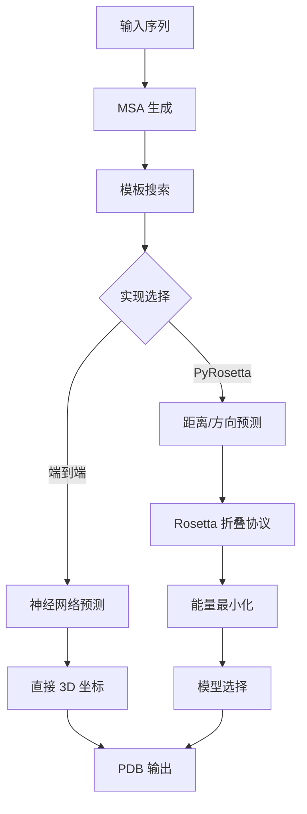

---
slug:19-end-to-end-vs-pyrosetta-implementation
blog_type:normal
---

RoseTTAFold 提供了两种不同的蛋白质结构预测方法：一种端到端的神经网络流水线和一种集成 PyRosetta 的工作流。理解这两种实现之间的差异对于根据你的具体用例选择合适的方法至关重要。

## 架构概述

这两种实现遵循截然不同的结构预测范式：

## 核心实现差异

### 模型加载与配置

主要的架构区别始于模型加载。端到端版本使用严格的状态字典匹配加载模型，而 PyRosetta 采用更灵活的方法：

- **端到端**：使用 `suffix='e2e'` 和 `strict=True` 进行模型加载 [predict_e2e.py#L107](network/predict_e2e.py#L107)
- **PyRosetta**：使用 `suffix='pyrosetta'` 和 `strict=False` 允许部分状态加载 [predict_pyRosetta.py#L73](network/predict_pyRosetta.py#L73)

### 模板集成

两种实现都利用模板信息，但使用不同的参数：

| 特性 | 端到端 | PyRosetta |
|---------|------------|-----------|
| 模板数量 | 10 个模板 [predict_e2e.py#L120](network/predict_e2e.py#L120) | 25 个模板 [predict_pyRosetta.py#L86](network/predict_pyRosetta.py#L86) |
| 窗口大小 | 150 个残基，shift=75 [predict_e2e.py#L115](network/predict_e2e.py#L115) | 150 个残基，shift=50 [predict_pyRosetta.py#L81](network/predict_pyRosetta.py#L81) |

### 输出生成

最显著的差异在于输出生成：

**端到端实现**直接生成 3D 坐标并写入带有置信度分数（预测 LDDT）的 PDB 文件 [predict_e2e.py#L240-280](network/predict_e2e.py#L240-280)：

- 生成完整的原子坐标（N、CA、C、O、CB）
- 使用内部 `extend()` 函数应用几何约束
- 写入 PDB 文件，其中 B 因子表示预测置信度

**PyRosetta 实现**输出中间预测用于下游 Rosetta 处理 [predict_pyRosetta.py#L140-170](network/predict_pyRosetta.py#L140-170)：

- 生成距离和方向概率分布
- 保存包含距离图数据的压缩 `.npz` 文件
- 需要单独的折叠协议来生成 3D 结构

## 工作流比较

### 端到端流水线

端到端工作流采用精简的方法：

此方法在 `run_e2e_ver.sh` [run_e2e_ver.sh#L52-71](run_e2e_ver.sh#L52-71) 中实现，并在单个神经网络推理步骤中完成。

### PyRosetta 流水线

PyRosetta 方法涉及多个阶段：

此工作流需要额外的步骤，包括 Rosetta 折叠协议 [run_pyrosetta_ver.sh#L85-95](run_pyrosetta_ver.sh#L85-95] 和使用 DeepAccNet 进行模型选择 [run_pyrosetta_ver.sh#L105-120](run_pyrosetta_ver.sh#L105-120]。

## 性能特征

### 计算需求

| 方面 | 端到端 | PyRosetta |
|--------|------------|-----------|
| GPU 内存 | 较高（直接坐标生成） | 较低（概率分布） |
| CPU 使用 | 最少的后处理 | 显著（Rosetta 折叠） |
| 运行时间 | 推理更快 | 总体较慢（多个阶段） |
| 输出质量 | 适用于初始预测 | 精炼后质量更高 |

### 内存管理

两种实现对大型蛋白质都使用裁剪策略，但方法不同：

- **端到端**：实现复杂的裁剪，带有重叠窗口和置信度加权 [predict_e2e.py#L160-190](network/predict_e2e.py#L160-190]
- **PyRosetta**：使用更简单的裁剪和基于置信度的加权 [predict_pyRosetta.py#L110-140](network/predict_pyRosetta.py#L110-140]

## 用例推荐

<CgxTip>当优先考虑速度而非最终精度时，选择端到端实现进行快速原型设计和初始结构预测。</CgxTip>

<CgxTip>对于高精度建模任务，当计算资源可用且额外的精炼步骤能显著提高结构质量时，选择 PyRosetta 实现。</CgxTip>

### 何时使用端到端

- 多个序列的快速筛选
- CPU 资源有限的环境
- 初始结构评估
- 需要快速响应的应用

### 何时使用 PyRosetta

- 高精度结构确定
- 详细的蛋白质工程应用
- 需要广泛精炼的情况
- 当访问 Rosetta 的能量函数有益时

## 与其他组件的集成

两种实现都集成到 RoseTTAFold 的生态系统中，但集成程度不同：

- **端到端**：自包含的预测流水线
- **PyRosetta**：与 DeepAccNet 集成进行错误预测 [DAN-msa/ErrorPredictorMSA.py](DAN-msa/ErrorPredictorMSA.py) 和 Rosetta 的折叠协议 [folding/RosettaTR.py](folding/RosettaTR.py)

实现之间的选择会影响下游工作流，应在整体计算流水线和精度要求的背景下考虑。

有关神经网络架构的更详细信息，请参阅 [RoseTTAFold 核心模型实现](8-rosettafold-core-model-implementation)，或有关 PyRosetta 特定功能，请参考 [PyRosetta 用于结构精炼的集成](17-pyrosetta-integration-for-structure-refinement)。