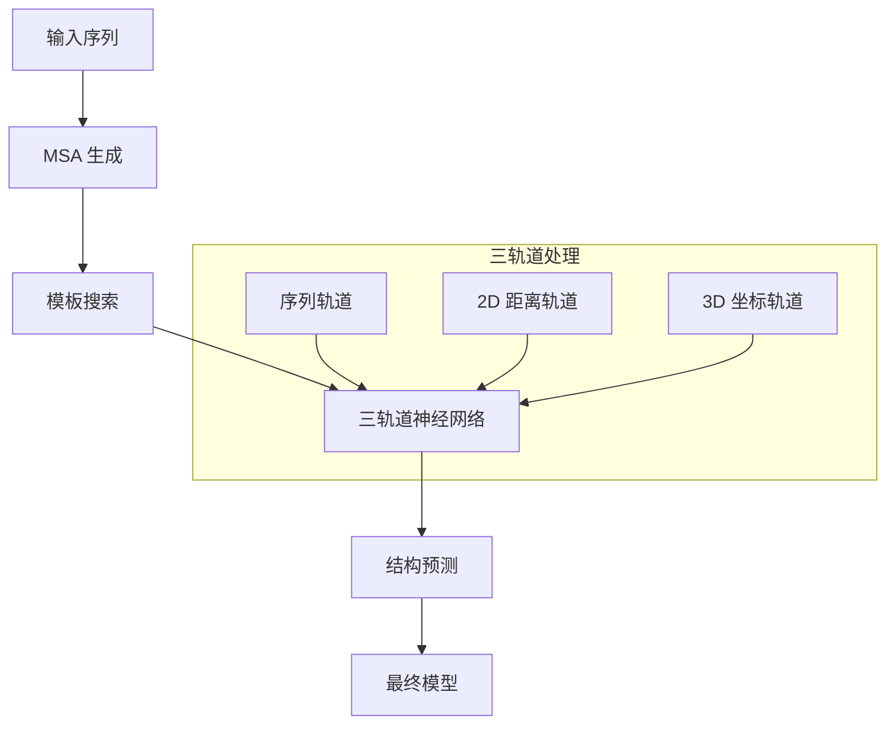

---
slug:2-quick-start
blog_type:normal
---


RoseTTAFold 是一个强大的深度学习框架，采用三轨道神经网络进行准确的蛋白质结构和相互作用预测。本快速入门指南将帮助你在几分钟内快速上手基本蛋白质结构预测。

## 系统要求

在开始之前，请确保你具备：
- Linux 操作系统
- 支持 CUDA 的 NVIDIA GPU（CUDA 10.1 或 11.0）
- Conda 包管理器
- 充足的存储空间（数据库约需 400GB）
- PyRosetta 许可证（仅 PyRosetta 版本需要）

## 快速安装

最快的入门方式是使用提供的 conda 环境文件：

```bash
# 克隆仓库
git clone https://github.com/RosettaCommons/RoseTTAFold.git
cd RoseTTAFold

# 创建 conda 环境（根据你的 CUDA 版本选择）
conda env create -f RoseTTAFold-linux.yml  # 适用于 CUDA 11
# 或
conda env create -f RoseTTAFold-linux-cu101.yml  # 适用于 CUDA 10.1

# 下载预训练权重
wget https://files.ipd.uw.edu/pub/RoseTTAFold/weights.tar.gz
tar xfz weights.tar.gz

# 安装依赖项
./install_dependencies.sh
```

## 基本用法：单体结构预测

RoseTTAFold 提供两种主要单体结构预测方法：

### 1. 端到端版本（更快，单一模型）

端到端版本提供快速预测，输出单个模型：

```bash
cd example
../run_e2e_ver.sh input.fa .
```

### 2. PyRosetta 版本（更详细，多模型）

PyRosetta 版本生成多个精修结构模型：

```bash
cd example  
../run_pyrosetta_ver.sh input.fa .
```

<CgxTip>对于初学者，建议从端到端版本开始，因为它速度更快且依赖项更少（无需 PyRosetta 许可证）。</CgxTip>

## 输入格式

你的输入应该是包含蛋白质序列的 FASTA 文件：

```fasta
>Protein_Name
MAAPTPADKSMMAAVPEWTITNLKRVCNAGNTSCTWTFGVDTHLATATSCTYVVKANANASQASGGPVTCGPYTITSSWSGQFGPNNGFTTFAVTDFSKKLIVWPAYTDVQVQAGKVVSPNQSYAPANLPLEHHHHHH
```

## 预期输出

| 版本 | 输出文件 | 描述 |
|---------|--------------|-------------|
| 端到端 | `t000_.e2e.pdb` | 单个 PDB 文件，B-factor 列包含估算的 CA-lddt 分数 |
| PyRosetta | `model/model_1-5.crderr.pdb` | 五个精修模型，B-factor 列包含估算的 CA RMS 误差 |

## 架构概述

RoseTTAFold 使用革命性的三轨道神经网络，同时处理：
1. **序列信息**（MSA 数据）
2. **距离/方向图**（2D 表示）  
3. **3D 坐标**（笛卡尔空间）



## 后续步骤

成功运行基本单体预测后，探索这些高级功能：

- **复合物建模**：学习使用双轨道网络预测蛋白质-蛋白质相互作用。详细说明请参见[复合物建模工作流](16-complex-modeling-workflow)。

- **数据库设置**：用于生产环境时，下载并配置完整的序列和结构数据库。请遵循[数据库下载和配置](4-database-download-and-configuration)指南。

- **高级功能**：在[深入探讨](8-rosettafold-core-model-implementation)章节探索 PyRosetta 集成、DeepAccNet 误差预测和批处理能力。

## 故障排除

如果遇到 hhblits/hhsearch 段错误，请尝试从源代码编译 hhsuite，而不是使用 conda 安装的版本。对于计算集群使用，请修改提供的脚本，为每个流水线步骤提交具有适当依赖关系的独立作业。

<CgxTip>建模脚本仅供指导参考。对于生产环境，建议根据你的特定计算基础设施优化资源分配和作业调度。</CgxTip>