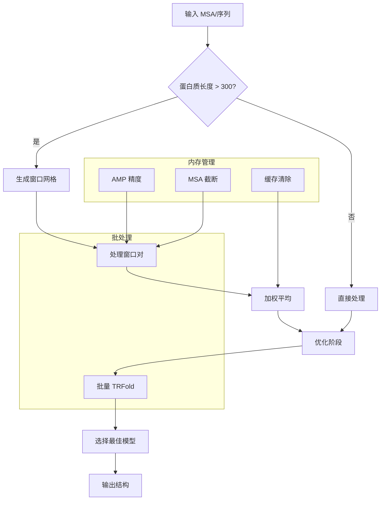

---
slug:22-batch-processing-and-parallelization
blog_type:normal
---


RoseTTAFold 实现了多种复杂的批处理和并行化策略，以高效处理大规模蛋白质结构预测。本文档将探讨流水线中不同组件的并行处理能力。

## 基于窗口的滑动窗口处理

对于超出内存限制的大型蛋白质，RoseTTAFold 采用滑动窗口方法，以重叠区块处理蛋白质序列。该策略能够在保持计算效率的同时预测任意长度蛋白质的结构。

PyRosetta 和端到端模式中的滑动窗口实现遵循一致的模式：

```python
# 大蛋白质处理的窗口参数
window = 150  # 窗口大小（残基数）
shift = 50    # 连续窗口之间的重叠

# 用于平铺的网格生成
grids = np.arange(0, L-window+shift, shift)
ngrids = grids.shape[0]
```

预测过程会遍历所有可能的窗口对，独立处理每个裁剪区域，然后通过加权平均合并结果 [predict_pyRosetta.py#L95-L130], [predict_e2e.py#L89-L140]。

### 裁剪处理策略

对于每个窗口对 `(i, j)`，系统会：

1. **选择**：为两个窗口中的残基创建布尔掩码
2. **输入准备**：提取对应的 MSA、序列和模板特征
3. **网络推理**：在裁剪后的输入上运行 RoseTTAFold 模型
4. **加权累积**：使用预测的 LDDT 分数作为权重合并结果

```python
# 使用 LDDT 预测进行加权平均
pred_lddt = torch.clamp(pred_lddt, 0.0, 1.0)
weight = pred_lddt[0][:,None] + pred_lddt[0][None,:]
weight = weight.cpu().numpy() + 1e-8
sub_idx_2d = np.ix_(sub_idx, sub_idx)
count[sub_idx_2d] += weight
prob_s[i_logit][sub_idx_2d] += weight[:,:,None]*prob
```

## TRFold 中的批处理

TRFold 优化模块实现了批处理功能，可同时探索多个构象轨迹。该方法通过从不同初始条件采样来提高鲁棒性：

```python
def fold(self, xyz, batch=32, lr=0.8, nsteps=100):
    # 通过随机扰动初始化多个轨迹
    xyz = perturb_init(xyz, batch) # (batch, L, 3)
    
    # 所有批次的优化变量
    T = torch.zeros_like(xyz,device=self.device,requires_grad=True)
    Q = torch.randn([batch,L,4],device=self.device,requires_grad=True)
```

TRFold 中的批处理具有以下优势：

- **并行优化**：同时优化多个构象
- **鲁棒性**：不同的随机种子防止收敛到局部最小值
- **效率**：通过批量矩阵操作最大化 GPU 利用率
- **选择**：基于组合损失函数选择最佳评分模型

## GPU 内存管理

RoseTTAFold 实现了战略性内存管理，以处理大型模型和数据集：

### 自动混合精度

系统使用 CUDA 的自动混合精度（AMP）来减少内存使用，同时保持数值稳定性：

```python
with torch.cuda.amp.autocast():
    logit_s, init_crds, pred_lddt = self.model(input_msa, input_seq, input_idx, 
                                             t1d=input_t1d, t2d=input_t2d)
```

### 内存清除

对于大型蛋白质，显式内存清除可防止 GPU 内存不足错误：

```python
# 在主要操作之间清除缓存内存
torch.cuda.empty_cache()
```

### MSA 序列限制

MSA 输入会被截断以防止内存过载：

```python
# 限制 MSA 深度以防止内存问题
input_msa = input_msa[:,:1000].to(self.device)
```

## 多线程 PyRosetta 集成

PyRosetta 折叠组件支持多线程配置以实现并行执行：

```python
# 通过线程控制初始化 PyRosetta
init_cmd.append("-multithreading:interaction_graph_threads 1 -multithreading:total_threads 1")
init(" ".join(init_cmd))
```

虽然当前实现为保持稳定性使用单线程，但该基础设施支持多线程执行以供未来优化。

## 性能优化策略

### 模板处理

模板特征通过可配置限制进行高效处理：

```python
# 内存效率的模板限制
n_templ = 25  # PyRosetta 模式
n_templ = 10  # 端到端模式
```

### 高效数据结构

系统使用内存高效的数据格式：

- **Float16 存储**：输出概率以半精度存储
- **稀疏表示**：仅处理距离截止范围内的残基
- **批量索引**：批处理的高效张量操作

## 并行处理工作流



## 配置选项

### 窗口处理参数

| 参数 | 默认值 | 描述 | 影响 |
|-----------|---------|-------------|--------|
| `window` | 150 | 窗口大小（残基数） | 内存使用与上下文 |
| `shift` | 50 | 窗口之间的重叠 | 冗余与效率 |

### TRFold 批处理参数

| 参数 | 默认值 | 描述 | 范围 |
|-----------|---------|-------------|-------|
| `batch` | 32 | 并行轨迹数 | 1-64 |
| `lr` | 0.8 | 优化学习率 | 0.1-2.0 |
| `nsteps` | 200 | 每条轨迹的优化步数 | 50-500 |

## 最佳实践

### 对于大型蛋白质
- 对超过 300 个残基的序列使用滑动窗口模式
- 监控 GPU 内存使用情况并相应调整批次大小
- 对于超大型序列考虑使用 CPU 模式

### 对于高通量处理
- 在 TRFold 中最大化批次大小以获得更好的 GPU 利用率
- 当模板质量较低时使用端到端模式以加快处理速度
- 为多个蛋白质处理实现作业调度

### 内存优化
- 在可用时启用混合精度处理
- 在大型预测之间清除 CUDA 缓存
- 根据可用内存限制 MSA 深度

RoseTTAFold 中的批处理和并行化功能能够高效处理从小结构域到大型多结构域蛋白质的各种尺寸蛋白质结构预测，同时保持高准确性和计算效率。

有关底层架构的更多详细信息，请参阅 [RoseTTAFold 核心模型实现](8-rosettafold-core-model-implementation)，有关 GPU 特定优化的内容，请参考 [GPU 加速和 CUDA 支持](20-gpu-acceleration-and-cuda-support)。