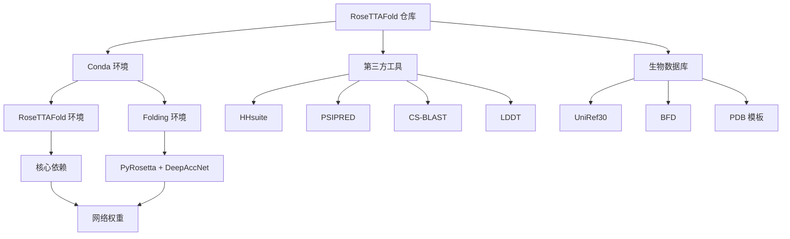

---
slug:3-installation-and-environment-setup
blog_type:normal
---


RoseTTAFold 需要全面设置，包括 conda 环境、第三方依赖和大规模生物数据库。本指南提供了配置蛋白质结构预测环境的系统方法。

## 系统要求和架构概述

RoseTTAFold 支持两种主要计算模式，具有不同的资源需求：

| 模式 | GPU 支持 | 主要用例 | 环境 |
|------|-------------|------------------|-------------|
| 端到端 | CUDA 10.2/11.1 | 快速单体预测 | RoseTTAFold |
| PyRosetta | CUDA 10.2/11.1 | 带优化的高精度建模 | RoseTTAFold + folding |



## 先决条件

在继续之前，请确保你拥有：
- 已安装 **Conda**（Miniconda 或 Anaconda）
- **NVIDIA GPU** 并配备 CUDA 兼容驱动程序（CUDA 10.2 或 11.1）
- **存储空间**：数据库至少需要 500GB 可用空间
- **内存**：最低 16GB RAM，推荐 64GB 用于大型蛋白质

## 环境设置

### 1. 仓库克隆

```bash
git clone https://github.com/RosettaCommons/RoseTTAFold.git
cd RoseTTAFold
```

### 2. Conda 环境创建

RoseTTAFold 根据你的 CUDA 版本提供两种环境配置：

**对于 CUDA 11.1：**
```bash
conda env create -f RoseTTAFold-linux.yml
```

**对于 CUDA 10.2：**
```bash
conda env create -f RoseTTAFold-linux-cu101.yml
```

两种环境都包含核心依赖，如 PyTorch 1.8-1.9、HHsuite、PSIPRED 以及几何深度学习的专用包 [RoseTTAFold-linux.yml](RoseTTAFold-linux.yml#L1-L109)。

**额外的 Folding 环境：**
基于 PyRosetta 的建模和 DeepAccNet 错误预测所必需：
```bash
conda env create -f folding-linux.yml
```

这个轻量级环境包含 TensorFlow-GPU 1.14 和支持库 [folding-linux.yml](folding-linux.yml#L1-L10)。

### 3. 网络权重下载

预训练权重根据 Rosetta-DL 软件许可证提供，仅供非商业用途：

```bash
wget https://files.ipd.uw.edu/pub/RoseTTAFold/weights.tar.gz
tar xfz weights.tar.gz
```

<CgxTip>
权重包包括原始 RoseTTAFold 模型和用于蛋白质-蛋白质相互作用筛选的 RoseTTAFold-2track 模型的 RF2t.pt 权重。如需最新的 2-track 权重，请重新下载。
</CgxTip>

## 第三方依赖安装

执行自动化安装脚本，安装无法通过 conda 获取的工具：

```bash
./install_dependencies.sh
```

此脚本下载并配置：
- **LDDT**：用于模型验证的局部距离差异测试
- **CS-BLAST**：用于增强序列比对的上下文特定 BLAST

脚本自动检测你的平台（Linux/macOS）并安装适当的二进制文件 [install_dependencies.sh](install_dependencies.sh#L1-L28)。

## 生物数据库配置

RoseTTAFold 需要三个基本数据库用于 MSA 生成和模板搜索：

### 1. UniRef30 数据库 (46GB)
```bash
wget http://wwwuser.gwdg.de/~compbiol/uniclust/2020_06/UniRef30_2020_06_hhsuite.tar.gz
mkdir -p UniRef30_2020_06
tar xfz UniRef30_2020_06_hhsuite.tar.gz -C ./UniRef30_2020_06
```

### 2. BFD 数据库 (272GB)
```bash
wget https://bfd.mmseqs.com/bfd_metaclust_clu_complete_id30_c90_final_seq.sorted_opt.tar.gz
mkdir -p bfd
tar xfz bfd_metaclust_clu_complete_id30_c90_final_seq.sorted_opt.tar.gz -C ./bfd
```

### 3. PDB 模板数据库 (>100GB)
```bash
wget https://files.ipd.uw.edu/pub/RoseTTAFold/pdb100_2021Mar03.tar.gz
tar xfz pdb100_2021Mar03.tar.gz
```

<CgxTip>
MSA 生成管道 [input_prep/make_msa.sh](input_prep/make_msa.sh#L18-L24) 迭代搜索 UniRef30 和 BFD 数据库，以构建全面的多序列比对，用于准确的进化信息提取。
</CgxTip>

## PyRosetta 许可证设置

对于基于 PyRosetta 的建模管道：

1. **获取许可证**：在 [PyRosetta Downloads](https://els2.commotion.uw.edu/product/pyrosetta) 注册
2. **安装 PyRosetta**：在 `folding` conda 环境中按照你平台的安装说明操作
3. **验证安装**：使用提供的示例脚本进行测试

## 管道验证

### 端到端模式测试
```bash
cd example
../run_e2e_ver.sh input.fa .
```

### PyRosetta 模式测试
```bash
cd example  
../run_pyrosetta_ver.sh input.fa .
```

两个脚本都会激活相应的 conda 环境并执行完整管道，包括 MSA 生成、模板搜索和结构预测 [run_e2e_ver.sh](run_e2e_ver.sh#L25-L30), [run_pyrosetta_ver.sh](run_pyrosetta_ver.sh#L25-L30)。

## 常见问题故障排除

### CUDA 兼容性
- **HHsuite 的段错误**：从源代码编译，而不是使用 conda 版本
- **GPU 内存问题**：减少批大小或对大型蛋白质使用仅 CPU 模式

### 数据库配置
- **缺失数据库**：验证管道脚本中的所有数据库路径
- **权限问题**：确保对数据库目录有适当的读取访问权限

### 环境冲突
- **PyRosetta 冲突**：按照规定使用单独的 `folding` 环境
- **依赖版本不匹配**：严格使用提供的环境文件

## 后续步骤

成功安装后，继续进行 [数据库下载和配置](4-database-download-and-configuration) 以了解详细的数据库管理，或探索 [快速开始](2-quick-start) 获取即时使用示例。如需了解计算管道，请参阅深入探讨部分中的 [MSA 生成和序列处理](11-msa-generation-and-sequence-processing)。