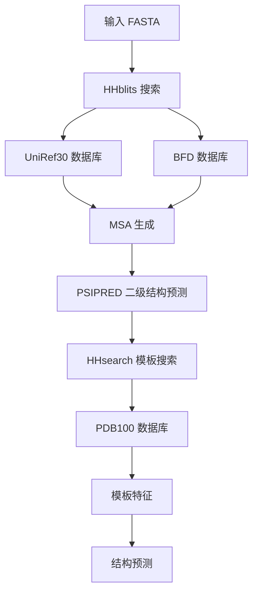

---
slug:4-database-download-and-configuration
blog_type:normal
---


本指南涵盖了高效运行 RoseTTAfold 所需的基础数据库和配置要求。正确的数据库设置对于精确的蛋白质结构预测和相互作用建模至关重要。

## 必需数据库

RoseTTAfold 需要三个主要数据库才能正常运行。这些数据库提供了精确预测所需的序列多样性、结构模板和进化信息。

### 序列数据库

**UniRef30 数据库** (46GB)
- 包含以 30% 一致性阈值聚类处理的蛋白质序列
- 对于生成多重序列比对（MSA）至关重要
- 下载并解压：
```bash
wget http://wwwuser.gwdg.de/~compbiol/uniclust/2020_06/UniRef30_2020_06_hhsuite.tar.gz
mkdir -p UniRef30_2020_06
tar xfz UniRef30_2020_06_hhsuite.tar.gz -C ./UniRef30_2020_06
```

**BFD 数据库** (272GB)
- 包含宏基因组序列的 Big Fantastic Database
- 为远缘同源物提供深度进化信息
- 下载并解压：
```bash
wget https://bfd.mmseqs.com/bfd_metaclust_clu_complete_id30_c90_final_seq.sorted_opt.tar.gz
mkdir -p bfd
tar xfz bfd_metaclust_clu_complete_id30_c90_final_seq.sorted_opt.tar.gz -C ./bfd
```

### 结构模板数据库

**PDB100 数据库** (100GB+)
- 包含用于同源建模的结构模板
- 包含 HHsuite 格式的序列和结构信息
- 下载并解压：
```bash
wget https://files.ipd.uw.edu/pub/RoseTTAFold/pdb100_2021Mar03.tar.gz
tar xfz pdb100_2021Mar03.tar.gz
```

<CgxTip>对于 CASP14 基准测试，请使用替代的 PDB100 数据库：`https://files.ipd.uw.edu/pub/RoseTTAFold/pdb100_2020Mar11.tar.gz`</CgxTip>

## 配置设置

### 环境变量

管道使用 `PIPEDIR` 环境变量来定位数据库和脚本。这在执行脚本中自动设置：

```bash
export PIPEDIR=/path/to/RoseTTAFold
```

### 数据库集成

MSA 生成脚本 [make_msa.sh](input_prep/make_msa.sh#L17-L18) 通过特定路径引用数据库：

```bash
declare -a DATABASES=( \
    "$PIPEDIR/UniRef30_2020_06/UniRef30_2020_06" \
    "$PIPEDIR/bfd/bfd_metaclust_clu_complete_id30_c90_final_seq.sorted_opt")
```

模板搜索使用 PDB100 数据库路径：
```bash
DB="$PIPEDIR/pdb100_2021Mar03/pdb100_2021Mar03"
```

## 数据库使用管道



<CgxTip>确保所有数据库都已解压在相对于 RoseTTAfold 安装目录的正确目录结构中，以便脚本能够正确定位它们。</CgxTip>

## 存储要求

| 数据库 | 大小 | 用途 | 格式 |
|----------|------|---------|--------|
| UniRef30_2020_06 | 46GB | MSA 生成 | HHsuite 格式 |
| BFD | 272GB | 深度进化信息 | MMseqs2 格式 |
| PDB100_2021Mar03 | 100GB+ | 结构模板 | HHsuite 格式 |

完整数据库设置的总存储需求：**约 418GB**。

## 配置文件

### 网络参数

折叠过程使用存储在 [params.json](folding/data/params.json#L1-L18) 中的配置参数，其中包括距离预测阈值、能量项和采样参数。

### 二级结构预测

PSIPRED 需要位于以下位置的特定数据文件：
```bash
$CONDA_PREFIX/share/psipred_4.01/data
```

这在 [make_ss.sh](input_prep/make_ss.sh#L3) 脚本中自动配置。

## 验证

数据库设置完成后，通过运行示例验证安装：

```bash
cd example
../run_pyrosetta_ver.sh input.fa .
```

管道将自动检测并使用配置的数据库进行 MSA 生成、模板搜索和结构预测。

## 下一步

配置好数据库后，请继续阅读 [安装和环境设置](3-installation-and-environment-setup) 以完成系统准备，或直接转到 [快速入门](2-quick-start) 开始使用 RoseTTAFold 处理你的蛋白质序列。

对于复杂的蛋白质-蛋白质相互作用建模，需要额外的数据库准备步骤，详见 [复合物建模工作流程](16-complex-modeling-workflow)。