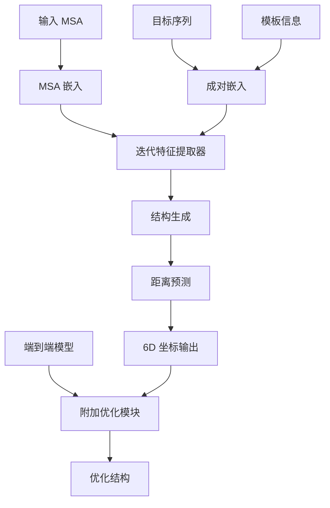

---
slug:8-rosettafold-core-model-implementation
blog_type:normal
---


RoseTTAFold 核心模型采用复杂的三轨道神经网络架构，同时处理序列、成对和结构信息以预测蛋白质 3D 结构。该实现利用深度学习技术，包括注意力机制、SE(3)-等变网络和迭代优化，实现了最先进的蛋白质结构预测性能。

## 架构概述

核心实现包含两个主要模型变体：标准版 `RoseTTAFoldModule` 和端到端版 `RoseTTAFoldModule_e2e`。两个模型都实现了基础的三轨道架构，但在优化能力和输出格式上有所不同 [RoseTTAFoldModel.py#L8-L132]。



## 核心模型组件

### 主要模型类

**RoseTTAFoldModule**：通过三轨道架构处理 MSA、序列和模板信息的标准实现 [RoseTTAFoldModel.py#L8-L59]。该模型包含：

- **MSA 嵌入层**：将多序列比对数据转换为学习表示 [RoseTTAFoldModel.py#L19]
- **成对嵌入层**：创建可选模板集成的成对表示 [RoseTTAFoldModel.py#L23-L25]
- **迭代特征提取器**：在轨道间交换信息的核心处理模块 [RoseTTAFoldModel.py#L27-L38]
- **距离网络**：预测残基间距离和取向 [RoseTTAFoldModel.py#L39]

**RoseTTAFoldModule_e2e**：具有附加优化能力的扩展版本 [RoseTTAFoldModel.py#L61-L132]。主要增强包括：

- **优化模块**：用于结构改进的后处理网络 [RoseTTAFoldModel.py#L95-L97]
- **概率处理**：将距离预测转换为概率分布 [RoseTTAFoldModel.py#L117-L120]
- **灵活输出模式**：支持原始和优化结构输出 [RoseTTAFoldModel.py#L123-L131]

### 嵌入架构

嵌入系统处理三种不同的信息类型：

**MSA 嵌入**：使用位置编码和注意力机制处理多序列比对 [Embeddings.py#L69-L81]。`MSA_emb` 类包含：
- 序列位置信息
- Dropout 正则化
- 最大序列长度约束

**模板嵌入**：通过基于注意力的机制处理可选模板信息 [Embeddings.py#L82-L122]。`Templ_emb` 类特点：
- 模板特征的像素级注意力
- 可配置注意力头数
- Performer 优化选项

**成对嵌入**：两种成对表示变体：
- `Pair_emb_w_templ`：集成模板信息 [Embeddings.py#L123-L151]
- `Pair_emb_wo_templ`：无模板版本 [Embeddings.py#L152-L176]

### 三轨道处理

核心三轨道架构通过 `IterativeFeatureExtractor` 类实现 [Attention_module_w_str.py#L410-L480]，它协调轨道间的信息流：

**初始处理**：
- 成对特征通过 `Pair2Pair` 层进行初始变换 [Attention_module_w_str.py#L420-L422]
- 仅序列迭代处理 MSA 和成对信息而不包含结构数据 [Attention_module_w_str.py#L466-L469]

**结构集成**：
- 从序列和成对数据生成初始结构 [Attention_module_w_str.py#L471]
- 使用结构信息进行迭代优化 [Attention_module_w_str.py#L475-L476]
- 最终处理块整合所有轨道信息 [Attention_module_w_str.py#L478]

**关键处理模块**：
- `MSA2MSA`：MSA 轨道内的自注意力 [Attention_module_w_str.py#L149-L168]
- `Pair2Pair`：成对特征处理 [Attention_module_w_str.py#L191-L200]
- `Str2Str`：具有 SE(3) 等变性的结构轨道处理 [Attention_module_w_str.py#L203-L252]
- 跨轨道模块：`MSA2Pair`、`Pair2MSA`、`Str2MSA` 用于信息交换

## SE(3)-等变网络

结构轨道利用 SE(3)-等变网络保持旋转和平移不变性：

**TFN 实现**：基本 SE(3) 等变图卷积网络 [SE3_network.py#L8-L53]：
- 具有度特定特征的多等变层
- 自交互和边特征处理
- 自动混合精度支持

**SE3Transformer**：带注意力机制的增强版本 [SE3_network.py#L54-L109]：
- SE(3) 框架内的多头注意力
- 可配置的注意力和自交互模式
- 度间的复杂特征路由

<CgxTip>
SE(3) 网络使用纤维表示，其中类型 0 特征是标量，类型 1 特征是向量值，能够在保持等变性质的同时正确处理 3D 几何信息。
</CgxTip>

## 距离预测与输出

`DistanceNetwork` 类将学习到的成对特征转换为几何预测 [DistancePredictor.py#L9-L37]：

- 增强表示学习的多块架构
- 输出距离和取向分布
- 支持不同块类型以处理不同复杂度

## 模型配置

### 默认参数

模型通过构造函数参数支持广泛配置：

**特征维度**：
- `d_msa=64`：MSA 嵌入维度
- `d_pair=128`：成对特征维度
- `d_templ=64`：模板嵌入维度

**架构参数**：
- `n_module=4`：仅序列迭代次数
- `n_module_str=4`：结构感知迭代次数
- `n_layer=4`：每个注意力模块的层数
- `n_head_msa=4`：MSA 注意力头数
- `n_head_pair=8`：成对注意力头数

**正则化**：
- `p_drop=0.1`：Dropout 概率
- `n_resblock=1`：每个模块的残差块数

### SE(3) 网络配置

SE(3) 网络通过参数字典配置：
```python
SE3_param = {
    'l0_in_features': 32,    # 输入标量特征
    'l0_out_features': 16,   # 输出标量特征
    'num_edge_features': 32  # 图卷积的边特征
}
```

## 前向传播流程

前向传播在两个模型变体中遵循一致模式：

1. **嵌入生成**：MSA、序列和模板数据嵌入为学习表示 [RoseTTAFoldModel.py#L44-L49]
2. **特征提取**：迭代处理在轨道间提取和优化特征 [RoseTTAFoldModel.py#L52-L53]
3. **结构预测**：生成距离和取向预测 [RoseTTAFoldModel.py#L56]
4. **输出格式化**：结果格式化用于下游处理 [RoseTTAFoldModel.py#L57-L58]

端到端模型添加优化步骤：
- 从距离 logits 生成概率分布 [RoseTTAFoldModel.py#L117-L120]
- 通过专用优化模块进行结构优化 [RoseTTAFoldModel.py#L126]

<CgxTip>
模型支持标准推理和仅优化模式，允许灵活集成到不同预测管道中，并支持对现有结构的迭代改进。
</CgxTip>

## 集成点

核心模型设计为与互补系统集成：

- **模板处理**：与模板搜索和比对管道接口
- **MSA 生成**：与多序列比对工具配合
- **结构优化**：与 Rosetta 和其他优化方法兼容
- **端到端管道**：支持独立和集成部署

这种模块化架构实现了灵活的部署场景，同时保持了区别于其他蛋白质结构预测方法的核心三轨道处理范式。

要深入了解特定注意力机制的结构信息细节，请继续阅读 [包含结构信息的注意力机制](9-attention-mechanisms-with-structural-information)。要进一步探索 SE(3)-等变网络，请参阅 [用于 3D 坐标的 SE(3)-等变网络](10-se-3-equivariant-networks-for-3d-coordinates)。