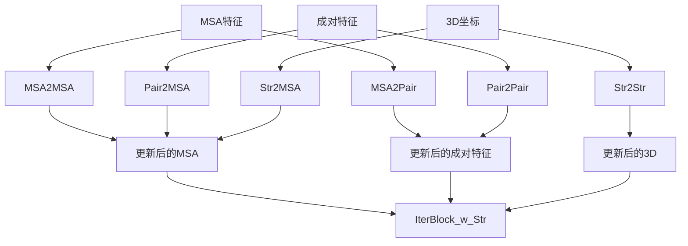

---
slug:9-attention-mechanisms-with-structural-information
blog_type:normal
---

RoseTTAFold实现了一种复杂的注意力机制，该机制将结构信息与基于序列的注意力相结合，使网络能够在蛋白质结构预测过程中同时利用进化和几何约束。

## 三轨道注意力架构

该注意力机制在三个相互连接的轨道上运行：MSA（多序列比对）、成对特征和3D坐标。这种架构通过专门的注意力模块，允许信息在序列进化模式和结构几何之间流动。

## 核心注意力模块

### 基于MSA的注意力

**MSA2MSA**模块在MSA维度上实现轴向注意力，处理序列和比对位置[network/Attention_module_w_str.py#L149-L169](network/Attention_module_w_str.py#L149-L169)。它使用Transformer模块中的`AxialEncoderLayer`，通过关联注意力机制高效处理大型MSA张量[network/Transformer.py#L312-L351](network/Transformer.py#L312-L351)。

**MSA2Pair**模块使用协同进化信息提取将MSA嵌入转换为成对表示[network/Attention_module_w_str.py#L98-L118](network/Attention_module_w_str.py#L98-L118)。这从MSA的进化信息中捕获残基-残基耦合模式。

### 基于成对的注意力

**Pair2Pair**模块使用标准Transformer注意力处理残基对特征[network/Attention_module_w_str.py#L191-L201](network/Attention_module_w_str.py#L191-L201)。这使得网络能够学习残基对之间的复杂关系，同时整合序列和结构约束。

**Pair2MSA**模块执行从成对特征到MSA表示的交叉注意力，允许结构信息影响序列级处理[network/Attention_module_w_str.py#L178-L188](network/Attention_module_w_str.py#L178-L188)。

## 结构感知注意力

### SE(3)-等变注意力

**Str2Str**模块实现直接操作3D坐标的SE(3)-等变注意力[network/Attention_module_w_str.py#L203-L252](network/Attention_module_w_str.py#L203-L252)。该模块：

1. 使用`make_graph()`函数从当前坐标构建几何图[network/Attention_module_w_str.py#L19-L55](network/Attention_module_w_str.py#L19-L55)
2. 应用具有等变注意力的SE3Transformer[network/SE3_network.py#L54-L109](network/SE3_network.py#L54-L109)
3. 更新原子坐标同时保持旋转和平移等变性

图构建基于空间邻近性和序列邻接性连接残基，创建编码几何和序列关系的边。

### 基于距离的掩码

**Str2MSA**模块使用基于距离的掩码来关注结构相关的残基对[network/Attention_module_w_str.py#L253-L287](network/Attention_module_w_str.py#L253-L287)。它创建多个注意力头，每个头专用于不同的距离范围（8Å、12Å、16Å、20Å），使网络能够捕获多尺度结构关系。

<CgxTip>
Str2MSA中基于距离的掩码为不同空间尺度创建了专门的注意力头，使网络能够同时捕获局部二级结构模式和长程三级相互作用。</CgxTip>

## 迭代信息流

**IterBlock_w_Str**协调所有三个轨道之间的信息流[network/Attention_module_w_str.py#L325-L367](network/Attention_module_w_str.py#L325-L367)：

1. **MSA处理**：通过自注意力更新MSA特征
2. **成对更新**：将更新后的MSA信息转换为成对表示
3. **成对处理**：通过自注意力精炼成对特征
4. **MSA精炼**：使用精炼的成对信息更新MSA
5. **结构更新**：对坐标应用SE(3)-等变注意力
6. **结构到序列**：将结构状态反馈给MSA

这个迭代过程使网络能够逐步完善其对蛋白质结构的理解，每次迭代都改进序列进化与3D几何之间的整合。

## 多头注意力配置

注意力机制使用精心配置的多头架构：

| 模块 | 注意力类型 | 头数 | 特征维度 | 用途 |
|--------|---------------|-------|-------------|---------|
| MSA2MSA | 轴向 | 8 | 256 | 高效处理MSA序列 |
| MSA2Pair | 标准 | 8 | 64→128 | 提取协同进化信号 |
| Pair2Pair | 标准 | 8 | 128 | 学习残基对关系 |
| Pair2MSA | 交叉 | 4 | 128→256 | 将结构信息注入MSA |
| Str2MSA | 距离掩码 | 4 | 32→64 | 结构感知序列注意力 |

<CgxTip>
不同模块的头数反映了所处理信息的复杂程度差异 - 复杂序列关系使用更多头，专注的结构注意力使用较少头。</CgxTip>

## 与整体架构的集成

**IterativeFeatureExtractor**在整个训练过程中协调这些注意力机制[network/Attention_module_w_str.py#L410-L481](network/Attention_module_w_str.py#L410-L481)。它首先通过标准注意力块处理序列信息，然后初始化3D坐标，最后使用结构感知注意力模块迭代精炼所有三个轨道。

这种集成方法使RoseTTAFold能够通过复杂的注意力机制，利用进化信息（来自MSA）和几何约束（来自3D结构）的互补优势，实现最先进的性能。

有关结构注意力中使用的SE(3)-等变网络的更多详细信息，请参见[SE(3)-Equivariant Networks for 3D Coordinates](10-se-3-equivariant-networks-for-3d-coordinates)。要理解这些注意力机制如何融入整体模型架构，请参考[RoseTTAFold Core Model Implementation](8-rosettafold-core-model-implementation)。