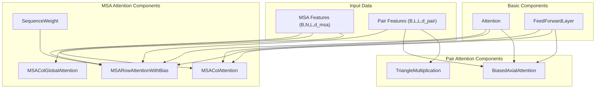
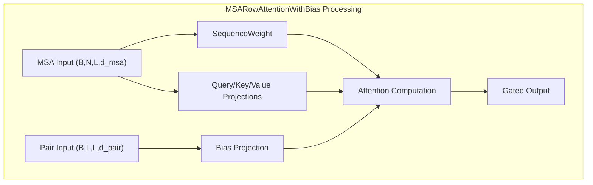
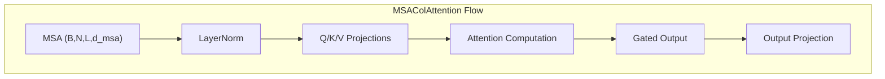
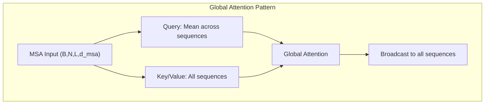
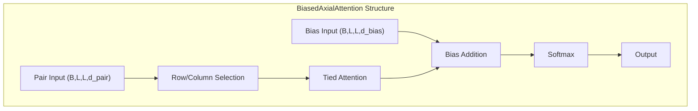
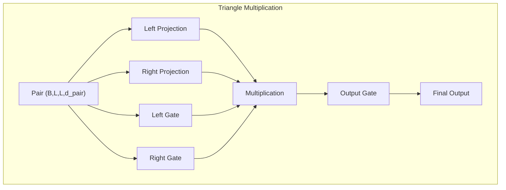
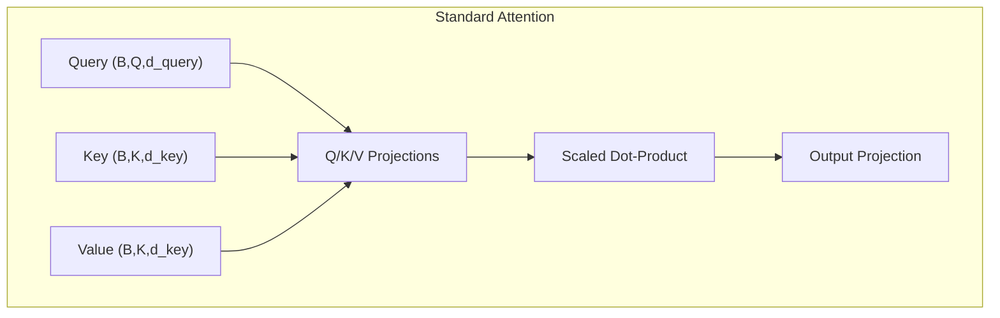
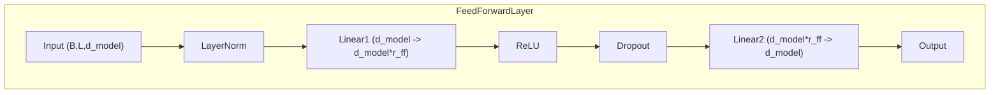
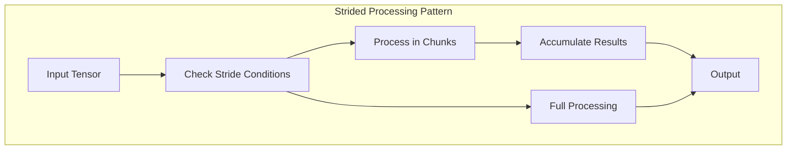

# Attention Mechanisms

> **Relevant source files**
> * [network/Attention_module.py](https://github.com/uw-ipd/RoseTTAFold2/blob/4b273b95/network/Attention_module.py)

The attention mechanisms in RoseTTAFold2 implement specialized transformer components designed for protein structure prediction. These modules process multiple sequence alignments (MSAs) and pairwise representations to capture evolutionary and structural relationships. The attention systems are optimized for large protein sequences with memory-efficient implementations that support both training and inference modes.

For information about the overall neural network architecture that uses these attention mechanisms, see [Core Architecture](/uw-ipd/RoseTTAFold2/3-core-architecture). For details on the SE(3)-equivariant geometric processing, see [SE3 Transformer](/uw-ipd/RoseTTAFold2/3.5-se3-transformer).

## Attention Architecture Overview

The attention system in RoseTTAFold2 consists of several specialized modules that operate on different representations:

**MSA Attention System Flow**

Sources: [network/Attention_module.py L1-L643](https://github.com/uw-ipd/RoseTTAFold2/blob/4b273b95/network/Attention_module.py#L1-L643)

## MSA Attention Mechanisms

MSA attention mechanisms process multiple sequence alignments to capture evolutionary relationships and co-evolution patterns. The system implements three main types of MSA attention:

### MSA Row Attention with Bias

The `MSARowAttentionWithBias` class implements attention across MSA sequences (rows) with bias terms from pair representations:

The module computes sequence weights using the target sequence (first MSA row) and applies them to attention computation:

| Component | Purpose | Input Shape | Output Shape |
| --- | --- | --- | --- |
| `SequenceWeight` | Compute attention weights for MSA sequences | (B,N,L,d_msa) | (B,N,L,h,1) |
| Query/Key/Value | Standard attention projections | (B,N,L,d_msa) | (B,N,L,h,d_hidden) |
| Bias projection | Incorporate pair information | (B,L,L,d_pair) | (B,L,L,h) |
| Gating | Control information flow | (B,N,L,d_msa) | (B,N,L,h*d_hidden) |

Sources: [network/Attention_module.py L168-L281](https://github.com/uw-ipd/RoseTTAFold2/blob/4b273b95/network/Attention_module.py#L168-L281)

 [network/Attention_module.py L124-L166](https://github.com/uw-ipd/RoseTTAFold2/blob/4b273b95/network/Attention_module.py#L124-L166)

### MSA Column Attention

The `MSAColAttention` class processes attention across MSA positions (columns) to capture positional co-evolution:

The attention is computed using the einsum operation `'bqihd,bkihd->bihqk'` which performs attention across the sequence dimension (N) for each position (L) independently.

Sources: [network/Attention_module.py L284-L362](https://github.com/uw-ipd/RoseTTAFold2/blob/4b273b95/network/Attention_module.py#L284-L362)

### MSA Column Global Attention

The `MSAColGlobalAttention` class implements a global attention mechanism where queries are averaged across all MSA sequences:

The key difference is that queries are computed as `query.mean(dim=1)` creating a single query per position that attends to all sequences.

Sources: [network/Attention_module.py L364-L416](https://github.com/uw-ipd/RoseTTAFold2/blob/4b273b95/network/Attention_module.py#L364-L416)

## Pair Attention Mechanisms

### Biased Axial Attention

The `BiasedAxialAttention` class implements axial attention for pair representations with bias terms from coordinate information:

The attention mechanism can operate on either rows (`is_row=True`) or columns (`is_row=False`) of the pair representation. The "tied" attention uses the same key projections across all positions, normalized by sequence length.

| Parameter | Purpose | Notes |
| --- | --- | --- |
| `is_row` | Attention direction | True for row attention, False for column |
| `d_pair` | Pair representation dimension | Usually 128 |
| `d_bias` | Bias feature dimension | From coordinate features |
| `n_head` | Number of attention heads | Typically 8 |

Sources: [network/Attention_module.py L419-L529](https://github.com/uw-ipd/RoseTTAFold2/blob/4b273b95/network/Attention_module.py#L419-L529)

### Triangle Multiplication

The `TriangleMultiplication` class implements triangle updates for pair representations:

The multiplication pattern depends on the `outgoing` parameter:

* **Outgoing**: `einsum('bikd,bjkd->bijd', left, right/L)` - outgoing edges
* **Incoming**: `einsum('bkid,bkjd->bijd', left, right/L)` - incoming edges

Sources: [network/Attention_module.py L531-L643](https://github.com/uw-ipd/RoseTTAFold2/blob/4b273b95/network/Attention_module.py#L531-L643)

## Basic Attention Components

### Standard Multi-Head Attention

The `Attention` class provides a standard multi-head attention implementation:

The attention uses scaled dot-product attention with scaling factor `1/sqrt(d_hidden)` and supports batch-wise striding for memory efficiency.

Sources: [network/Attention_module.py L52-L121](https://github.com/uw-ipd/RoseTTAFold2/blob/4b273b95/network/Attention_module.py#L52-L121)

### Feed-Forward Layer

The `FeedForwardLayer` provides position-wise feed-forward networks used throughout the attention modules:

The expansion ratio `r_ff` typically ranges from 2-4, and the module supports striding for memory optimization during inference.

Sources: [network/Attention_module.py L9-L50](https://github.com/uw-ipd/RoseTTAFold2/blob/4b273b95/network/Attention_module.py#L9-L50)

## Memory Optimization Strategies

All attention modules implement memory-efficient striding patterns for large sequences:

### Striding Patterns

| Module | Stride Dimension | Purpose |
| --- | --- | --- |
| `MSARowAttentionWithBias` | N (sequences), L (positions) | Reduce memory for large MSAs |
| `MSAColAttention` | L (positions) | Handle long sequences |
| `BiasedAxialAttention` | L (positions) | Process large pair representations |
| `TriangleMultiplication` | L (positions) | Efficient triangle updates |

### Memory-Efficient Implementation

The striding is only applied during inference (`not self.training`) when the stride parameter is positive and less than the tensor dimension.

Sources: [network/Attention_module.py L33-L44](https://github.com/uw-ipd/RoseTTAFold2/blob/4b273b95/network/Attention_module.py#L33-L44)

 [network/Attention_module.py L87-L107](https://github.com/uw-ipd/RoseTTAFold2/blob/4b273b95/network/Attention_module.py#L87-L107)

 [network/Attention_module.py L218-L258](https://github.com/uw-ipd/RoseTTAFold2/blob/4b273b95/network/Attention_module.py#L218-L258)

## Initialization and Parameter Management

All attention modules use careful parameter initialization:

| Parameter Type | Initialization | Purpose |
| --- | --- | --- |
| Q/K/V projections | Xavier uniform | Stable gradients |
| Bias projections | LeCun normal | Coordinate feature integration |
| Gating weights | Zero | Open gates initially |
| Gating biases | One | Open gates initially |
| Output projections | Zero | Identity residual connections |

This initialization strategy ensures stable training and proper residual connections throughout the network.

Sources: [network/Attention_module.py L70-L78](https://github.com/uw-ipd/RoseTTAFold2/blob/4b273b95/network/Attention_module.py#L70-L78)

 [network/Attention_module.py L189-L204](https://github.com/uw-ipd/RoseTTAFold2/blob/4b273b95/network/Attention_module.py#L189-L204)

 [network/Attention_module.py L442-L457](https://github.com/uw-ipd/RoseTTAFold2/blob/4b273b95/network/Attention_module.py#L442-L457)