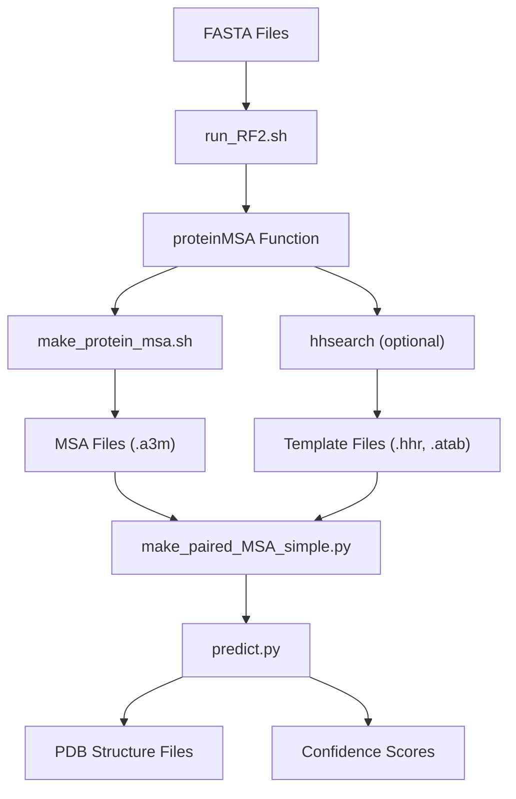
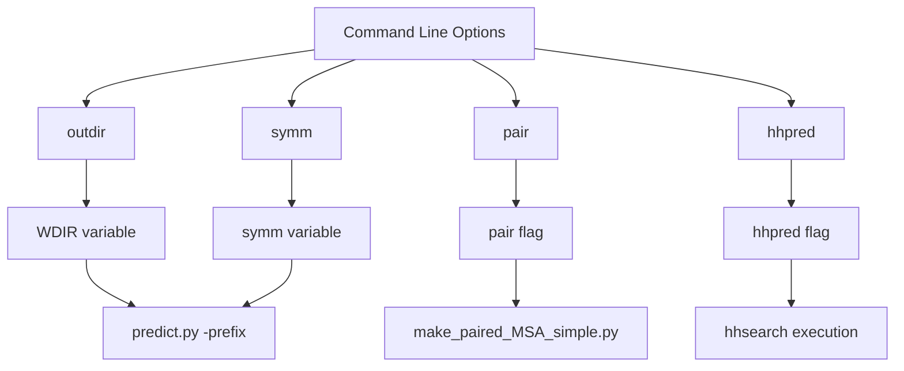
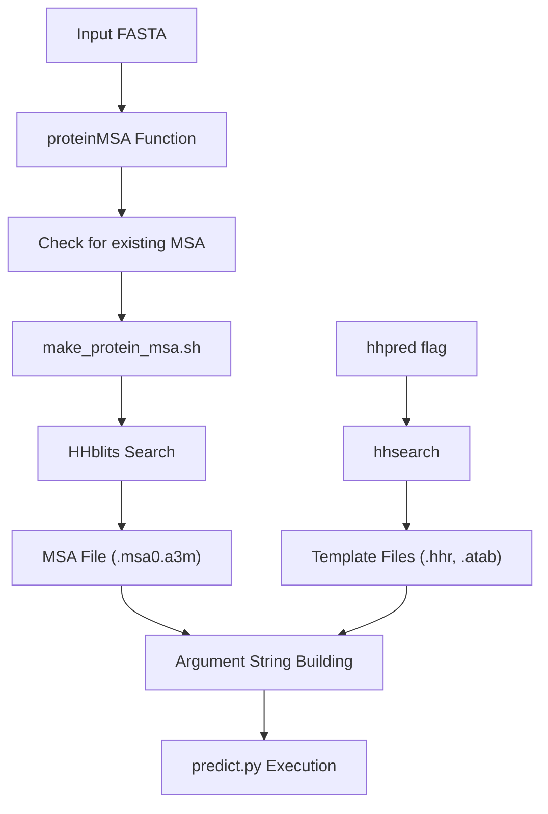
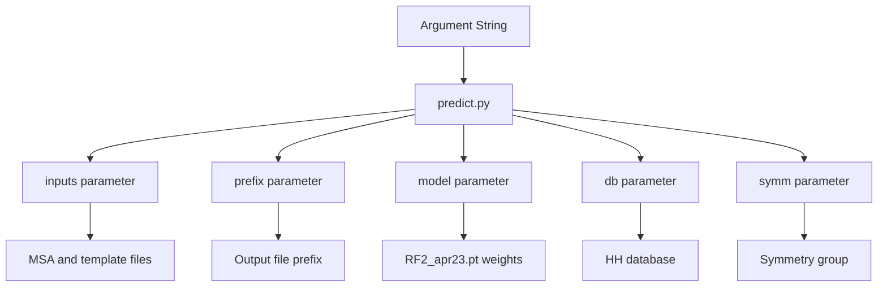

# Basic Usage

> **Relevant source files**
> * [examples/rcsb_pdb_7UGF.fasta](https://github.com/uw-ipd/RoseTTAFold2/blob/4b273b95/examples/rcsb_pdb_7UGF.fasta)
> * [examples/rcsb_pdb_7YTB.fasta](https://github.com/uw-ipd/RoseTTAFold2/blob/4b273b95/examples/rcsb_pdb_7YTB.fasta)
> * [examples/rcsb_pdb_7ZLR.fasta](https://github.com/uw-ipd/RoseTTAFold2/blob/4b273b95/examples/rcsb_pdb_7ZLR.fasta)
> * [examples/rcsb_pdb_8HBN.fasta](https://github.com/uw-ipd/RoseTTAFold2/blob/4b273b95/examples/rcsb_pdb_8HBN.fasta)
> * [input_prep/make_paired_MSA_simple.py](https://github.com/uw-ipd/RoseTTAFold2/blob/4b273b95/input_prep/make_paired_MSA_simple.py)
> * [run_RF2.sh](https://github.com/uw-ipd/RoseTTAFold2/blob/4b273b95/run_RF2.sh)

This document covers the essential steps for running RoseTTAFold2 structure predictions using the main command-line interface. It focuses on the primary entry point script and common usage patterns for new users.

For detailed installation instructions, see [Installation and Setup](/uw-ipd/RoseTTAFold2/2.1-installation-and-setup). For advanced prediction options and the Python API, see [Main Prediction Interface](/uw-ipd/RoseTTAFold2/4.1-main-prediction-interface).

## Overview

RoseTTAFold2 predictions are typically run using the `run_RF2.sh` script, which orchestrates the complete pipeline from FASTA input to final structure prediction. The script handles MSA generation, template search, and calls the neural network prediction engine.

## Basic Command Syntax

The basic command structure is:

```
./run_RF2.sh [options] input1.fasta [input2.fasta ...]
```

### Core Workflow



Sources: [run_RF2.sh L1-L159](https://github.com/uw-ipd/RoseTTAFold2/blob/4b273b95/run_RF2.sh#L1-L159)

 [input_prep/make_paired_MSA_simple.py L1-L141](https://github.com/uw-ipd/RoseTTAFold2/blob/4b273b95/input_prep/make_paired_MSA_simple.py#L1-L141)

## Input Requirements

### FASTA Files

* One or more protein sequences in FASTA format
* Each sequence must have a proper FASTA header starting with `>`
* Sequences can be single-chain or multi-chain proteins

### Example Input Files

The repository includes several example FASTA files:

| File | Description | Chains |
| --- | --- | --- |
| `examples/rcsb_pdb_7ZLR.fasta` | Multi-chain protein complex | 3 chains |
| `examples/rcsb_pdb_7YTB.fasta` | Symmetric dimer | 2 chains |
| `examples/rcsb_pdb_7UGF.fasta` | Single-chain protein | 1 chain |
| `examples/rcsb_pdb_8HBN.fasta` | Two-chain complex | 2 chains |

Sources: [examples/rcsb_pdb_7ZLR.fasta L1-L7](https://github.com/uw-ipd/RoseTTAFold2/blob/4b273b95/examples/rcsb_pdb_7ZLR.fasta#L1-L7)

 [examples/rcsb_pdb_7YTB.fasta L1-L3](https://github.com/uw-ipd/RoseTTAFold2/blob/4b273b95/examples/rcsb_pdb_7YTB.fasta#L1-L3)

 [examples/rcsb_pdb_7UGF.fasta L1-L3](https://github.com/uw-ipd/RoseTTAFold2/blob/4b273b95/examples/rcsb_pdb_7UGF.fasta#L1-L3)

 [examples/rcsb_pdb_8HBN.fasta L1-L5](https://github.com/uw-ipd/RoseTTAFold2/blob/4b273b95/examples/rcsb_pdb_8HBN.fasta#L1-L5)

## Command Line Options

### Available Options

| Option | Description | Default |
| --- | --- | --- |
| `-o, --outdir` | Output directory name | `rf2out` |
| `-s, --symm` | Symmetry group (Cn, Dn, T, I, O) | `C1` |
| `-p, --pair` | Pair MSAs by taxonomy ID | disabled |
| `-h, --hhpred` | Run hhpred for templates | disabled |
| `--help` | Show usage information | - |

### Option Details



Sources: [run_RF2.sh L60-L99](https://github.com/uw-ipd/RoseTTAFold2/blob/4b273b95/run_RF2.sh#L60-L99)

## Basic Usage Examples

### Single Chain Prediction

```
./run_RF2.sh examples/rcsb_pdb_7UGF.fasta
```

This runs a basic prediction on a single-chain protein without templates.

### Multi-Chain with Pairing

```
./run_RF2.sh --pair examples/rcsb_pdb_7ZLR.fasta
```

For multi-chain proteins, the `--pair` flag enables MSA pairing based on taxonomy IDs using the `make_paired_MSA_simple.py` script.

### With Templates and Custom Output

```
./run_RF2.sh --hhpred --outdir my_results examples/rcsb_pdb_7UGF.fasta
```

This enables template search via hhpred and writes results to a custom directory.

### Symmetric Protein

```
./run_RF2.sh --symm C2 examples/rcsb_pdb_7YTB.fasta
```

For symmetric proteins, specify the symmetry group (C2 for 2-fold cyclic symmetry).

Sources: [run_RF2.sh L68-L89](https://github.com/uw-ipd/RoseTTAFold2/blob/4b273b95/run_RF2.sh#L68-L89)

## Processing Pipeline

### MSA Generation Process



The `proteinMSA` function [run_RF2.sh L28-L52](https://github.com/uw-ipd/RoseTTAFold2/blob/4b273b95/run_RF2.sh#L28-L52)

 handles MSA generation for each input sequence, checking for existing files to avoid redundant computation.

### Multi-Chain MSA Pairing

When multiple FASTA files are provided with the `--pair` flag, the script:

1. Processes each chain individually to generate MSAs
2. Calls `make_paired_MSA_simple.py` to merge MSAs based on taxonomy IDs
3. Creates a combined MSA file for the complex

The pairing logic [run_RF2.sh L129-L143](https://github.com/uw-ipd/RoseTTAFold2/blob/4b273b95/run_RF2.sh#L129-L143)

 ensures that sequences from the same organism are aligned together in the final MSA.

Sources: [run_RF2.sh L129-L143](https://github.com/uw-ipd/RoseTTAFold2/blob/4b273b95/run_RF2.sh#L129-L143)

 [input_prep/make_paired_MSA_simple.py L94-L141](https://github.com/uw-ipd/RoseTTAFold2/blob/4b273b95/input_prep/make_paired_MSA_simple.py#L94-L141)

## Output Files

### Standard Output Structure

The script creates the following directory structure:

```markdown
rf2out/                           # Output directory
├── log/                          # Log files
│   ├── make_msa.{tag}.stdout     # MSA generation logs
│   ├── make_msa.{tag}.stderr
│   └── hhsearch.{tag}.stdout     # Template search logs
├── {tag}.msa0.a3m               # MSA files
├── {tag}.hhr                    # HHpred results (if enabled)
├── {tag}.atab                   # HHpred alignment table
└── models/                      # Final predictions
    ├── model_0.pdb              # Structure files
    └── model_*.npz              # Confidence scores
```

### Key Output Files

| File Pattern | Description |
| --- | --- |
| `models/model_*.pdb` | Predicted protein structures |
| `models/model_*.npz` | Confidence scores and metrics |
| `*.msa0.a3m` | Generated MSA files |
| `*.hhr` | Template search results |
| `log/*.stdout` | Processing logs |

Sources: [run_RF2.sh L101](https://github.com/uw-ipd/RoseTTAFold2/blob/4b273b95/run_RF2.sh#L101-L101)

 [run_RF2.sh L149](https://github.com/uw-ipd/RoseTTAFold2/blob/4b273b95/run_RF2.sh#L149-L149)

 [run_RF2.sh L38](https://github.com/uw-ipd/RoseTTAFold2/blob/4b273b95/run_RF2.sh#L38-L38)

 [run_RF2.sh L48](https://github.com/uw-ipd/RoseTTAFold2/blob/4b273b95/run_RF2.sh#L48-L48)

## Final Prediction Call

The script culminates in calling the Python prediction engine:



The final prediction command [run_RF2.sh L151-L156](https://github.com/uw-ipd/RoseTTAFold2/blob/4b273b95/run_RF2.sh#L151-L156)

 passes all processed inputs to the neural network prediction engine with the pre-trained model weights.

Sources: [run_RF2.sh L151-L156](https://github.com/uw-ipd/RoseTTAFold2/blob/4b273b95/run_RF2.sh#L151-L156)