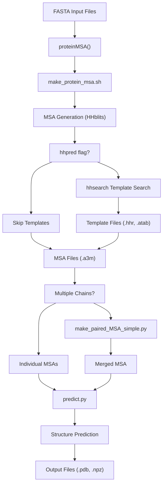
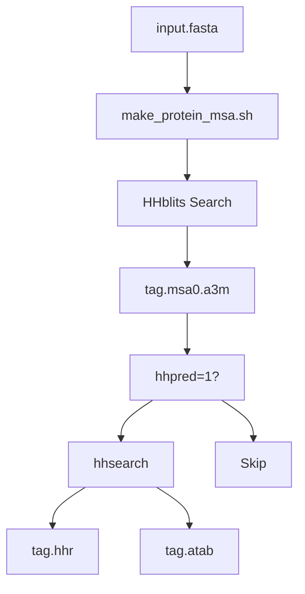
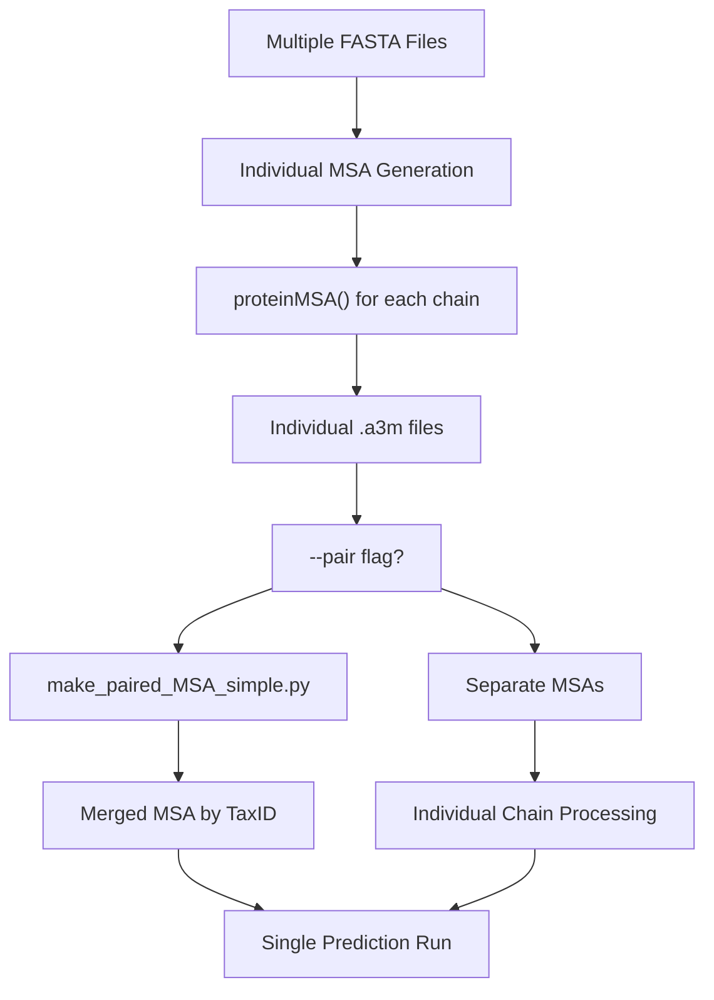

# Command Line Reference

> **Relevant source files**
> * [examples/rcsb_pdb_7YTB.fasta](https://github.com/uw-ipd/RoseTTAFold2/blob/4b273b95/examples/rcsb_pdb_7YTB.fasta)
> * [input_prep/make_paired_MSA_simple.py](https://github.com/uw-ipd/RoseTTAFold2/blob/4b273b95/input_prep/make_paired_MSA_simple.py)
> * [run_RF2.sh](https://github.com/uw-ipd/RoseTTAFold2/blob/4b273b95/run_RF2.sh)

This document provides comprehensive reference information for the RoseTTAFold2 command line interface. It covers the main entry point script, command line options, internal pipeline commands, and file format specifications.

For basic usage examples and quick start instructions, see [Basic Usage](/uw-ipd/RoseTTAFold2/2.2-basic-usage). For detailed information about input and output file formats, see [File Formats and Examples](/uw-ipd/RoseTTAFold2/8.1-file-formats-and-examples).

## Main Command Interface

The primary entry point for RoseTTAFold2 is the `run_RF2.sh` script, which orchestrates the complete protein structure prediction pipeline from FASTA input to PDB output.

### Basic Syntax

```
run_RF2.sh [OPTIONS] input1.fasta [input2.fasta ...]
```

### Command Line Options

| Option | Long Form | Description | Default |
| --- | --- | --- | --- |
| `-o` | `--outdir` | Output directory for results | `rf2out` |
| `-s` | `--symm` | Symmetry group (C_n, D_n, T, I, O) | `C1` |
| `-p` | `--pair` | Pair MSAs based on taxonomy ID | `false` |
| `-h` | `--hhpred` | Run hhpred for template generation | `false` |
|  | `--help` | Display help message |  |

Sources: [run_RF2.sh L59-L99](https://github.com/uw-ipd/RoseTTAFold2/blob/4b273b95/run_RF2.sh#L59-L99)

## Pipeline Workflow

The `run_RF2.sh` script executes a multi-stage pipeline that processes input sequences through MSA generation, template search, and structure prediction.

### Main Pipeline Flow



Sources: [run_RF2.sh L28-L156](https://github.com/uw-ipd/RoseTTAFold2/blob/4b273b95/run_RF2.sh#L28-L156)

### Internal Command Execution

The script executes several internal commands in sequence:

#### MSA Generation Phase



The MSA generation uses the `proteinMSA()` function which calls:

* `make_protein_msa.sh` for MSA generation
* `hhsearch` for template search when `--hhpred` is enabled

Sources: [run_RF2.sh L28-L52](https://github.com/uw-ipd/RoseTTAFold2/blob/4b273b95/run_RF2.sh#L28-L52)

#### Prediction Phase

The final prediction step executes:

```
python $PIPEDIR/network/predict.py \    -inputs $argstring \    -prefix $WDIR/models/model \    -model $PIPEDIR/network/weights/RF2_apr23.pt \    -db $HHDB \    -symm $symm
```

Sources: [run_RF2.sh L151-L156](https://github.com/uw-ipd/RoseTTAFold2/blob/4b273b95/run_RF2.sh#L151-L156)

## Environment Configuration

The script requires specific environment setup:

### Required Variables

| Variable | Purpose | Default Value |
| --- | --- | --- |
| `PIPEDIR` | RoseTTAFold2 installation directory | Auto-detected |
| `HHDB` | HHpred database path | `$PIPEDIR/pdb100_2021Mar03/pdb100_2021Mar03` |
| `CPU` | Number of CPU cores | `8` |
| `MEM` | Memory limit in GB | `64` |
| `WDIR` | Working directory | `rf2out` |

### Conda Environment

The script activates the `RF2` conda environment:

```
conda activate RF2
```

Sources: [run_RF2.sh L15-L26](https://github.com/uw-ipd/RoseTTAFold2/blob/4b273b95/run_RF2.sh#L15-L26)

## Multi-Chain Processing

For multi-chain predictions, the script supports MSA pairing based on taxonomic information.

### Pairing Workflow



The pairing script `make_paired_MSA_simple.py` merges MSAs by:

1. Reading sequences from multiple A3M files
2. Grouping sequences by TaxID
3. Selecting best sequence per TaxID per chain
4. Creating merged MSA with paired sequences

Sources: [run_RF2.sh L127-L143](https://github.com/uw-ipd/RoseTTAFold2/blob/4b273b95/run_RF2.sh#L127-L143)

 [input_prep/make_paired_MSA_simple.py L79-L141](https://github.com/uw-ipd/RoseTTAFold2/blob/4b273b95/input_prep/make_paired_MSA_simple.py#L79-L141)

## File Naming Conventions

The script uses systematic file naming patterns:

### Input Processing

* Input FASTA files are split into individual chains: `{tag}_{n}.fa`
* MSA files are generated as: `{tag}.msa0.a3m`
* Template search results: `{tag}.hhr`, `{tag}.atab`

### Output Structure

```
{WDIR}/
├── log/
│   ├── make_msa.{tag}.stdout
│   ├── make_msa.{tag}.stderr
│   ├── hhsearch.{tag}.stdout
│   └── hhsearch.{tag}.stderr
├── models/
│   ├── model_00.pdb
│   ├── model_00.npz
│   └── ...
├── {tag}.msa0.a3m
├── {tag}.hhr
└── {tag}.atab
```

Sources: [run_RF2.sh L101-L150](https://github.com/uw-ipd/RoseTTAFold2/blob/4b273b95/run_RF2.sh#L101-L150)

## Error Handling

The script includes error handling mechanisms:

* `set -e` causes script to exit on any command failure
* Output and error streams are redirected to log files
* Conditional execution prevents re-running completed steps

Sources: [run_RF2.sh L3-L4](https://github.com/uw-ipd/RoseTTAFold2/blob/4b273b95/run_RF2.sh#L3-L4)

 [run_RF2.sh L38-L49](https://github.com/uw-ipd/RoseTTAFold2/blob/4b273b95/run_RF2.sh#L38-L49)

## Usage Examples

### Basic Single Chain Prediction

```
./run_RF2.sh protein.fasta
```

### Multi-Chain with Pairing

```
./run_RF2.sh --pair chainA.fasta chainB.fasta
```

### Custom Output Directory with Templates

```
./run_RF2.sh --outdir my_results --hhpred protein.fasta
```

### Symmetric Complex Prediction

```
./run_RF2.sh --symm C3 --pair subunit.fasta
```

Sources: [run_RF2.sh L60-L76](https://github.com/uw-ipd/RoseTTAFold2/blob/4b273b95/run_RF2.sh#L60-L76)

## Internal Script Dependencies

The main script depends on several internal utilities:

### Required Scripts

* `input_prep/make_protein_msa.sh` - MSA generation
* `input_prep/make_paired_MSA_simple.py` - MSA pairing
* `network/predict.py` - Structure prediction
* External tools: `hhsearch`, `hhblits`

### Database Requirements

* PDB100 database for template search
* UniRef30/BFD databases for MSA generation (configured in `make_protein_msa.sh`)

Sources: [run_RF2.sh L37-L38](https://github.com/uw-ipd/RoseTTAFold2/blob/4b273b95/run_RF2.sh#L37-L38)

 [run_RF2.sh L47-L49](https://github.com/uw-ipd/RoseTTAFold2/blob/4b273b95/run_RF2.sh#L47-L49)

 [run_RF2.sh L151-L156](https://github.com/uw-ipd/RoseTTAFold2/blob/4b273b95/run_RF2.sh#L151-L156)