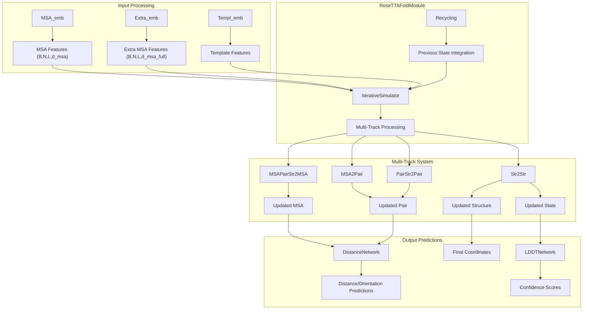
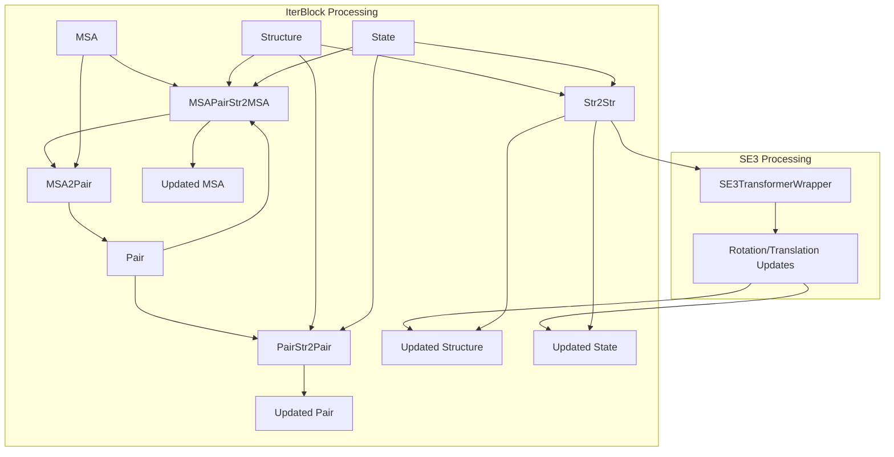
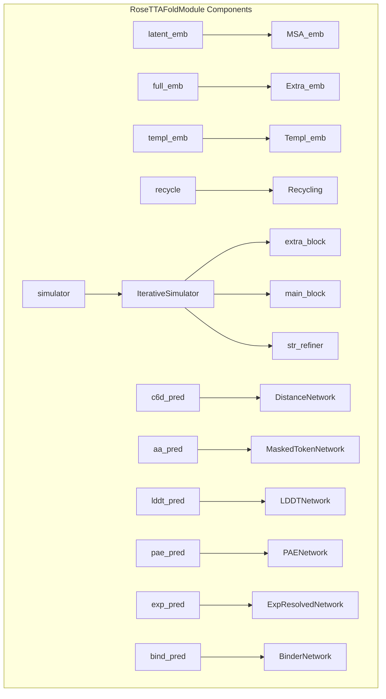
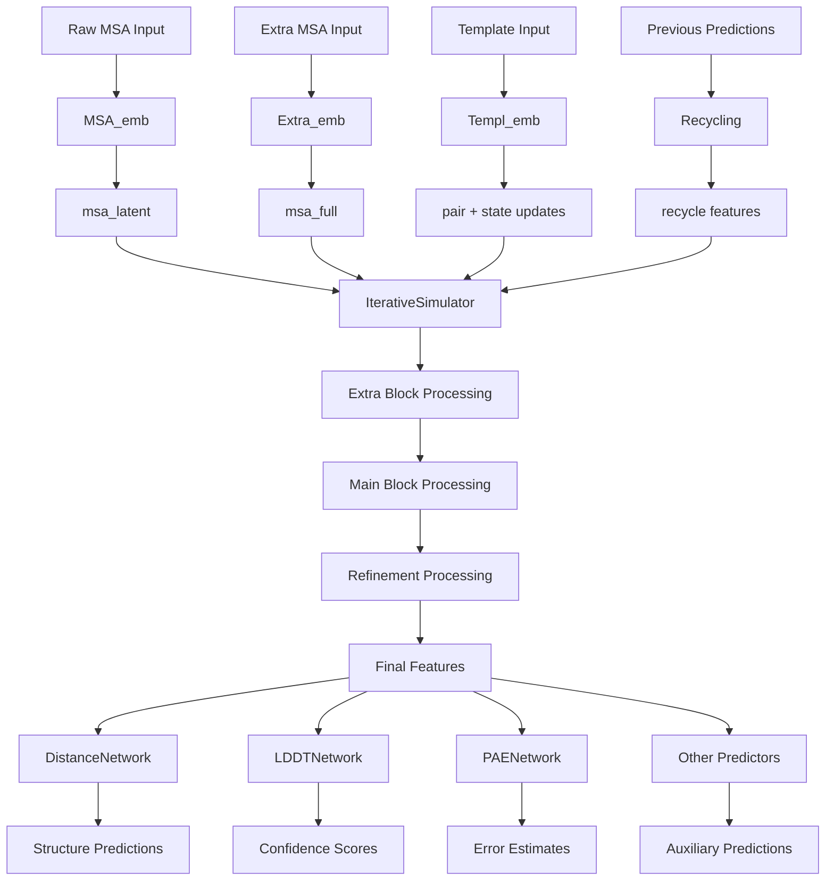

# Core Architecture

> **Relevant source files**
> * [network/Embeddings.py](https://github.com/uw-ipd/RoseTTAFold2/blob/4b273b95/network/Embeddings.py)
> * [network/RoseTTAFoldModel.py](https://github.com/uw-ipd/RoseTTAFold2/blob/4b273b95/network/RoseTTAFoldModel.py)
> * [network/Track_module.py](https://github.com/uw-ipd/RoseTTAFold2/blob/4b273b95/network/Track_module.py)

## Purpose and Scope

This document provides a comprehensive overview of RoseTTAFold2's core neural network architecture, focusing on the multi-track processing system that enables protein structure prediction. The architecture centers around the `RoseTTAFoldModule` class and its associated components that process multiple sequence alignments (MSAs), pairwise features, and 3D structural information simultaneously.

For implementation details of specific components, see [RoseTTAFold Model](/uw-ipd/RoseTTAFold2/3.1-rosettafold-model), [Iterative Simulator](/uw-ipd/RoseTTAFold2/3.2-iterative-simulator), [Embedding Modules](/uw-ipd/RoseTTAFold2/3.3-embedding-modules), [Attention Mechanisms](/uw-ipd/RoseTTAFold2/3.4-attention-mechanisms), and [SE3 Transformer](/uw-ipd/RoseTTAFold2/3.5-se3-transformer). For the prediction pipeline that uses this architecture, see [Prediction Pipeline](/uw-ipd/RoseTTAFold2/4-prediction-pipeline).

## Architecture Overview

RoseTTAFold2 employs a multi-track neural network architecture that processes three types of information simultaneously: MSA features, pairwise residue features, and 3D structural coordinates. The core design principle is iterative refinement, where each track informs and updates the others through attention mechanisms and geometric transformations.

**RoseTTAFold2 Core Architecture Overview**

Sources: [network/RoseTTAFoldModel.py L11-L149](https://github.com/uw-ipd/RoseTTAFold2/blob/4b273b95/network/RoseTTAFoldModel.py#L11-L149)

 [network/Track_module.py L1-L841](https://github.com/uw-ipd/RoseTTAFold2/blob/4b273b95/network/Track_module.py#L1-L841)

 [network/Embeddings.py L1-L412](https://github.com/uw-ipd/RoseTTAFold2/blob/4b273b95/network/Embeddings.py#L1-L412)

## Multi-Track Processing System

The heart of RoseTTAFold2 is the multi-track processing system implemented in the `IterativeSimulator` class. This system processes information through three primary tracks that communicate through attention mechanisms:

| Track | Input | Output | Purpose |
| --- | --- | --- | --- |
| MSA Track | MSA features (B,N,L,d_msa) | Updated MSA embeddings | Evolutionary information processing |
| Pair Track | Pairwise features (B,L,L,d_pair) | Updated pair embeddings | Residue-residue interactions |
| Structure Track | 3D coordinates (B,L,3,3) | Updated coordinates & rotations | Geometric constraints |

**Multi-Track Communication in IterBlock**

The `IterBlock` class coordinates these tracks through four key operations:

1. **MSA → MSA Update**: `MSAPairStr2MSA` uses biased attention with information from pair and structure tracks
2. **MSA → Pair Update**: `MSA2Pair` extracts coevolution signals from MSA to update pair features
3. **Pair → Pair Update**: `PairStr2Pair` processes pairwise features with structural bias
4. **Structure → Structure Update**: `Str2Str` applies SE(3)-equivariant transformations

Sources: [network/Track_module.py L619-L700](https://github.com/uw-ipd/RoseTTAFold2/blob/4b273b95/network/Track_module.py#L619-L700)

 [network/Track_module.py L701-L841](https://github.com/uw-ipd/RoseTTAFold2/blob/4b273b95/network/Track_module.py#L701-L841)

## Core Components

The `RoseTTAFoldModule` integrates several specialized components:

### Embedding Systems

* **`MSA_emb`**: Processes seed MSA sequences and generates initial embeddings
* **`Extra_emb`**: Handles additional MSA sequences with reduced dimensionality
* **`Templ_emb`**: Integrates template structure information through attention mechanisms
* **`Recycling`**: Incorporates predictions from previous inference rounds

### Processing Blocks

* **`IterativeSimulator`**: Orchestrates multi-track processing through configurable block sequences
* **Extra Blocks**: Process full MSA with global attention (n_extra_block iterations)
* **Main Blocks**: Process seed MSA with local attention (n_main_block iterations)
* **Refinement Blocks**: Final structure refinement using top-k neighbors (n_ref_block iterations)

### Auxiliary Predictors

* **`DistanceNetwork`**: Predicts distance and orientation distributions
* **`LDDTNetwork`**: Estimates local confidence scores
* **`PAENetwork`**: Predicts position alignment errors
* **`ExpResolvedNetwork`**: Estimates experimental resolution quality

**RoseTTAFoldModule Component Architecture**

Sources: [network/RoseTTAFoldModel.py L19-L50](https://github.com/uw-ipd/RoseTTAFold2/blob/4b273b95/network/RoseTTAFoldModel.py#L19-L50)

 [network/Embeddings.py L54-L106](https://github.com/uw-ipd/RoseTTAFold2/blob/4b273b95/network/Embeddings.py#L54-L106)

 [network/Embeddings.py L187-L336](https://github.com/uw-ipd/RoseTTAFold2/blob/4b273b95/network/Embeddings.py#L187-L336)

## Data Flow and Processing Pipeline

The data flows through the architecture in a carefully orchestrated sequence:

1. **Initial Embedding**: Raw MSA and sequence data are embedded into feature spaces
2. **Recycling Integration**: Previous predictions are incorporated to improve iterative refinement
3. **Template Processing**: Structural templates are integrated through attention mechanisms
4. **Multi-Track Iteration**: Features are refined through coordinated track updates
5. **Final Prediction**: Auxiliary networks generate final structure and confidence predictions

**Data Flow Through RoseTTAFold2 Architecture**

The forward pass processes batches with dimensions:

* **MSA features**: `(B, N, L, d_msa)` where B=batch, N=sequences, L=length
* **Pair features**: `(B, L, L, d_pair)` for residue-residue interactions
* **Structure coordinates**: `(B, L, 3, 3)` for backbone atoms (N, CA, C)
* **State features**: `(B, L, d_state)` for per-residue hidden states

Sources: [network/RoseTTAFoldModel.py L52-L149](https://github.com/uw-ipd/RoseTTAFold2/blob/4b273b95/network/RoseTTAFoldModel.py#L52-L149)

 [network/Track_module.py L753-L841](https://github.com/uw-ipd/RoseTTAFold2/blob/4b273b95/network/Track_module.py#L753-L841)

## Integration Points and Optimization

The architecture includes several key integration points that enable efficient processing:

### Memory Management

* **Striping**: Processes large structures in chunks to manage memory usage
* **Checkpointing**: Uses gradient checkpointing to reduce memory during training
* **Low VRAM Mode**: Moves tensors between CPU/GPU to handle memory constraints

### Symmetry Handling

* **`update_symm_Rs`**: Applies symmetry constraints to rotation matrices
* **`update_symm_subs`**: Updates symmetric subunit relationships
* **Symmetry-aware processing**: Maintains structural symmetries during prediction

### Computational Efficiency

* **Top-k neighborhoods**: Limits attention to most relevant residue pairs
* **Cropping strategies**: Processes pair features in sub-blocks for large proteins
* **Mixed precision**: Uses automatic mixed precision for faster training

The architecture balances computational efficiency with biological accuracy through these carefully designed integration points, enabling prediction of large protein complexes while maintaining high structural quality.

Sources: [network/Track_module.py L411-L489](https://github.com/uw-ipd/RoseTTAFold2/blob/4b273b95/network/Track_module.py#L411-L489)

 [network/Track_module.py L172-L216](https://github.com/uw-ipd/RoseTTAFold2/blob/4b273b95/network/Track_module.py#L172-L216)

 [network/RoseTTAFoldModel.py L56-L58](https://github.com/uw-ipd/RoseTTAFold2/blob/4b273b95/network/RoseTTAFoldModel.py#L56-L58)