# Core Utilities

> **Relevant source files**
> * [network/chemical.py](https://github.com/uw-ipd/RoseTTAFold2/blob/4b273b95/network/chemical.py)
> * [network/symmetry.py](https://github.com/uw-ipd/RoseTTAFold2/blob/4b273b95/network/symmetry.py)
> * [network/util.py](https://github.com/uw-ipd/RoseTTAFold2/blob/4b273b95/network/util.py)
> * [network/util_module.py](https://github.com/uw-ipd/RoseTTAFold2/blob/4b273b95/network/util_module.py)

This document covers the core utility functions and classes that support RoseTTAFold2's neural network architecture and prediction pipeline. These utilities handle graph construction, coordinate transformations, neural network operations, chemical data, and protein symmetry processing.

For information about the main neural network architecture, see [Core Architecture](/uw-ipd/RoseTTAFold2/3-core-architecture). For training-specific utilities, see [Training System](/uw-ipd/RoseTTAFold2/5-training-system). For memory optimization utilities, see [Memory Management](/uw-ipd/RoseTTAFold2/6.2-memory-management).

## Graph Construction

RoseTTAFold2 uses graph neural networks that require constructing molecular graphs from protein coordinates and features. The system provides several graph construction strategies based on spatial proximity and sequence relationships.

### Top-K Graph Construction

The `make_topk_graph` function creates graphs by connecting each residue to its k nearest neighbors in 3D space, with additional sequential connectivity constraints.

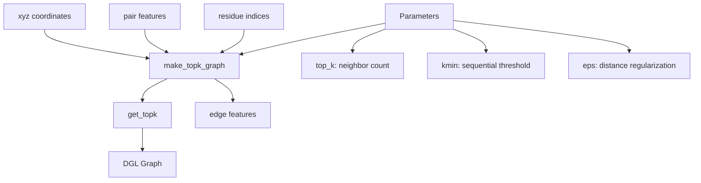

**Graph Construction Process:**

1. **Distance Calculation**: Computes pairwise distances between residue CA atoms
2. **Sequential Connectivity**: Ensures nearby residues in sequence are connected (controlled by `kmin`)
3. **Top-K Selection**: Selects k nearest neighbors for each residue beyond sequential neighbors
4. **Edge Features**: Extracts corresponding pair features for selected edges

Sources: [network/util_module.py L221-L268](https://github.com/uw-ipd/RoseTTAFold2/blob/4b273b95/network/util_module.py#L221-L268)

### Multi-Node Graph Construction

For SE(3) transformer processing, the system constructs graphs with multiple node types representing different atomic centers (backbone and sidechain).

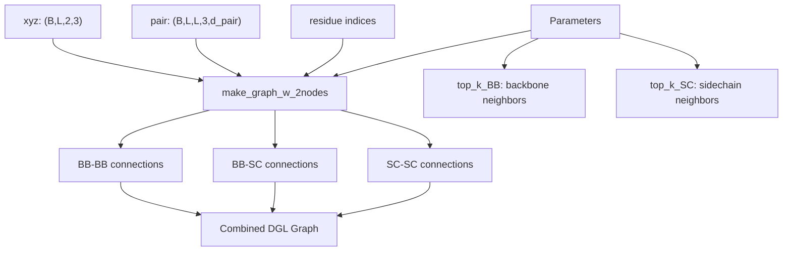

**Node Types:**

* **Backbone nodes**: Represent CA atom positions
* **Sidechain nodes**: Represent CB/centroid positions
* **Edge types**: BB-BB, BB-SC, SC-SC connections based on spatial proximity

Sources: [network/util_module.py L129-L187](https://github.com/uw-ipd/RoseTTAFold2/blob/4b273b95/network/util_module.py#L129-L187)

## Coordinate Transformation Utilities

The system extensively uses coordinate transformations for protein structure prediction and all-atom reconstruction.

### Rigid Body Transformations

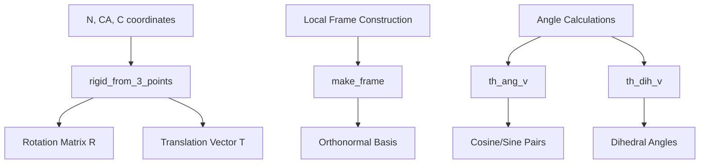

The `rigid_from_3_points` function constructs local coordinate frames from backbone atoms, handling both ideal and non-ideal geometries.

Sources: [network/util.py L75-L103](https://github.com/uw-ipd/RoseTTAFold2/blob/4b273b95/network/util.py#L75-L103)

### All-Atom Coordinate Generation

The `XYZConverter` class reconstructs full atomic detail from backbone coordinates and torsion angles.

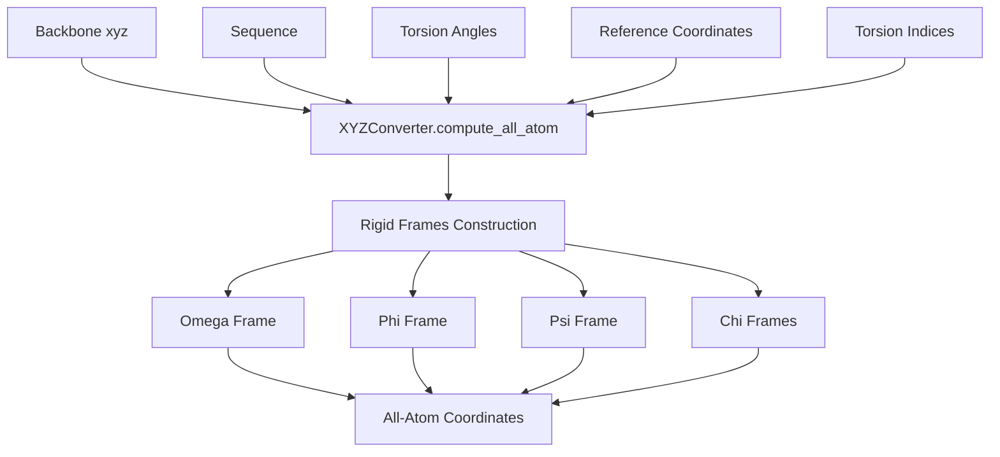

**Torsion Handling:**

* **Backbone torsions**: omega, phi, psi angles
* **Sidechain torsions**: chi1-chi4 angles
* **Additional angles**: CB bend, CB twist, CG bend for improved geometry

Sources: [network/util_module.py L413-L507](https://github.com/uw-ipd/RoseTTAFold2/blob/4b273b95/network/util_module.py#L413-L507)

## Neural Network Utilities

### Weight Initialization

The system uses LeCun normal initialization with truncated distributions for stable training.

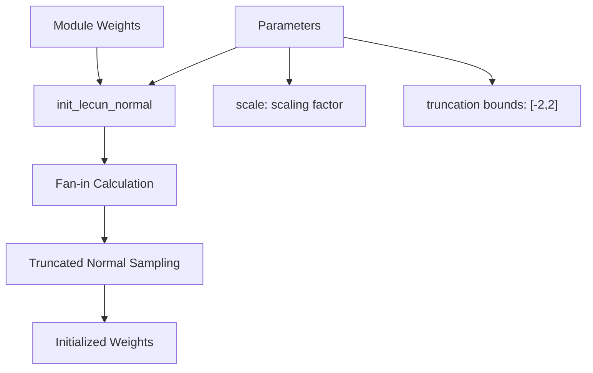

Sources: [network/util_module.py L10-L31](https://github.com/uw-ipd/RoseTTAFold2/blob/4b273b95/network/util_module.py#L10-L31)

### Gradient Checkpointing

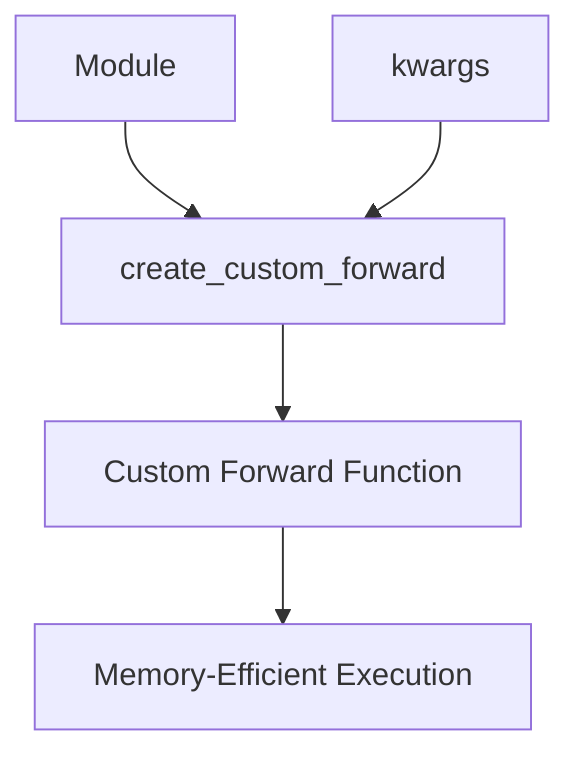

The `create_custom_forward` function creates wrapped forward functions for gradient checkpointing, trading computation for memory.

Sources: [network/util_module.py L57-L60](https://github.com/uw-ipd/RoseTTAFold2/blob/4b273b95/network/util_module.py#L57-L60)

### Custom Dropout

The `Dropout` class implements structured dropout that can drop entire rows or columns, useful for attention mechanisms.

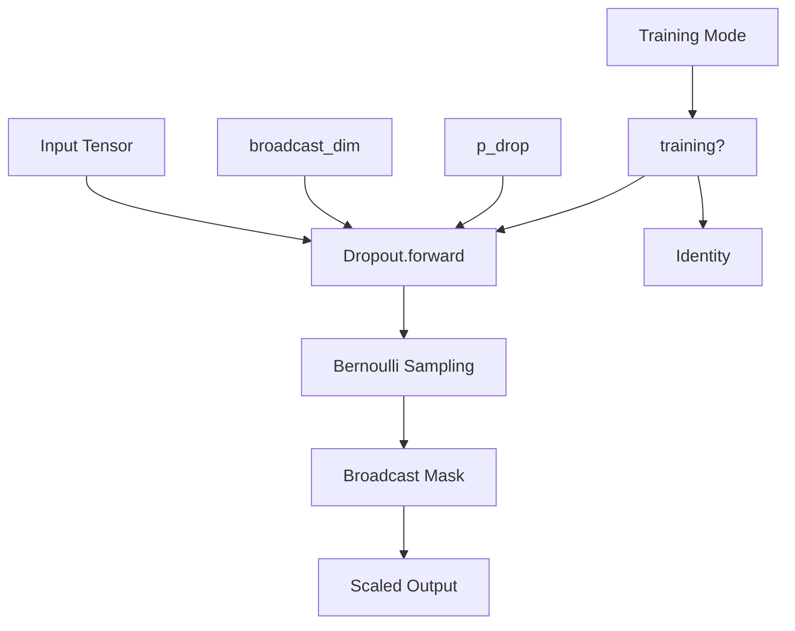

Sources: [network/util_module.py L65-L82](https://github.com/uw-ipd/RoseTTAFold2/blob/4b273b95/network/util_module.py#L65-L82)

## Chemical Data and Constants

The system maintains extensive chemical knowledge for amino acid processing and all-atom reconstruction.

### Amino Acid Representations

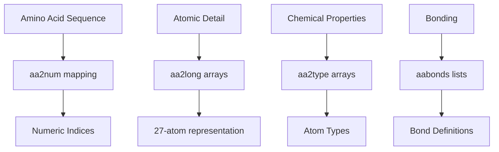

**Key Data Structures:**

* `aa2long`: 27-atom representation for each amino acid type
* `aa2type`: Chemical atom types for force field calculations
* `torsions`: Torsion angle definitions for sidechain flexibility
* `ideal_coords`: Reference coordinates for reconstruction

Sources: [network/chemical.py L16-L571](https://github.com/uw-ipd/RoseTTAFold2/blob/4b273b95/network/chemical.py#L16-L571)

### Radial Basis Functions

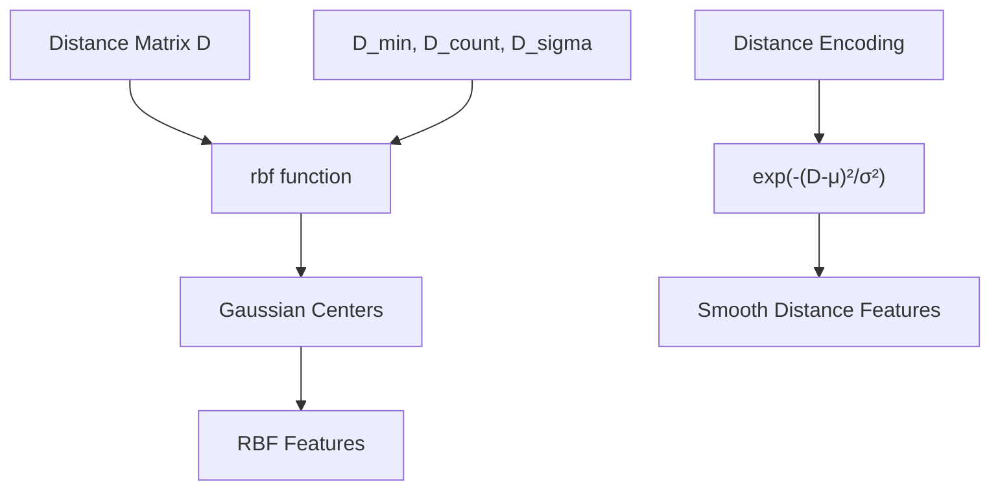

The `rbf` function converts distances into smooth feature representations using Gaussian basis functions.

Sources: [network/util_module.py L84-L91](https://github.com/uw-ipd/RoseTTAFold2/blob/4b273b95/network/util_module.py#L84-L91)

## Symmetry Handling

RoseTTAFold2 can handle symmetric protein complexes through specialized symmetry utilities.

### Symmetry Detection

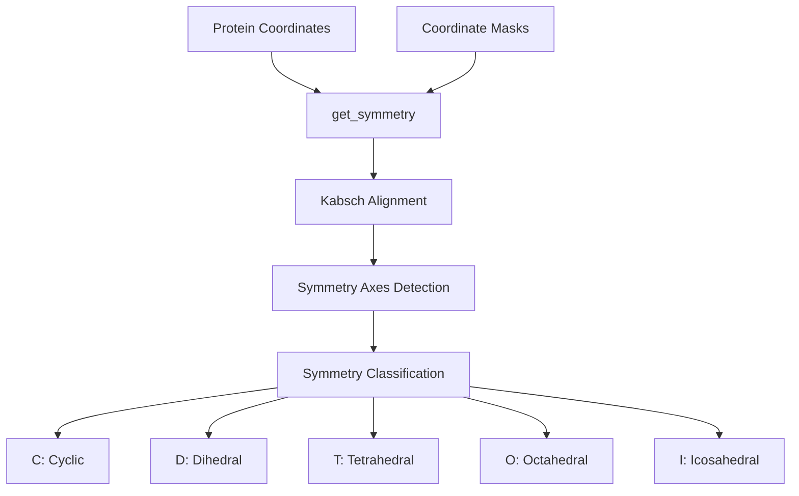

**Detection Process:**

1. **Pairwise Alignment**: Use Kabsch algorithm to align subunits
2. **Axis Identification**: Find rotation axes from alignment matrices
3. **Classification**: Determine symmetry group based on axis relationships

Sources: [network/symmetry.py L106-L219](https://github.com/uw-ipd/RoseTTAFold2/blob/4b273b95/network/symmetry.py#L106-L219)

### Symmetry Matrices

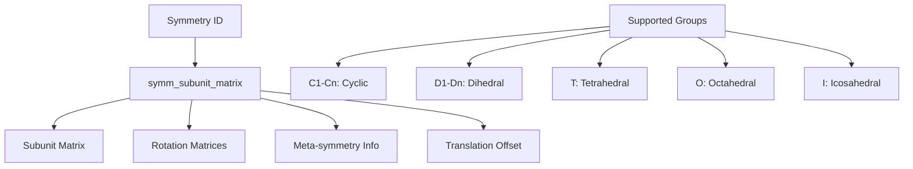

The system provides pre-computed symmetry operators for all major protein symmetry groups.

Sources: [network/symmetry.py L222-L710](https://github.com/uw-ipd/RoseTTAFold2/blob/4b273b95/network/symmetry.py#L222-L710)

## Sequence Features

### Sequence Separation

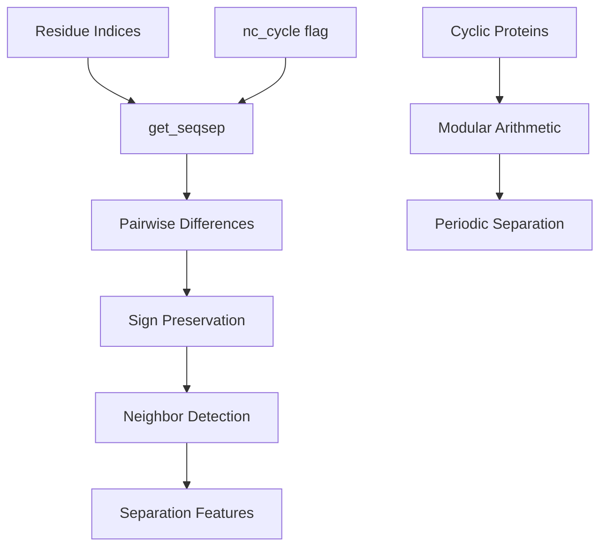

The `get_seqsep` function computes sequence separation features that help the network understand residue connectivity.

Sources: [network/util_module.py L93-L111](https://github.com/uw-ipd/RoseTTAFold2/blob/4b273b95/network/util_module.py#L93-L111)

These core utilities form the foundation for RoseTTAFold2's molecular processing capabilities, providing essential functions for graph construction, coordinate manipulation, and chemical knowledge representation.