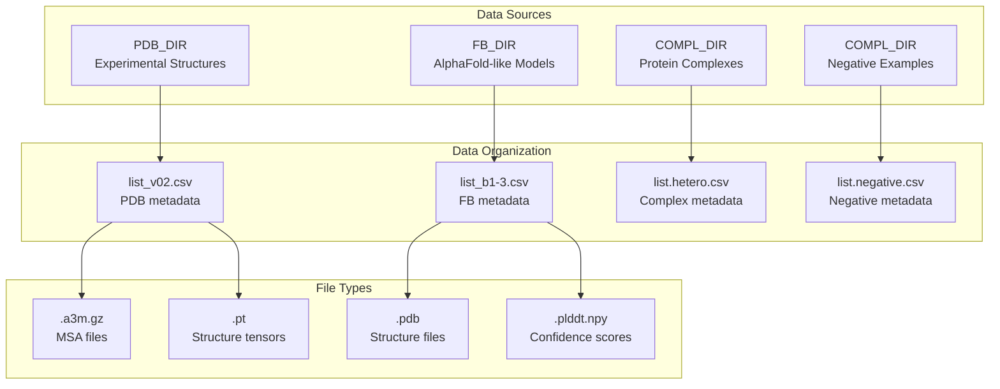
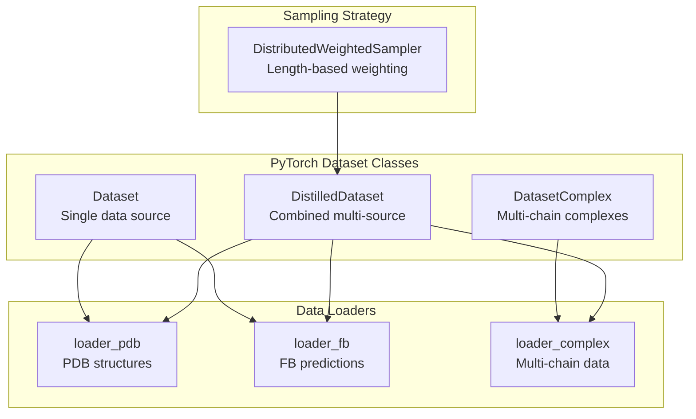
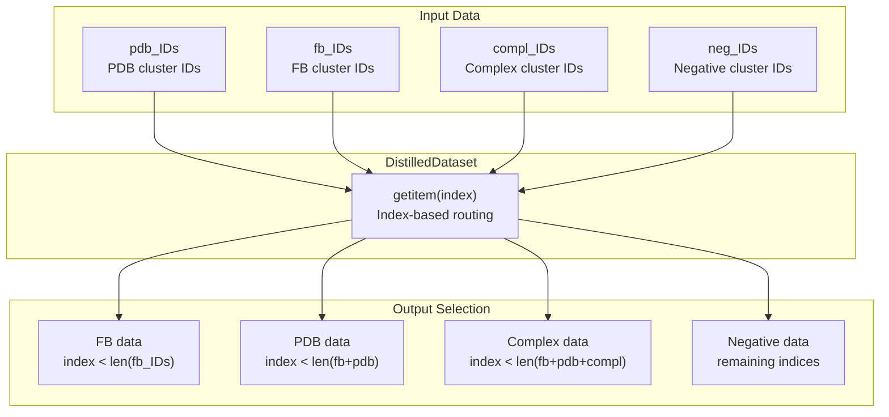
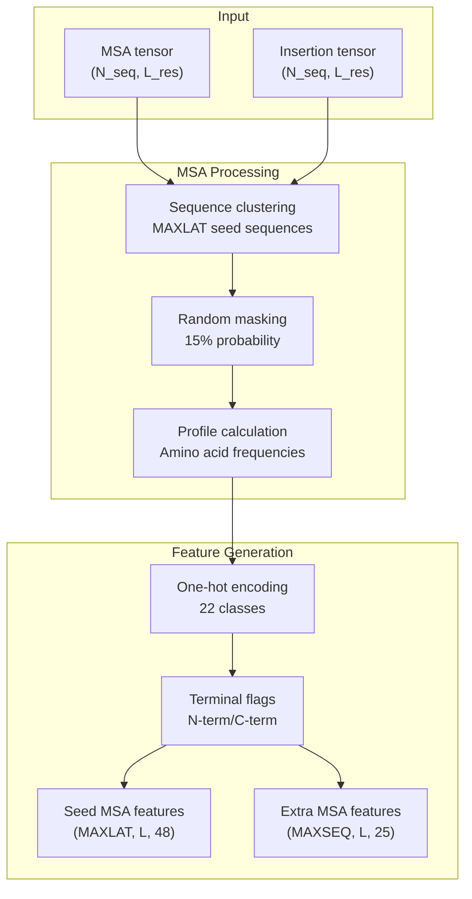
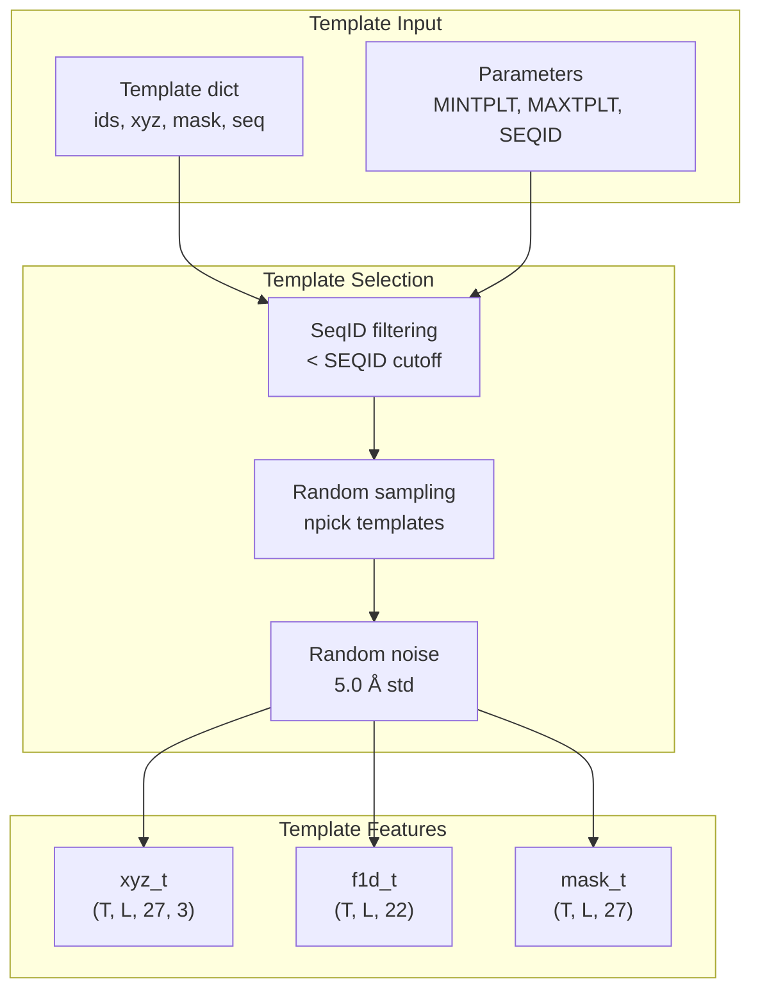
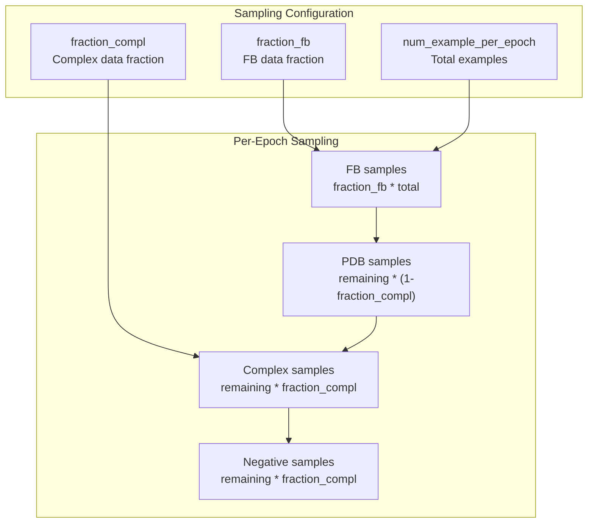
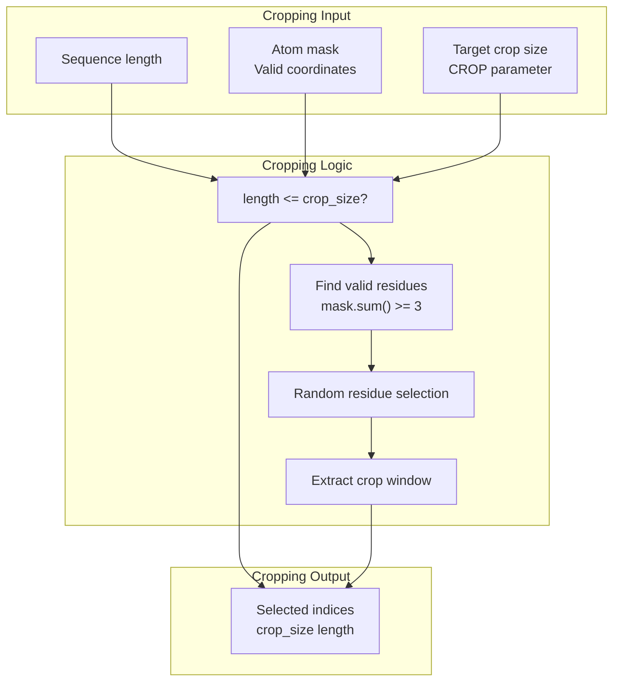
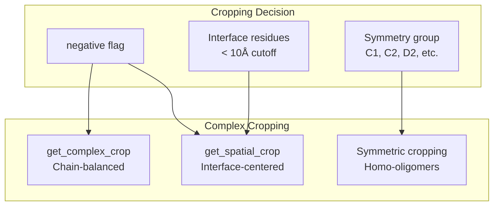
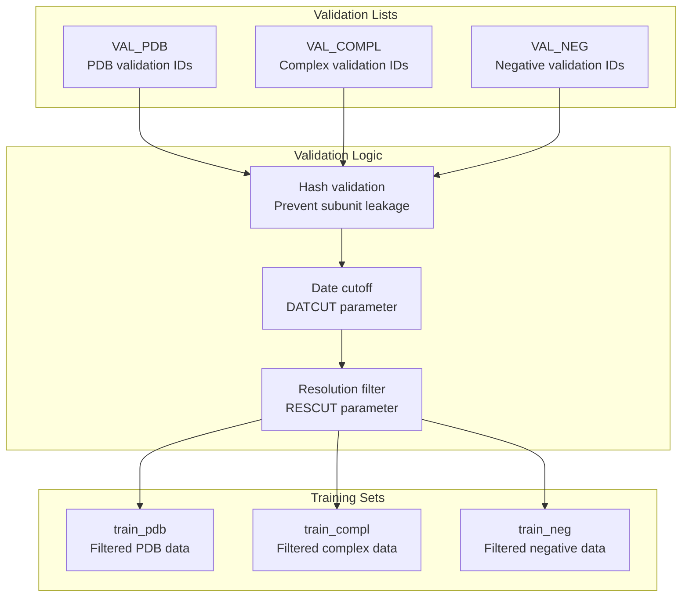

# Data Loading for Training

> **Relevant source files**
> * [network/data_loader.py](https://github.com/uw-ipd/RoseTTAFold2/blob/4b273b95/network/data_loader.py)

This document covers the training data loading system for RoseTTAFold2, which handles multiple heterogeneous data sources and converts them into neural network features. The system manages PDB structures, AlphaFold-like models, protein complexes, and negative examples while supporting distributed training with weighted sampling.

For information about the training pipeline itself, see [Training Pipeline](/uw-ipd/RoseTTAFold2/5.1-training-pipeline). For data preparation during inference, see [Data Preparation](/uw-ipd/RoseTTAFold2/4.3-data-preparation).

## Data Sources and Organization

The training system integrates four distinct data sources, each with specific directory structures and metadata formats:

| Data Source | Directory Variable | Description | File Types |
| --- | --- | --- | --- |
| PDB | `PDB_DIR` | Experimental protein structures | `.pt`, `.a3m.gz`, `.pdb` |
| Facebook/Meta | `FB_DIR` | AlphaFold-like predicted structures | `.pdb`, `.plddt.npy`, `.a3m.gz` |
| Complex | `COMPL_DIR` | Multi-chain protein complexes | `.a3m.gz`, assembly info |
| Negative | `COMPL_DIR` | Non-interacting protein pairs | `.a3m.gz`, pair metadata |

Sources: [network/data_loader.py L12-L43](https://github.com/uw-ipd/RoseTTAFold2/blob/4b273b95/network/data_loader.py#L12-L43)

## Dataset Classes and Architecture

The data loading system uses a hierarchical class structure to handle different data types and training requirements:

### DistilledDataset Class

The `DistilledDataset` class combines all data sources into a single dataset with configurable sampling ratios:

Sources: [network/data_loader.py L1023-L1092](https://github.com/uw-ipd/RoseTTAFold2/blob/4b273b95/network/data_loader.py#L1023-L1092)

## Feature Processing Pipeline

The system converts raw biological data into neural network features through a multi-stage pipeline:

### MSA Feature Processing

The `MSAFeaturize` function performs the core MSA-to-feature conversion:

Key parameters from `MSAFeaturize`:

* `MAXLAT`: Maximum latent MSA sequences (default: 128)
* `MAXSEQ`: Maximum extra sequences (default: 1024)
* `MAXCYCLE`: Number of masking cycles (default: 4)

Sources: [network/data_loader.py L75-L210](https://github.com/uw-ipd/RoseTTAFold2/blob/4b273b95/network/data_loader.py#L75-L210)

### Template Feature Processing

The `TemplFeaturize` function handles structural template processing:

Sources: [network/data_loader.py L212-L268](https://github.com/uw-ipd/RoseTTAFold2/blob/4b273b95/network/data_loader.py#L212-L268)

## Data Sampling and Distribution

### Weighted Sampling Strategy

The `DistributedWeightedSampler` implements length-based weighting to ensure balanced training:

| Data Type | Weight Calculation | Purpose |
| --- | --- | --- |
| PDB | `(1/512) * clamp(length, 256, 512)` | Favor longer structures |
| FB | `(1/512) * clamp(length, 256, 512)` | Consistent with PDB |
| Complex | `(1/512) * clamp(sum(lengths), 256, 512)` | Weight by total length |
| Negative | `(1/512) * clamp(sum(lengths), 256, 512)` | Consistent with complex |

Sources: [network/data_loader.py L1094-L1166](https://github.com/uw-ipd/RoseTTAFold2/blob/4b273b95/network/data_loader.py#L1094-L1166)

## Cropping Strategies

The system implements multiple cropping strategies to manage memory and computational requirements:

### Single Chain Cropping

The `get_crop` function handles single-chain structures:

### Complex Cropping

For multi-chain complexes, the system uses specialized cropping strategies:

| Strategy | Function | Use Case |
| --- | --- | --- |
| Spatial | `get_spatial_crop` | Interface-focused crops |
| Proportional | `get_complex_crop` | Balanced chain representation |
| Symmetric | Applied in `featurize_homo` | Homo-oligomer handling |

Sources: [network/data_loader.py L439-L508](https://github.com/uw-ipd/RoseTTAFold2/blob/4b273b95/network/data_loader.py#L439-L508)

## Validation Set Management

The system maintains strict separation between training and validation data:

Sources: [network/data_loader.py L270-L437](https://github.com/uw-ipd/RoseTTAFold2/blob/4b273b95/network/data_loader.py#L270-L437)