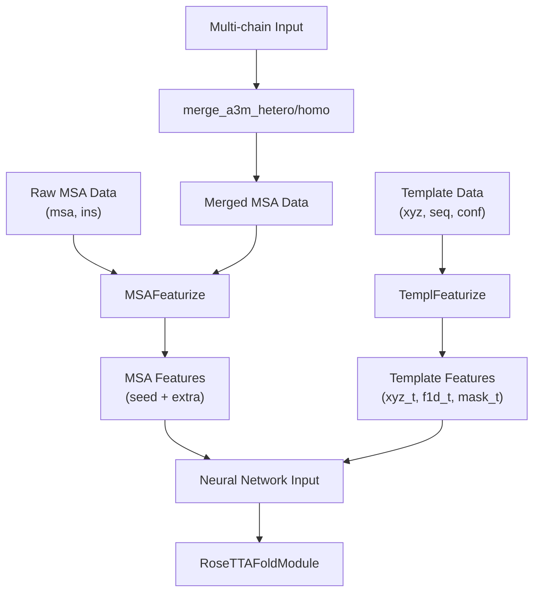
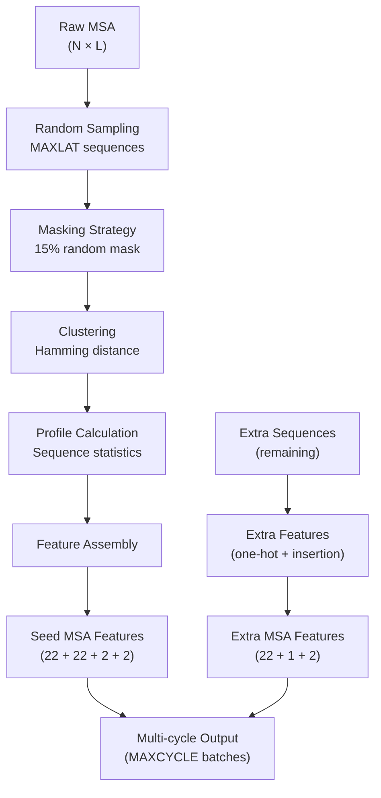
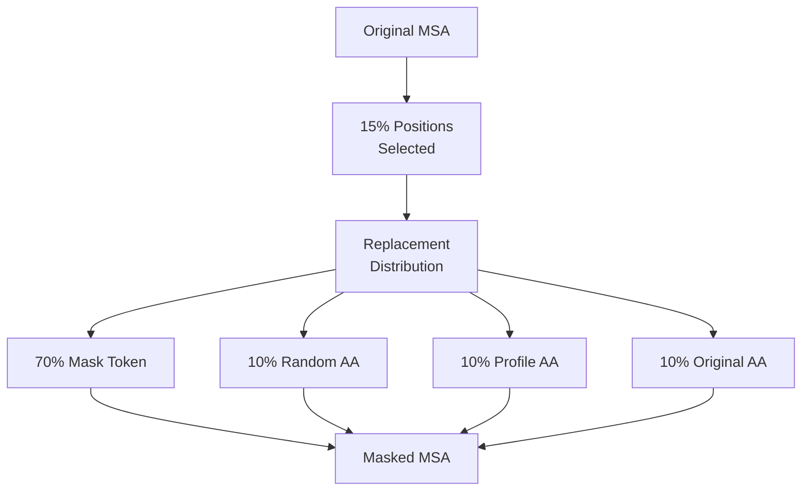
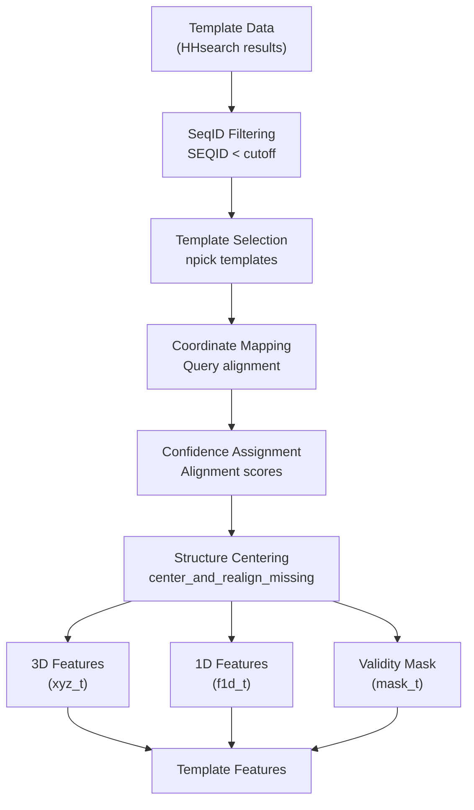
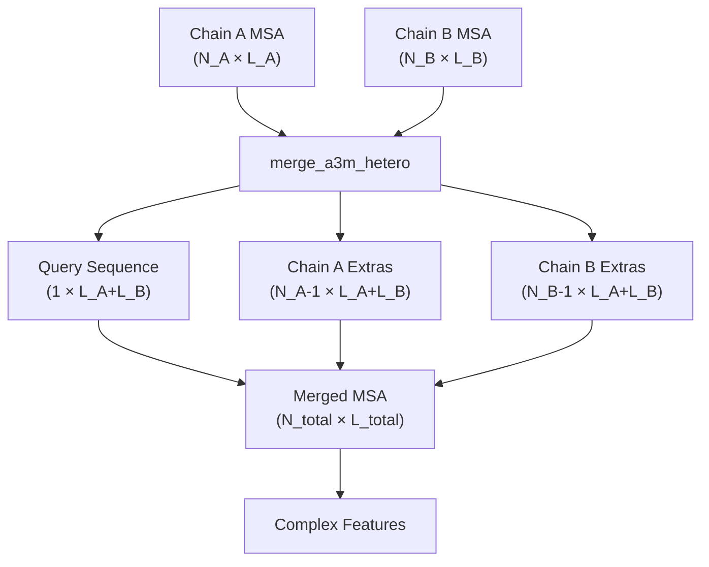
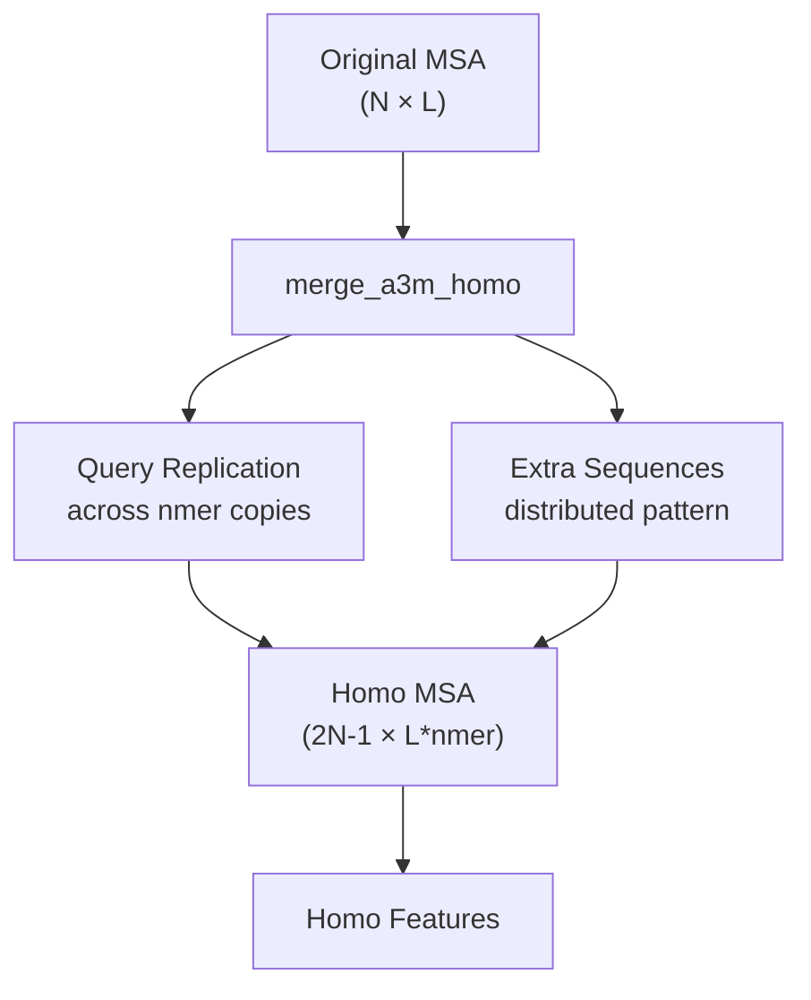
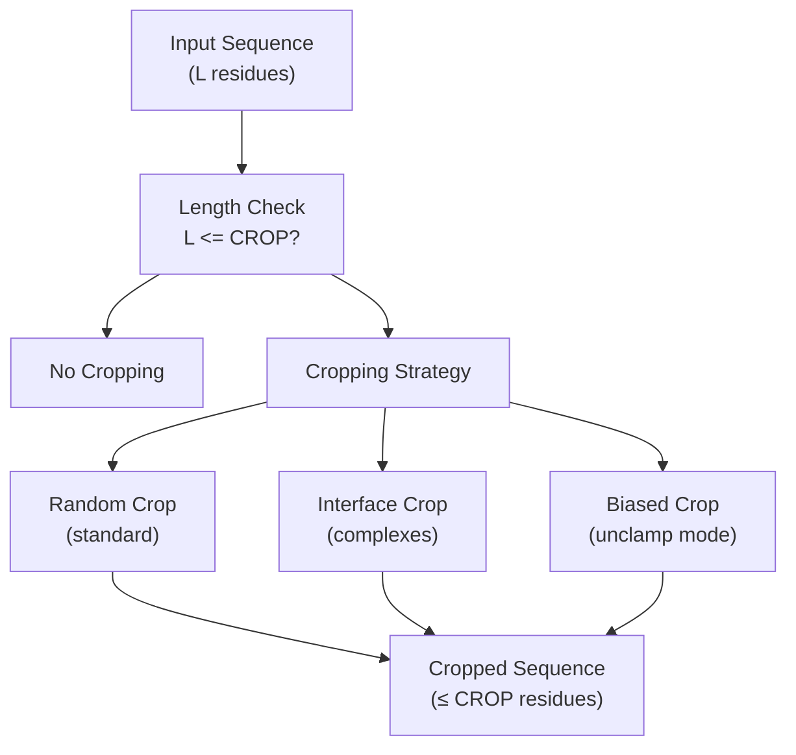
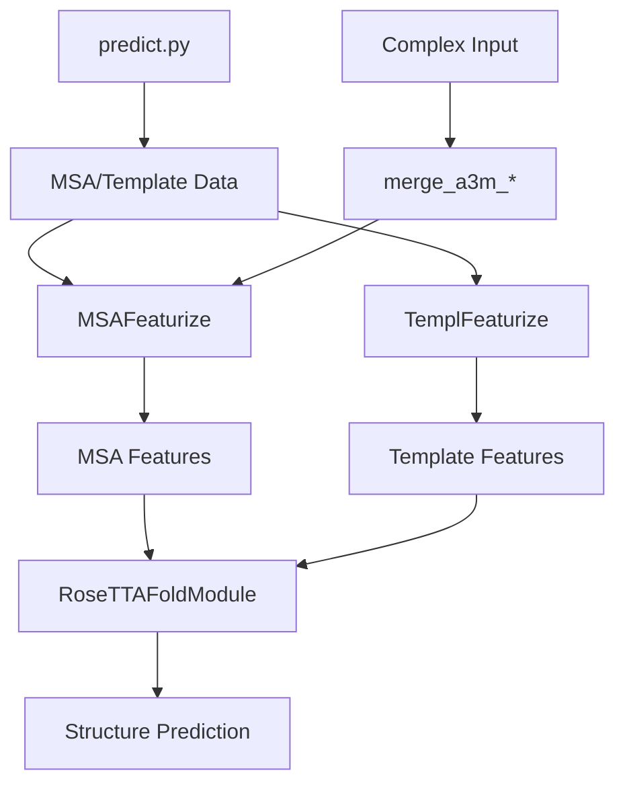

# Data Preparation

> **Relevant source files**
> * [network/data_loader.py](https://github.com/uw-ipd/RoseTTAFold2/blob/4b273b95/network/data_loader.py)

This page covers the data preparation processes that transform parsed input data into neural network features for protein structure prediction. The data preparation system handles MSA featurization, template processing, and multi-chain complex assembly before feeding data to the RoseTTAFold2 model.

For information about parsing raw input files (A3M, PDB, templates), see [Input Processing](/uw-ipd/RoseTTAFold2/4.2-input-processing). For training data loading and sampling strategies, see [Data Loading for Training](/uw-ipd/RoseTTAFold2/5.2-data-loading-for-training).

## Overview

The data preparation pipeline transforms parsed biological sequence and structure data into tensor features suitable for the RoseTTAFold2 neural network. The system handles three main data types:

1. **MSA Features**: Multiple sequence alignments with insertion statistics
2. **Template Features**: 3D structural templates with confidence scores
3. **Complex Assembly**: Multi-chain protein complexes with proper MSA merging

**Data Preparation Workflow**

Sources: [network/data_loader.py L75-L210](https://github.com/uw-ipd/RoseTTAFold2/blob/4b273b95/network/data_loader.py#L75-L210)

 [network/data_loader.py L212-L268](https://github.com/uw-ipd/RoseTTAFold2/blob/4b273b95/network/data_loader.py#L212-L268)

 [network/data_loader.py L511-L578](https://github.com/uw-ipd/RoseTTAFold2/blob/4b273b95/network/data_loader.py#L511-L578)

## MSA Featurization

The `MSAFeaturize` function converts raw MSA data into structured features for the neural network. It processes both seed MSAs (high-quality alignments) and extra sequences (additional homologs) with masking and clustering operations.

### MSA Feature Processing

**MSA Featurization Pipeline**

The process generates multiple feature cycles for training robustness:

| Feature Type | Seed MSA Dimensions | Extra MSA Dimensions | Description |
| --- | --- | --- | --- |
| One-hot AA | 22 | 22 | Amino acid type encoding |
| Cluster Profile | 22 | - | Evolutionary conservation |
| Insertion Stats | 2 | 1 | Insertion/deletion patterns |
| Terminal Info | 2 | 2 | N-term/C-term flags |

Sources: [network/data_loader.py L75-L210](https://github.com/uw-ipd/RoseTTAFold2/blob/4b273b95/network/data_loader.py#L75-L210)

### Masking Strategy

The system applies a sophisticated masking strategy during MSA processing:

* **15% random masking** applied to MSA positions
* **Replacement distribution**: * 70% mask token (special token) * 10% random amino acid * 10% amino acid from MSA profile * 10% original amino acid

**MSA Masking Process**

Sources: [network/data_loader.py L122-L136](https://github.com/uw-ipd/RoseTTAFold2/blob/4b273b95/network/data_loader.py#L122-L136)

## Template Featurization

The `TemplFeaturize` function processes structural templates into 3D coordinate features and 1D sequence features. It handles template selection, coordinate transformation, and confidence scoring.

### Template Processing Pipeline

**Template Featurization Process**

### Template Feature Structure

Templates are processed into three main components:

| Component | Shape | Description |
| --- | --- | --- |
| `xyz_t` | (T, L, 27, 3) | 3D atom coordinates |
| `f1d_t` | (T, L, 22) | 1D sequence + confidence |
| `mask_t` | (T, L, 27) | Atom validity mask |

Where T = number of templates, L = sequence length.

Sources: [network/data_loader.py L212-L268](https://github.com/uw-ipd/RoseTTAFold2/blob/4b273b95/network/data_loader.py#L212-L268)

## Complex Assembly

For multi-chain protein complexes, the system merges MSAs from individual chains while maintaining proper sequence relationships. Different strategies are used for homomeric and heteromeric complexes.

### Heteromeric Complex Assembly

**Heteromeric Complex MSA Merging**

### Homomeric Complex Assembly

For homomeric complexes, the system replicates MSA data across multiple copies while maintaining evolutionary relationships:

**Homomeric Complex MSA Merging**

Sources: [network/data_loader.py L511-L539](https://github.com/uw-ipd/RoseTTAFold2/blob/4b273b95/network/data_loader.py#L511-L539)

 [network/data_loader.py L563-L578](https://github.com/uw-ipd/RoseTTAFold2/blob/4b273b95/network/data_loader.py#L563-L578)

## Cropping and Sampling

The system implements multiple cropping strategies to manage memory constraints while preserving important structural information.

### Cropping Strategies

| Strategy | Function | Use Case |
| --- | --- | --- |
| Single Chain | `get_crop` | Standard protein sequences |
| Complex | `get_complex_crop` | Multi-chain complexes |
| Spatial | `get_spatial_crop` | Interface-focused cropping |

**Sequence Cropping Decision Tree**

### Spatial Cropping for Complexes

For protein complexes, spatial cropping focuses on interfacial regions:

1. **Interface Detection**: Identify residues within 10Å cutoff between chains
2. **Center Selection**: Random interface residue as crop center
3. **Distance-Based Selection**: Select nearest residues to center
4. **Fallback**: Use complex cropping if no interface found

Sources: [network/data_loader.py L440-L508](https://github.com/uw-ipd/RoseTTAFold2/blob/4b273b95/network/data_loader.py#L440-L508)

## Integration with Prediction Pipeline

The data preparation system integrates with the main prediction pipeline through the `Predictor` class. The prepared features are passed directly to the `RoseTTAFoldModule` for structure prediction.

### Data Flow Integration

**Integration with Prediction Pipeline**

### Feature Tensor Shapes

The system produces standardized tensor shapes for neural network input:

| Feature | Shape | Description |
| --- | --- | --- |
| `msa_seed` | (B, N_clust, L, 48) | Seed MSA features |
| `msa_extra` | (B, N_extra, L, 25) | Extra sequence features |
| `xyz_t` | (T, L, 27, 3) | Template coordinates |
| `f1d_t` | (T, L, 22) | Template sequence features |
| `mask_t` | (T, L, 27) | Template atom masks |

Where B = batch size (MAXCYCLE), N_clust = clustered sequences, N_extra = extra sequences, T = templates, L = sequence length.

Sources: [network/data_loader.py L192-L210](https://github.com/uw-ipd/RoseTTAFold2/blob/4b273b95/network/data_loader.py#L192-L210)

 [network/data_loader.py L265-L267](https://github.com/uw-ipd/RoseTTAFold2/blob/4b273b95/network/data_loader.py#L265-L267)