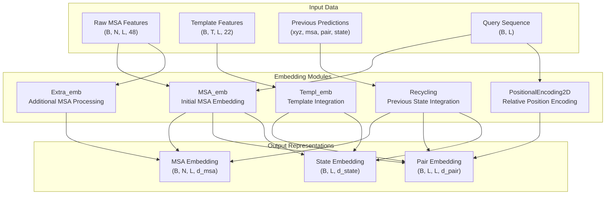
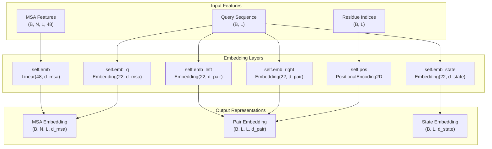
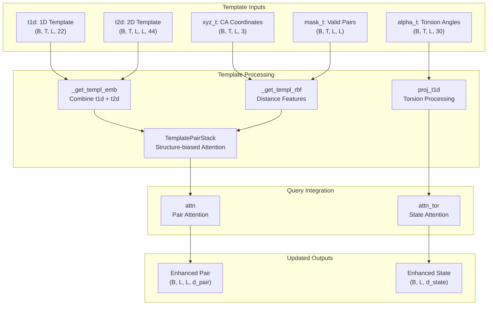
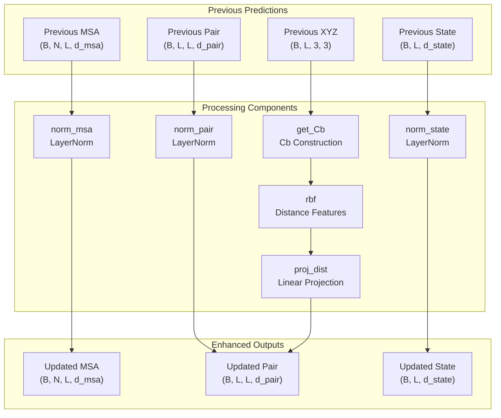
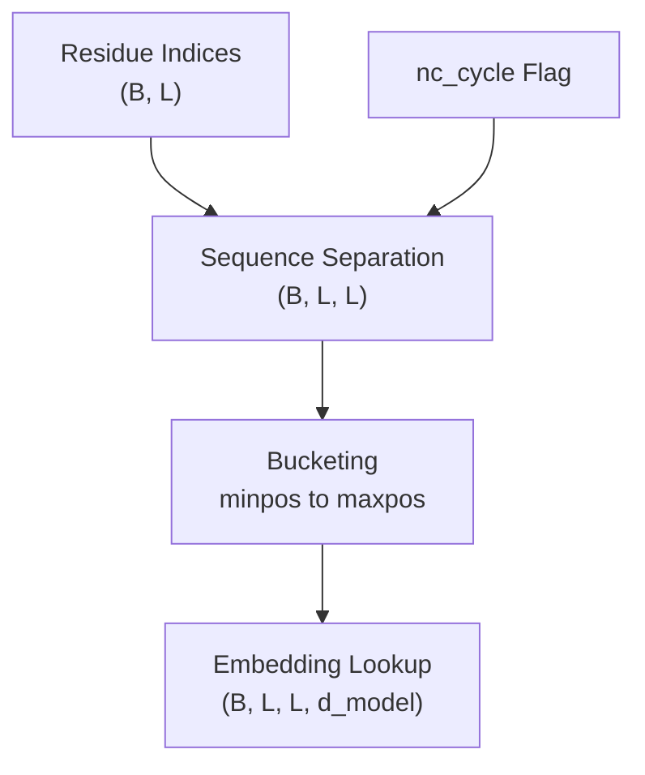
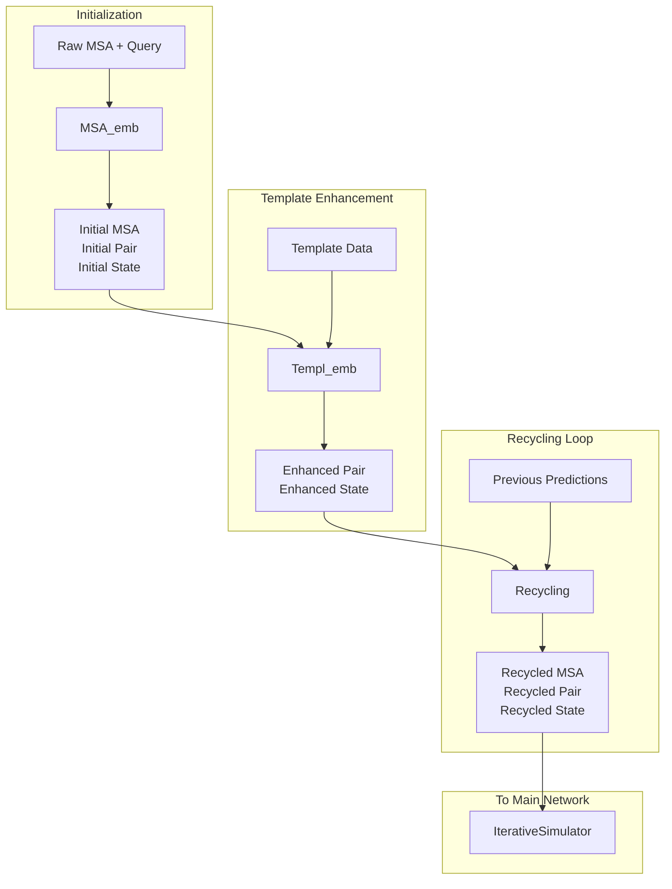

# Embedding Modules

> **Relevant source files**
> * [network/Embeddings.py](https://github.com/uw-ipd/RoseTTAFold2/blob/4b273b95/network/Embeddings.py)

## Purpose and Scope

The embedding modules in RoseTTAFold2 are responsible for converting raw input features into learned representations that can be processed by the neural network. These modules handle the initial transformation of Multiple Sequence Alignments (MSAs), template structures, and recycled predictions into high-dimensional embeddings suitable for the transformer architecture.

For information about the main neural network architecture that uses these embeddings, see [Core Architecture](/uw-ipd/RoseTTAFold2/3-core-architecture). For details about input processing that generates the raw features, see [Input Processing](/uw-ipd/RoseTTAFold2/4.2-input-processing).

## Overview of Embedding Architecture

The embedding system consists of several specialized modules that handle different types of input data:

**Sources:** [network/Embeddings.py L1-L412](https://github.com/uw-ipd/RoseTTAFold2/blob/4b273b95/network/Embeddings.py#L1-L412)

## MSA Embedding (MSA_emb)

The `MSA_emb` class generates initial embeddings for MSA sequences, pair features, and single sequence state. It serves as the primary entry point for converting raw MSA data into neural network representations.

### Architecture and Components

### Key Features

| Component | Purpose | Input Shape | Output Shape |
| --- | --- | --- | --- |
| `emb` | General MSA embedding | `(B, N, L, 48)` | `(B, N, L, d_msa)` |
| `emb_q` | Query sequence embedding | `(B, L)` | `(B, 1, L, d_msa)` |
| `emb_left/right` | Pair embeddings from sequence | `(B, L)` | `(B, L, 1/L, d_pair)` |
| `emb_state` | Single sequence state | `(B, L)` | `(B, L, d_state)` |
| `pos` | Relative positional encoding | `(B, L)` | `(B, L, L, d_pair)` |

The forward pass combines MSA features with query-specific embeddings [network/Embeddings.py L92-L94](https://github.com/uw-ipd/RoseTTAFold2/blob/4b273b95/network/Embeddings.py#L92-L94)

 and constructs pair representations by combining left and right sequence embeddings with positional encoding [network/Embeddings.py L96-L100](https://github.com/uw-ipd/RoseTTAFold2/blob/4b273b95/network/Embeddings.py#L96-L100)

**Sources:** [network/Embeddings.py L54-L105](https://github.com/uw-ipd/RoseTTAFold2/blob/4b273b95/network/Embeddings.py#L54-L105)

## Template Embedding (Templ_emb)

The `Templ_emb` class processes template structure information and integrates it with query features. It handles both 2D structural features and 1D torsion angle information.

### Template Processing Pipeline

### Template Feature Integration

The template embedding process follows these key steps:

1. **2D Template Features**: Combines 1D features (tiled) with 2D structural features [network/Embeddings.py L234-L237](https://github.com/uw-ipd/RoseTTAFold2/blob/4b273b95/network/Embeddings.py#L234-L237)
2. **RBF Distance Features**: Computes radial basis function features from CA coordinates [network/Embeddings.py L264-L266](https://github.com/uw-ipd/RoseTTAFold2/blob/4b273b95/network/Embeddings.py#L264-L266)
3. **Template Stack Processing**: Applies structure-biased attention blocks [network/Embeddings.py L296-L300](https://github.com/uw-ipd/RoseTTAFold2/blob/4b273b95/network/Embeddings.py#L296-L300)
4. **Attention Integration**: Mixes template information with query features using attention mechanisms [network/Embeddings.py L320-L333](https://github.com/uw-ipd/RoseTTAFold2/blob/4b273b95/network/Embeddings.py#L320-L333)

**Sources:** [network/Embeddings.py L187-L335](https://github.com/uw-ipd/RoseTTAFold2/blob/4b273b95/network/Embeddings.py#L187-L335)

## Recycling Embedding (Recycling)

The `Recycling` class processes predictions from previous iterations to improve structure refinement. It normalizes previous states and incorporates geometric information.

### Recycling Architecture

### Geometric Feature Integration

The recycling process incorporates geometric information by:

1. **Cb Construction**: Reconstructs Cb atoms from N, Ca, C coordinates [network/Embeddings.py L385](https://github.com/uw-ipd/RoseTTAFold2/blob/4b273b95/network/Embeddings.py#L385-L385)
2. **Distance Features**: Computes RBF features from Cb-Cb distances [network/Embeddings.py L392-L396](https://github.com/uw-ipd/RoseTTAFold2/blob/4b273b95/network/Embeddings.py#L392-L396)
3. **State Tiling**: Tiles state features to create pairwise representations [network/Embeddings.py L381-L382](https://github.com/uw-ipd/RoseTTAFold2/blob/4b273b95/network/Embeddings.py#L381-L382)
4. **Feature Combination**: Combines distance and state features via linear projection [network/Embeddings.py L401-L408](https://github.com/uw-ipd/RoseTTAFold2/blob/4b273b95/network/Embeddings.py#L401-L408)

**Sources:** [network/Embeddings.py L337-L410](https://github.com/uw-ipd/RoseTTAFold2/blob/4b273b95/network/Embeddings.py#L337-L410)

## Supporting Components

### PositionalEncoding2D

The `PositionalEncoding2D` class adds relative positional information to pair features, supporting both linear and cyclic sequence arrangements.

Key features:

* Configurable position range (`minpos=-32, maxpos=32`) [network/Embeddings.py L17](https://github.com/uw-ipd/RoseTTAFold2/blob/4b273b95/network/Embeddings.py#L17-L17)
* Support for cyclic sequences via `nc_cycle` parameter [network/Embeddings.py L32-L33](https://github.com/uw-ipd/RoseTTAFold2/blob/4b273b95/network/Embeddings.py#L32-L33)
* Memory-efficient striping for large sequences [network/Embeddings.py L36-L52](https://github.com/uw-ipd/RoseTTAFold2/blob/4b273b95/network/Embeddings.py#L36-L52)

### TemplatePairStack

The `TemplatePairStack` processes template pair features using structure-biased attention blocks. It applies multiple `PairStr2Pair` layers to refine template representations [network/Embeddings.py L140-L184](https://github.com/uw-ipd/RoseTTAFold2/blob/4b273b95/network/Embeddings.py#L140-L184)

**Sources:** [network/Embeddings.py L15-L52](https://github.com/uw-ipd/RoseTTAFold2/blob/4b273b95/network/Embeddings.py#L15-L52)

 [network/Embeddings.py L140-L184](https://github.com/uw-ipd/RoseTTAFold2/blob/4b273b95/network/Embeddings.py#L140-L184)

## Data Flow and Integration

The embedding modules work together to transform raw inputs into the multi-track representations used by the main neural network:

The embedding system ensures that all input modalities are properly integrated and normalized before being passed to the main transformer architecture, enabling effective multi-modal learning for protein structure prediction.

**Sources:** [network/Embeddings.py L1-L412](https://github.com/uw-ipd/RoseTTAFold2/blob/4b273b95/network/Embeddings.py#L1-L412)