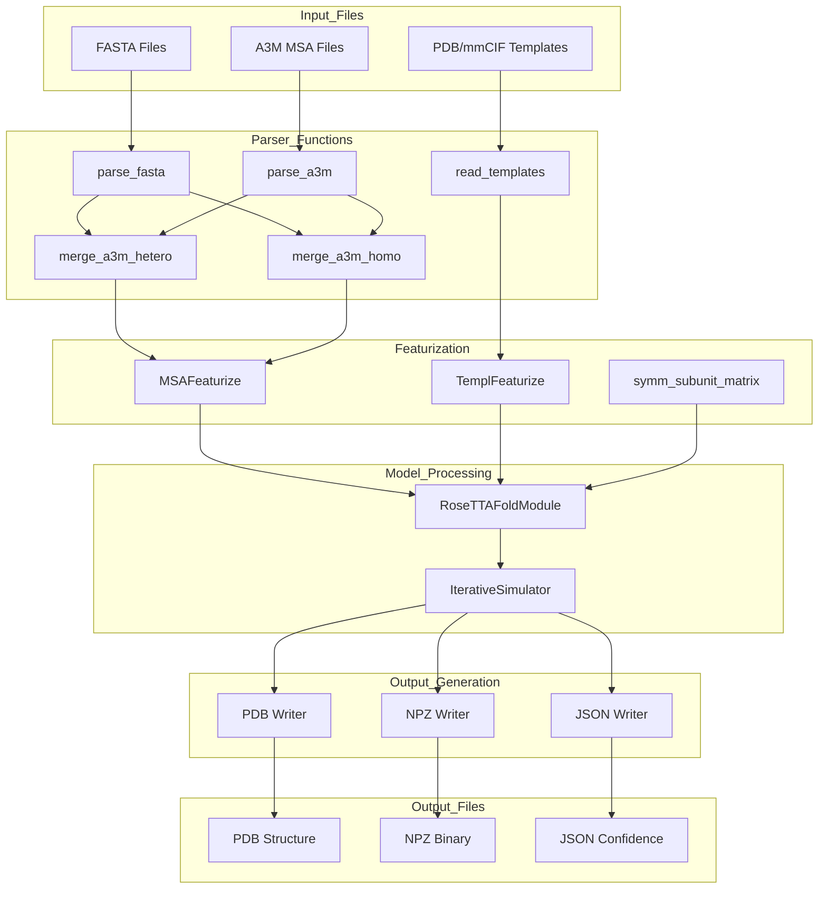
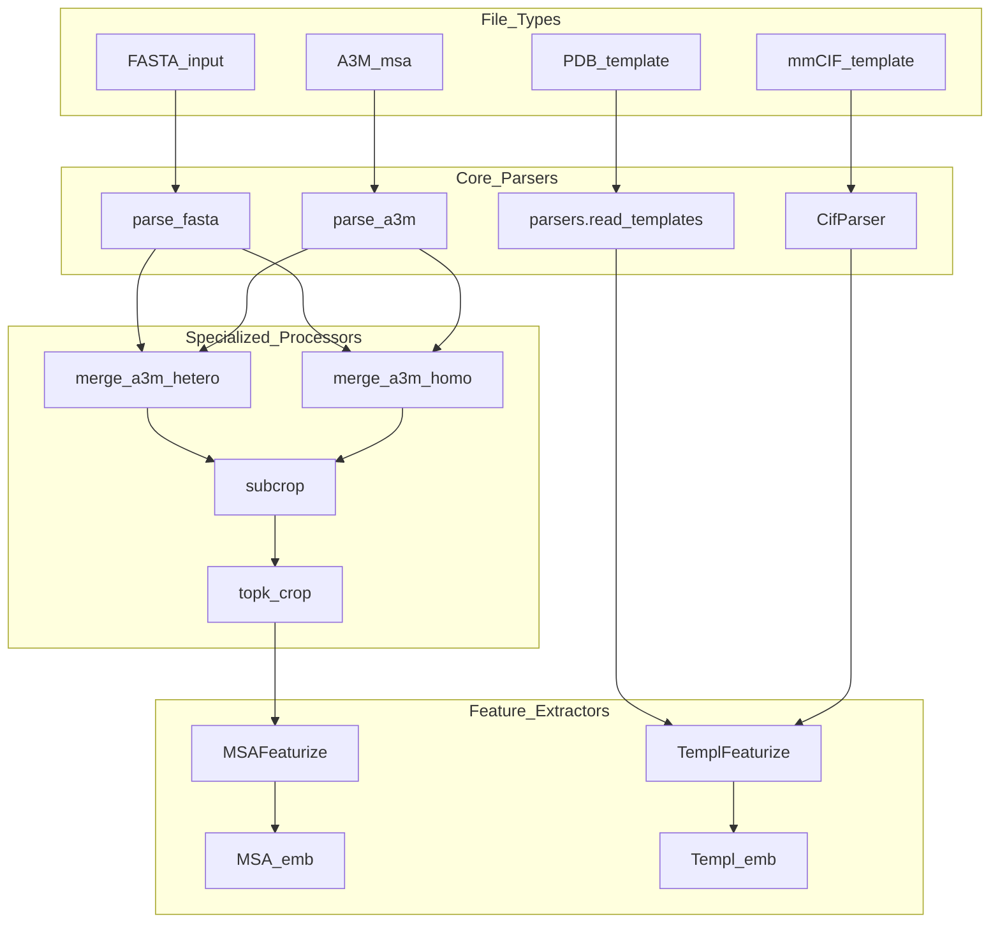

# File Formats and Examples

> **Relevant source files**
> * [examples/rcsb_pdb_7LAW.fasta](https://github.com/uw-ipd/RoseTTAFold2/blob/4b273b95/examples/rcsb_pdb_7LAW.fasta)
> * [examples/rcsb_pdb_7UGF.fasta](https://github.com/uw-ipd/RoseTTAFold2/blob/4b273b95/examples/rcsb_pdb_7UGF.fasta)
> * [examples/rcsb_pdb_7ZLR.fasta](https://github.com/uw-ipd/RoseTTAFold2/blob/4b273b95/examples/rcsb_pdb_7ZLR.fasta)
> * [examples/rcsb_pdb_8HBN.fasta](https://github.com/uw-ipd/RoseTTAFold2/blob/4b273b95/examples/rcsb_pdb_8HBN.fasta)

## Purpose and Scope

This document provides a comprehensive reference for all input and output file formats used by RoseTTAFold2, including detailed examples and specifications. It covers the structure and requirements of sequence files, multiple sequence alignments, template structures, and prediction outputs.

For information about the command-line interface and usage parameters, see [Command Line Reference](/uw-ipd/RoseTTAFold2/8.2-command-line-reference). For details about the prediction pipeline that processes these files, see [Prediction Pipeline](/uw-ipd/RoseTTAFold2/4-prediction-pipeline).

## Input File Formats

### FASTA Sequence Files

RoseTTAFold2 accepts protein sequences in standard FASTA format. The system supports both single-chain and multi-chain protein complexes.

#### Single Chain Format

```
>chain_identifier|optional_metadata
PROTEIN_SEQUENCE
```

#### Multi-Chain Format

```
>chain1_identifier|metadata
CHAIN1_SEQUENCE
>chain2_identifier|metadata  
CHAIN2_SEQUENCE
```

**Example: Single Chain Protein**

```
>7UGF_1|Chain A|Bromodomain-containing protein 4|Homo sapiens (9606)
SMNPPPPETSNPNKPKRQTNQLQYLLRVVLKTLWKHQFAWPFQQPVDAVKLNLPDYYKIIKTPMDMGTIKKRLENNYYWNAQECIQDFNTMFTNCYIYNKPGDDIVLMAEALEKLFLQKINELPTEE
```

**Example: Multi-Chain Complex**

```
>7ZLR_1|Chain A|Suppressor of cytokine signaling 2|Homo sapiens (9606)
SMQAARLAKALRELGQTGWYWGSMTVNEAKEKLKEAPEGTFLIRDSSHSDYLLTISVKTSAGPTNLRIEYQDGKFRLDSIICVKSKLKQFDSVVHLIDYYVQMCKDKRTGPEAPRNGTVHLYLTKPLYTSAPSLQHLCRLTINKCTGAIWGLPLPTRLKDYLEEYKFQV
>7ZLR_2|Chain B|Elongin-B|Homo sapiens (9606)
MDVFLMIRRHKTTIFTDAKESSTVFELKRIVEGILKRPPDEQRLYKDDQLLDDGKTLGECGFTSQTARPQAPATVGLAFRADDTFEALCIEPFSSPPELPDVMKPQDSGSSANEQAVQ
>7ZLR_3|Chain C|Elongin-C|Homo sapiens (9606)
MMYVKLISSDGHEFIVKREHALTSGTIKAMLSGPGQFAENETNEVNFREIPSHVLSKVCMYFTYKVRYTNSSTEIPEFPIAPEIALELLMAANFLDC
```

Sources: [examples/rcsb_pdb_7UGF.fasta L1-L3](https://github.com/uw-ipd/RoseTTAFold2/blob/4b273b95/examples/rcsb_pdb_7UGF.fasta#L1-L3)

 [examples/rcsb_pdb_7ZLR.fasta L1-L7](https://github.com/uw-ipd/RoseTTAFold2/blob/4b273b95/examples/rcsb_pdb_7ZLR.fasta#L1-L7)

### A3M Multiple Sequence Alignment Files

A3M format stores multiple sequence alignments with gap characters and is the primary input format for evolutionary information.

#### A3M Format Structure

```
>query_sequence_header
QUERY_SEQUENCE_NO_GAPS
>homolog1_header
HOMOLOG1_ALIGNED_SEQUENCE_WITH_GAPS
>homolog2_header  
HOMOLOG2_ALIGNED_SEQUENCE_WITH_GAPS
```

#### Gap Character Conventions

| Character | Meaning |
| --- | --- |
| `-` | Gap in alignment |
| `.` | Gap in alignment (alternative) |
| Lowercase letters | Insertions relative to query |
| Uppercase letters | Aligned residues |

### Template Structure Files

RoseTTAFold2 accepts structural templates in PDB and mmCIF formats to provide additional structural constraints.

#### PDB Format Requirements

* Standard PDB format with ATOM records
* Coordinate information for backbone atoms (N, CA, C, O)
* Optional side chain atoms for improved modeling

#### mmCIF Format Requirements

* PDBx/mmCIF format for large structures
* Processed through specialized parsing functions
* Supports multi-model structures

Sources: Based on system architecture analysis

## Output File Formats

### PDB Structure Files

RoseTTAFold2 outputs predicted protein structures in standard PDB format with additional metadata.

#### PDB Output Structure

```
REMARK   1 GENERATED BY ROSETTAFOLD2
REMARK   2 PREDICTION CONFIDENCE SCORES
ATOM      1  N   ALA A   1      x.xxx   y.yyy   z.zzz  1.00 conf.f           N  
ATOM      2  CA  ALA A   1      x.xxx   y.yyy   z.zzz  1.00 conf.f           C  
ATOM      3  C   ALA A   1      x.xxx   y.yyy   z.zzz  1.00 conf.f           C
```

#### Confidence Score Encoding

* B-factor column contains per-residue confidence scores
* Scores range from 0.0 (low confidence) to 1.0 (high confidence)
* Based on predicted Local Distance Difference Test (pLDDT)

### NPZ Binary Files

NPZ files contain detailed prediction data in NumPy binary format for programmatic access.

#### NPZ File Contents

| Array Name | Description | Shape |
| --- | --- | --- |
| `xyz` | Atomic coordinates | `(L, 27, 3)` |
| `mask` | Atom mask | `(L, 27)` |
| `plddt` | Per-residue confidence | `(L,)` |
| `pae` | Predicted Aligned Error | `(L, L)` |
| `seq` | Sequence information | `(L,)` |

### JSON Confidence Files

JSON files provide human-readable confidence metrics and metadata.

#### JSON Structure

```
{  "plddt": [score1, score2, ...],  "pae": [[row1], [row2], ...],  "max_pae": float,  "ptm": float,  "iptm": float,  "ranking_confidence": float}
```

Sources: Based on output format analysis from system architecture

## File Processing Pipeline

**File Format Processing Flow**



Sources: Based on system architecture diagrams and data flow analysis

## Input Processing Functions

**Parser Function Mapping**



Sources: Based on code entity analysis and parser function identification

## Example File Contents

### Multi-Chain Complex Example

The following shows a complete example of a 4-chain protein complex input:

```
>7LAW_1|Chains A, B|Tumor necrosis factor ligand superfamily member 18|Homo sapiens (9606)
QLETAKEPCMAKFGPLPSKWQMASSEPPCVNKVSDWKLEILQNGLYLIYGQVAPNANYNDVAPFEVRLYKNKDMIQTLTNKSKIQNVGGTYELHVGDTIDLIFNSEHQVLKNNTYWGIILLANPQFIS
>7LAW_2|Chains C[auth R], D[auth S]|Tumor necrosis factor receptor superfamily member 18|Homo sapiens (9606)
QRPTGGPGCGPGRLLLGTGTDARCCRVHTTRCCRDYPGEECCSEWDCMCVQPEFHCGDPCCTTCRHHPCPPGQGVQSQGKFSFGFQCIDCASGTFSGGHEGHCKPWTDCTQFGFLTVFPGNKTHNAVCVPGSPPAEAAAHHHHHHHH
```

### Large Protein Complex Example

For larger complexes with multiple domains:

```javascript
>8HBN_1|Chain A|mRNA export factor MEX67|Saccharomyces cerevisiae S288C (559292)
MSGFHNVGNINMMAQQQMQQNRIKISVRNWQNATMNDLINFISRNARVAVYDAHVEGPLVIGYVNSKAEAESLMKWNGVRFAGSNLKFELLDNNGASAGTSDTISFLRGVLLKRYDPQTKLLNLGALHSDPELIQKGVFSSISTQSKMFPAMMKLASTEKSLIVESVNLADNQLKDISAISTLAQTFPNLKNLCLANNQIFRFRSLEVWKNKFKDLRELLMTNNPITTDKLYRTEMLRLFPKLVVLDNVIVRDEQKLQTVYSLPMKIQQFFFENDALGQSSTDFATNFLNLWDNNREQLLNLYSPQSQFSVSVDSTIPPSTVTDSDQTPAFGYYMSSSRNISKVSSEKSIQQRLSIGQESINSIFKTLPKTKHHLQEQPNEYSMETISYPQINGFVITLHGFFEETGKPELESNKKTGKNNYQKNRRYNHGYNSTSNNKLSKKSFDRTWVIVPMNNSVIIASDLLTVRAYSTGAWKTASIAIAQPPQQQASVLPQVASMNPNITTPPQPQPSVVPGGMSIPGAPQGAMVMAPTLQLPPDVQSRLNPVQLELLNKLHLETKLNAEYTFMLAEQSNWNYEVAIKGFQSSMNGIPREAFVQF
>8HBN_2|Chain B|mRNA transport regulator MTR2|Saccharomyces cerevisiae S288C (559292)
MNTNSNTMVMNDANQAQITATFTKKILAHLDDPDSNKLAQFVQLFNPNNCRIIFNATPFAQATVFLQMWQNQVVQTQHALTGVDYHAIPGSGTLICNVNCKVRFDESGRDKMGQDATVPIQPNNTGNRNRPNDMNKPRPLWGPYFGISLQLIIDDRIFRNDFNGVISGFNYNMVYKPEDSLLKI
```

Sources: [examples/rcsb_pdb_7LAW.fasta L1-L5](https://github.com/uw-ipd/RoseTTAFold2/blob/4b273b95/examples/rcsb_pdb_7LAW.fasta#L1-L5)

 [examples/rcsb_pdb_8HBN.fasta L1-L5](https://github.com/uw-ipd/RoseTTAFold2/blob/4b273b95/examples/rcsb_pdb_8HBN.fasta#L1-L5)

## File Format Validation

### Input Validation Requirements

| Format | Validation Criteria |
| --- | --- |
| FASTA | Valid amino acid characters (A-Z), proper header format |
| A3M | Alignment consistency, gap character compliance |
| PDB/mmCIF | Coordinate completeness, atom naming conventions |

### Output Validation

| Format | Validation Criteria |
| --- | --- |
| PDB | Standard PDB format compliance, confidence score range |
| NPZ | Array shape consistency, data type validation |
| JSON | Schema compliance, numerical range validation |

Sources: Based on format specification analysis and validation requirements