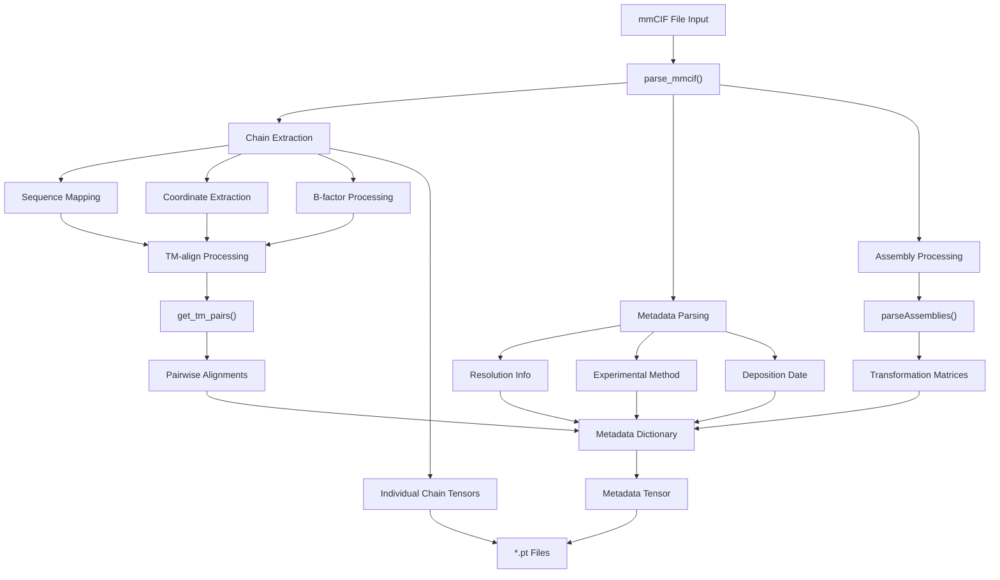
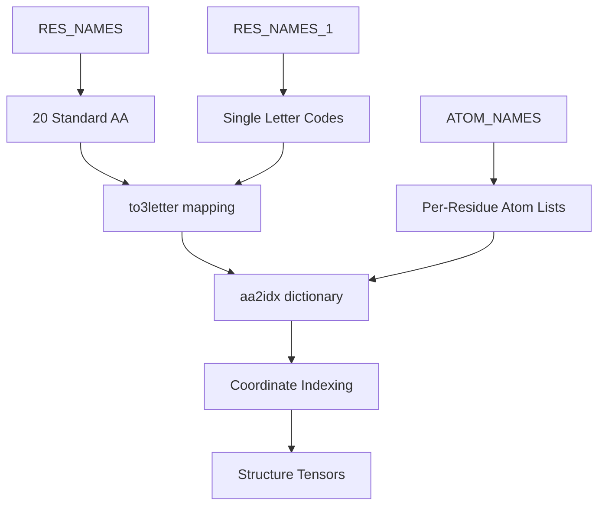
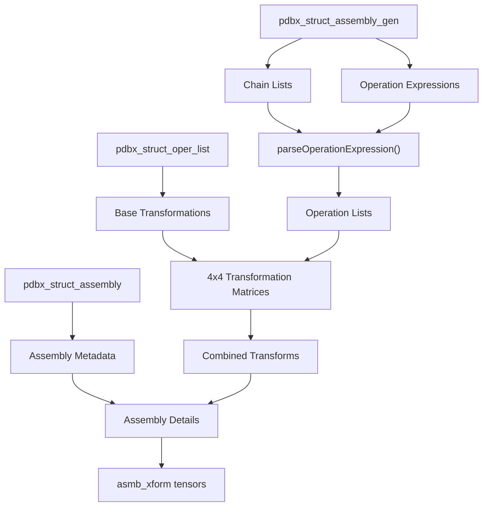
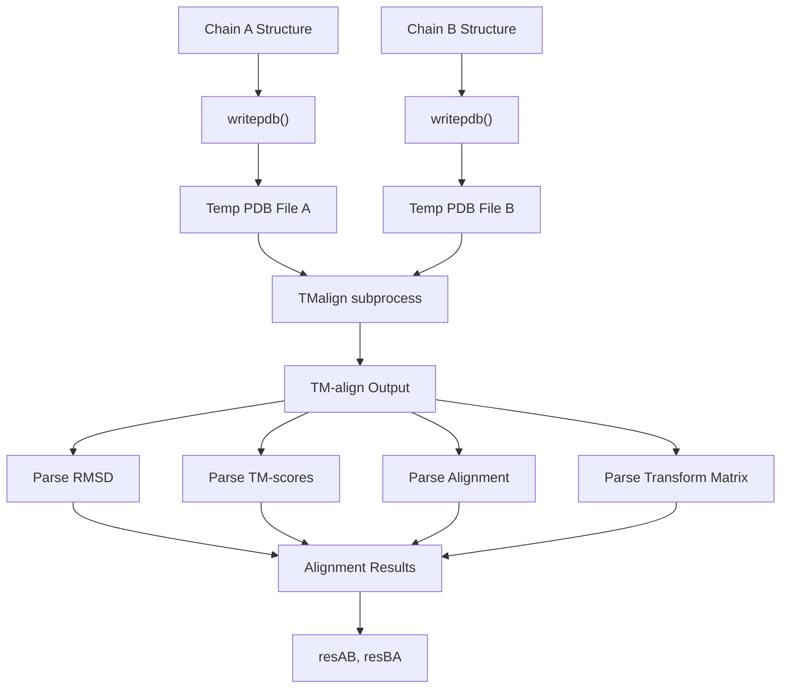
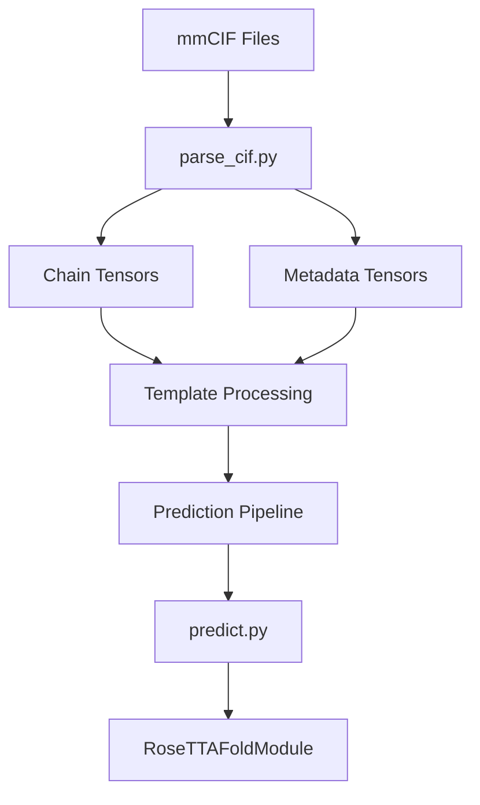

# Input Preparation Tools

> **Relevant source files**
> * [input_prep/parse_cif.py](https://github.com/uw-ipd/RoseTTAFold2/blob/4b273b95/input_prep/parse_cif.py)
> * [input_prep/pdbx/README](https://github.com/uw-ipd/RoseTTAFold2/blob/4b273b95/input_prep/pdbx/README)

The input preparation tools provide functionality for processing structural data files, particularly PDBx/mmCIF format files, and preparing them for use in RoseTTAFold2 predictions. These tools handle the parsing, validation, and transformation of protein structure data from standard crystallographic formats into the internal tensor representations used by the neural network.

For information about the main prediction pipeline that consumes the output of these tools, see [Main Prediction Interface](/uw-ipd/RoseTTAFold2/4.1-main-prediction-interface). For details about MSA and template processing during prediction, see [Input Processing](/uw-ipd/RoseTTAFold2/4.2-input-processing).

## Overview

The input preparation system consists of two main components: PDBx/mmCIF parsing capabilities and structure analysis tools. The primary workflow involves reading mmCIF files, extracting protein chains and metadata, performing structural alignments, and converting the data into PyTorch tensor format for downstream processing.

## Input Preparation Workflow

### mmCIF Processing Pipeline

The following diagram shows the complete workflow for processing mmCIF files:



Sources: [input_prep/parse_cif.py L263-L431](https://github.com/uw-ipd/RoseTTAFold2/blob/4b273b95/input_prep/parse_cif.py#L263-L431)

### Core Data Structures

The input preparation tools work with several key data structures:

| Structure | Purpose | Key Fields |
| --- | --- | --- |
| `chains` | Per-chain structural data | `seq`, `xyz`, `mask`, `bfac`, `occ` |
| `metadata` | File-level information | `method`, `date`, `resolution`, `chains`, `seq` |
| `tm_pairs` | Pairwise alignment results | `rmsd`, `seqid`, `tm`, `aln`, `t`, `u` |
| `asmbs` | Biological assembly data | `asmb_xform`, `asmb_chains`, `asmb_details` |

Sources: [input_prep/parse_cif.py L265-L320](https://github.com/uw-ipd/RoseTTAFold2/blob/4b273b95/input_prep/parse_cif.py#L265-L320)

 [input_prep/parse_cif.py L414-L430](https://github.com/uw-ipd/RoseTTAFold2/blob/4b273b95/input_prep/parse_cif.py#L414-L430)

## PDBx/mmCIF Processing

The core parsing functionality is implemented in the `parse_mmcif()` function, which handles the complete processing of mmCIF files into structured data.

### Amino Acid and Atom Mapping

The system maintains comprehensive mappings for standard amino acids and their atoms:



Sources: [input_prep/parse_cif.py L16-L56](https://github.com/uw-ipd/RoseTTAFold2/blob/4b273b95/input_prep/parse_cif.py#L16-L56)

### Chain Processing

The `parse_mmcif()` function processes each polypeptide chain through several steps:

1. **Entity Mapping**: Maps chain IDs to entity sequences using `pdbx_poly_seq_scheme`
2. **Sequence Extraction**: Retrieves canonical sequences from `entity_poly`
3. **Coordinate Population**: Processes `atom_site` records to populate xyz coordinates
4. **Quality Control**: Handles alternative conformations, occupancy, and B-factors

Sources: [input_prep/parse_cif.py L278-L320](https://github.com/uw-ipd/RoseTTAFold2/blob/4b273b95/input_prep/parse_cif.py#L278-L320)

 [input_prep/parse_cif.py L343-L389](https://github.com/uw-ipd/RoseTTAFold2/blob/4b273b95/input_prep/parse_cif.py#L343-L389)

### Assembly Processing

The `parseAssemblies()` function handles biological assembly transformations:



Sources: [input_prep/parse_cif.py L194-L260](https://github.com/uw-ipd/RoseTTAFold2/blob/4b273b95/input_prep/parse_cif.py#L194-L260)

## Structure Analysis Tools

### TM-align Integration

The system integrates with TM-align for structural comparison between chains:



Sources: [input_prep/parse_cif.py L92-L152](https://github.com/uw-ipd/RoseTTAFold2/blob/4b273b95/input_prep/parse_cif.py#L92-L152)

### Pairwise Analysis

The `get_tm_pairs()` function performs comprehensive pairwise structural analysis:

* Runs TM-align for all chain pairs using `combinations()`
* Generates bidirectional alignment results
* Adds self-alignments with perfect scores
* Returns dictionary with `(chainA, chainB)` keys

Sources: [input_prep/parse_cif.py L155-L173](https://github.com/uw-ipd/RoseTTAFold2/blob/4b273b95/input_prep/parse_cif.py#L155-L173)

## Integration with Main Pipeline

The input preparation tools integrate with the main RoseTTAFold2 pipeline through the tensor output format:

### Output Files

| File Type | Content | Usage |
| --- | --- | --- |
| `{prefix}_{chain}.pt` | Individual chain tensors | Structure input to neural network |
| `{prefix}.pt` | Metadata and assembly info | Pipeline configuration and validation |

### Data Flow Connection



Sources: [input_prep/parse_cif.py L461-L475](https://github.com/uw-ipd/RoseTTAFold2/blob/4b273b95/input_prep/parse_cif.py#L461-L475)

## Command Line Usage

The main script processes mmCIF files via command line:

```
python input_prep/parse_cif.py input.cif output_prefix
```

This generates individual `.pt` files for each chain and a metadata file, ready for use in structure prediction workflows.

Sources: [input_prep/parse_cif.py L438-L439](https://github.com/uw-ipd/RoseTTAFold2/blob/4b273b95/input_prep/parse_cif.py#L438-L439)