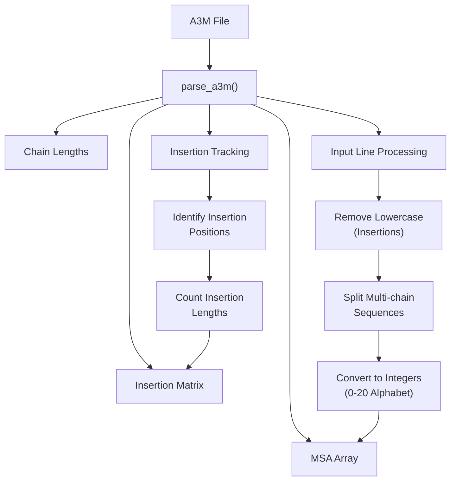
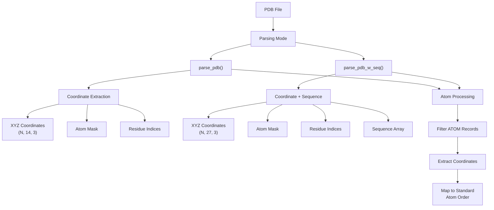
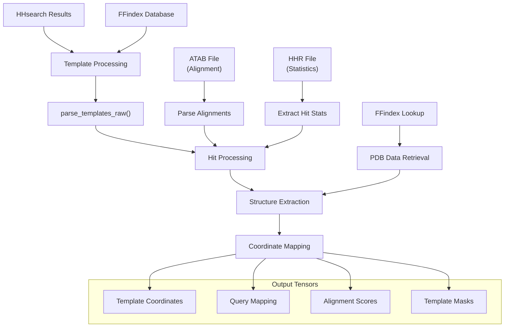
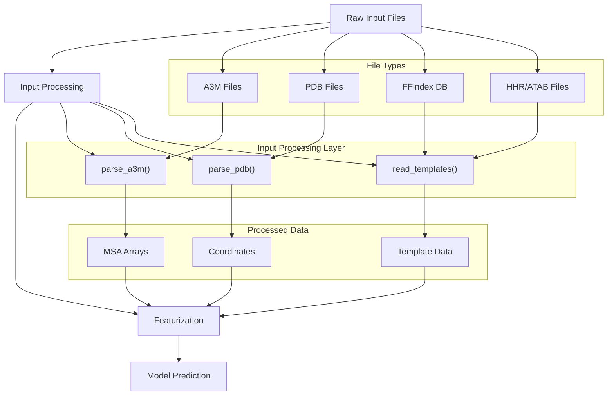

# Input Processing

> **Relevant source files**
> * [network/parsers.py](https://github.com/uw-ipd/RoseTTAFold2/blob/4b273b95/network/parsers.py)

## Purpose and Scope

This document covers the input processing system of RoseTTAFold2, which handles parsing and preprocessing of various file formats required for protein structure prediction. The system processes Multiple Sequence Alignments (MSAs), protein structures, and template databases to prepare data for the neural network prediction pipeline.

For information about the main prediction workflow, see [Main Prediction Interface](/uw-ipd/RoseTTAFold2/4.1-main-prediction-interface). For details about data featurization and preparation for model input, see [Data Preparation](/uw-ipd/RoseTTAFold2/4.3-data-preparation).

## Overview of Input Types

RoseTTAFold2 processes three main categories of input data:

| Input Type | File Formats | Purpose |
| --- | --- | --- |
| Multiple Sequence Alignments | A3M, FASTA | Evolutionary information and sequence diversity |
| Protein Structures | PDB | Reference structures and templates |
| Template Databases | FFindex (PDB/ATAB/HHR) | Homologous structure templates from searches |

All input processing functions are centralized in the `parsers.py` module, which provides a unified interface for handling these diverse data formats.

## MSA Processing

### A3M Format Parsing

The `parse_a3m` function processes A3M format files, which contain multiple sequence alignments with insertion annotations. This format is commonly used by HHsuite and other sequence analysis tools.

*MSA Processing Pipeline in parse_a3m Function*

The function handles several key processing steps:

* **Character Translation**: Removes lowercase letters (insertions) and converts amino acid letters to integer codes [network/parsers.py L27-L28](https://github.com/uw-ipd/RoseTTAFold2/blob/4b273b95/network/parsers.py#L27-L28)
* **Multi-chain Support**: Splits sequences at '/' characters for protein complexes [network/parsers.py L51-L62](https://github.com/uw-ipd/RoseTTAFold2/blob/4b273b95/network/parsers.py#L51-L62)
* **Insertion Tracking**: Maintains insertion positions and lengths for each sequence [network/parsers.py L70-L86](https://github.com/uw-ipd/RoseTTAFold2/blob/4b273b95/network/parsers.py#L70-L86)
* **Alphabet Conversion**: Maps amino acids to integers 0-19, gaps to 20, unknowns to 20 [network/parsers.py L98-L103](https://github.com/uw-ipd/RoseTTAFold2/blob/4b273b95/network/parsers.py#L98-L103)

**Sources:** [network/parsers.py L22-L106](https://github.com/uw-ipd/RoseTTAFold2/blob/4b273b95/network/parsers.py#L22-L106)

### Key Features

* **Compression Support**: Handles gzipped A3M files automatically [network/parsers.py L31-L34](https://github.com/uw-ipd/RoseTTAFold2/blob/4b273b95/network/parsers.py#L31-L34)
* **Sequence Limit**: Configurable maximum sequences (`max_seq=5000`) to control memory usage [network/parsers.py L89-L90](https://github.com/uw-ipd/RoseTTAFold2/blob/4b273b95/network/parsers.py#L89-L90)
* **Multi-chain Handling**: Processes protein complexes with multiple chains separated by '/' [network/parsers.py L55-L56](https://github.com/uw-ipd/RoseTTAFold2/blob/4b273b95/network/parsers.py#L55-L56)

## Structure Processing

### PDB File Parsing

The system provides two main approaches for parsing PDB files: basic coordinate extraction and coordinate extraction with sequence information.

*PDB File Processing Architecture*

**Sources:** [network/parsers.py L111-L169](https://github.com/uw-ipd/RoseTTAFold2/blob/4b273b95/network/parsers.py#L111-L169)

### Coordinate Extraction Details

The PDB parsing functions extract atomic coordinates for standard protein atoms:

* **Atom Selection**: Focuses on ATOM records, ignoring HETATM [network/parsers.py L124-L126](https://github.com/uw-ipd/RoseTTAFold2/blob/4b273b95/network/parsers.py#L124-L126)
* **Standard Atom Order**: Maps atoms to predefined positions using `util.aa2long` [network/parsers.py L128-L131](https://github.com/uw-ipd/RoseTTAFold2/blob/4b273b95/network/parsers.py#L128-L131)
* **Missing Atom Handling**: Uses NaN for missing atoms, creates boolean masks [network/parsers.py L134-L135](https://github.com/uw-ipd/RoseTTAFold2/blob/4b273b95/network/parsers.py#L134-L135)
* **Coordinate Precision**: Stores coordinates as float32 for memory efficiency [network/parsers.py L122](https://github.com/uw-ipd/RoseTTAFold2/blob/4b273b95/network/parsers.py#L122-L122)

The `parse_pdb_w_seq` variant additionally extracts sequence information for template processing [network/parsers.py L143-L169](https://github.com/uw-ipd/RoseTTAFold2/blob/4b273b95/network/parsers.py#L143-L169)

## Template Processing

Template processing is the most complex part of input processing, involving integration of homology search results with structure databases.

### Template Database Integration

*Template Processing Pipeline*

**Sources:** [network/parsers.py L245-L311](https://github.com/uw-ipd/RoseTTAFold2/blob/4b273b95/network/parsers.py#L245-L311)

### Template Processing Functions

The system provides several template processing functions for different use cases:

| Function | Purpose | Key Features |
| --- | --- | --- |
| `parse_templates_raw` | Extract raw template data | FFindex integration, hit filtering |
| `read_templates` | Prepare templates for prediction | Coordinate alignment, noise addition |
| `read_template_pdb` | Process single PDB template | Direct PDB file input |

### Template Coordinate Processing

The `read_templates` function performs sophisticated coordinate processing [network/parsers.py L313-L342](https://github.com/uw-ipd/RoseTTAFold2/blob/4b273b95/network/parsers.py#L313-L342)

:

* **Template Selection**: Picks top N templates based on quality scores
* **Coordinate Initialization**: Uses `INIT_CRDS` with random noise for missing regions [network/parsers.py L317-L324](https://github.com/uw-ipd/RoseTTAFold2/blob/4b273b95/network/parsers.py#L317-L324)
* **Alignment Mapping**: Maps template coordinates to query positions [network/parsers.py L329-L337](https://github.com/uw-ipd/RoseTTAFold2/blob/4b273b95/network/parsers.py#L329-L337)
* **Realignment**: Centers and realigns coordinates using `util.center_and_realign_missing` [network/parsers.py L337](https://github.com/uw-ipd/RoseTTAFold2/blob/4b273b95/network/parsers.py#L337-L337)

## Data Flow Integration

The input processing system integrates with the broader prediction pipeline through a well-defined data flow:

*Input Processing Data Flow*

**Sources:** [network/parsers.py L1-L373](https://github.com/uw-ipd/RoseTTAFold2/blob/4b273b95/network/parsers.py#L1-L373)

### Output Data Structures

The input processing system produces standardized data structures:

* **MSA Data**: NumPy arrays with integer-encoded sequences and insertion matrices
* **Coordinate Data**: Float32 tensors with standardized atom ordering
* **Template Data**: PyTorch tensors with coordinates, masks, and alignment mappings
* **Metadata**: Residue indices, chain lengths, and quality scores

All processed data maintains consistent tensor shapes and data types for seamless integration with the neural network components.