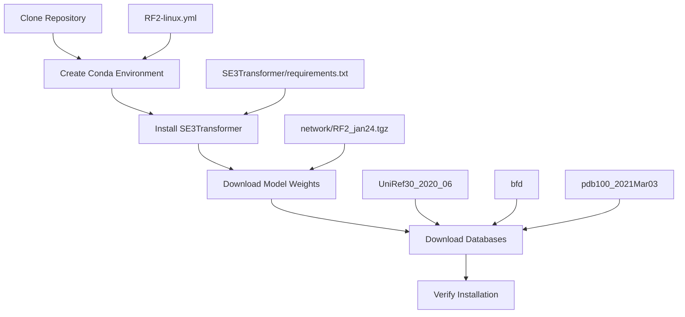
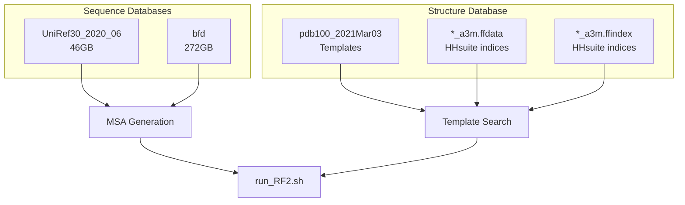
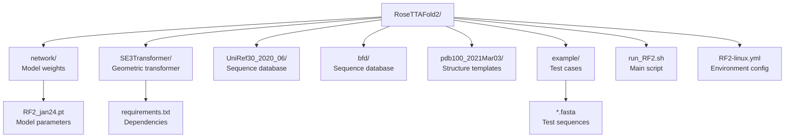

# Installation and Setup

> **Relevant source files**
> * [README.md](https://github.com/uw-ipd/RoseTTAFold2/blob/4b273b95/README.md?plain=1)
> * [RF2-linux.yml](https://github.com/uw-ipd/RoseTTAFold2/blob/4b273b95/RF2-linux.yml)

## Purpose and Scope

This document provides comprehensive installation and setup instructions for RoseTTAFold2, covering system requirements, dependency installation, model weights, and database setup. For basic usage instructions after installation, see [Basic Usage](/uw-ipd/RoseTTAFold2/2.2-basic-usage). For training-specific setup requirements, see [Training Pipeline](/uw-ipd/RoseTTAFold2/5.1-training-pipeline).

## System Requirements

RoseTTAFold2 requires specific hardware and software configurations for optimal performance:

| Component | Requirement | Notes |
| --- | --- | --- |
| OS | Linux (Ubuntu 18.04+, CentOS 7+) | Tested on modern Linux distributions |
| GPU | NVIDIA GPU with CUDA 12.1+ | Required for neural network inference |
| Memory | 16GB RAM minimum, 32GB+ recommended | Large protein complexes require more memory |
| Storage | ~320GB for databases + workspace | UniRef30 (46GB) + BFD (272GB) + templates |
| Python | 3.10 | Specified in conda environment |

## Installation Overview

The installation process follows a structured workflow with clear dependencies between components:

**Installation Workflow**



Sources: [README.md L13-L58](https://github.com/uw-ipd/RoseTTAFold2/blob/4b273b95/README.md?plain=1#L13-L58)

 [RF2-linux.yml L1-L20](https://github.com/uw-ipd/RoseTTAFold2/blob/4b273b95/RF2-linux.yml#L1-L20)

## Step-by-Step Installation

### 1. Repository Setup

Clone the RoseTTAFold2 repository and navigate to the project directory:

```
git clone https://github.com/uw-ipd/RoseTTAFold2.gitcd RoseTTAFold2
```

Sources: [README.md L15-L19](https://github.com/uw-ipd/RoseTTAFold2/blob/4b273b95/README.md?plain=1#L15-L19)

### 2. Conda Environment Creation

Create and activate the conda environment using the provided configuration file:

```sql
# Create conda environment for RoseTTAFold2conda env create -f RF2-linux.ymlconda activate RF2
```

The `RF2-linux.yml` file defines the following key dependencies:

| Package | Version | Purpose |
| --- | --- | --- |
| `python` | 3.10 | Base Python runtime |
| `pytorch` | 2.2 | Neural network framework |
| `pytorch-cuda` | 12.1 | CUDA support for PyTorch |
| `dgl` | 2.0.0.cu121 | Graph neural network library |
| `pyg` | latest | PyTorch Geometric for graph operations |
| `hhsuite` | latest | Homology search and alignment |

Sources: [README.md L21-L25](https://github.com/uw-ipd/RoseTTAFold2/blob/4b273b95/README.md?plain=1#L21-L25)

 [RF2-linux.yml L1-L20](https://github.com/uw-ipd/RoseTTAFold2/blob/4b273b95/RF2-linux.yml#L1-L20)

### 3. SE3Transformer Installation

Install the SE(3)-Transformer package from the included subdirectory:

```
cd SE3Transformerpip install --no-cache-dir -r requirements.txtpython setup.py installcd ..
```

**Important**: Use the SE3Transformer version included in this repository, not the original NVIDIA version, as it contains RoseTTAFold2-specific modifications.

Sources: [README.md L26-L33](https://github.com/uw-ipd/RoseTTAFold2/blob/4b273b95/README.md?plain=1#L26-L33)

### 4. Model Weights Download

Download and extract the pre-trained neural network weights:

```
cd networkwget https://files.ipd.uw.edu/dimaio/RF2_jan24.tgztar xvfz RF2_jan24.tgzcd ..
```

This creates the model files required for inference in the `network/` directory.

Sources: [README.md L35-L41](https://github.com/uw-ipd/RoseTTAFold2/blob/4b273b95/README.md?plain=1#L35-L41)

### 5. Database Download

Download the sequence and structure databases required for MSA generation and template search:

```markdown
# UniRef30 database [46GB]wget http://wwwuser.gwdg.de/~compbiol/uniclust/2020_06/UniRef30_2020_06_hhsuite.tar.gzmkdir -p UniRef30_2020_06tar xfz UniRef30_2020_06_hhsuite.tar.gz -C ./UniRef30_2020_06 # BFD database [272GB]wget https://bfd.mmseqs.com/bfd_metaclust_clu_complete_id30_c90_final_seq.sorted_opt.tar.gzmkdir -p bfdtar xfz bfd_metaclust_clu_complete_id30_c90_final_seq.sorted_opt.tar.gz -C ./bfd # Structure templateswget https://files.ipd.uw.edu/pub/RoseTTAFold/pdb100_2021Mar03.tar.gztar xfz pdb100_2021Mar03.tar.gz
```

**Database Components**



Sources: [README.md L43-L58](https://github.com/uw-ipd/RoseTTAFold2/blob/4b273b95/README.md?plain=1#L43-L58)

## Post-Installation Directory Structure

After successful installation, the RoseTTAFold2 directory structure should contain:

**Directory Structure**



Sources: [README.md L35-L58](https://github.com/uw-ipd/RoseTTAFold2/blob/4b273b95/README.md?plain=1#L35-L58)

## Installation Verification

### 1. Environment Verification

Verify that all packages are correctly installed:

```javascript
conda activate RF2python -c "import torch; print('PyTorch:', torch.__version__)"python -c "import dgl; print('DGL:', dgl.__version__)"python -c "from se3_transformer.model import SE3Transformer; print('SE3Transformer: OK')"
```

### 2. Database Verification

Check that databases are properly extracted:

```markdown
# Check UniRef30ls -la UniRef30_2020_06/# Should contain: UniRef30_2020_06_* # Check BFDls -la bfd/# Should contain: bfd_metaclust_clu_complete_id30_c90_final_seq.sorted_opt.* # Check templatesls -la pdb100_2021Mar03/# Should contain: pdb100_2021Mar03_*
```

### 3. Test Run

Run a simple test to verify the complete installation:

```
conda activate RF2cd example../run_RF2.sh rcsb_pdb_7UGF.fasta -o test_output
```

Successful execution should create `test_output/models/model_final.pdb` with predicted structure.

Sources: [README.md L60-L70](https://github.com/uw-ipd/RoseTTAFold2/blob/4b273b95/README.md?plain=1#L60-L70)

## Common Installation Issues

### CUDA Version Mismatch

If you encounter CUDA version conflicts:

* Verify NVIDIA driver compatibility with CUDA 12.1
* Check `nvidia-smi` output for driver version
* Ensure `pytorch-cuda==12.1` is installed correctly

### Memory Issues During Database Download

* Ensure sufficient disk space (>320GB) before starting downloads
* Consider downloading databases individually to monitor progress
* Use `wget -c` to resume interrupted downloads

### SE3Transformer Installation Failures

* Ensure conda environment is activated before installation
* Check that compiler tools are available (`gcc`, `g++`)
* Verify CUDA development tools are installed

### Database Path Issues

* Ensure databases are extracted to the correct directory structure
* Check file permissions after extraction
* Verify `run_RF2.sh` can locate database files

Sources: [README.md L26-L33](https://github.com/uw-ipd/RoseTTAFold2/blob/4b273b95/README.md?plain=1#L26-L33)

 [RF2-linux.yml L14-L16](https://github.com/uw-ipd/RoseTTAFold2/blob/4b273b95/RF2-linux.yml#L14-L16)