# Iterative Simulator

> **Relevant source files**
> * [network/Track_module.py](https://github.com/uw-ipd/RoseTTAFold2/blob/4b273b95/network/Track_module.py)

## Purpose and Scope

The Iterative Simulator is the core computational engine of RoseTTAFold2 that performs multi-track structural refinement through iterative processing of MSA, pair, and structure features. It orchestrates the gradual refinement of protein structure predictions through a series of interconnected neural network blocks that update different feature representations in a coordinated manner.

For information about the overall RoseTTAFold2 architecture, see [RoseTTAFold Model](/uw-ipd/RoseTTAFold2/3.1-rosettafold-model). For details about the SE3 transformer used within the structure refinement track, see [SE3 Transformer](/uw-ipd/RoseTTAFold2/3.5-se3-transformer).

## Architecture Overview

The `IterativeSimulator` class implements a three-stage refinement process with different computational focuses and MSA handling strategies:

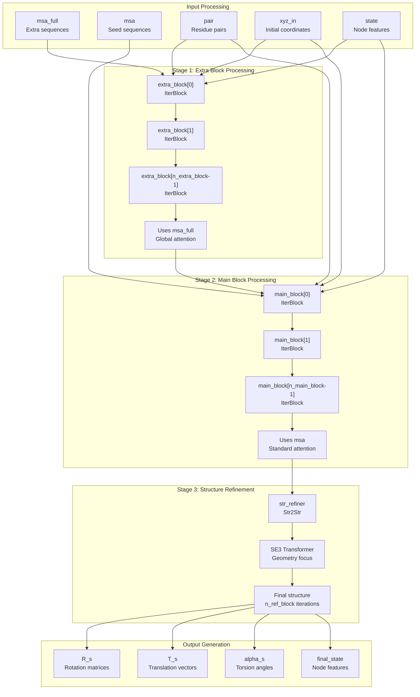

**Sources:** [network/Track_module.py L701-L841](https://github.com/uw-ipd/RoseTTAFold2/blob/4b273b95/network/Track_module.py#L701-L841)

## Core Components

### IterBlock - Multi-Track Processing Unit

The `IterBlock` class implements the fundamental multi-track processing unit that updates MSA, pair, and structure features in a coordinated manner:

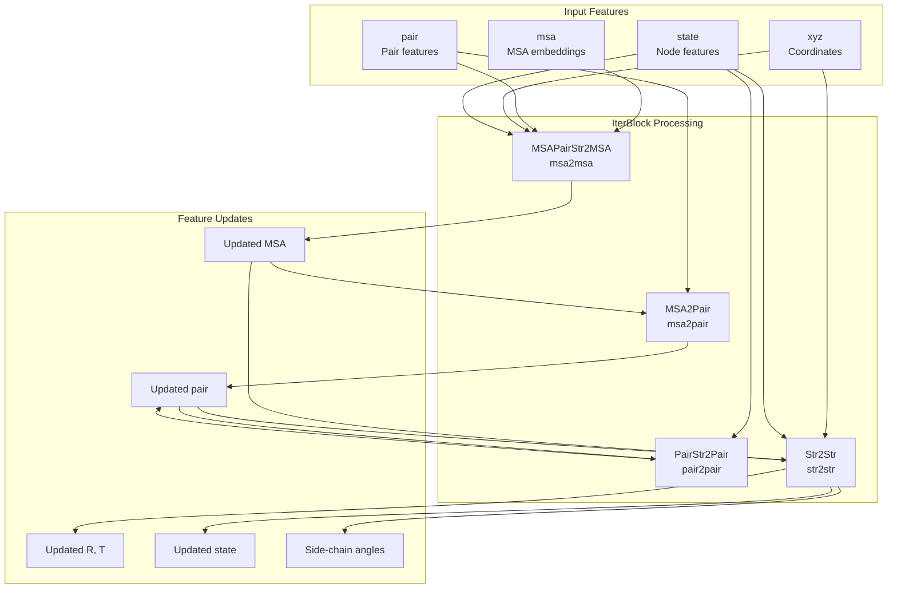

**Sources:** [network/Track_module.py L619-L699](https://github.com/uw-ipd/RoseTTAFold2/blob/4b273b95/network/Track_module.py#L619-L699)

### Four-Track Update System

Each `IterBlock` performs four coordinated updates that form the core of the multi-track architecture:

| Track | Component | Input | Output | Purpose |
| --- | --- | --- | --- | --- |
| MSA→MSA | `MSAPairStr2MSA` | MSA, pair, structure | Updated MSA | Biased self-attention with structure feedback |
| MSA→Pair | `MSA2Pair` | MSA | Pair updates | Extract coevolution signals |
| Pair→Pair | `PairStr2Pair` | Pair, structure | Updated pair | Structure-biased pair refinement |
| Structure→Structure | `Str2Str` | All features | R, T, state, angles | SE3-equivariant geometric updates |

**Sources:** [network/Track_module.py L13-L17](https://github.com/uw-ipd/RoseTTAFold2/blob/4b273b95/network/Track_module.py#L13-L17)

 [network/Track_module.py L49-L131](https://github.com/uw-ipd/RoseTTAFold2/blob/4b273b95/network/Track_module.py#L49-L131)

 [network/Track_module.py L297-L349](https://github.com/uw-ipd/RoseTTAFold2/blob/4b273b95/network/Track_module.py#L297-L349)

 [network/Track_module.py L132-L295](https://github.com/uw-ipd/RoseTTAFold2/blob/4b273b95/network/Track_module.py#L132-L295)

 [network/Track_module.py L490-L617](https://github.com/uw-ipd/RoseTTAFold2/blob/4b273b95/network/Track_module.py#L490-L617)

## Processing Pipeline

### Three-Stage Refinement Process

The `IterativeSimulator` implements a carefully orchestrated three-stage refinement:

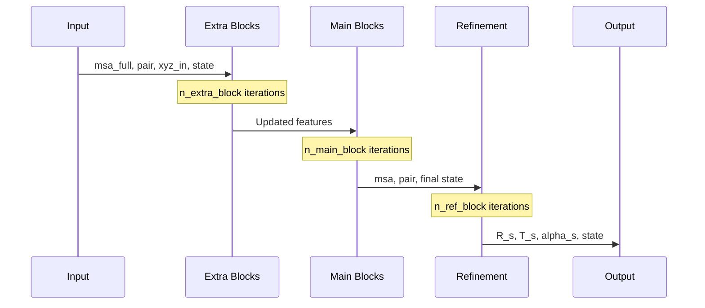

**Sources:** [network/Track_module.py L785-L834](https://github.com/uw-ipd/RoseTTAFold2/blob/4b273b95/network/Track_module.py#L785-L834)

### State Projection and Feature Dimensionality

The system uses different feature dimensions for different stages and includes projection layers to manage feature compatibility:

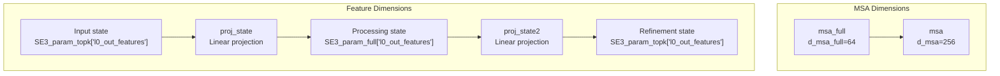

**Sources:** [network/Track_module.py L713](https://github.com/uw-ipd/RoseTTAFold2/blob/4b273b95/network/Track_module.py#L713-L713)

 [network/Track_module.py L737](https://github.com/uw-ipd/RoseTTAFold2/blob/4b273b95/network/Track_module.py#L737-L737)

 [network/Track_module.py L780](https://github.com/uw-ipd/RoseTTAFold2/blob/4b273b95/network/Track_module.py#L780-L780)

 [network/Track_module.py L819](https://github.com/uw-ipd/RoseTTAFold2/blob/4b273b95/network/Track_module.py#L819-L819)

## Multi-Track Feature Updates

### MSA Track Updates

The MSA track (`MSAPairStr2MSA`) incorporates structural information through biased attention:

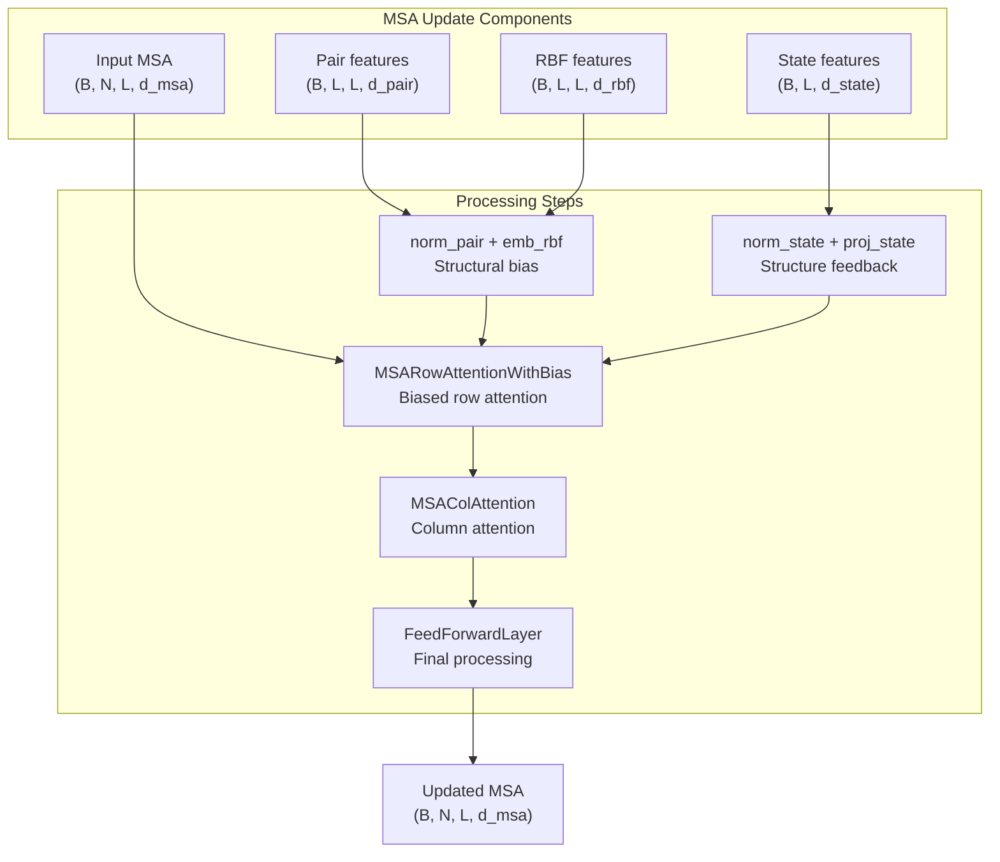

**Sources:** [network/Track_module.py L49-L130](https://github.com/uw-ipd/RoseTTAFold2/blob/4b273b95/network/Track_module.py#L49-L130)

### Pair Track Updates

The pair track (`PairStr2Pair`) uses triangular attention and structural gating:

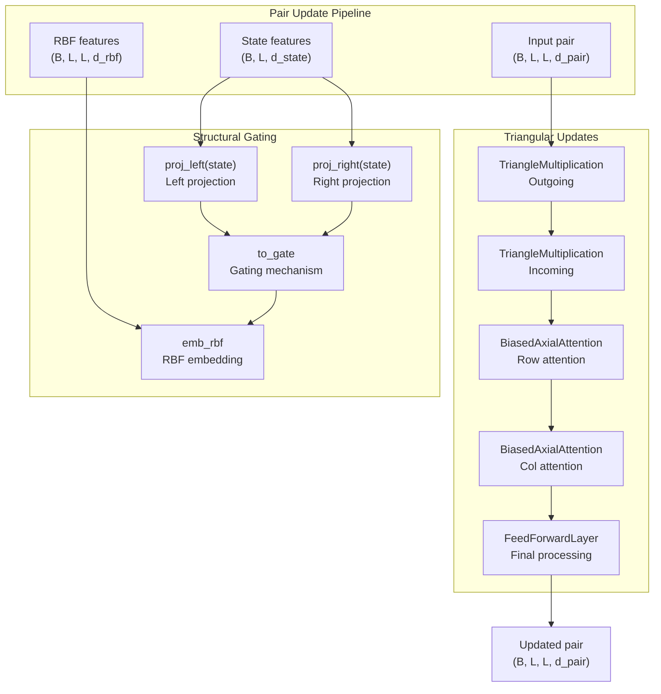

**Sources:** [network/Track_module.py L132-L295](https://github.com/uw-ipd/RoseTTAFold2/blob/4b273b95/network/Track_module.py#L132-L295)

### Structure Track Updates

The structure track (`Str2Str`) performs SE3-equivariant geometric processing:

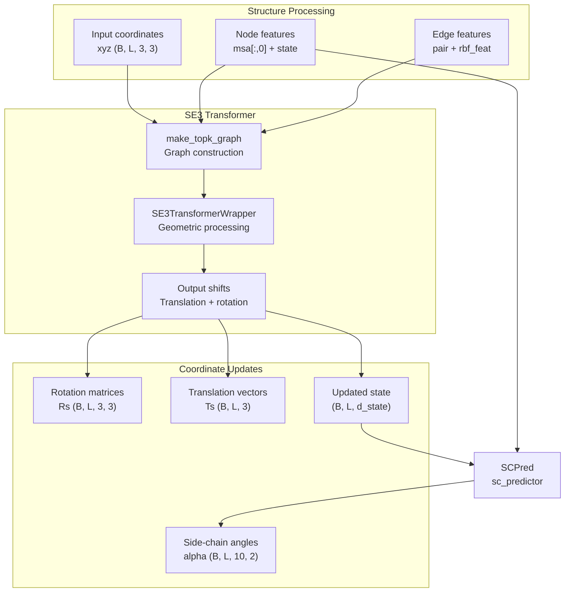

**Sources:** [network/Track_module.py L490-L617](https://github.com/uw-ipd/RoseTTAFold2/blob/4b273b95/network/Track_module.py#L490-L617)

## Symmetry Handling

The system includes sophisticated symmetry handling for multi-chain and symmetric complexes:

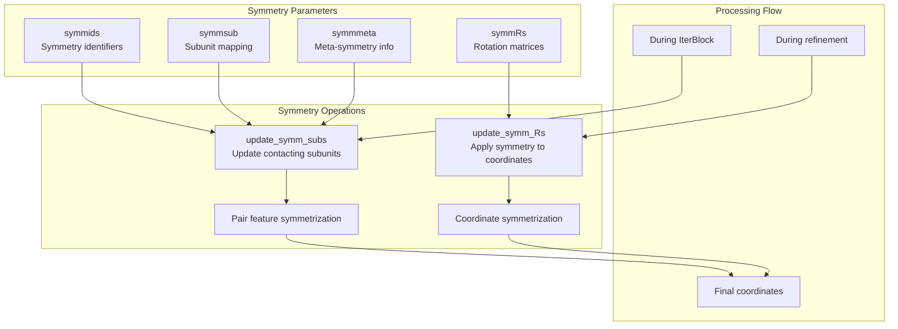

**Sources:** [network/Track_module.py L411-L488](https://github.com/uw-ipd/RoseTTAFold2/blob/4b273b95/network/Track_module.py#L411-L488)

 [network/Track_module.py L696-L697](https://github.com/uw-ipd/RoseTTAFold2/blob/4b273b95/network/Track_module.py#L696-L697)

 [network/Track_module.py L828-L829](https://github.com/uw-ipd/RoseTTAFold2/blob/4b273b95/network/Track_module.py#L828-L829)

## Memory Optimization Features

### Strided Processing

The system implements strided processing to manage memory usage for large proteins:

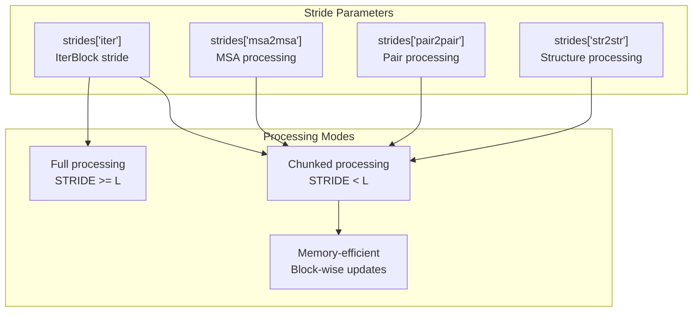

**Sources:** [network/Track_module.py L92-L103](https://github.com/uw-ipd/RoseTTAFold2/blob/4b273b95/network/Track_module.py#L92-L103)

 [network/Track_module.py L225-L234](https://github.com/uw-ipd/RoseTTAFold2/blob/4b273b95/network/Track_module.py#L225-L234)

 [network/Track_module.py L539-L544](https://github.com/uw-ipd/RoseTTAFold2/blob/4b273b95/network/Track_module.py#L539-L544)

 [network/Track_module.py L654-L657](https://github.com/uw-ipd/RoseTTAFold2/blob/4b273b95/network/Track_module.py#L654-L657)

### Low VRAM Mode

The system supports low VRAM operation by temporarily moving features to CPU:

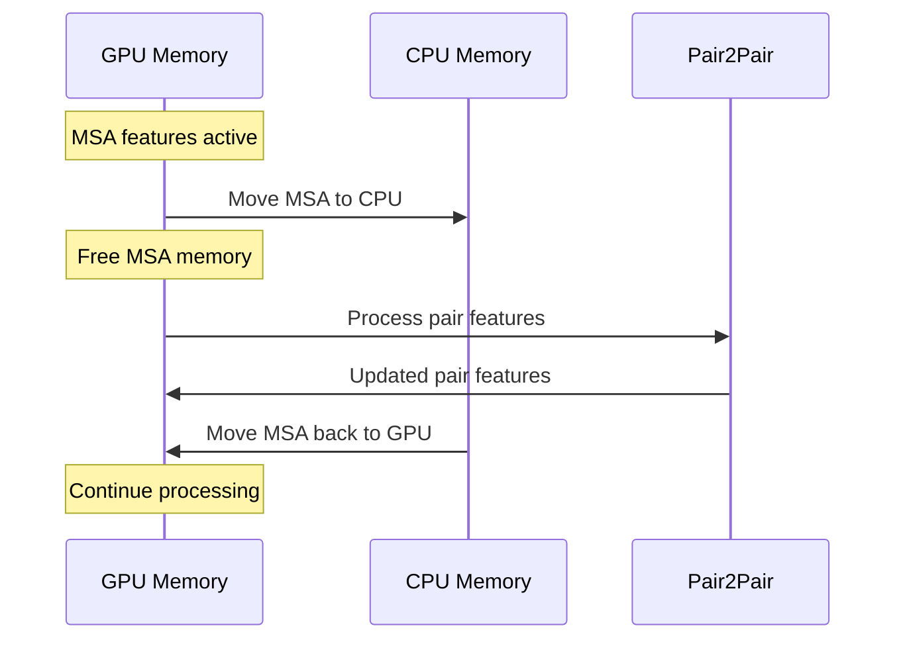

**Sources:** [network/Track_module.py L683-L688](https://github.com/uw-ipd/RoseTTAFold2/blob/4b273b95/network/Track_module.py#L683-L688)

### Gradient Checkpointing

The system supports gradient checkpointing to trade computation for memory during training:

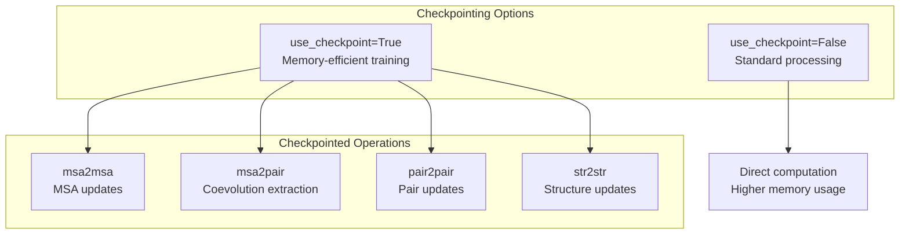

**Sources:** [network/Track_module.py L671-L678](https://github.com/uw-ipd/RoseTTAFold2/blob/4b273b95/network/Track_module.py#L671-L678)

## Configuration Parameters

The `IterativeSimulator` accepts extensive configuration parameters to control processing behavior:

| Parameter | Default | Purpose |
| --- | --- | --- |
| `n_extra_block` | 4 | Number of extra sequence processing blocks |
| `n_main_block` | 12 | Number of main sequence processing blocks |
| `n_ref_block` | 4 | Number of structure refinement blocks |
| `d_msa` | 256 | MSA feature dimension |
| `d_msa_full` | 64 | Full MSA feature dimension |
| `d_pair` | 128 | Pair feature dimension |
| `p2p_crop` | -1 | Pair processing crop size |
| `topk_crop` | -1 | Structure processing top-k neighbors |
| `use_checkpoint` | False | Enable gradient checkpointing |
| `low_vram` | False | Enable low VRAM mode |

**Sources:** [network/Track_module.py L702-L707](https://github.com/uw-ipd/RoseTTAFold2/blob/4b273b95/network/Track_module.py#L702-L707)

 [network/Track_module.py L753-L758](https://github.com/uw-ipd/RoseTTAFold2/blob/4b273b95/network/Track_module.py#L753-L758)