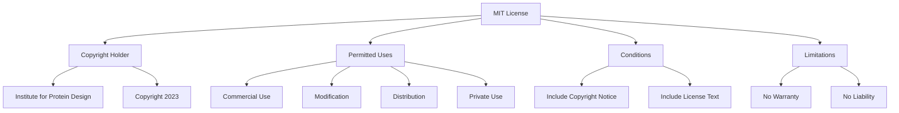
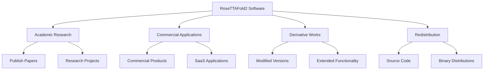
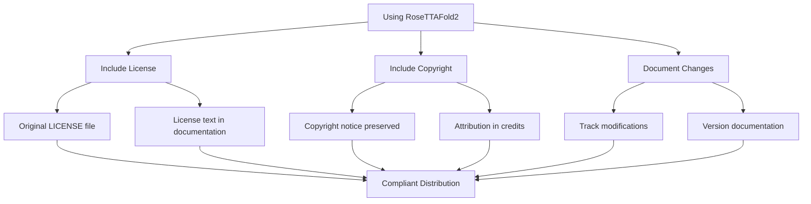

# License and Legal

> **Relevant source files**
> * [LICENSE](https://github.com/uw-ipd/RoseTTAFold2/blob/4b273b95/LICENSE)

This page provides comprehensive information about the licensing terms and legal considerations for using, modifying, and distributing the RoseTTAFold2 codebase. It covers the MIT License terms, usage rights, attribution requirements, and legal obligations that apply to all users of the software.

For information about system installation and setup, see [Installation and Setup](/uw-ipd/RoseTTAFold2/2.1-installation-and-setup). For command line usage details, see [Command Line Reference](/uw-ipd/RoseTTAFold2/8.2-command-line-reference).

## License Overview

RoseTTAFold2 is distributed under the MIT License, one of the most permissive open source licenses. The software is owned by the Institute for Protein Design and was released in 2023.

### License Structure



Sources: [LICENSE L1-L22](https://github.com/uw-ipd/RoseTTAFold2/blob/4b273b95/LICENSE#L1-L22)

## MIT License Terms

The complete license text is found in the root directory of the repository. The MIT License grants broad permissions while requiring minimal obligations from users.

### Key License Provisions

| Aspect | Details |
| --- | --- |
| **License Type** | MIT License |
| **Copyright Holder** | Institute for Protein Design |
| **Copyright Year** | 2023 |
| **License File** | [LICENSE L1-L22](https://github.com/uw-ipd/RoseTTAFold2/blob/4b273b95/LICENSE#L1-L22) |

### Permitted Activities

The MIT License explicitly grants the following rights:

* **Use**: Run the software for any purpose
* **Copy**: Create copies of the software
* **Modify**: Alter the source code
* **Merge**: Combine with other software
* **Publish**: Make the software publicly available
* **Distribute**: Share copies with others
* **Sublicense**: Grant licenses to third parties
* **Sell**: Commercialize the software

Sources: [LICENSE L5-L9](https://github.com/uw-ipd/RoseTTAFold2/blob/4b273b95/LICENSE#L5-L9)

## Usage Rights and Restrictions

### What You Can Do



### Rights Summary

The MIT License provides the following permissions without restriction:

1. **Academic Use**: Use in research, education, and academic publications
2. **Commercial Use**: Integration into commercial products and services
3. **Modification**: Adapt the code for specific needs or improvements
4. **Distribution**: Share original or modified versions with others
5. **Private Use**: Use internally within organizations without disclosure

Sources: [LICENSE L5-L9](https://github.com/uw-ipd/RoseTTAFold2/blob/4b273b95/LICENSE#L5-L9)

## Attribution Requirements

### Mandatory Inclusions

The license requires two elements to be included in all distributions:

| Requirement | Content | Location |
| --- | --- | --- |
| **Copyright Notice** | `Copyright (c) 2023 Institute for Protein Design` | [LICENSE L3](https://github.com/uw-ipd/RoseTTAFold2/blob/4b273b95/LICENSE#L3-L3) |
| **License Text** | Complete MIT License text | [LICENSE L1-L22](https://github.com/uw-ipd/RoseTTAFold2/blob/4b273b95/LICENSE#L1-L22) |

### Attribution Examples

When redistributing the software or substantial portions, you must include:

```
MIT License

Copyright (c) 2023 Institute for Protein Design

Permission is hereby granted, free of charge, to any person obtaining a copy
of this software and associated documentation files (the "Software"), to deal
in the Software without restriction...
```

Sources: [LICENSE L1-L22](https://github.com/uw-ipd/RoseTTAFold2/blob/4b273b95/LICENSE#L1-L22)

## Legal Considerations

### Warranty and Liability Disclaimers

The MIT License includes important legal protections for the copyright holder:

#### No Warranty Clause

The software is provided "AS IS" without warranty of any kind, including:

* **Express warranties**: No explicit guarantees
* **Implied warranties**: No implied fitness for purpose
* **Merchantability**: No guarantee of commercial suitability
* **Non-infringement**: No guarantee against IP conflicts

#### Liability Limitations

The copyright holder is not liable for:

* **Claims**: Legal disputes arising from software use
* **Damages**: Financial losses from software issues
* **Tort liability**: Harm caused by software defects
* **Contract liability**: Breach of any implied agreements

Sources: [LICENSE L15-L21](https://github.com/uw-ipd/RoseTTAFold2/blob/4b273b95/LICENSE#L15-L21)

### Compliance Guidelines



### Best Practices for Compliance

1. **Always Include**: Keep the original `LICENSE` file when distributing
2. **Preserve Attribution**: Maintain copyright notices in source files
3. **Document Changes**: Track modifications for derivative works
4. **Clear Attribution**: Credit the Institute for Protein Design appropriately
5. **Understand Scope**: The license applies to the entire codebase

Sources: [LICENSE L1-L22](https://github.com/uw-ipd/RoseTTAFold2/blob/4b273b95/LICENSE#L1-L22)

## Third-Party Dependencies

While the main RoseTTAFold2 codebase is under MIT License, users should be aware that:

* **External dependencies** may have different licenses
* **Database dependencies** (UniRef30, BFD) may have separate terms
* **Model weights** may have additional restrictions
* **Template structures** from PDB have their own usage terms

Users are responsible for ensuring compliance with all applicable licenses when using the complete system.

Sources: [LICENSE L1-L22](https://github.com/uw-ipd/RoseTTAFold2/blob/4b273b95/LICENSE#L1-L22)