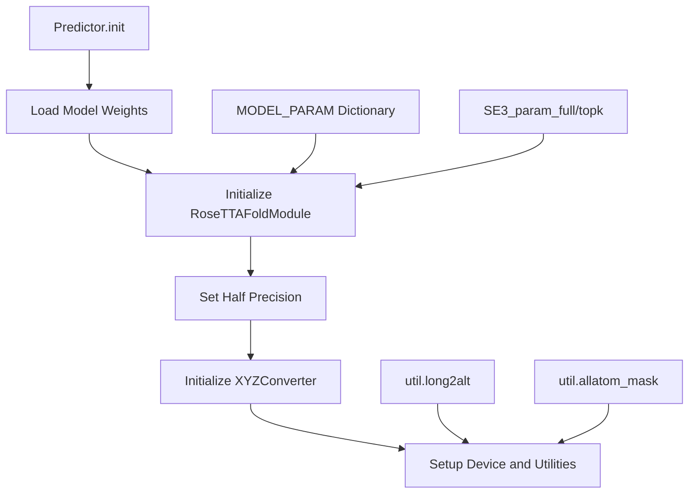
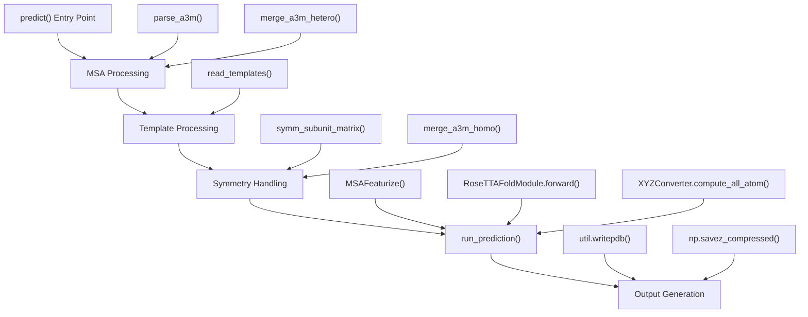
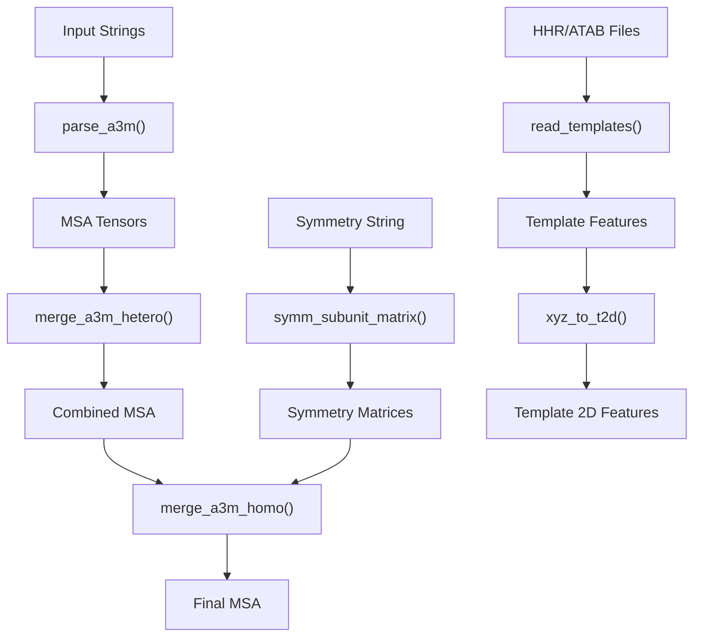
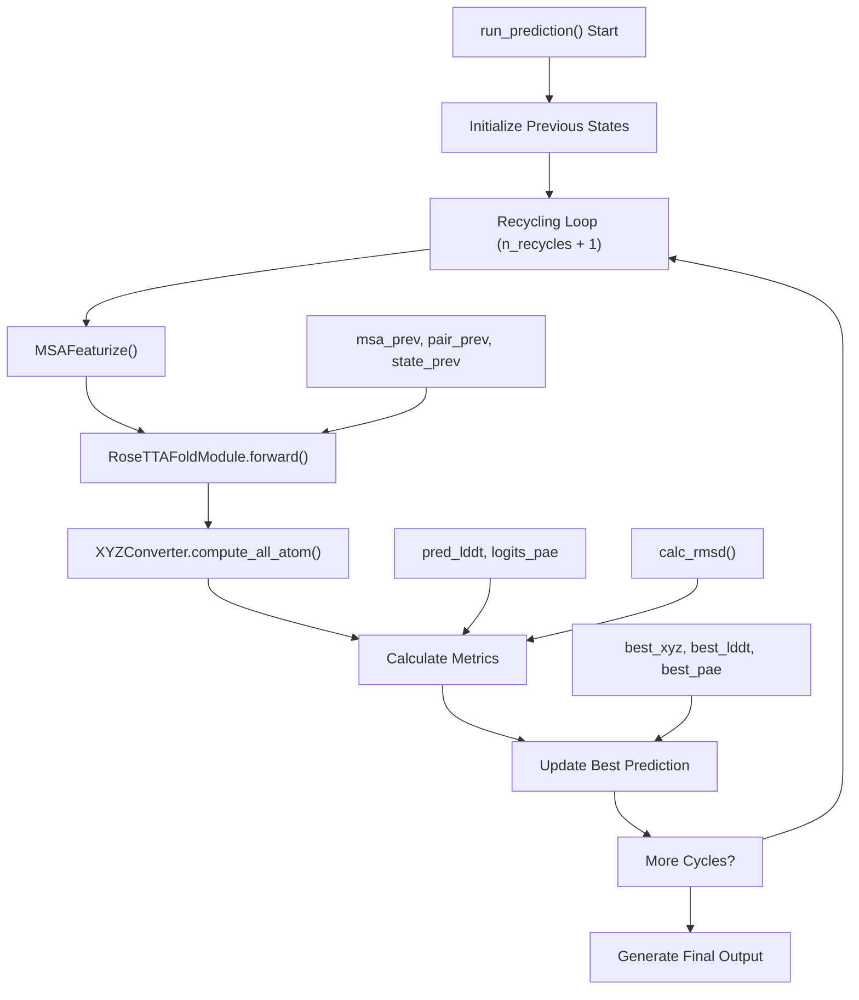
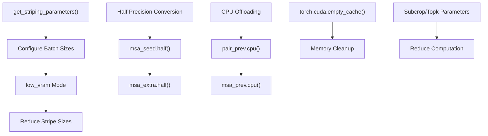
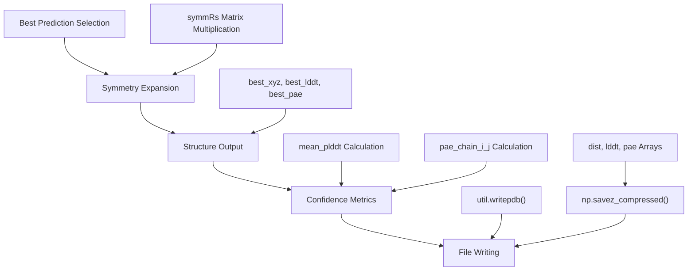
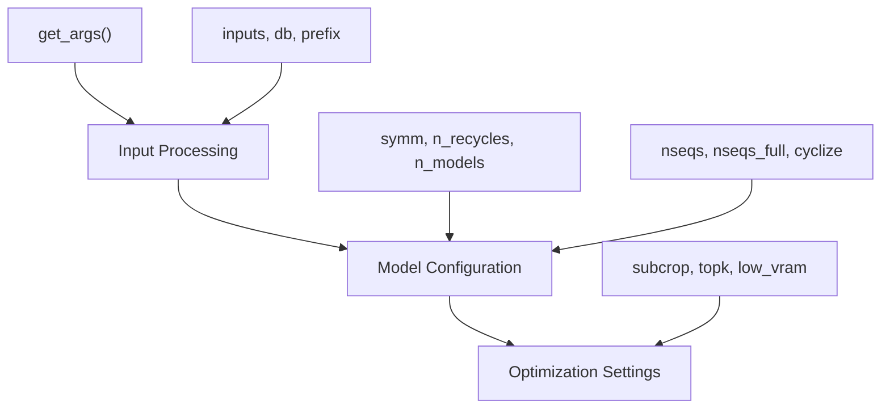

# Main Prediction Interface

> **Relevant source files**
> * [network/predict.py](https://github.com/uw-ipd/RoseTTAFold2/blob/4b273b95/network/predict.py)

This document describes the main prediction interface for RoseTTAFold2, implemented in the `Predictor` class. This interface orchestrates the complete prediction workflow from raw inputs to final structure predictions, handling MSA processing, template integration, neural network inference, and output generation.

For information about the core neural network components used by this interface, see [Core Architecture](/uw-ipd/RoseTTAFold2/3-core-architecture). For details about input file parsing, see [Input Processing](/uw-ipd/RoseTTAFold2/4.2-input-processing). For training-related prediction workflows, see [Training System](/uw-ipd/RoseTTAFold2/5-training-system).

## Predictor Class Architecture

The `Predictor` class serves as the main entry point for structure prediction, encapsulating model loading, configuration, and inference orchestration.

### Class Initialization and Model Loading

The `Predictor` class initialization follows a structured workflow where model parameters are loaded from predefined dictionaries, the neural network is instantiated, and various utility components are prepared for inference.

Sources: [network/predict.py L204-L229](https://github.com/uw-ipd/RoseTTAFold2/blob/4b273b95/network/predict.py#L204-L229)

### Model Parameter Configuration

The prediction interface uses several parameter dictionaries to configure the neural network:

| Parameter Group | Key Components | Purpose |
| --- | --- | --- |
| `MODEL_PARAM` | `n_main_block=36`, `d_msa=256`, `d_pair=128` | Core transformer architecture sizing |
| `SE3_param_full` | `num_channels=48`, `num_degrees=2` | Full SE3 transformer configuration |
| `SE3_param_topk` | `num_channels=128`, `num_degrees=2` | Top-k SE3 transformer configuration |

Sources: [network/predict.py L53-L94](https://github.com/uw-ipd/RoseTTAFold2/blob/4b273b95/network/predict.py#L53-L94)

## Main Prediction Workflow

The prediction workflow consists of three main phases: input processing, neural network inference, and output generation.

### High-Level Prediction Flow

Sources: [network/predict.py L251-L437](https://github.com/uw-ipd/RoseTTAFold2/blob/4b273b95/network/predict.py#L251-L437)

### Input Processing Pipeline

The prediction interface handles complex input processing including MSA parsing, template integration, and symmetry operations:

The input processing handles multiple sequence alignments, template structures, and symmetry operations to prepare features for the neural network.

Sources: [network/predict.py L264-L413](https://github.com/uw-ipd/RoseTTAFold2/blob/4b273b95/network/predict.py#L264-L413)

## Neural Network Inference Loop

The core prediction computation occurs in the `run_prediction` method, which implements a recycling loop for iterative refinement.

### Recycling Loop Architecture

The recycling loop iteratively refines predictions by feeding previous cycle outputs back into the network, selecting the best prediction based on confidence metrics.

Sources: [network/predict.py L495-L556](https://github.com/uw-ipd/RoseTTAFold2/blob/4b273b95/network/predict.py#L495-L556)

### Memory Management Strategy

The prediction interface implements several memory optimization strategies:

Memory management includes striping parameters for batching, half-precision computation, CPU offloading of intermediate states, and explicit memory cleanup.

Sources: [network/predict.py L96-L136](https://github.com/uw-ipd/RoseTTAFold2/blob/4b273b95/network/predict.py#L96-L136)

 [network/predict.py L504-L545](https://github.com/uw-ipd/RoseTTAFold2/blob/4b273b95/network/predict.py#L504-L545)

## Output Generation and Metrics

The prediction interface generates multiple output formats and calculates confidence metrics.

### Output Processing Pipeline

Output generation expands asymmetric unit predictions to full symmetric complexes, calculates chain-pair confidence metrics, and writes both PDB structure files and NPZ data files.

Sources: [network/predict.py L565-L601](https://github.com/uw-ipd/RoseTTAFold2/blob/4b273b95/network/predict.py#L565-L601)

### Confidence Metrics

The interface calculates several confidence metrics:

| Metric | Calculation | Purpose |
| --- | --- | --- |
| `mean_plddt` | Average over all residues | Overall prediction confidence |
| `pae_chain_i_j` | Average PAE between chain pairs | Inter-chain confidence |
| `pred_lddt` | Per-residue confidence | Local structure quality |
| `logits_pae` | Predicted aligned error | Residue-pair confidence |

Sources: [network/predict.py L582-L594](https://github.com/uw-ipd/RoseTTAFold2/blob/4b273b95/network/predict.py#L582-L594)

## Command Line Interface

The prediction interface provides a comprehensive command line interface for controlling prediction parameters.

### Key Parameters

The command line interface supports input specification, symmetry handling, recycling control, memory optimization, and sequence sampling configuration.

Sources: [network/predict.py L27-L51](https://github.com/uw-ipd/RoseTTAFold2/blob/4b273b95/network/predict.py#L27-L51)

## Integration with Core Components

The prediction interface integrates with several core system components:

* **RoseTTAFoldModule**: The main neural network ([RoseTTAFold Model](/uw-ipd/RoseTTAFold2/3.1-rosettafold-model))
* **MSAFeaturize**: MSA processing and featurization ([Data Preparation](/uw-ipd/RoseTTAFold2/4.3-data-preparation))
* **XYZConverter**: Coordinate system conversions ([Core Utilities](/uw-ipd/RoseTTAFold2/6.1-core-utilities))
* **Symmetry functions**: Symmetric complex handling ([symm_subunit_matrix](/uw-ipd/RoseTTAFold2/3.2-iterative-simulator))
* **Template readers**: Structure template processing ([Input Processing](/uw-ipd/RoseTTAFold2/4.2-input-processing))

Sources: [network/predict.py L8-L16](https://github.com/uw-ipd/RoseTTAFold2/blob/4b273b95/network/predict.py#L8-L16)