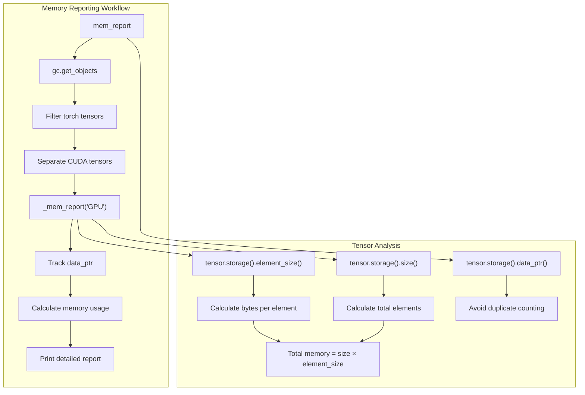
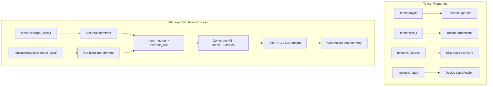
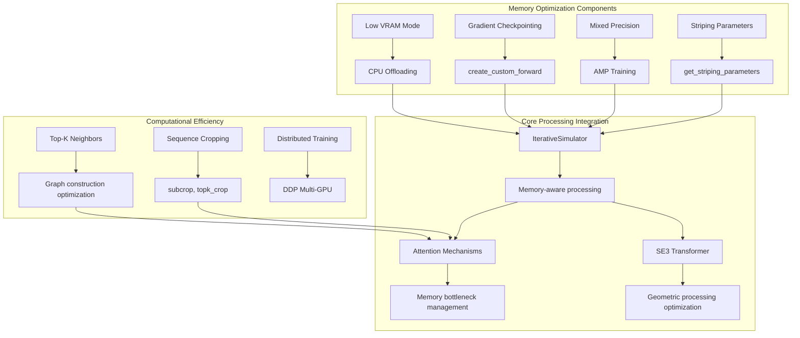
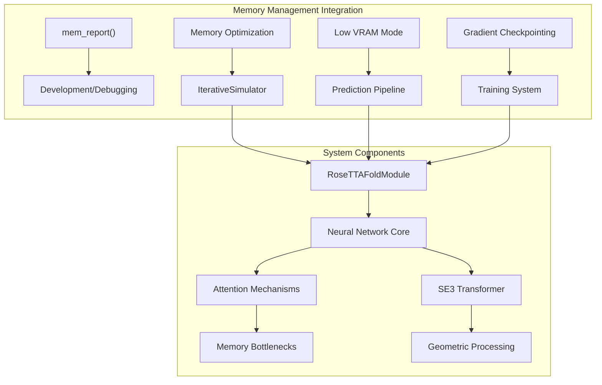

# Memory Management

> **Relevant source files**
> * [network/memory.py](https://github.com/uw-ipd/RoseTTAFold2/blob/4b273b95/network/memory.py)

This document covers the memory management utilities and optimization strategies used in RoseTTAFold2. The memory management system provides tools for monitoring tensor memory usage and implementing optimization strategies to handle large protein structures within available memory constraints.

For information about core computational utilities, see [Core Utilities](/uw-ipd/RoseTTAFold2/6.1-core-utilities). For training-specific memory optimizations, see [Training System](/uw-ipd/RoseTTAFold2/5-training-system).

## Memory Reporting System

RoseTTAFold2 includes a dedicated memory reporting utility that provides detailed analysis of tensor memory usage across CPU and GPU devices. The system tracks memory allocation patterns and identifies memory-intensive operations.



**Memory Reporting Architecture**

The memory reporting system uses Python's garbage collection to enumerate all tensor objects and provides detailed breakdowns of memory usage patterns.

Sources: [network/memory.py L1-L59](https://github.com/uw-ipd/RoseTTAFold2/blob/4b273b95/network/memory.py#L1-L59)

## Core Memory Management Functions

### Memory Report Function

The `mem_report()` function serves as the main interface for memory analysis:

| Function | Purpose | Key Features |
| --- | --- | --- |
| `mem_report()` | Generate comprehensive memory usage report | GPU/CPU separation, duplicate detection, detailed breakdown |
| `_mem_report(tensors, mem_type)` | Internal reporting for specific device type | Per-tensor analysis, memory threshold filtering |

The system implements several key optimizations:

* **Duplicate Detection**: Uses `tensor.storage().data_ptr()` to avoid counting shared memory blocks multiple times
* **Memory Threshold Filtering**: Only reports tensors consuming more than 128 MB of memory
* **Device-Specific Analysis**: Separates GPU and CPU tensor analysis for targeted optimization

Sources: [network/memory.py L6-L59](https://github.com/uw-ipd/RoseTTAFold2/blob/4b273b95/network/memory.py#L6-L59)

### Memory Calculation Logic



**Memory Calculation Workflow**

Sources: [network/memory.py L23-L47](https://github.com/uw-ipd/RoseTTAFold2/blob/4b273b95/network/memory.py#L23-L47)

## Memory Optimization Strategies

Based on the system architecture, RoseTTAFold2 implements several memory optimization strategies:



**Memory Optimization Architecture**

## Implementation Details

### Memory Reporting Output Format

The memory reporting system generates structured output with the following format:

```
================================================================================
Element type    Size                    Used MEM(MBytes)
Storage on GPU
-------------------------------------------------------------------------------
[Tensor details for tensors > 128 MB]
-------------------------------------------------------------------------------
Total Tensors: [count]     Used Memory Space: [total MB] MBytes
-------------------------------------------------------------------------------
================================================================================
```

### Key Constants and Thresholds

| Constant | Value | Purpose |
| --- | --- | --- |
| `LEN` | 65 | Report formatting width |
| Memory threshold | 128.0 MB | Minimum size for individual tensor reporting |
| Unit conversion | `/1024/1024` | Bytes to megabytes conversion |

Sources: [network/memory.py L40-L48](https://github.com/uw-ipd/RoseTTAFold2/blob/4b273b95/network/memory.py#L40-L48)

## Integration with Core Systems

The memory management system integrates with the broader RoseTTAFold2 architecture through several key touchpoints:



**Memory Management System Integration**

## Usage Context

The memory management utilities are primarily used during:

1. **Development and Debugging**: Memory profiling to identify bottlenecks
2. **Production Monitoring**: Tracking memory usage patterns in deployed systems
3. **Optimization Validation**: Verifying effectiveness of memory reduction strategies
4. **Hardware Sizing**: Determining appropriate GPU memory requirements

The system focuses specifically on GPU memory management, as this is typically the primary constraint for large protein structure predictions.

Sources: [network/memory.py L1-L59](https://github.com/uw-ipd/RoseTTAFold2/blob/4b273b95/network/memory.py#L1-L59)