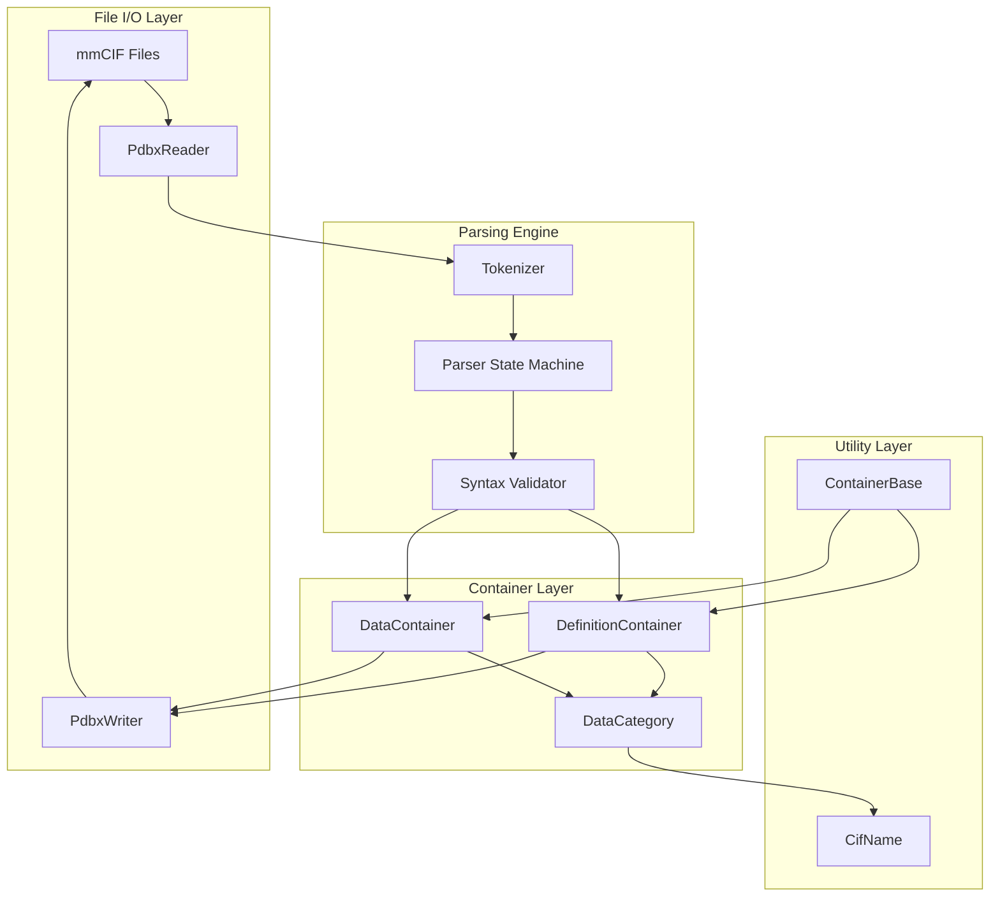
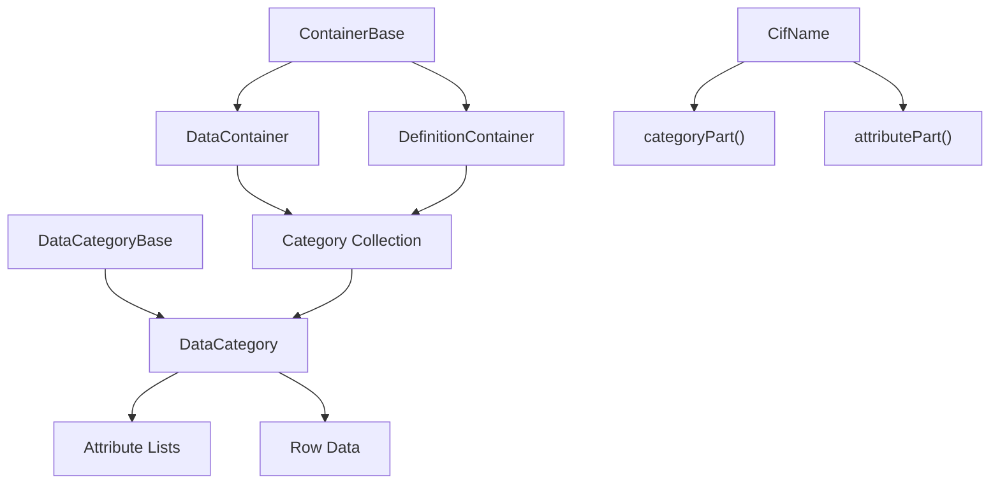
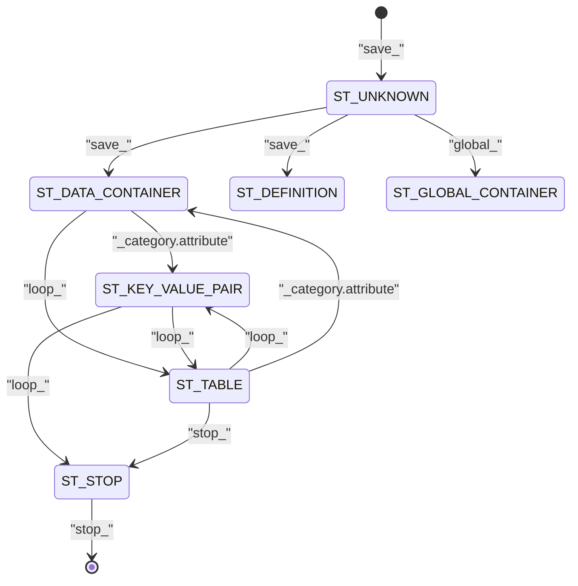
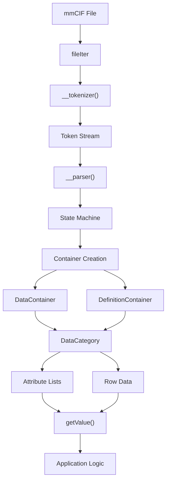

# PDBx/mmCIF Processing

> **Relevant source files**
> * [input_prep/pdbx/reader/PdbxContainers.py](https://github.com/uw-ipd/RoseTTAFold2/blob/4b273b95/input_prep/pdbx/reader/PdbxContainers.py)
> * [input_prep/pdbx/reader/PdbxParser.py](https://github.com/uw-ipd/RoseTTAFold2/blob/4b273b95/input_prep/pdbx/reader/PdbxParser.py)

This document covers the PDBx/mmCIF file format processing system used in RoseTTAFold2 for parsing and handling crystallographic information files. The system provides comprehensive support for reading, writing, and manipulating mmCIF format files that contain protein structure data and metadata.

For structure analysis and comparison tools, see [Structure Analysis Tools](/uw-ipd/RoseTTAFold2/7.2-structure-analysis-tools). For general input processing workflows, see [Input Processing](/uw-ipd/RoseTTAFold2/4.2-input-processing).

## Overview

The PDBx/mmCIF processing system consists of a collection of container classes and parser utilities that handle the Complex Information File (CIF) format used by the Protein Data Bank. This system enables RoseTTAFold2 to process template structures and structural metadata from crystallographic databases.

The mmCIF format organizes data in a hierarchical structure with data blocks containing categories, which in turn contain attributes and values. This mirrors a relational database model where categories are analogous to tables and attributes to columns.

## Core Architecture

The PDBx/mmCIF processing system follows a layered architecture with distinct responsibilities for parsing, data representation, and output formatting.



**Sources:** [input_prep/pdbx/reader/PdbxContainers.py L1-L820](https://github.com/uw-ipd/RoseTTAFold2/blob/4b273b95/input_prep/pdbx/reader/PdbxContainers.py#L1-L820)

 [input_prep/pdbx/reader/PdbxParser.py L1-L639](https://github.com/uw-ipd/RoseTTAFold2/blob/4b273b95/input_prep/pdbx/reader/PdbxParser.py#L1-L639)

## Container Classes

The container system provides a hierarchical data model for representing mmCIF content in memory.

### Base Container Architecture



**Sources:** [input_prep/pdbx/reader/PdbxContainers.py L77-L172](https://github.com/uw-ipd/RoseTTAFold2/blob/4b273b95/input_prep/pdbx/reader/PdbxContainers.py#L77-L172)

 [input_prep/pdbx/reader/PdbxContainers.py L174-L208](https://github.com/uw-ipd/RoseTTAFold2/blob/4b273b95/input_prep/pdbx/reader/PdbxContainers.py#L174-L208)

 [input_prep/pdbx/reader/PdbxContainers.py L210-L229](https://github.com/uw-ipd/RoseTTAFold2/blob/4b273b95/input_prep/pdbx/reader/PdbxContainers.py#L210-L229)

### Key Container Classes

| Class | Purpose | Key Methods |
| --- | --- | --- |
| `ContainerBase` | Base class for all containers | `append()`, `getObj()`, `exists()` |
| `DataContainer` | Holds data blocks | `setGlobal()`, `getGlobal()` |
| `DefinitionContainer` | Holds definition sections | `isCategory()`, `isAttribute()` |
| `DataCategory` | Stores category data | `getValue()`, `setValue()`, `appendAttribute()` |
| `CifName` | Utility for CIF name parsing | `categoryPart()`, `attributePart()` |

The `DataCategory` class serves as the primary data storage mechanism, implementing list-like behavior with support for both integer indexing (for rows) and string indexing (for attribute access).

**Sources:** [input_prep/pdbx/reader/PdbxContainers.py L48-L75](https://github.com/uw-ipd/RoseTTAFold2/blob/4b273b95/input_prep/pdbx/reader/PdbxContainers.py#L48-L75)

 [input_prep/pdbx/reader/PdbxContainers.py L275-L820](https://github.com/uw-ipd/RoseTTAFold2/blob/4b273b95/input_prep/pdbx/reader/PdbxContainers.py#L275-L820)

## Parser Implementation

The parsing system uses a state machine approach with regex-based tokenization to process mmCIF syntax.

### Parser State Machine



**Sources:** [input_prep/pdbx/reader/PdbxParser.py L68-L73](https://github.com/uw-ipd/RoseTTAFold2/blob/4b273b95/input_prep/pdbx/reader/PdbxParser.py#L68-L73)

 [input_prep/pdbx/reader/PdbxParser.py L114-L335](https://github.com/uw-ipd/RoseTTAFold2/blob/4b273b95/input_prep/pdbx/reader/PdbxParser.py#L114-L335)

### Tokenization Process

The tokenizer uses a comprehensive regex pattern to identify different syntax elements:

```python
# Key regex patterns from the tokenizermmcifRe = re.compile(    r"(?:"    "(?:_(.+?)[.](\S+))"               "|"  # _category.attribute    "(?:['](.*?)(?:[']\s|[']$))"       "|"  # single quoted strings    "(?:[\"](.*?)(?:[\"]\s|[\"]$))"    "|"  # double quoted strings    "(?:\s*#.*$)"                      "|"  # comments (dumped)    "(\S+)"                                 # unquoted words    ")")
```

The tokenizer handles several syntax elements:

* Category-attribute pairs (`_category.attribute`)
* Single and double quoted strings
* Multi-line semicolon-delimited strings
* Comments (which are discarded)
* Unquoted words

**Sources:** [input_prep/pdbx/reader/PdbxParser.py L337-L410](https://github.com/uw-ipd/RoseTTAFold2/blob/4b273b95/input_prep/pdbx/reader/PdbxParser.py#L337-L410)

 [input_prep/pdbx/reader/PdbxParser.py L351-L363](https://github.com/uw-ipd/RoseTTAFold2/blob/4b273b95/input_prep/pdbx/reader/PdbxParser.py#L351-L363)

## Data Flow and Processing

The complete processing pipeline from file input to structured data follows this flow:



**Sources:** [input_prep/pdbx/reader/PdbxParser.py L74-L86](https://github.com/uw-ipd/RoseTTAFold2/blob/4b273b95/input_prep/pdbx/reader/PdbxParser.py#L74-L86)

 [input_prep/pdbx/reader/PdbxParser.py L337-L410](https://github.com/uw-ipd/RoseTTAFold2/blob/4b273b95/input_prep/pdbx/reader/PdbxParser.py#L337-L410)

 [input_prep/pdbx/reader/PdbxParser.py L114-L335](https://github.com/uw-ipd/RoseTTAFold2/blob/4b273b95/input_prep/pdbx/reader/PdbxParser.py#L114-L335)

## Writer Functionality

The `PdbxWriter` class provides output formatting capabilities with support for both item-value pairs and tabular formats.

### Output Formatting

The writer supports two primary output formats:

1. **Item-Value Format** - For single-row categories: ``` _category.attribute1    value1 _category.attribute2    value2 ```
2. **Loop/Table Format** - For multi-row categories: ``` loop_ _category.attribute1 _category.attribute2 value1  value2 value3  value4 ```

The writer automatically determines the appropriate format based on the number of rows in each category and applies proper quoting rules for string values.

**Sources:** [input_prep/pdbx/reader/PdbxParser.py L489-L639](https://github.com/uw-ipd/RoseTTAFold2/blob/4b273b95/input_prep/pdbx/reader/PdbxParser.py#L489-L639)

 [input_prep/pdbx/reader/PdbxParser.py L554-L575](https://github.com/uw-ipd/RoseTTAFold2/blob/4b273b95/input_prep/pdbx/reader/PdbxParser.py#L554-L575)

 [input_prep/pdbx/reader/PdbxParser.py L577-L638](https://github.com/uw-ipd/RoseTTAFold2/blob/4b273b95/input_prep/pdbx/reader/PdbxParser.py#L577-L638)

## Data Type Handling

The system includes sophisticated data type detection and formatting capabilities:

| Data Type | Format Code | Description |
| --- | --- | --- |
| `DT_NULL_VALUE` | `FT_NULL_VALUE` | Null values (., ?) |
| `DT_INTEGER` | `FT_NUMBER` | Integer values |
| `DT_FLOAT` | `FT_NUMBER` | Floating point values |
| `DT_UNQUOTED_STRING` | `FT_UNQUOTED_STRING` | Simple strings |
| `DT_SINGLE_QUOTED_STRING` | `FT_QUOTED_STRING` | Single quoted strings |
| `DT_DOUBLE_QUOTED_STRING` | `FT_QUOTED_STRING` | Double quoted strings |
| `DT_MULTI_LINE_STRING` | `FT_MULTI_LINE_STRING` | Semicolon-delimited strings |

The system automatically selects appropriate quoting based on content analysis, preferring double quotes when possible to avoid embedded quote conflicts.

**Sources:** [input_prep/pdbx/reader/PdbxContainers.py L605-L657](https://github.com/uw-ipd/RoseTTAFold2/blob/4b273b95/input_prep/pdbx/reader/PdbxContainers.py#L605-L657)

 [input_prep/pdbx/reader/PdbxContainers.py L658-L703](https://github.com/uw-ipd/RoseTTAFold2/blob/4b273b95/input_prep/pdbx/reader/PdbxContainers.py#L658-L703)

 [input_prep/pdbx/reader/PdbxContainers.py L307-L311](https://github.com/uw-ipd/RoseTTAFold2/blob/4b273b95/input_prep/pdbx/reader/PdbxContainers.py#L307-L311)

## Usage Patterns

### Basic Reading Pattern

```markdown
# Typical usage pattern for reading mmCIF filescontainerList = []with open('structure.cif', 'r') as ifh:    reader = PdbxReader(ifh)    reader.read(containerList) # Access data containersfor container in containerList:    if container.getType() == 'data':        # Process data container        if container.exists('atom_site'):            atom_category = container.getObj('atom_site')            # Access atomic coordinates and properties
```

### Category Data Access

The `DataCategory` class provides multiple access patterns:

```markdown
# List-like access for rowsrow = category[0]  # First row # Dictionary-like access for attributesvalue = category['attribute_name']  # First row, specific attribute # Explicit access methodsvalue = category.getValue('attribute_name', row_index)category.setValue(new_value, 'attribute_name', row_index)
```

**Sources:** [input_prep/pdbx/reader/PdbxContainers.py L314-L331](https://github.com/uw-ipd/RoseTTAFold2/blob/4b273b95/input_prep/pdbx/reader/PdbxContainers.py#L314-L331)

 [input_prep/pdbx/reader/PdbxContainers.py L452-L503](https://github.com/uw-ipd/RoseTTAFold2/blob/4b273b95/input_prep/pdbx/reader/PdbxContainers.py#L452-L503)