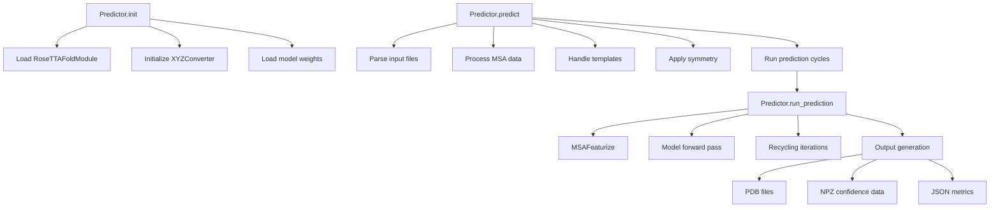
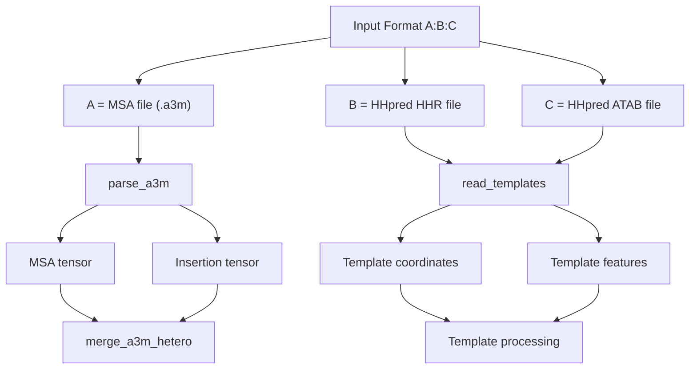
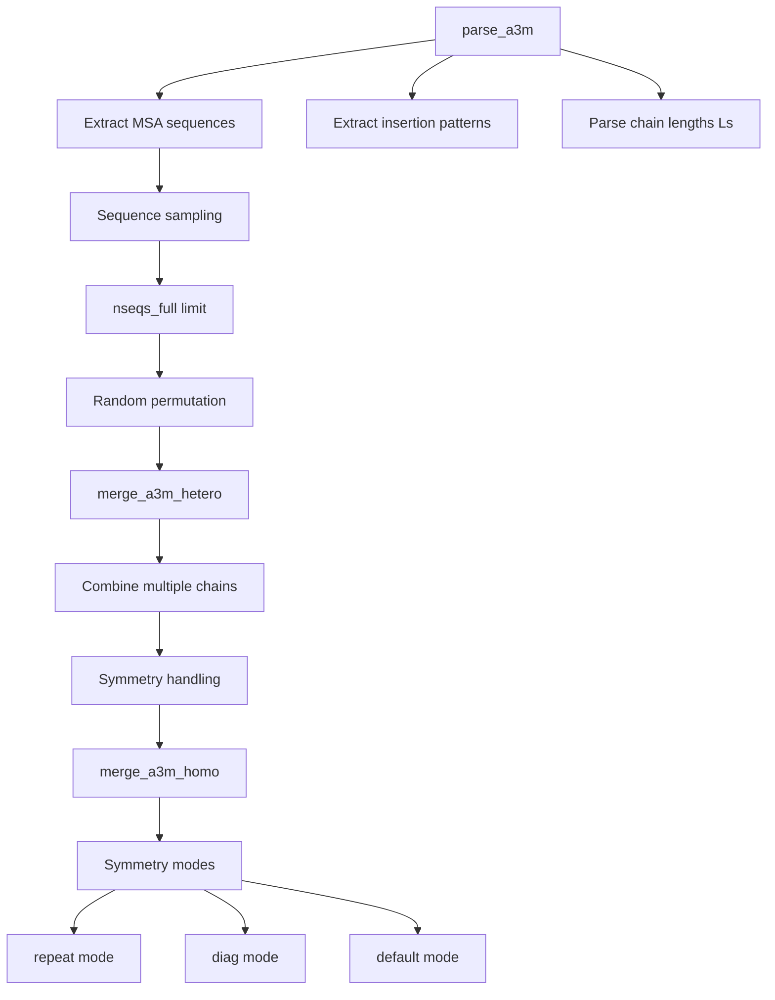
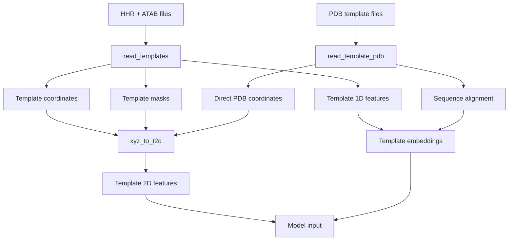
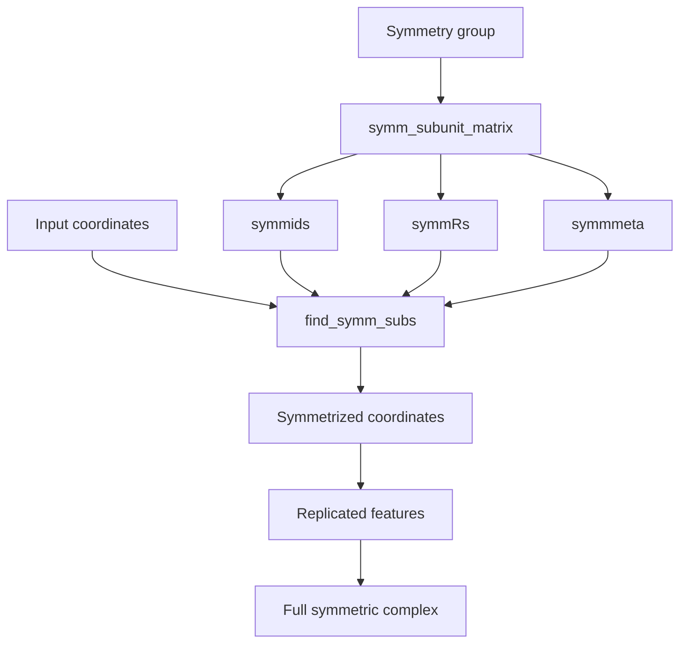
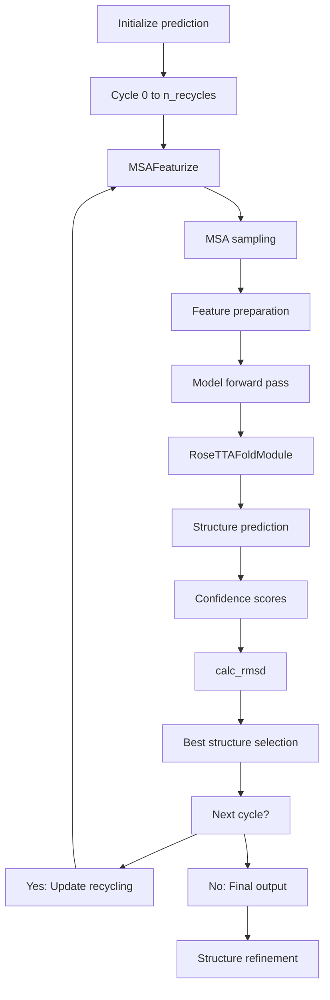
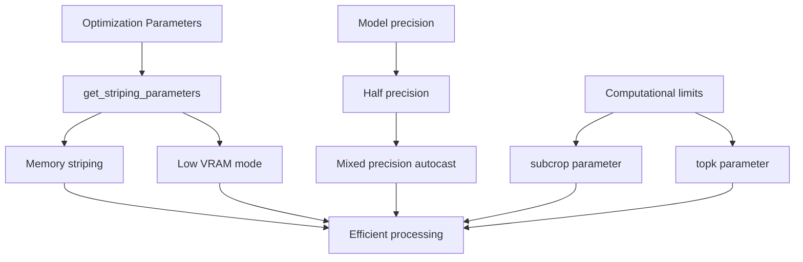
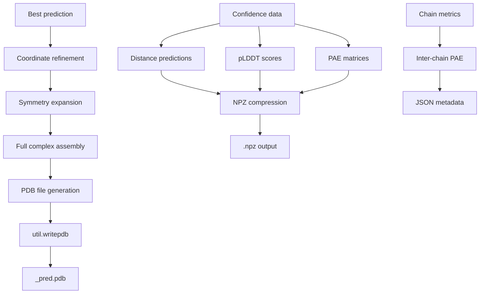
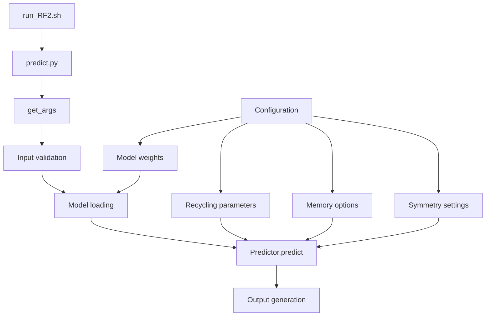

# Prediction Pipeline

> **Relevant source files**
> * [network/parsers.py](https://github.com/uw-ipd/RoseTTAFold2/blob/4b273b95/network/parsers.py)
> * [network/predict.py](https://github.com/uw-ipd/RoseTTAFold2/blob/4b273b95/network/predict.py)

The prediction pipeline is the core inference system that takes protein sequence inputs and generates structure predictions using the trained RoseTTAFold2 model. This document covers the end-to-end workflow from input processing to output generation, including MSA handling, template processing, and structure refinement.

For information about the core neural network architecture, see [Core Architecture](/uw-ipd/RoseTTAFold2/3-core-architecture). For details about training the model, see [Training System](/uw-ipd/RoseTTAFold2/5-training-system). For input format specifications, see [File Formats and Examples](/uw-ipd/RoseTTAFold2/8.1-file-formats-and-examples).

## Main Prediction Interface

The `Predictor` class serves as the main entry point for structure prediction, encapsulating model loading, input processing, and prediction orchestration.

### Predictor Class Architecture

Sources: [network/predict.py L204-L250](https://github.com/uw-ipd/RoseTTAFold2/blob/4b273b95/network/predict.py#L204-L250)

 [network/predict.py L251-L255](https://github.com/uw-ipd/RoseTTAFold2/blob/4b273b95/network/predict.py#L251-L255)

 [network/predict.py L439-L446](https://github.com/uw-ipd/RoseTTAFold2/blob/4b273b95/network/predict.py#L439-L446)

### Model Parameters and Configuration

The prediction pipeline uses predefined model parameters stored in `MODEL_PARAM` dictionary and SE3 transformer configurations:

| Parameter | Default Value | Description |
| --- | --- | --- |
| `n_extra_block` | 4 | Number of extra processing blocks |
| `n_main_block` | 36 | Number of main processing blocks |
| `n_ref_block` | 4 | Number of refinement blocks |
| `d_msa` | 256 | MSA embedding dimension |
| `d_pair` | 128 | Pair embedding dimension |
| `n_recycles` | 3 | Number of recycling iterations |
| `n_models` | 1 | Number of models to predict |
| `nseqs` | 256 | MSA sequences in main track |
| `nseqs_full` | 2048 | MSA sequences in full track |

Sources: [network/predict.py L53-L66](https://github.com/uw-ipd/RoseTTAFold2/blob/4b273b95/network/predict.py#L53-L66)

 [network/predict.py L68-L94](https://github.com/uw-ipd/RoseTTAFold2/blob/4b273b95/network/predict.py#L68-L94)

## Input Processing Workflow

The prediction pipeline processes multiple input types through a structured workflow that handles MSA files, template data, and symmetry specifications.

### Input Format and Parsing Flow

Sources: [network/predict.py L32-L38](https://github.com/uw-ipd/RoseTTAFold2/blob/4b273b95/network/predict.py#L32-L38)

 [network/predict.py L264-L276](https://github.com/uw-ipd/RoseTTAFold2/blob/4b273b95/network/predict.py#L264-L276)

 [network/parsers.py L22-L106](https://github.com/uw-ipd/RoseTTAFold2/blob/4b273b95/network/parsers.py#L22-L106)

### MSA Processing Pipeline

The MSA processing involves multiple steps to handle multi-chain proteins and symmetry through specialized merge functions:

Sources: [network/predict.py L147-L202](https://github.com/uw-ipd/RoseTTAFold2/blob/4b273b95/network/predict.py#L147-L202)

 [network/predict.py L264-L311](https://github.com/uw-ipd/RoseTTAFold2/blob/4b273b95/network/predict.py#L264-L311)

 [network/parsers.py L22-L106](https://github.com/uw-ipd/RoseTTAFold2/blob/4b273b95/network/parsers.py#L22-L106)

## Data Preparation

### Template Processing System

Template processing involves reading structural templates from multiple sources and converting them to model-ready features:

Sources: [network/predict.py L325-L361](https://github.com/uw-ipd/RoseTTAFold2/blob/4b273b95/network/predict.py#L325-L361)

 [network/parsers.py L313-L342](https://github.com/uw-ipd/RoseTTAFold2/blob/4b273b95/network/parsers.py#L313-L342)

 [network/parsers.py L344-L372](https://github.com/uw-ipd/RoseTTAFold2/blob/4b273b95/network/parsers.py#L344-L372)

### Symmetry Processing

The pipeline supports various symmetry groups through coordinate transformations using the `symm_subunit_matrix` function:

Sources: [network/predict.py L321-L322](https://github.com/uw-ipd/RoseTTAFold2/blob/4b273b95/network/predict.py#L321-L322)

 [network/predict.py L384-L411](https://github.com/uw-ipd/RoseTTAFold2/blob/4b273b95/network/predict.py#L384-L411)

## Model Inference Workflow

### Prediction Cycles and Recycling

The core prediction process involves multiple recycling iterations with convergence monitoring:

Sources: [network/predict.py L495-L556](https://github.com/uw-ipd/RoseTTAFold2/blob/4b273b95/network/predict.py#L495-L556)

 [network/predict.py L509-L532](https://github.com/uw-ipd/RoseTTAFold2/blob/4b273b95/network/predict.py#L509-L532)

### Memory Management and Optimization

The pipeline includes several optimization strategies controlled by `get_striping_parameters`:

Sources: [network/predict.py L96-L136](https://github.com/uw-ipd/RoseTTAFold2/blob/4b273b95/network/predict.py#L96-L136)

 [network/predict.py L450](https://github.com/uw-ipd/RoseTTAFold2/blob/4b273b95/network/predict.py#L450-L450)

 [network/predict.py L509](https://github.com/uw-ipd/RoseTTAFold2/blob/4b273b95/network/predict.py#L509-L509)

## Output Generation

### Structure Output Pipeline

The final output generation produces multiple file formats with comprehensive metadata:

Sources: [network/predict.py L566-L602](https://github.com/uw-ipd/RoseTTAFold2/blob/4b273b95/network/predict.py#L566-L602)

 [network/predict.py L579-L594](https://github.com/uw-ipd/RoseTTAFold2/blob/4b273b95/network/predict.py#L579-L594)

### Confidence Score Processing

The pipeline processes multiple confidence metrics using specialized functions:

| Metric | Description | Processing Function |
| --- | --- | --- |
| pLDDT | Per-residue confidence | Softmax + bin weighting |
| PAE | Predicted aligned error | `pae_unbin` function |
| Inter-chain PAE | Chain-chain confidence | Averaging across pairs |
| RMSD | Recycling convergence | `calc_rmsd` function |

Sources: [network/predict.py L537-L543](https://github.com/uw-ipd/RoseTTAFold2/blob/4b273b95/network/predict.py#L537-L543)

 [network/predict.py L138-L145](https://github.com/uw-ipd/RoseTTAFold2/blob/4b273b95/network/predict.py#L138-L145)

 [network/predict.py L582-L594](https://github.com/uw-ipd/RoseTTAFold2/blob/4b273b95/network/predict.py#L582-L594)

## Command Line Interface

The prediction pipeline provides a comprehensive command line interface through the `get_args` function:

Sources: [network/predict.py L27-L51](https://github.com/uw-ipd/RoseTTAFold2/blob/4b273b95/network/predict.py#L27-L51)

 [network/predict.py L605-L636](https://github.com/uw-ipd/RoseTTAFold2/blob/4b273b95/network/predict.py#L605-L636)

### Key Command Line Parameters

| Parameter | Default | Description |
| --- | --- | --- |
| `-model` | RF2_jan24.pt | Model weights file |
| `-n_recycles` | 3 | Number of recycling iterations |
| `-n_models` | 1 | Number of models to predict |
| `-subcrop` | -1 | Pair-to-pair update cropping |
| `-topk` | 1536 | Residue-pair neighbor limit |
| `-low_vram` | False | CPU offloading for memory |
| `-symm` | C1 | Symmetry group specification |

Sources: [network/predict.py L39-L50](https://github.com/uw-ipd/RoseTTAFold2/blob/4b273b95/network/predict.py#L39-L50)

The prediction pipeline provides a comprehensive system for converting protein sequences into high-quality structure predictions with confidence estimates and support for complex multi-chain and symmetric assemblies.