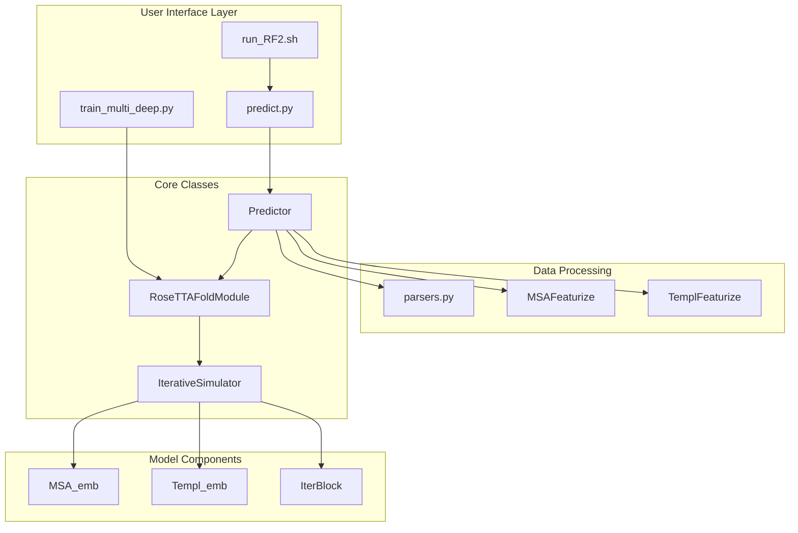
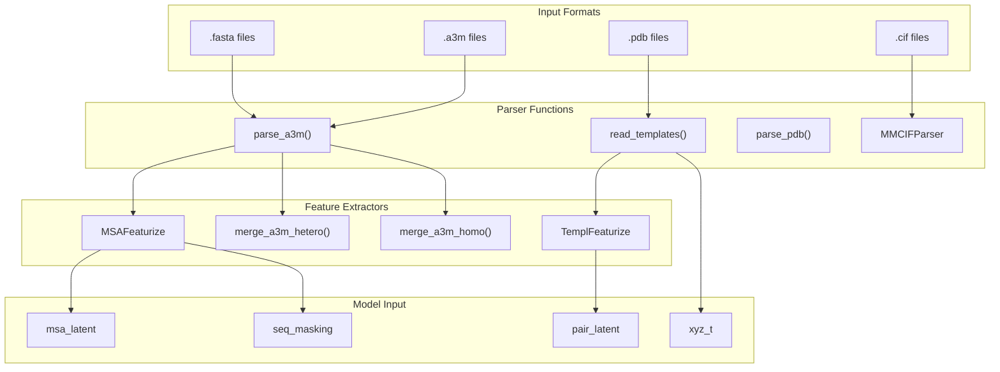
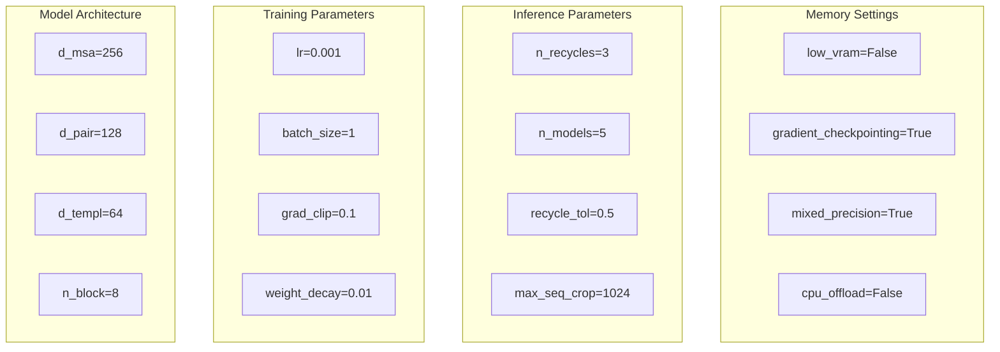
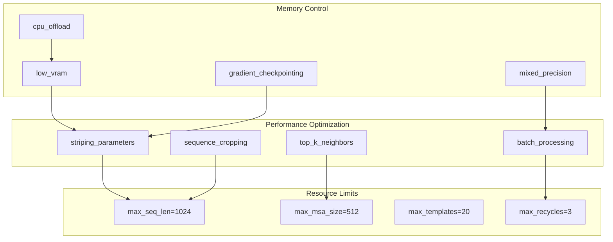

# Reference

> **Relevant source files**
> * [LICENSE](https://github.com/uw-ipd/RoseTTAFold2/blob/4b273b95/LICENSE)
> * [examples/rcsb_pdb_7ZLR.fasta](https://github.com/uw-ipd/RoseTTAFold2/blob/4b273b95/examples/rcsb_pdb_7ZLR.fasta)

This reference provides comprehensive documentation of RoseTTAFold2's interfaces, file formats, configuration parameters, and usage patterns. It serves as a technical reference for developers, researchers, and advanced users who need detailed information about the system's components and their interactions.

For installation and basic usage instructions, see [Getting Started](/uw-ipd/RoseTTAFold2/2-getting-started). For detailed architectural information, see [Core Architecture](/uw-ipd/RoseTTAFold2/3-core-architecture). For information about specific file format details and examples, see [File Formats and Examples](/uw-ipd/RoseTTAFold2/8.1-file-formats-and-examples). For complete command line documentation, see [Command Line Reference](/uw-ipd/RoseTTAFold2/8.2-command-line-reference). For licensing terms, see [License and Legal](/uw-ipd/RoseTTAFold2/8.3-license-and-legal).

## System Entry Points and Code Entities

The RoseTTAFold2 system provides multiple entry points for different use cases, each corresponding to specific code entities and execution paths.

### Main Entry Points



**Main Entry Points and Code Entities**

Sources: [run_RF2.sh](https://github.com/uw-ipd/RoseTTAFold2/blob/4b273b95/run_RF2.sh)

 [predict.py](https://github.com/uw-ipd/RoseTTAFold2/blob/4b273b95/predict.py)

 [train_multi_deep.py](https://github.com/uw-ipd/RoseTTAFold2/blob/4b273b95/train_multi_deep.py)

## Data Flow and File Format Handlers

The system processes various input formats through specialized parsers and handlers, each designed for specific data types and use cases.

### File Format Processing Pipeline



**File Format Processing and Code Entities**

Sources: [parsers.py](https://github.com/uw-ipd/RoseTTAFold2/blob/4b273b95/parsers.py)

 [MSAFeaturize](https://github.com/uw-ipd/RoseTTAFold2/blob/4b273b95/MSAFeaturize)

 [TemplFeaturize](https://github.com/uw-ipd/RoseTTAFold2/blob/4b273b95/TemplFeaturize)

## Key Configuration Parameters

The system's behavior is controlled by numerous configuration parameters that affect model performance, memory usage, and output quality.

### Configuration Parameter Categories

| Parameter Category | Key Parameters | Code Location | Description |
| --- | --- | --- | --- |
| **Model Selection** | `model_name`, `n_models` | `predict.py` | Controls which models to use and ensemble size |
| **Recycling** | `n_recycles`, `recycle_early_stop_tolerance` | `RoseTTAFoldModule` | Iterative refinement parameters |
| **Memory Management** | `low_vram`, `gradient_checkpointing` | `IterativeSimulator` | Memory optimization settings |
| **MSA Processing** | `max_msa_clusters`, `max_extra_msa` | `MSAFeaturize` | MSA size and processing limits |
| **Template Processing** | `max_templates`, `template_conf_threshold` | `TemplFeaturize` | Template selection and filtering |
| **Structure Output** | `output_dir`, `save_npz`, `save_pdb` | `Predictor` | Output format and location controls |

### Model Configuration Parameters



**Configuration Parameter Organization**

Sources: [RoseTTAFoldModule](https://github.com/uw-ipd/RoseTTAFold2/blob/4b273b95/RoseTTAFoldModule)

 [IterativeSimulator](https://github.com/uw-ipd/RoseTTAFold2/blob/4b273b95/IterativeSimulator)

 [Predictor](https://github.com/uw-ipd/RoseTTAFold2/blob/4b273b95/Predictor)

## Input File Specifications

RoseTTAFold2 accepts multiple input file formats, each with specific requirements and formatting constraints.

### FASTA Format Requirements

The system accepts standard FASTA format files with specific header requirements for multi-chain proteins:

```
>chain_id|Chain X|protein_name|organism
SEQUENCE_DATA
```

**Example Multi-Chain Format:**

```
>7ZLR_1|Chain A|Suppressor of cytokine signaling 2|Homo sapiens (9606)
SMQAARLAKALRELGQTGWYWGSMTVNEAKEKLKEAPEGTFLIRDSSHSDYLLTISVKTSAGPTNLRIEYQDGKFRLDSIICVKSKLKQFDSVVHLIDYYVQMCKDKRTGPEAPRNGTVHLYLTKPLYTSAPSLQHLCRLTINKCTGAIWGLPLPTRLKDYLEEYKFQV
>7ZLR_2|Chain B|Elongin-B|Homo sapiens (9606)
MDVFLMIRRHKTTIFTDAKESSTVFELKRIVEGILKRPPDEQRLYKDDQLLDDGKTLGECGFTSQTARPQAPATVGLAFRADDTFEALCIEPFSSPPELPDVMKPQDSGSSANEQAVQ
```

### MSA Format (A3M) Requirements

Multiple Sequence Alignments must be provided in A3M format with specific formatting:

* Header line starts with `>`
* Gap characters: `-` for gaps, `.` for insertions
* Lowercase letters indicate insertions relative to query sequence
* First sequence must be the query sequence

### Template Format Requirements

Structure templates are processed from PDB files with specific requirements:

* Standard PDB format with ATOM records
* Chain identifiers must match FASTA headers
* Coordinate quality checks are performed
* Template confidence scores are calculated

Sources: [examples/rcsb_pdb_7ZLR.fasta L1-L7](https://github.com/uw-ipd/RoseTTAFold2/blob/4b273b95/examples/rcsb_pdb_7ZLR.fasta#L1-L7)

 [parsers.py](https://github.com/uw-ipd/RoseTTAFold2/blob/4b273b95/parsers.py)

## Output File Formats

The system generates multiple output formats providing different levels of detail and usage scenarios.

### Output Format Specifications

| Format | Extension | Content | Primary Use |
| --- | --- | --- | --- |
| **Structure** | `.pdb` | 3D coordinates, confidence scores | Visualization, analysis |
| **Numerical** | `.npz` | Raw model outputs, arrays | Further analysis, research |
| **Metadata** | `.json` | Prediction metadata, parameters | Reproducibility, tracking |
| **Scores** | `.out` | Per-residue confidence scores | Quality assessment |

### PDB Output Format

The generated PDB files include:

* Standard ATOM records with predicted coordinates
* B-factor column contains confidence scores (pLDDT)
* REMARK records with prediction metadata
* Multi-chain support with proper chain identifiers

### NPZ Output Format

NumPy archive files contain:

* `coord`: Predicted coordinates [N, 3]
* `confidence`: Per-residue confidence scores
* `pair_confidence`: Pairwise confidence matrix
* `distogram`: Distance distribution predictions

Sources: [Predictor](https://github.com/uw-ipd/RoseTTAFold2/blob/4b273b95/Predictor)

 [predict.py](https://github.com/uw-ipd/RoseTTAFold2/blob/4b273b95/predict.py)

## Memory and Performance Parameters

The system includes extensive memory management and performance optimization parameters to handle large protein structures efficiently.

### Memory Management Settings



**Memory and Performance Parameter Relationships**

### Resource Limit Guidelines

| Resource | Limit | Parameter | Impact |
| --- | --- | --- | --- |
| **Sequence Length** | 1024 residues | `max_seq_len` | Memory usage, processing time |
| **MSA Size** | 512 sequences | `max_msa_clusters` | MSA processing complexity |
| **Templates** | 20 structures | `max_templates` | Template processing time |
| **Recycles** | 3 iterations | `n_recycles` | Refinement quality vs speed |

Sources: [IterativeSimulator](https://github.com/uw-ipd/RoseTTAFold2/blob/4b273b95/IterativeSimulator)

 [MSAFeaturize](https://github.com/uw-ipd/RoseTTAFold2/blob/4b273b95/MSAFeaturize)

 [TemplFeaturize](https://github.com/uw-ipd/RoseTTAFold2/blob/4b273b95/TemplFeaturize)

## Error Handling and Debugging

The system provides comprehensive error handling and debugging capabilities for troubleshooting prediction issues.

### Common Error Categories

| Error Type | Typical Cause | Resolution |
| --- | --- | --- |
| **Memory Errors** | Insufficient GPU memory | Enable `low_vram` mode |
| **Input Format** | Malformed FASTA/A3M files | Check file format specifications |
| **Model Loading** | Missing model weights | Verify model file paths |
| **Template Processing** | Invalid PDB structure | Check template file quality |

### Debugging Parameters

* `verbose`: Enable detailed logging output
* `debug_mode`: Additional validation checks
* `save_intermediates`: Save intermediate processing results
* `memory_profiling`: Track memory usage patterns

Sources: [Predictor](https://github.com/uw-ipd/RoseTTAFold2/blob/4b273b95/Predictor)

 [predict.py](https://github.com/uw-ipd/RoseTTAFold2/blob/4b273b95/predict.py)

## Legal and Licensing Information

RoseTTAFold2 is released under the MIT License, providing broad permissions for use, modification, and distribution.

### License Summary

The software is provided under the MIT License with the following key provisions:

* **Copyright**: 2023 Institute for Protein Design
* **Permissions**: Use, modify, distribute, sublicense, and sell
* **Conditions**: Include copyright notice and license in copies
* **Warranty**: Provided "as is" without warranty of any kind

### Full License Text

```
MIT License

Copyright (c) 2023 Institute for Protein Design

Permission is hereby granted, free of charge, to any person obtaining a copy
of this software and associated documentation files (the "Software"), to deal
in the Software without restriction, including without limitation the rights
to use, copy, modify, merge, publish, distribute, sublicense, and/or sell
copies of the Software, and to permit persons to whom the Software is
furnished to do so, subject to the following conditions:

The above copyright notice and this permission notice shall be included in all
copies or substantial portions of the Software.

THE SOFTWARE IS PROVIDED "AS IS", WITHOUT WARRANTY OF ANY KIND, EXPRESS OR
IMPLIED, INCLUDING BUT NOT LIMITED TO THE WARRANTIES OF MERCHANTABILITY,
FITNESS FOR A PARTICULAR PURPOSE AND NONINFRINGEMENT. IN NO EVENT SHALL THE
AUTHORS OR COPYRIGHT HOLDERS BE LIABLE FOR ANY CLAIM, DAMAGES OR OTHER
LIABILITY, WHETHER IN AN ACTION OF CONTRACT, TORT OR OTHERWISE, ARISING FROM,
OUT OF OR IN CONNECTION WITH THE SOFTWARE OR THE USE OR OTHER DEALINGS IN THE
SOFTWARE.
```

### Usage Guidelines

When using RoseTTAFold2 in research or commercial applications:

1. Include the copyright notice and license terms
2. Acknowledge the Institute for Protein Design
3. Cite appropriate publications when publishing results
4. Follow any additional attribution requirements

Sources: [LICENSE L1-L22](https://github.com/uw-ipd/RoseTTAFold2/blob/4b273b95/LICENSE#L1-L22)