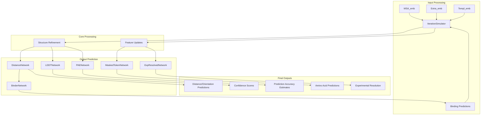
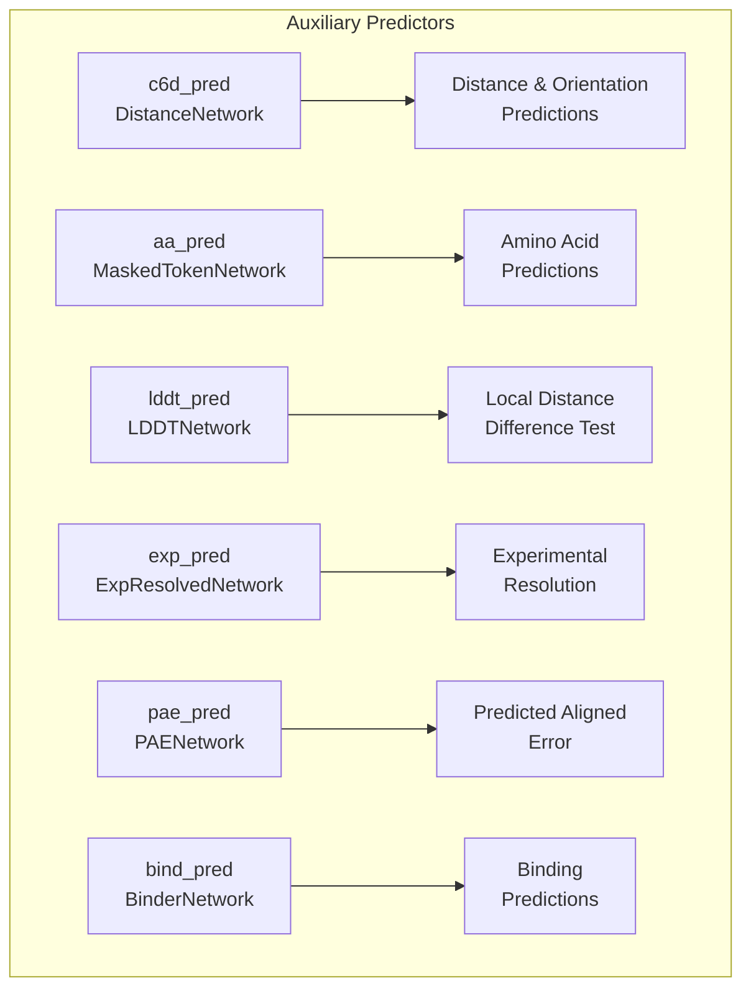
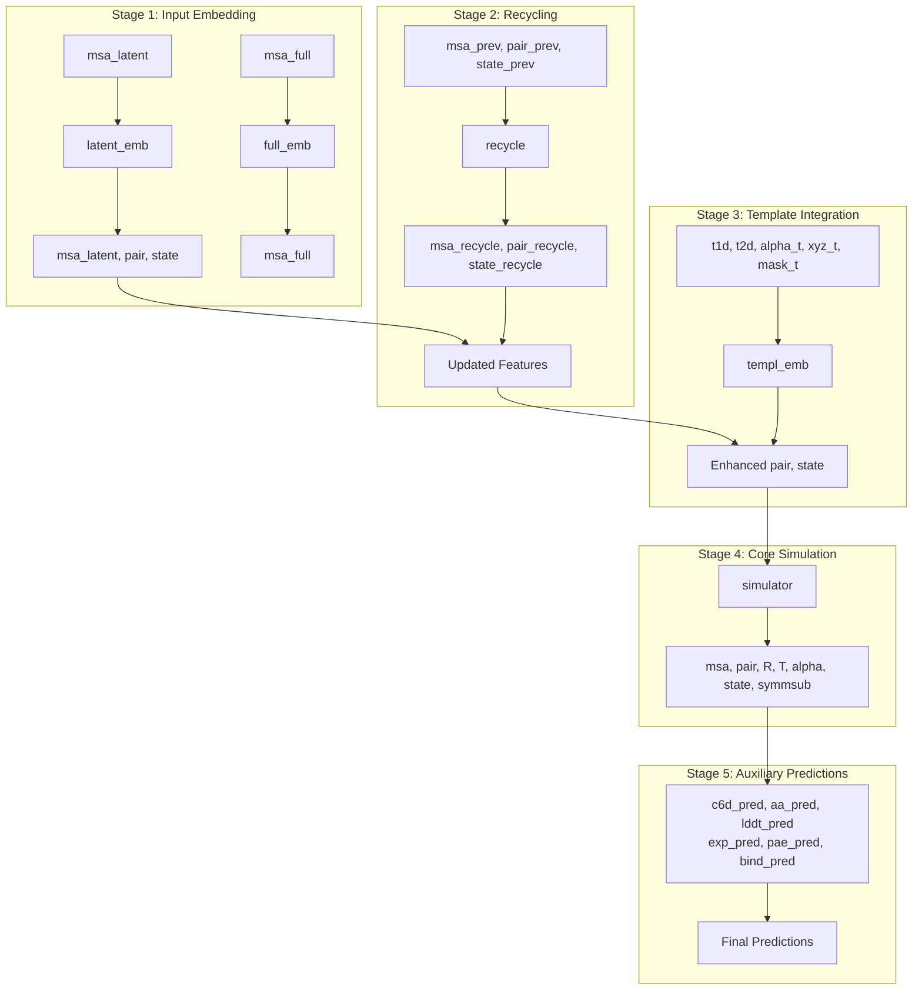

# RoseTTAFold Model

> **Relevant source files**
> * [network/RoseTTAFoldModel.py](https://github.com/uw-ipd/RoseTTAFold2/blob/4b273b95/network/RoseTTAFoldModel.py)

## Purpose and Scope

The RoseTTAFold Model is the core neural network component of the RoseTTAFold2 system, implemented in the `RoseTTAFoldModule` class. This module orchestrates the entire protein structure prediction process, from input feature processing through iterative structural refinement to final auxiliary predictions. For information about the iterative refinement process, see [Iterative Simulator](/uw-ipd/RoseTTAFold2/3.2-iterative-simulator). For details about the embedding systems, see [Embedding Modules](/uw-ipd/RoseTTAFold2/3.3-embedding-modules).

## Architecture Overview

The `RoseTTAFoldModule` serves as the primary neural network architecture that integrates multiple specialized components into a unified prediction system. The model follows a multi-stage processing pipeline that handles sequence, structural, and evolutionary information.

### High-Level Component Structure

*Sources: [network/RoseTTAFoldModel.py L11-L149](https://github.com/uw-ipd/RoseTTAFold2/blob/4b273b95/network/RoseTTAFoldModel.py#L11-L149)*

## Key Components

### Main Architecture Class

The `RoseTTAFoldModule` class inherits from `nn.Module` and serves as the primary entry point for the neural network. It coordinates all subcomponents and manages the forward pass through the entire prediction pipeline.

| Component | Type | Purpose |
| --- | --- | --- |
| `latent_emb` | `MSA_emb` | Processes latent MSA representations |
| `full_emb` | `Extra_emb` | Handles full MSA sequences |
| `templ_emb` | `Templ_emb` | Integrates template structural information |
| `recycle` | `Recycling` | Incorporates previous prediction cycles |
| `simulator` | `IterativeSimulator` | Core iterative refinement engine |

*Sources: [network/RoseTTAFoldModel.py L23-L41](https://github.com/uw-ipd/RoseTTAFold2/blob/4b273b95/network/RoseTTAFoldModel.py#L23-L41)*

### Auxiliary Prediction Networks

The model includes specialized prediction heads for various auxiliary tasks:

*Sources: [network/RoseTTAFoldModel.py L43-L49](https://github.com/uw-ipd/RoseTTAFold2/blob/4b273b95/network/RoseTTAFoldModel.py#L43-L49)*

## Configuration Parameters

The `RoseTTAFoldModule` constructor accepts extensive configuration parameters that control model architecture and behavior:

### Block Configuration

* `n_extra_block`: Number of extra processing blocks (default: 4)
* `n_main_block`: Number of main processing blocks (default: 8)
* `n_ref_block`: Number of refinement blocks (default: 4)

### Dimension Configuration

* `d_msa`: MSA embedding dimension (default: 256)
* `d_msa_full`: Full MSA embedding dimension (default: 64)
* `d_pair`: Pair representation dimension (default: 128)
* `d_templ`: Template embedding dimension (default: 64)
* `d_hidden`: Hidden dimension for processing (default: 32)
* `d_hidden_templ`: Hidden dimension for template processing (default: 64)

### Attention Configuration

* `n_head_msa`: Number of attention heads for MSA (default: 8)
* `n_head_pair`: Number of attention heads for pairs (default: 4)
* `n_head_templ`: Number of attention heads for templates (default: 4)

### SE3 Transformer Parameters

* `SE3_param_full`: Configuration for full SE3 transformer
* `SE3_param_topk`: Configuration for top-k SE3 transformer

*Sources: [network/RoseTTAFoldModel.py L12-L19](https://github.com/uw-ipd/RoseTTAFold2/blob/4b273b95/network/RoseTTAFoldModel.py#L12-L19)*

## Forward Pass Flow

The forward method orchestrates the complete prediction pipeline through several distinct stages:

### Processing Pipeline

*Sources: [network/RoseTTAFoldModel.py L52-L148](https://github.com/uw-ipd/RoseTTAFold2/blob/4b273b95/network/RoseTTAFoldModel.py#L52-L148)*

### Key Processing Steps

1. **Input Embedding** ([line 71-78](https://github.com/uw-ipd/RoseTTAFold2/blob/4b273b95/line 71-78) ): Processes MSA latent and full representations
2. **Recycling Integration** ([line 92-98](https://github.com/uw-ipd/RoseTTAFold2/blob/4b273b95/line 92-98) ): Incorporates previous prediction cycle results
3. **Template Embedding** ([line 106-109](https://github.com/uw-ipd/RoseTTAFold2/blob/4b273b95/line 106-109) ): Integrates structural template information
4. **Iterative Simulation** ([line 115-120](https://github.com/uw-ipd/RoseTTAFold2/blob/4b273b95/line 115-120) ): Core structural refinement process
5. **Auxiliary Predictions** ([line 128-143](https://github.com/uw-ipd/RoseTTAFold2/blob/4b273b95/line 128-143) ): Generates various prediction outputs

### Memory Management Features

The forward pass includes several memory optimization strategies:

* **Tensor Cleanup**: Explicit deletion of unused tensors ([line 101-102](https://github.com/uw-ipd/RoseTTAFold2/blob/4b273b95/line 101-102)  [line 112](https://github.com/uw-ipd/RoseTTAFold2/blob/4b273b95/line 112) )
* **Checkpoint Support**: Optional gradient checkpointing via `use_checkpoint` parameter
* **Low VRAM Mode**: Memory-efficient processing via `low_vram` parameter
* **Striping Support**: Memory-efficient sequence processing via `striping` parameter

*Sources: [network/RoseTTAFoldModel.py L101-L102](https://github.com/uw-ipd/RoseTTAFold2/blob/4b273b95/network/RoseTTAFoldModel.py#L101-L102)*

## Input and Output Specifications

### Forward Method Inputs

The forward method accepts a comprehensive set of inputs for flexible prediction scenarios:

| Parameter | Type | Description |
| --- | --- | --- |
| `msa_latent` | Tensor | Latent MSA representations |
| `msa_full` | Tensor | Full MSA sequences |
| `seq` | Tensor | Primary sequence information |
| `xyz` | Tensor | Initial 3D coordinates |
| `t1d`, `t2d` | Tensor | Template 1D and 2D features |
| `xyz_t`, `alpha_t` | Tensor | Template coordinates and angles |
| `msa_prev`, `pair_prev`, `state_prev` | Tensor | Previous cycle states |
| `symmids`, `symmsub`, `symmRs`, `symmmeta` | Tensor | Symmetry information |

### Forward Method Outputs

The method returns multiple prediction outputs:

| Output | Description |
| --- | --- |
| `logits` | Distance and orientation predictions |
| `logits_aa` | Amino acid predictions |
| `logits_exp` | Experimental resolution predictions |
| `logits_pae` | Predicted aligned error |
| `p_bind` | Binding predictions |
| `xyz` | Predicted 3D coordinates |
| `alpha` | Predicted angles |
| `lddt` | Local distance difference test scores |

*Sources: [network/RoseTTAFoldModel.py L52-L148](https://github.com/uw-ipd/RoseTTAFold2/blob/4b273b95/network/RoseTTAFoldModel.py#L52-L148)*

## Symmetry and Complex Handling

The model includes sophisticated support for symmetric protein complexes and multi-chain structures:

* **Symmetry Detection**: Automatic handling of C1 symmetry as default ([line 59-61](https://github.com/uw-ipd/RoseTTAFold2/blob/4b273b95/line 59-61) )
* **Oligomer Processing**: Support for multi-subunit complexes via `oligo` parameter
* **Symmetry Metadata**: Integration of symmetry transformations and metadata

*Sources: [network/RoseTTAFoldModel.py L59-L61](https://github.com/uw-ipd/RoseTTAFold2/blob/4b273b95/network/RoseTTAFoldModel.py#L59-L61)*