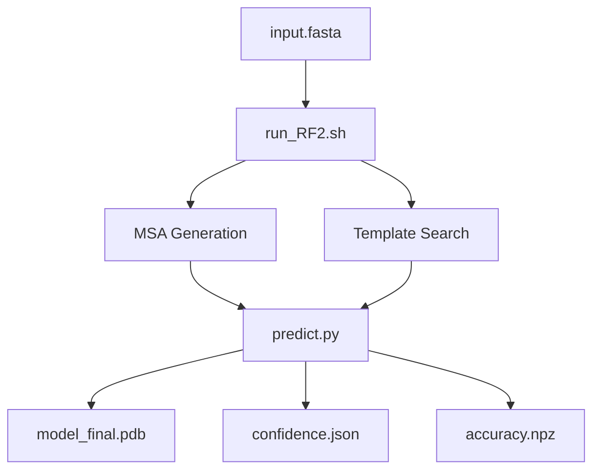
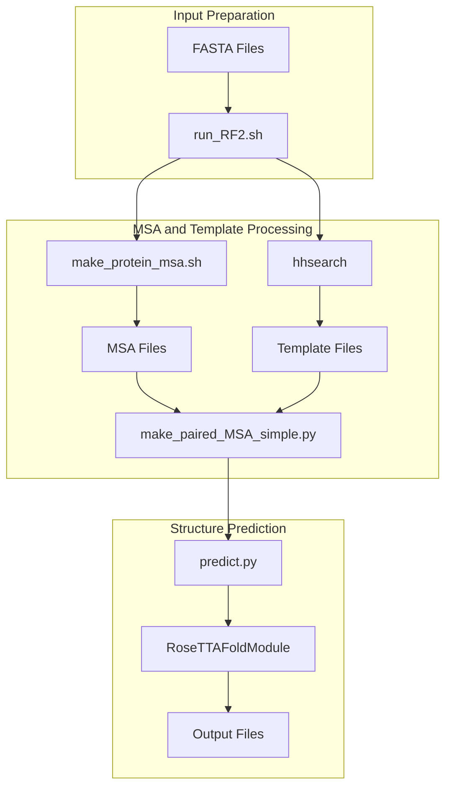
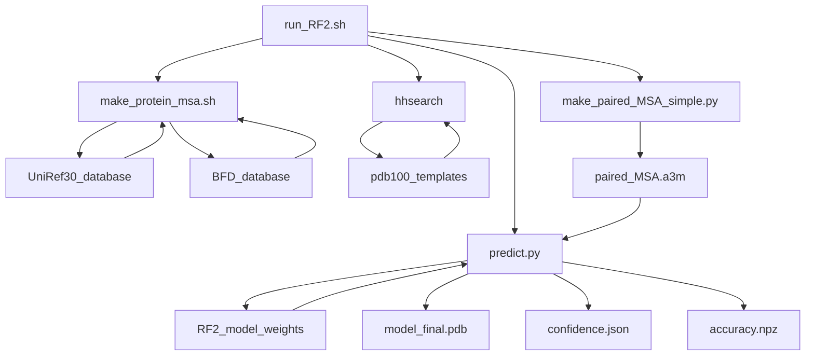

# Getting Started

# Getting Started

> **Relevant source files**
> - [README\.md](https://github.com/uw-ipd/RoseTTAFold2/blob/4b273b95/README.md?plain=1)
> - [RF2\-linux\.yml](https://github.com/uw-ipd/RoseTTAFold2/blob/4b273b95/RF2-linux.yml)
> - [examples/rcsb\_pdb\_7YTB\.fasta](https://github.com/uw-ipd/RoseTTAFold2/blob/4b273b95/examples/rcsb_pdb_7YTB.fasta)
> - [input\_prep/make\_paired\_MSA\_simple\.py](https://github.com/uw-ipd/RoseTTAFold2/blob/4b273b95/input_prep/make_paired_MSA_simple.py)
> - [run\_RF2\.sh](https://github.com/uw-ipd/RoseTTAFold2/blob/4b273b95/run_RF2.sh)

 This document provides an overview of RoseTTAFold2 installation, setup, and basic usage for new users\. It covers the essential steps to get the system running and explains the high\-level workflow from input preparation to structure prediction\.

 For detailed installation instructions, see [Installation and Setup](https://deepwiki.com/uw-ipd/RoseTTAFold2/2.1-installation-and-setup)\. For comprehensive usage examples and command\-line options, see [Basic Usage](https://deepwiki.com/uw-ipd/RoseTTAFold2/2.2-basic-usage)\. For information about the neural network architecture and training, see [Core Architecture](https://deepwiki.com/uw-ipd/RoseTTAFold2/3-core-architecture) and [Training System](https://deepwiki.com/uw-ipd/RoseTTAFold2/5-training-system)\.

## System Overview

 RoseTTAFold2 is a protein structure prediction system that takes FASTA sequence files as input and produces predicted 3D structures in PDB format\. The system integrates multiple sequence alignment \(MSA\) generation, template searching, and deep learning\-based structure prediction into a unified pipeline\.

 The main user interface is the `run_RF2.sh` script, which orchestrates the entire prediction workflow:

 **User Workflow Overview** Sources: [README\.md?plain=1 L1-L107](https://github.com/uw-ipd/RoseTTAFold2/blob/4b273b95/README.md?plain=1#L1-L107) [run\_RF2\.sh L1-L159](https://github.com/uw-ipd/RoseTTAFold2/blob/4b273b95/run_RF2.sh#L1-L159)

## Prerequisites

 Before using RoseTTAFold2, you need:

| Component | Purpose | Size |
| --- | --- | --- |
| Conda Environment | Python dependencies and tools | ~5GB |
| SE3Transformer | Geometric deep learning library | ~500MB |
| Neural Network Weights | Pre\-trained model parameters | ~2GB |
| UniRef30 Database | Sequence database for MSA generation | ~46GB |
| BFD Database | Large sequence database | ~272GB |
| PDB100 Templates | Structure templates | ~5GB |

 The system requires significant computational resources, particularly GPU memory for inference on large protein complexes\.

 Sources: [README\.md?plain=1 L13-L58](https://github.com/uw-ipd/RoseTTAFold2/blob/4b273b95/README.md?plain=1#L13-L58) [RF2\-linux\.yml L1-L20](https://github.com/uw-ipd/RoseTTAFold2/blob/4b273b95/RF2-linux.yml#L1-L20)

## Quick Start Workflow

 The typical RoseTTAFold2 workflow involves three main stages:

 **Main Pipeline Components** Sources: [run\_RF2\.sh L27-L52](https://github.com/uw-ipd/RoseTTAFold2/blob/4b273b95/run_RF2.sh#L27-L52) [run\_RF2\.sh L145-L157](https://github.com/uw-ipd/RoseTTAFold2/blob/4b273b95/run_RF2.sh#L145-L157)

### Key Scripts and Their Roles

 The system uses several key scripts that work together:

 **Script Dependencies and Data Flow** Sources: [run\_RF2\.sh L36-L49](https://github.com/uw-ipd/RoseTTAFold2/blob/4b273b95/run_RF2.sh#L36-L49) [run\_RF2\.sh L140-L142](https://github.com/uw-ipd/RoseTTAFold2/blob/4b273b95/run_RF2.sh#L140-L142) [run\_RF2\.sh L151-L156](https://github.com/uw-ipd/RoseTTAFold2/blob/4b273b95/run_RF2.sh#L151-L156)

## Installation Overview

 Installation involves four main steps:

 1. **Repository Setup**: Clone the RoseTTAFold2 repository
2. **Environment Creation**: Create conda environment using `RF2-linux.yml`
3. **SE3Transformer Installation**: Install the geometric deep learning library
4. **Database Downloads**: Download sequence databases and model weights

 The conda environment includes essential dependencies:

 - PyTorch with CUDA support
- Deep Graph Library \(DGL\)
- HHsuite for sequence alignment
- Various scientific Python packages

 Sources: [README\.md?plain=1 L15-L33](https://github.com/uw-ipd/RoseTTAFold2/blob/4b273b95/README.md?plain=1#L15-L33) [RF2\-linux\.yml L1-L20](https://github.com/uw-ipd/RoseTTAFold2/blob/4b273b95/RF2-linux.yml#L1-L20)

## Basic Usage Overview

 The primary interface is the `run_RF2.sh` script, which accepts various command\-line options:

| Option | Purpose | Example |
| --- | --- | --- |
| \-o/\-\-outdir | Output directory | \-o results/ |
| \-s/\-\-symm | Symmetry group | \-s C6 |
| \-p/\-\-pair | Paired MSA mode | \-\-pair |
| \-h/\-\-hhpred | Template search | \-\-hhpred |

 The script supports multiple prediction scenarios:

 - Single protein monomers
- Multi\-chain complexes with paired MSAs
- Symmetric assemblies \(Cn, Dn, T, I, O\)
- Template\-based predictions

 Sources: [README\.md?plain=1 L67-L106](https://github.com/uw-ipd/RoseTTAFold2/blob/4b273b95/README.md?plain=1#L67-L106) [run\_RF2\.sh L60-L99](https://github.com/uw-ipd/RoseTTAFold2/blob/4b273b95/run_RF2.sh#L60-L99)

## Input and Output Files

### Input Files

 - **FASTA sequences**: Protein sequences in standard FASTA format
- **MSA files**: Generated automatically from sequence databases
- **Template files**: Optional structural templates from PDB

### Output Files

 - **model\_final\.pdb**: Predicted 3D structure with confidence scores in B\-factors
- **confidence\.json**: Detailed confidence metrics and accuracy estimates
- **accuracy\.npz**: Numerical arrays with prediction confidence data

 The system automatically creates the necessary intermediate files in the specified output directory\.

 Sources: [README\.md?plain=1 L92-L94](https://github.com/uw-ipd/RoseTTAFold2/blob/4b273b95/README.md?plain=1#L92-L94) [run\_RF2\.sh L149-L156](https://github.com/uw-ipd/RoseTTAFold2/blob/4b273b95/run_RF2.sh#L149-L156)

## Example Usage Scenarios

 RoseTTAFold2 supports several common prediction scenarios:

 1. **Monomer Prediction**: Single protein chain structure prediction
2. **Complex Prediction**: Multi\-chain protein complexes with paired MSAs
3. **Symmetric Assembly**: Proteins with cyclic or other symmetries
4. **Template\-Based**: Using known structural templates for improved accuracy

 Each scenario uses the same basic workflow but with different command\-line options and input preparation strategies\.

 Sources: [README\.md?plain=1 L67-L90](https://github.com/uw-ipd/RoseTTAFold2/blob/4b273b95/README.md?plain=1#L67-L90) [rcsb\_pdb\_7YTB\.fasta L1-L3](https://github.com/uw-ipd/RoseTTAFold2/blob/4b273b95/examples/rcsb_pdb_7YTB.fasta#L1-L3)

## Memory and Performance Considerations

 RoseTTAFold2 requires substantial computational resources:

 - **GPU Memory**: 8GB\+ recommended for typical proteins
- **System Memory**: 64GB\+ for large complexes
- **Storage**: 300GB\+ for complete database installation
- **CPU**: Multi\-core processor for MSA generation

 The system includes memory optimization features and can be configured for different hardware setups\.

 Sources: [run\_RF2\.sh L19-L20](https://github.com/uw-ipd/RoseTTAFold2/blob/4b273b95/run_RF2.sh#L19-L20)

## Next Steps

 For detailed setup instructions, proceed to [Installation and Setup](https://deepwiki.com/uw-ipd/RoseTTAFold2/2.1-installation-and-setup)\. For comprehensive usage examples and advanced options, see [Basic Usage](https://deepwiki.com/uw-ipd/RoseTTAFold2/2.2-basic-usage)\. To understand the underlying neural network architecture, refer to [Core Architecture](https://deepwiki.com/uw-ipd/RoseTTAFold2/3-core-architecture)\.

---
*Source: [https://deepwiki.com/uw-ipd/RoseTTAFold2/2-getting-started](https://deepwiki.com/uw-ipd/RoseTTAFold2/2-getting-started) on DeepWiki*