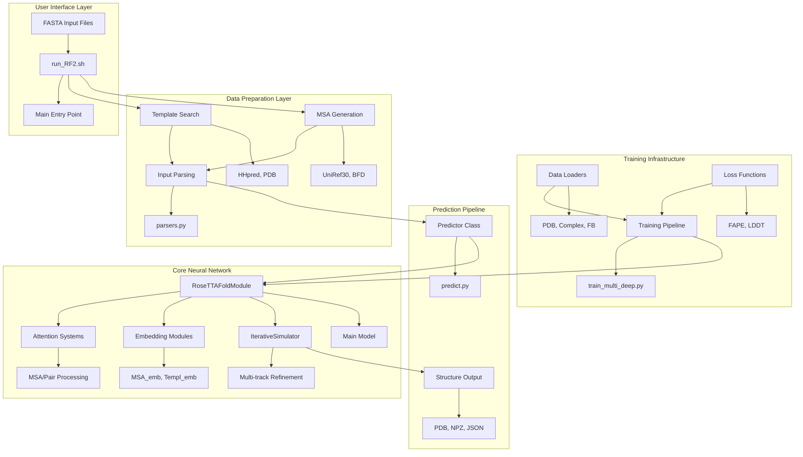
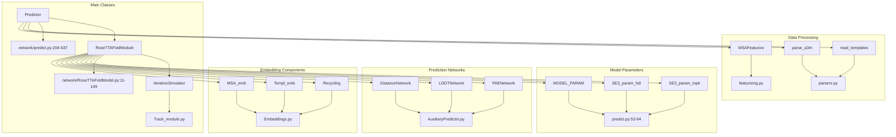
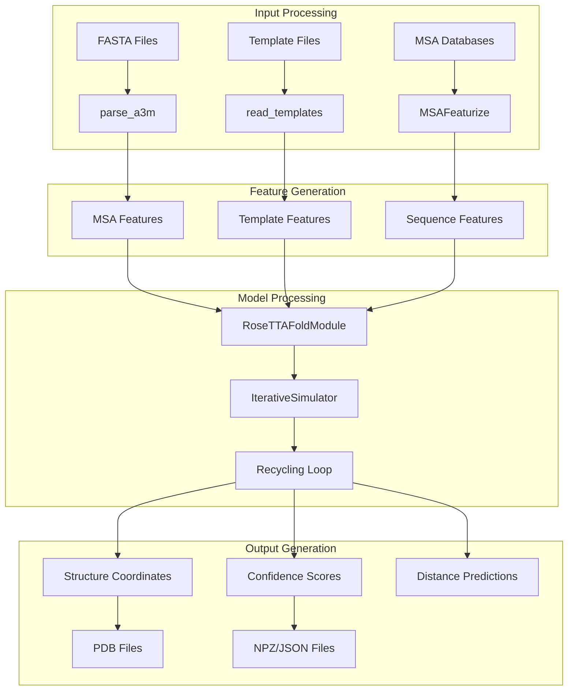

# Overview

# Overview

> **Relevant source files**
> - [README\.md](https://github.com/uw-ipd/RoseTTAFold2/blob/4b273b95/README.md?plain=1)
> - [RF2\-linux\.yml](https://github.com/uw-ipd/RoseTTAFold2/blob/4b273b95/RF2-linux.yml)
> - [network/RoseTTAFoldModel\.py](https://github.com/uw-ipd/RoseTTAFold2/blob/4b273b95/network/RoseTTAFoldModel.py)
> - [network/predict\.py](https://github.com/uw-ipd/RoseTTAFold2/blob/4b273b95/network/predict.py)

 This document provides a comprehensive overview of the RoseTTAFold2 system architecture, its core components, and how they work together to predict protein structures\. RoseTTAFold2 is a deep learning system that uses multiple sequence alignments \(MSAs\), structural templates, and iterative refinement to predict accurate 3D protein structures for both monomers and multi\-chain complexes\.

 For detailed information about installation and basic usage, see [Getting Started](https://deepwiki.com/uw-ipd/RoseTTAFold2/2-getting-started)\. For deep technical details about the neural network architecture, see [Core Architecture](https://deepwiki.com/uw-ipd/RoseTTAFold2/3-core-architecture)\. For information about the prediction workflow, see [Prediction Pipeline](https://deepwiki.com/uw-ipd/RoseTTAFold2/4-prediction-pipeline)\.

## System Architecture

 RoseTTAFold2 follows a modular architecture with clear separation between data preparation, neural network processing, and output generation\. The system supports both training new models and running inference on protein sequences\.

### High\-Level Architecture

 **Sources:** [predict\.py L1-L637](https://github.com/uw-ipd/RoseTTAFold2/blob/4b273b95/network/predict.py#L1-L637) [RoseTTAFoldModel\.py L1-L149](https://github.com/uw-ipd/RoseTTAFold2/blob/4b273b95/network/RoseTTAFoldModel.py#L1-L149) [README\.md?plain=1 L1-L107](https://github.com/uw-ipd/RoseTTAFold2/blob/4b273b95/README.md?plain=1#L1-L107)

## Core Components

 The system consists of several key components that work together to process protein sequences and predict their 3D structures:

### Component Architecture Map

 **Sources:** [predict\.py L204-L249](https://github.com/uw-ipd/RoseTTAFold2/blob/4b273b95/network/predict.py#L204-L249) [RoseTTAFoldModel\.py L11-L41](https://github.com/uw-ipd/RoseTTAFold2/blob/4b273b95/network/RoseTTAFoldModel.py#L11-L41) [predict\.py L53-L94](https://github.com/uw-ipd/RoseTTAFold2/blob/4b273b95/network/predict.py#L53-L94)

## Data Flow Pipeline

 The prediction process follows a well\-defined data flow from input sequences to final structure predictions:

### Processing Workflow

 **Sources:** [predict\.py L251-L438](https://github.com/uw-ipd/RoseTTAFold2/blob/4b273b95/network/predict.py#L251-L438) [predict\.py L496-L556](https://github.com/uw-ipd/RoseTTAFold2/blob/4b273b95/network/predict.py#L496-L556)

## Key Features

### Multi\-Chain Complex Support

 RoseTTAFold2 supports prediction of both monomers and multi\-chain complexes, including:

 - Heterodimers and higher\-order complexes
- Symmetric assemblies \(Cn, Dn, T, O, I symmetry groups\)
- Paired MSA processing for inter\-chain interactions

### Iterative Refinement

 The system uses an iterative refinement approach through the `IterativeSimulator` with:

 - Multiple recycling iterations \(default: 3\)
- Multi\-track processing \(MSA, pair, structure\)
- Progressive structure refinement

### Memory Optimization

 Several optimization strategies are implemented:

 - Low VRAM mode with CPU offloading
- Gradient checkpointing for memory efficiency
- Striping parameters for computational optimization
- Mixed precision training support

### Model Configuration

 The system defines comprehensive model parameters:

| Parameter | Default Value | Description |
| --- | --- | --- |
| n\_main\_block | 36 | Number of main transformer blocks |
| n\_extra\_block | 4 | Number of extra processing blocks |
| d\_msa | 256 | MSA embedding dimension |
| d\_pair | 128 | Pair embedding dimension |
| n\_head\_msa | 8 | MSA attention heads |
| n\_head\_pair | 4 | Pair attention heads |

 **Sources:** [predict\.py L53-L66](https://github.com/uw-ipd/RoseTTAFold2/blob/4b273b95/network/predict.py#L53-L66) [predict\.py L96-L136](https://github.com/uw-ipd/RoseTTAFold2/blob/4b273b95/network/predict.py#L96-L136)

## Training vs Inference

 RoseTTAFold2 supports both training and inference modes:

### Training Mode

 - Distributed training with multiple GPUs
- Multiple loss functions \(FAPE, LDDT, distance\)
- Data loading from PDB and other structural databases
- Model checkpointing and validation

### Inference Mode

 - Single model or ensemble predictions
- Confidence estimation \(pLDDT, PAE\)
- Support for various input formats
- Batch processing capabilities

 The `Predictor` class handles the inference pipeline, while separate training scripts manage model development\.

 **Sources:** [predict\.py L204-L637](https://github.com/uw-ipd/RoseTTAFold2/blob/4b273b95/network/predict.py#L204-L637) [RoseTTAFoldModel\.py L52-L148](https://github.com/uw-ipd/RoseTTAFold2/blob/4b273b95/network/RoseTTAFoldModel.py#L52-L148)

---
*Source: [https://deepwiki.com/uw-ipd/RoseTTAFold2/1-overview](https://deepwiki.com/uw-ipd/RoseTTAFold2/1-overview) on DeepWiki*