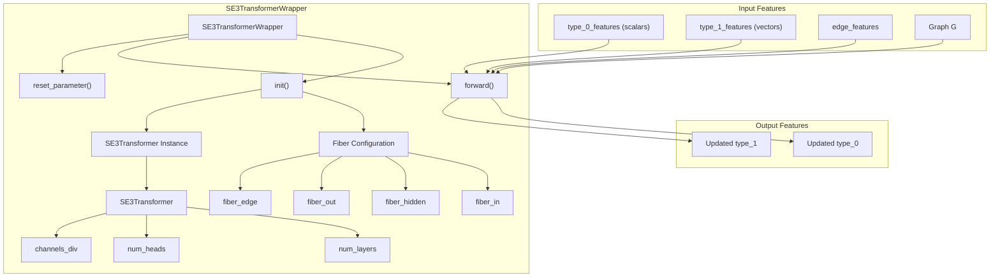
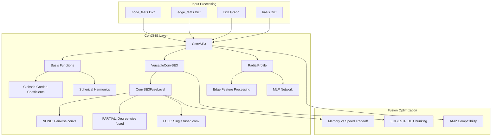
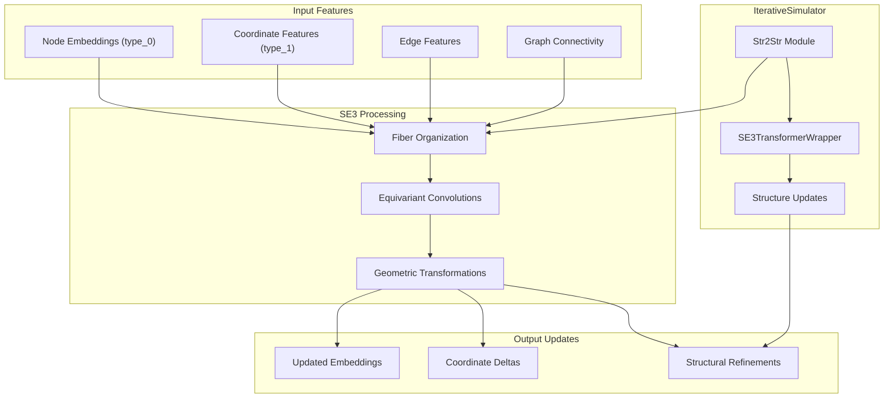
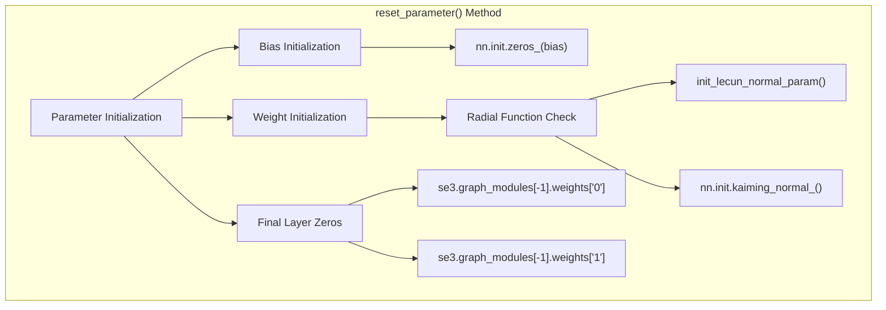
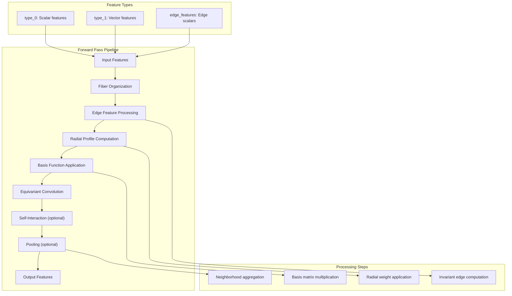

# SE3 Transformer

> **Relevant source files**
> * [SE3Transformer/se3_transformer/model/layers/convolution.py](https://github.com/uw-ipd/RoseTTAFold2/blob/4b273b95/SE3Transformer/se3_transformer/model/layers/convolution.py)
> * [network/SE3_network.py](https://github.com/uw-ipd/RoseTTAFold2/blob/4b273b95/network/SE3_network.py)

## Purpose and Scope

The SE3 Transformer is a core component of RoseTTAFold2 that handles SE(3)-equivariant geometric processing for 3D structural updates. This module ensures that the neural network maintains proper geometric invariances when processing protein structures, meaning that rotations and translations of the input structure produce correspondingly rotated and translated outputs.

This page covers the SE3 Transformer implementation in RoseTTAFold2, specifically the `SE3TransformerWrapper` class and underlying SE3 convolution layers. For information about the broader structural update pipeline, see [Iterative Simulator](/uw-ipd/RoseTTAFold2/3.2-iterative-simulator). For other attention mechanisms used in the model, see [Attention Mechanisms](/uw-ipd/RoseTTAFold2/3.4-attention-mechanisms).

## SE(3) Equivariance Overview

SE(3) equivariance is a mathematical property ensuring that geometric transformations (rotations and translations) applied to input coordinates produce equivalent transformations in the output. This is crucial for protein structure prediction because the predicted structure should be invariant to the coordinate system used to represent the input.

The SE3 Transformer achieves this through:

* **Fiber representations**: Features are organized by their transformation properties under rotations
* **Spherical harmonics**: Higher-order geometric information is encoded using spherical harmonic bases
* **Equivariant convolutions**: Graph convolutions that preserve SE(3) symmetries

## Architecture Components

### SE3TransformerWrapper

The main interface to the SE3 Transformer is provided by the `SE3TransformerWrapper` class, which adapts the generic SE3 Transformer for use in RoseTTAFold2's structure prediction pipeline.

**Sources:** network/SE3_network.py:12-86

### Fiber Representations

The SE3 Transformer uses fiber representations to organize features by their transformation properties:

| Fiber Type | Degree | Transformation Property | Usage in RoseTTAFold2 |
| --- | --- | --- | --- |
| `fiber_in` | 0, 1 | Input scalar/vector features | Node embeddings, coordinates |
| `fiber_hidden` | 0-3 | Internal geometric features | Intermediate representations |
| `fiber_out` | 0, 1 | Output scalar/vector features | Updated embeddings, coordinate updates |
| `fiber_edge` | 0 | Edge scalar features | Distance, bond information |

### SE3 Convolution Layers

The core computational unit is the `ConvSE3` layer, which performs SE(3)-equivariant graph convolutions:

**Sources:** SE3Transformer/se3_transformer/model/layers/convolution.py:199-396

## Integration in RoseTTAFold2

The SE3 Transformer is integrated into RoseTTAFold2's structure update pipeline through the `Str2Str` module in the `IterativeSimulator`:

**Sources:** network/SE3_network.py:78-86

## Implementation Details

### Parameter Initialization

The SE3 Transformer uses specialized initialization to ensure stable training:

**Sources:** network/SE3_network.py:57-76

### Memory Optimization

The SE3 convolution layers implement several memory optimization strategies:

| Optimization | Purpose | Implementation |
| --- | --- | --- |
| `EDGESTRIDE` | Reduce memory in inference | Process edges in chunks of 65536 |
| `ConvSE3FuseLevel` | Control fusion vs memory | FULL/PARTIAL/NONE fusion levels |
| `low_memory` | Gradient checkpointing | Enable/disable checkpointing |
| Mixed precision | Reduce memory footprint | `@torch.cuda.amp.autocast(enabled=False)` |

**Sources:** SE3Transformer/se3_transformer/model/layers/convolution.py:150-196

### Forward Pass Flow

The SE3 Transformer processes features through multiple stages:

**Sources:** network/SE3_network.py:78-86, SE3Transformer/se3_transformer/model/layers/convolution.py:316-396

## Usage in Structure Prediction

The SE3 Transformer enables RoseTTAFold2 to perform geometric reasoning about protein structures while maintaining proper equivariance properties. It processes:

* **Backbone coordinates**: CA, C, N atom positions as vector features
* **Residue embeddings**: Sequence and structural information as scalar features
* **Geometric relationships**: Inter-residue distances and orientations through edge features
* **Structural updates**: Coordinate refinements that respect 3D geometry

The equivariant design ensures that predictions are consistent regardless of the input coordinate frame, making the model robust to different structure representations and enabling accurate structure prediction across diverse protein families.

**Sources:** network/SE3_network.py:12-86, SE3Transformer/se3_transformer/model/layers/convolution.py:199-396