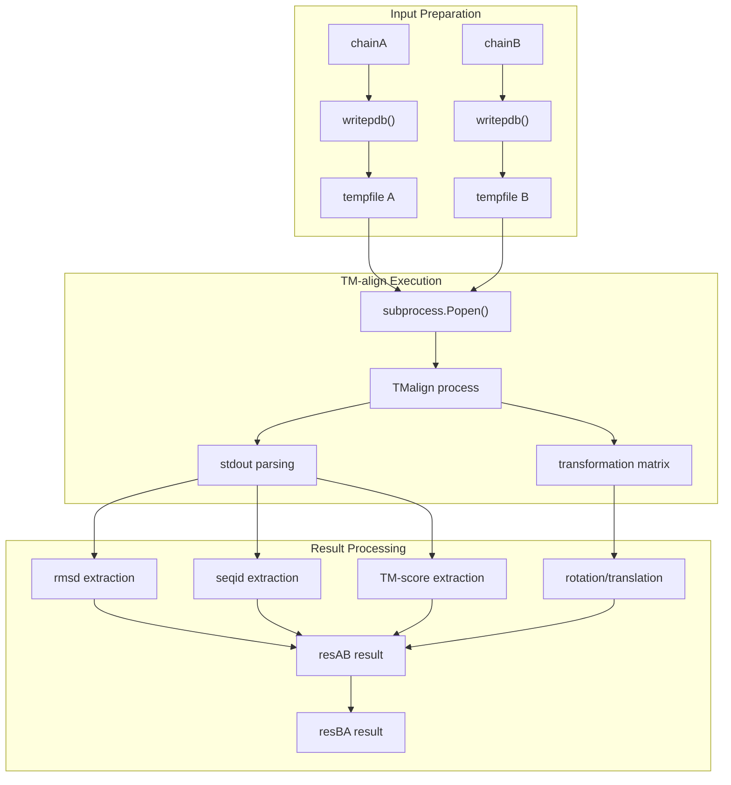
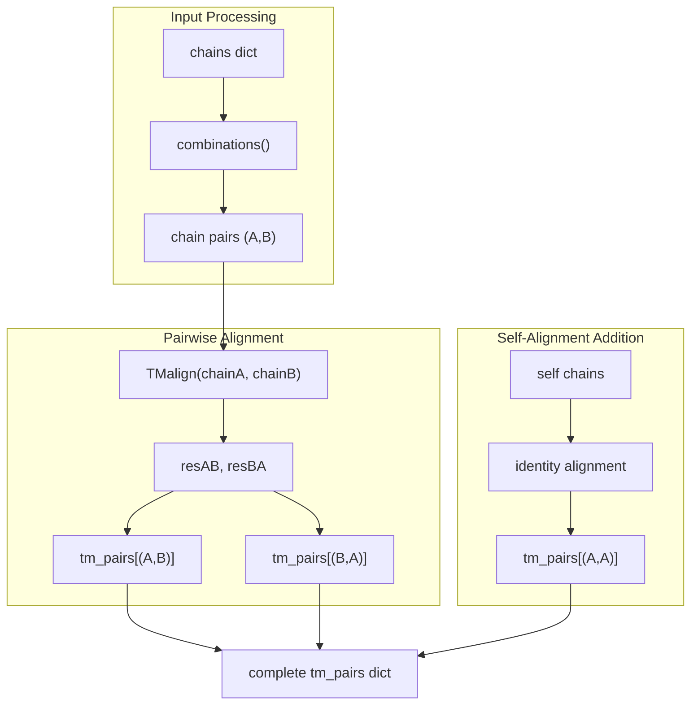
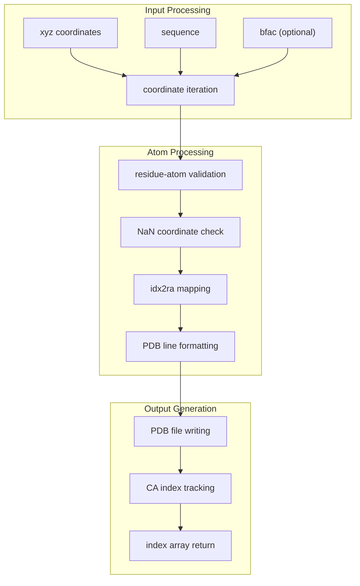
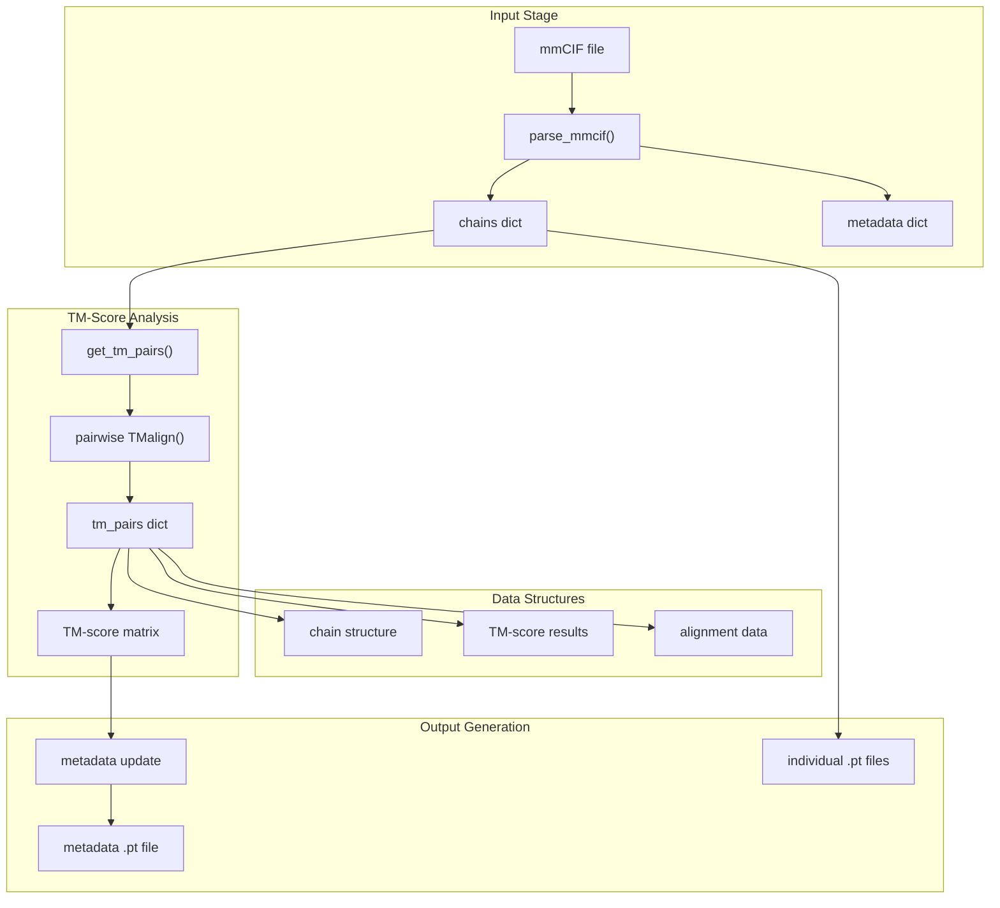

# Structure Analysis Tools

> **Relevant source files**
> * [input_prep/parse_cif.py](https://github.com/uw-ipd/RoseTTAFold2/blob/4b273b95/input_prep/parse_cif.py)

This page covers the structure analysis and comparison utilities in RoseTTAFold2, focusing on TM-align integration and structure comparison tools. These utilities enable quantitative comparison of protein structures through TM-score calculations and structural alignments.

For information about PDBx/mmCIF parsing, see [PDBx/mmCIF Processing](/uw-ipd/RoseTTAFold2/7.1-pdbxmmcif-processing).

## Overview

The structure analysis tools provide functionality for:

* Integration with TM-align for structural comparisons
* Calculation of pairwise TM-scores between protein chains
* PDB file generation for structure visualization
* Structural alignment and transformation analysis

## TM-align Integration

The system integrates with the TM-align structural alignment tool to perform quantitative structure comparisons.

### TM-align Configuration

The TM-align executable path is configured as a global constant:

```
TMALIGN = '/home/aivan/prog/TMalign'
```

### TMalign Function

The `TMalign()` function provides the core interface for running TM-align comparisons between two protein chains.



**TM-align Integration Workflow**

Sources: [input_prep/parse_cif.py L92-L152](https://github.com/uw-ipd/RoseTTAFold2/blob/4b273b95/input_prep/parse_cif.py#L92-L152)

The function performs the following steps:

1. **Temporary File Creation**: Creates temporary PDB files for both input chains
2. **Structure Writing**: Uses `writepdb()` to generate PDB format files
3. **TM-align Execution**: Runs TM-align as a subprocess with transformation output
4. **Result Parsing**: Extracts RMSD, sequence identity, TM-scores, and alignment data
5. **Transformation Processing**: Parses rotation and translation matrices

### Result Structure

The `TMalign()` function returns two dictionaries representing bidirectional alignments:

| Field | Description |
| --- | --- |
| `rmsd` | Root Mean Square Deviation |
| `seqid` | Sequence identity percentage |
| `tm` | TM-score for the alignment |
| `aln` | Alignment indices array |
| `t` | Translation vector |
| `u` | Rotation matrix |

Sources: [input_prep/parse_cif.py L149-L150](https://github.com/uw-ipd/RoseTTAFold2/blob/4b273b95/input_prep/parse_cif.py#L149-L150)

## Pairwise Structure Comparison

The `get_tm_pairs()` function computes TM-scores for all pairs of chains in a structure.



**Pairwise TM-Score Computation**

Sources: [input_prep/parse_cif.py L155-L173](https://github.com/uw-ipd/RoseTTAFold2/blob/4b273b95/input_prep/parse_cif.py#L155-L173)

### Self-Alignment Handling

For self-alignments, the system creates identity alignments with perfect scores:

```sql
tm_pairs.update({(A,A):{'rmsd':0.0, 'seqid':1.0, 'tm':1.0, 'aln':aln}})
```

Sources: [input_prep/parse_cif.py L167-L171](https://github.com/uw-ipd/RoseTTAFold2/blob/4b273b95/input_prep/parse_cif.py#L167-L171)

## PDB File Writing

The `writepdb()` function generates PDB format files from coordinate arrays and sequences.

### Amino Acid Mapping

The system maintains comprehensive amino acid and atom name mappings:

| Constant | Purpose |
| --- | --- |
| `RES_NAMES` | 20 standard amino acids (3-letter codes) |
| `RES_NAMES_1` | Single letter amino acid codes |
| `ATOM_NAMES` | Complete atom name definitions per residue |
| `idx2ra` | Index to residue-atom mapping |
| `aa2idx` | Amino acid-atom to index mapping |

Sources: [input_prep/parse_cif.py L16-L56](https://github.com/uw-ipd/RoseTTAFold2/blob/4b273b95/input_prep/parse_cif.py#L16-L56)

### PDB Writing Process



**PDB File Writing Workflow**

Sources: [input_prep/parse_cif.py L58-L89](https://github.com/uw-ipd/RoseTTAFold2/blob/4b273b95/input_prep/parse_cif.py#L58-L89)

## Structure Analysis Workflow

The complete structure analysis workflow integrates mmCIF parsing with TM-align comparisons.



**Complete Structure Analysis Pipeline**

Sources: [input_prep/parse_cif.py L444-L458](https://github.com/uw-ipd/RoseTTAFold2/blob/4b273b95/input_prep/parse_cif.py#L444-L458)

## Integration with RoseTTAFold2

The structure analysis tools integrate with the broader RoseTTAFold2 system by:

1. **Template Processing**: Providing structural similarity metrics for template selection
2. **Validation**: Enabling comparison of predicted structures with known structures
3. **Assembly Analysis**: Supporting multi-chain structure analysis through TM-score matrices
4. **Quality Assessment**: Providing quantitative measures for structure evaluation

The tools output structured data compatible with PyTorch tensors for seamless integration with the neural network pipeline.

Sources: [input_prep/parse_cif.py L466-L475](https://github.com/uw-ipd/RoseTTAFold2/blob/4b273b95/input_prep/parse_cif.py#L466-L475)