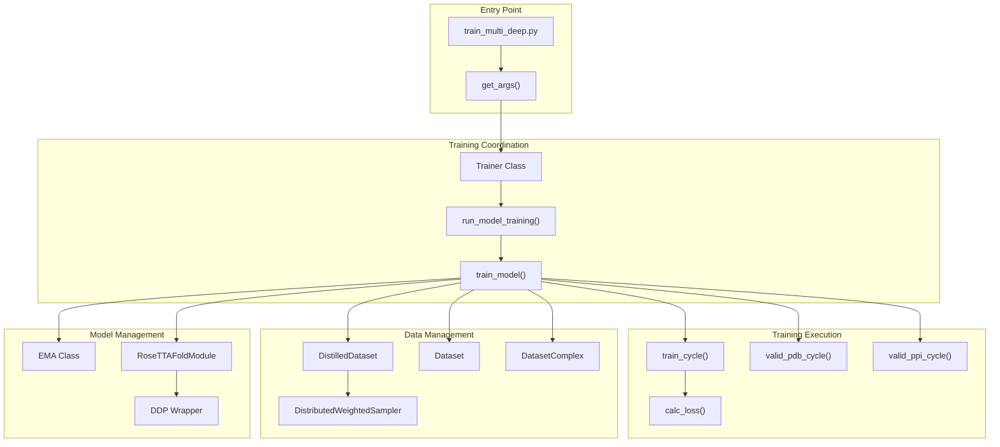
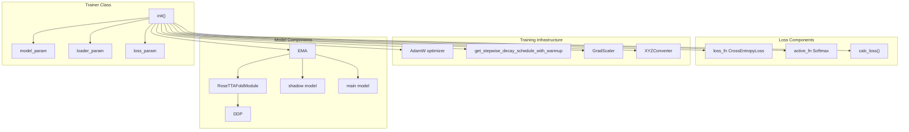
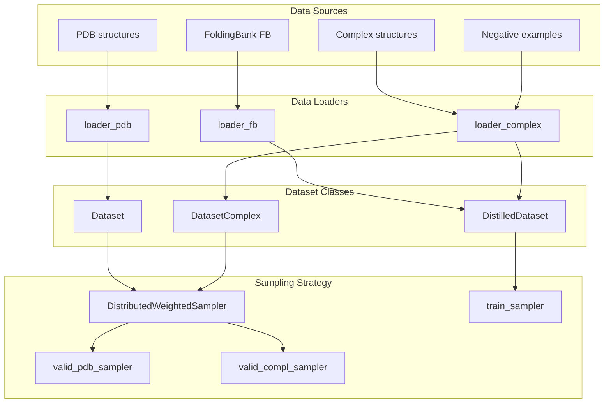
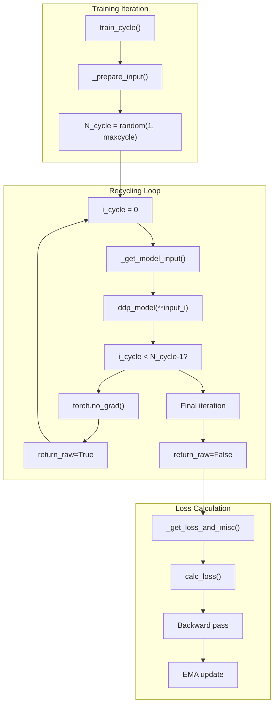
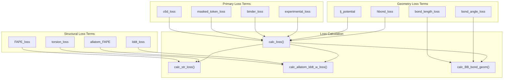
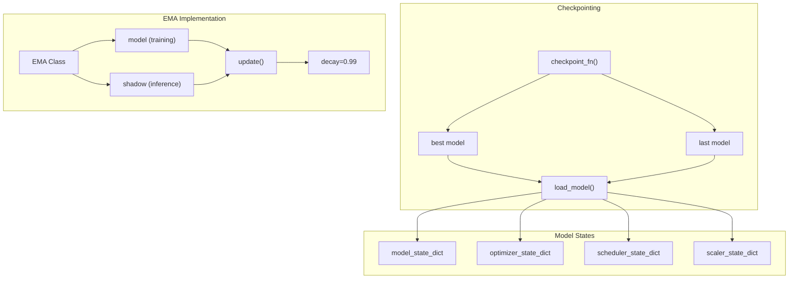
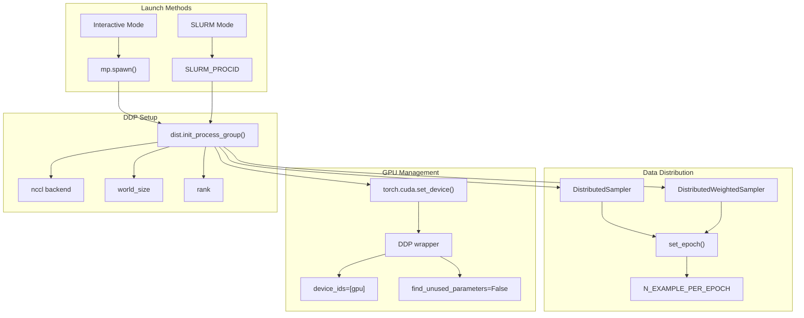

# Training Pipeline

> **Relevant source files**
> * [network/loss.py](https://github.com/uw-ipd/RoseTTAFold2/blob/4b273b95/network/loss.py)
> * [network/train_multi_deep.py](https://github.com/uw-ipd/RoseTTAFold2/blob/4b273b95/network/train_multi_deep.py)

This document describes the distributed training infrastructure for RoseTTAFold2, including the main training loop, data management, loss functions, and validation procedures. The training pipeline supports multi-GPU distributed training with various data types and implements advanced features like exponential moving averages and recycling iterations.

For information about the neural network architecture being trained, see [Core Architecture](/uw-ipd/RoseTTAFold2/3-core-architecture). For details about data loading and preprocessing, see [Data Loading for Training](/uw-ipd/RoseTTAFold2/5.2-data-loading-for-training).

## Training Architecture Overview

The training pipeline is built around a distributed training framework that handles multiple data types and implements sophisticated training strategies including recycling and validation across different protein structure prediction tasks.

**Training System Architecture**

Sources: [network/train_multi_deep.py L1-L1184](https://github.com/uw-ipd/RoseTTAFold2/blob/4b273b95/network/train_multi_deep.py#L1-L1184)

## Trainer Class and Core Components

The `Trainer` class serves as the central coordinator for the training process, managing model initialization, data loading, and training execution.

**Core Training Components**

The `Trainer` class is initialized with comprehensive parameters for model architecture, data loading, and loss computation:

| Parameter Category | Key Components | Purpose |
| --- | --- | --- |
| `model_param` | Network architecture settings | Configures `RoseTTAFoldModule` |
| `loader_param` | Data loading parameters | Controls dataset behavior |
| `loss_param` | Loss function weights | Balances different loss terms |
| Training Settings | `batch_size`, `accum_step`, `maxcycle` | Controls training dynamics |

Sources: [network/train_multi_deep.py L104-L149](https://github.com/uw-ipd/RoseTTAFold2/blob/4b273b95/network/train_multi_deep.py#L104-L149)

## Data Loading and Management

The training pipeline supports multiple data types through specialized dataset classes and implements sophisticated sampling strategies.

**Data Loading Architecture**

The data management system handles different validation sets:

* **PDB validation**: Standard protein structures
* **Homo validation**: Homo-oligomeric structures
* **Complex validation**: Protein-protein complexes
* **Negative validation**: Non-interacting protein pairs

Sources: [network/train_multi_deep.py L421-L467](https://github.com/uw-ipd/RoseTTAFold2/blob/4b273b95/network/train_multi_deep.py#L421-L467)

## Training Loop and Recycling

The training process implements a sophisticated recycling mechanism where predictions from previous iterations are used as input for subsequent iterations.

**Training Cycle Flow**

Key training features:

* **Random recycling**: Number of cycles varies from 1 to `maxcycle`
* **Gradient accumulation**: Supports `ACCUM_STEP` for effective batch size scaling
* **Mixed precision**: Uses `torch.cuda.amp.autocast` with bfloat16
* **Memory optimization**: Intermediate cycles use `torch.no_grad()` and `return_raw=True`

Sources: [network/train_multi_deep.py L752-L881](https://github.com/uw-ipd/RoseTTAFold2/blob/4b273b95/network/train_multi_deep.py#L752-L881)

## Loss Functions and Validation

The training pipeline implements a comprehensive loss function that combines multiple structural and sequence-based terms.

**Loss Function Components**

The loss function weights are configurable through `loss_param`:

| Loss Component | Weight Parameter | Purpose |
| --- | --- | --- |
| Distance prediction | `w_dist` | 6D distance/orientation |
| Amino acid prediction | `w_aa` | Masked language modeling |
| Structure prediction | `w_str` | FAPE and torsion angles |
| Binding prediction | `w_bind` | Protein-protein interaction |
| Confidence prediction | `w_lddt`, `w_pae` | Quality estimation |

Sources: [network/train_multi_deep.py L150-L332](https://github.com/uw-ipd/RoseTTAFold2/blob/4b273b95/network/train_multi_deep.py#L150-L332)

 [network/loss.py L1-L678](https://github.com/uw-ipd/RoseTTAFold2/blob/4b273b95/network/loss.py#L1-L678)

## Model Checkpointing and EMA

The training system implements Exponential Moving Average (EMA) for model weights and comprehensive checkpointing.

**EMA and Checkpointing System**

The EMA mechanism maintains two copies of the model:

* **Training model**: Used for gradient computation and parameter updates
* **Shadow model**: Exponentially averaged weights used for inference and validation

The checkpoint system saves:

* Best model based on validation loss
* Most recent model for training resumption
* Complete optimizer and scheduler states
* Training and validation metrics

Sources: [network/train_multi_deep.py L60-L103](https://github.com/uw-ipd/RoseTTAFold2/blob/4b273b95/network/train_multi_deep.py#L60-L103)

 [network/train_multi_deep.py L365-L542](https://github.com/uw-ipd/RoseTTAFold2/blob/4b273b95/network/train_multi_deep.py#L365-L542)

## Distributed Training Setup

The training pipeline supports both interactive and SLURM-based distributed training across multiple GPUs.

**Distributed Training Architecture**

Key distributed training features:

* **Automatic GPU detection**: Uses `torch.cuda.device_count()` for interactive mode
* **SLURM integration**: Reads environment variables for cluster deployment
* **Synchronized sampling**: Ensures consistent data distribution across processes
* **Gradient synchronization**: Uses DDP for efficient gradient averaging

The system handles both training and validation data distribution, ensuring each process receives a balanced subset of the total dataset.

Sources: [network/train_multi_deep.py L398-L544](https://github.com/uw-ipd/RoseTTAFold2/blob/4b273b95/network/train_multi_deep.py#L398-L544)