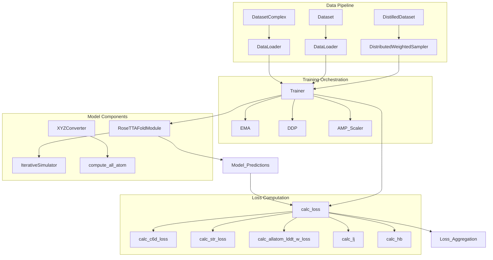
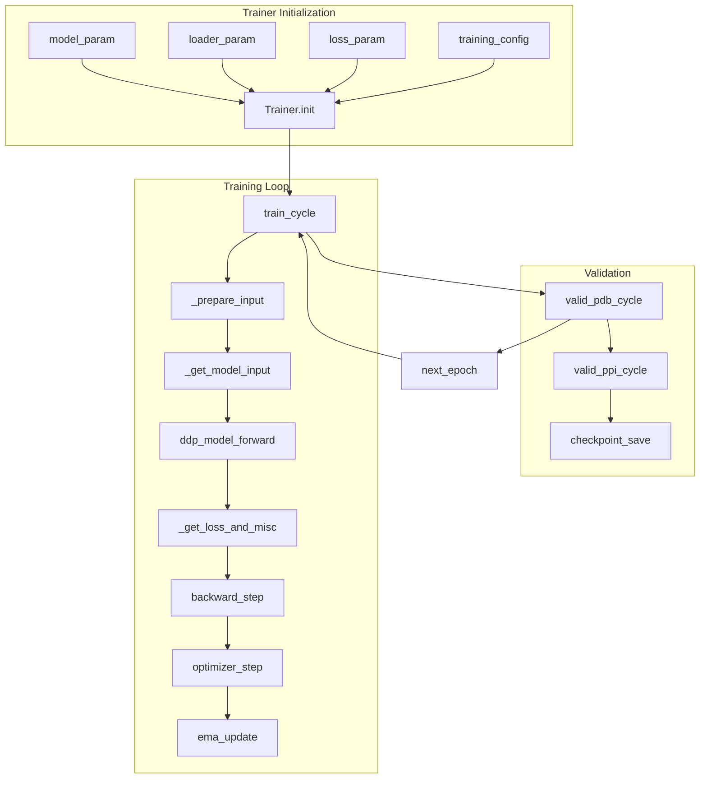
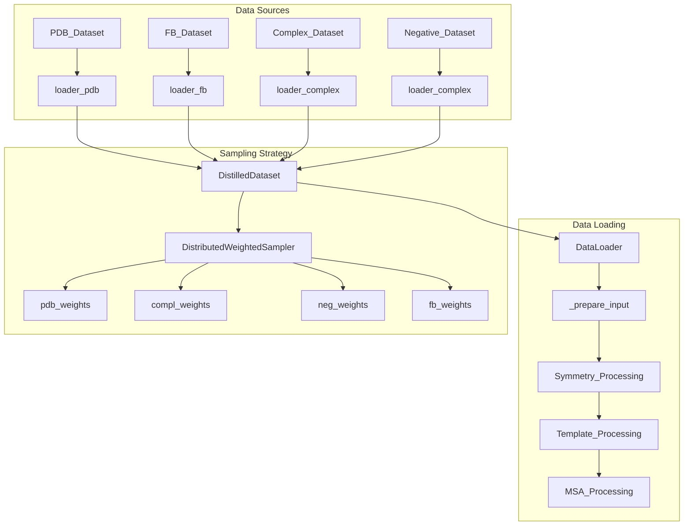
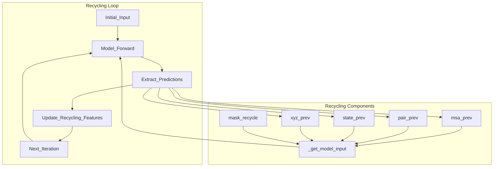
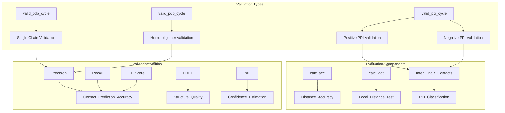
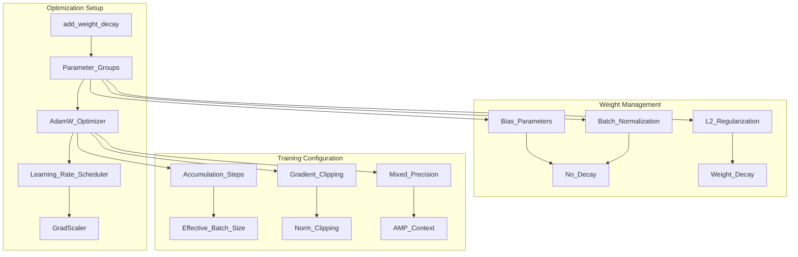

# Training System

> **Relevant source files**
> * [network/loss.py](https://github.com/uw-ipd/RoseTTAFold2/blob/4b273b95/network/loss.py)
> * [network/train_multi_deep.py](https://github.com/uw-ipd/RoseTTAFold2/blob/4b273b95/network/train_multi_deep.py)

This document describes the training infrastructure for RoseTTAFold2, including the distributed training pipeline, loss functions, data handling, and model optimization strategies. The training system orchestrates the complex process of training the neural network on protein structure prediction tasks using multiple data sources and sophisticated loss functions.

For information about the core neural network architecture being trained, see [Core Architecture](/uw-ipd/RoseTTAFold2/3-core-architecture). For details about data loading and preprocessing, see [Data Loading for Training](/uw-ipd/RoseTTAFold2/5.2-data-loading-for-training).

## Training Architecture Overview

The RoseTTAFold2 training system is built around a distributed training framework that handles multiple data types, complex loss functions, and sophisticated optimization strategies. The system supports both single-node and multi-node training with automatic mixed precision and exponential moving averages.

### Core Training Components

**Training System Architecture**

The training system coordinates distributed training across multiple GPUs, manages complex data sampling strategies, and computes sophisticated loss functions that capture various aspects of protein structure prediction accuracy.

Sources: [network/train_multi_deep.py L104-L148](https://github.com/uw-ipd/RoseTTAFold2/blob/4b273b95/network/train_multi_deep.py#L104-L148)

 [network/train_multi_deep.py L414-L544](https://github.com/uw-ipd/RoseTTAFold2/blob/4b273b95/network/train_multi_deep.py#L414-L544)

## Training Pipeline Components

### Trainer Class

The `Trainer` class serves as the central coordinator for the entire training process, managing model initialization, data loading, loss calculation, and optimization steps.

**Training Pipeline Flow**

The training pipeline processes batches through multiple recycling iterations, computes complex losses, and updates model weights using distributed optimization with exponential moving averages.

Sources: [network/train_multi_deep.py L752-L881](https://github.com/uw-ipd/RoseTTAFold2/blob/4b273b95/network/train_multi_deep.py#L752-L881)

 [network/train_multi_deep.py L104-L148](https://github.com/uw-ipd/RoseTTAFold2/blob/4b273b95/network/train_multi_deep.py#L104-L148)

### Exponential Moving Average (EMA)

The training system uses EMA to maintain a shadow copy of model weights that provides more stable predictions during inference.

| Component | Purpose | Key Methods |
| --- | --- | --- |
| `EMA` | Weight averaging | `update()`, `forward()` |
| `shadow` | EMA model copy | Automatically updated |
| `decay` | EMA decay rate | Typically 0.99 |

The EMA mechanism switches between the training model and shadow model based on the training mode, providing better generalization during validation and inference.

Sources: [network/train_multi_deep.py L60-L103](https://github.com/uw-ipd/RoseTTAFold2/blob/4b273b95/network/train_multi_deep.py#L60-L103)

## Loss Functions

The training system employs a sophisticated multi-component loss function that captures various aspects of protein structure prediction accuracy.

### Primary Loss Components

```mermaid
flowchart TD

A["calc_c6d_loss"]
B["Distance/Orientation Prediction"]
C["calc_str_loss"]
D["Backbone FAPE Loss"]
E["compute_FAPE"]
F["All-Atom FAPE Loss"]
G["torsionAngleLoss"]
H["Torsion Angle Loss"]
I["CrossEntropyLoss"]
J["Masked Token Prediction"]
K["BCELoss"]
L["Binder Classification"]
M["BCEWithLogitsLoss"]
N["Experimental Resolution"]
O["calc_allatom_lddt_w_loss"]
P["LDDT Prediction Loss"]
Q["calc_lddt"]
R["CA-LDDT Evaluation"]
S["calc_lj"]
T["Lennard-Jones Potential"]
U["calc_hb"]
V["Hydrogen Bond Energy"]
W["calc_BB_bond_geom"]
X["Bond Geometry Loss"]
Y["calc_loss"]

Y --> A
Y --> C
Y --> E
Y --> G
Y --> I
Y --> K
Y --> M
Y --> O
Y --> S
Y --> U
Y --> W

subgraph subGraph3 ["Physical Losses"]
    S
    T
    U
    V
    W
    X
    S --> T
    U --> V
    W --> X
end

subgraph subGraph2 ["Quality Losses"]
    O
    P
    Q
    R
    O --> P
    Q --> R
end

subgraph subGraph1 ["Sequence Losses"]
    I
    J
    K
    L
    M
    N
    I --> J
    K --> L
    M --> N
end

subgraph subGraph0 ["Structural Losses"]
    A
    B
    C
    D
    E
    F
    G
    H
    A --> B
    C --> D
    E --> F
    G --> H
end
```

**Loss Function Architecture**

The loss function combines structural, sequence, quality, and physical constraints to train the model on accurate protein structure prediction across multiple objectives.

Sources: [network/train_multi_deep.py L150-L332](https://github.com/uw-ipd/RoseTTAFold2/blob/4b273b95/network/train_multi_deep.py#L150-L332)

 [network/loss.py L44-L110](https://github.com/uw-ipd/RoseTTAFold2/blob/4b273b95/network/loss.py#L44-L110)

### Loss Function Details

#### Structural Losses

| Loss Type | Function | Purpose | Weight Parameter |
| --- | --- | --- | --- |
| Distance/Orientation | `calc_c6d_loss` | 6D distance predictions | `w_dist` |
| Backbone FAPE | `calc_str_loss` | Frame-aligned point error | `w_str` |
| All-Atom FAPE | `compute_FAPE` | All-atom structure accuracy | `w_all * w_str` |
| Torsion Angles | `torsionAngleLoss` | Side-chain conformations | `w_all * w_str` |

#### Quality and Physical Losses

| Loss Type | Function | Purpose | Weight Parameter |
| --- | --- | --- | --- |
| LDDT | `calc_allatom_lddt_w_loss` | Local distance difference | `w_lddt` |
| PAE | Included in `calc_str_loss` | Predicted aligned error | `w_pae` |
| Lennard-Jones | `calc_lj` | Steric clashes | `w_lj` |
| Hydrogen Bonds | `calc_hb` | Hydrogen bond energy | `w_hb` |
| Bond Geometry | `calc_BB_bond_geom` | Bond lengths/angles | `w_blen`, `w_bang` |

Sources: [network/loss.py L44-L51](https://github.com/uw-ipd/RoseTTAFold2/blob/4b273b95/network/loss.py#L44-L51)

 [network/loss.py L62-L110](https://github.com/uw-ipd/RoseTTAFold2/blob/4b273b95/network/loss.py#L62-L110)

 [network/loss.py L595-L640](https://github.com/uw-ipd/RoseTTAFold2/blob/4b273b95/network/loss.py#L595-L640)

## Data Handling and Distributed Training

### Data Sources and Sampling

The training system handles multiple data sources with sophisticated sampling strategies to balance different types of protein structures and interactions.

**Data Pipeline Architecture**

The data pipeline combines multiple protein structure datasets with weighted sampling to ensure balanced training across different types of structures and interactions.

Sources: [network/train_multi_deep.py L421-L467](https://github.com/uw-ipd/RoseTTAFold2/blob/4b273b95/network/train_multi_deep.py#L421-L467)

 [network/train_multi_deep.py L546-L654](https://github.com/uw-ipd/RoseTTAFold2/blob/4b273b95/network/train_multi_deep.py#L546-L654)

### Distributed Training Setup

The training system supports both SLURM-based cluster deployment and interactive multi-GPU training with automatic process group management.

| Component | Purpose | Configuration |
| --- | --- | --- |
| `DistributedDataParallel` | Multi-GPU training | `find_unused_parameters=False` |
| `DistributedSampler` | Data distribution | Per-GPU data sharding |
| `NCCL` | Communication backend | GPU-optimized collective operations |
| `ProcessGroup` | Synchronization | World size and rank management |

The system automatically detects the execution environment (SLURM vs interactive) and configures distributed training parameters accordingly.

Sources: [network/train_multi_deep.py L398-L418](https://github.com/uw-ipd/RoseTTAFold2/blob/4b273b95/network/train_multi_deep.py#L398-L418)

 [network/train_multi_deep.py L483-L495](https://github.com/uw-ipd/RoseTTAFold2/blob/4b273b95/network/train_multi_deep.py#L483-L495)

## Recycling and Iterative Refinement

### Recycling Mechanism

The training system implements iterative refinement through recycling, where model predictions are fed back as input for subsequent iterations.

**Recycling Architecture**

The recycling mechanism allows the model to iteratively refine its predictions by using previous outputs as additional input features, enabling progressive structure refinement.

Sources: [network/train_multi_deep.py L656-L671](https://github.com/uw-ipd/RoseTTAFold2/blob/4b273b95/network/train_multi_deep.py#L656-L671)

 [network/train_multi_deep.py L776-L795](https://github.com/uw-ipd/RoseTTAFold2/blob/4b273b95/network/train_multi_deep.py#L776-L795)

### Training vs Validation Recycling

| Mode | Recycling Strategy | Purpose |
| --- | --- | --- |
| Training | Random 1-4 cycles | Variable complexity training |
| Validation | Fixed maximum cycles | Consistent evaluation |
| Gradient Computation | Only final cycle | Memory efficiency |

The system uses different recycling strategies for training and validation to balance computational efficiency with model performance.

Sources: [network/train_multi_deep.py L776-L795](https://github.com/uw-ipd/RoseTTAFold2/blob/4b273b95/network/train_multi_deep.py#L776-L795)

 [network/train_multi_deep.py L899-L915](https://github.com/uw-ipd/RoseTTAFold2/blob/4b273b95/network/train_multi_deep.py#L899-L915)

## Validation and Evaluation

### Validation Pipeline

The training system includes comprehensive validation across multiple protein types and interaction scenarios.

**Validation System Architecture**

The validation system evaluates model performance across different protein types and interaction scenarios, providing comprehensive metrics for structure prediction accuracy and confidence estimation.

Sources: [network/train_multi_deep.py L883-L964](https://github.com/uw-ipd/RoseTTAFold2/blob/4b273b95/network/train_multi_deep.py#L883-L964)

 [network/train_multi_deep.py L966-L1164](https://github.com/uw-ipd/RoseTTAFold2/blob/4b273b95/network/train_multi_deep.py#L966-L1164)

### Validation Metrics

| Metric Type | Function | Purpose |
| --- | --- | --- |
| Contact Accuracy | `calc_acc` | Distance prediction precision/recall |
| Structure Quality | `calc_lddt` | Local distance difference test |
| PPI Classification | Inter-chain contact analysis | Protein-protein interaction detection |
| Confidence Estimation | PAE evaluation | Prediction reliability assessment |

The validation system provides detailed metrics for monitoring training progress and model performance across different aspects of protein structure prediction.

Sources: [network/train_multi_deep.py L334-L363](https://github.com/uw-ipd/RoseTTAFold2/blob/4b273b95/network/train_multi_deep.py#L334-L363)

 [network/loss.py L569-L594](https://github.com/uw-ipd/RoseTTAFold2/blob/4b273b95/network/loss.py#L569-L594)

## Model Checkpointing and Optimization

### Checkpoint Management

The training system implements sophisticated checkpointing with both best model saving and regular snapshots.

| Checkpoint Type | Content | Purpose |
| --- | --- | --- |
| Best Model | EMA shadow weights | Optimal validation performance |
| Last Model | Both EMA and current weights | Training resumption |
| Optimizer State | Learning rate, momentum | Complete training restoration |
| Scheduler State | Learning rate schedule | Consistent training progression |

The system saves checkpoints based on validation loss improvement and provides mechanisms for training resumption with full state restoration.

Sources: [network/train_multi_deep.py L365-L391](https://github.com/uw-ipd/RoseTTAFold2/blob/4b273b95/network/train_multi_deep.py#L365-L391)

 [network/train_multi_deep.py L513-L543](https://github.com/uw-ipd/RoseTTAFold2/blob/4b273b95/network/train_multi_deep.py#L513-L543)

### Optimization Configuration

**Optimization Architecture**

The optimization system combines mixed precision training, gradient clipping, and sophisticated weight decay strategies to enable stable and efficient training of large protein structure prediction models.

Sources: [network/train_multi_deep.py L45-L56](https://github.com/uw-ipd/RoseTTAFold2/blob/4b273b95/network/train_multi_deep.py#L45-L56)

 [network/train_multi_deep.py L487-L491](https://github.com/uw-ipd/RoseTTAFold2/blob/4b273b95/network/train_multi_deep.py#L487-L491)

 [network/train_multi_deep.py L804-L816](https://github.com/uw-ipd/RoseTTAFold2/blob/4b273b95/network/train_multi_deep.py#L804-L816)