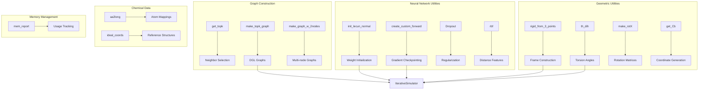
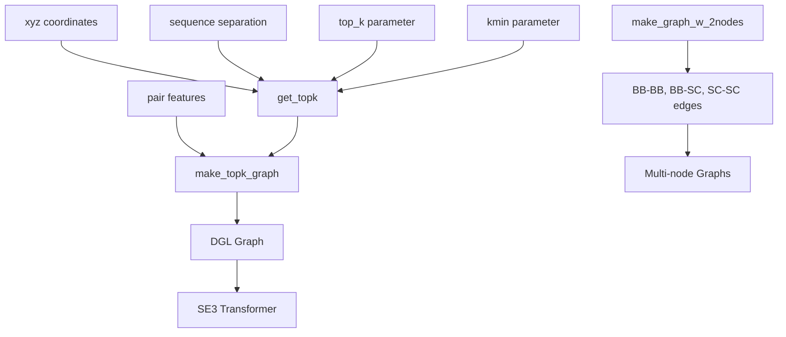
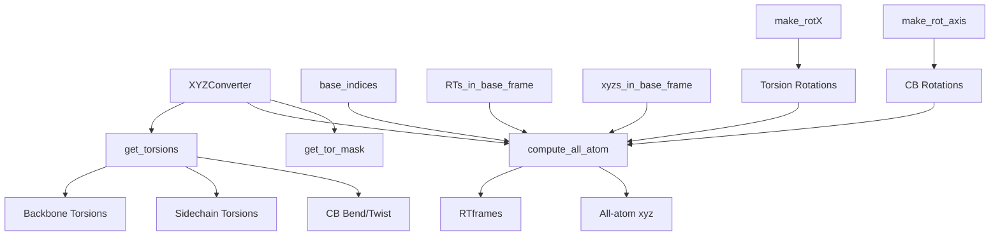
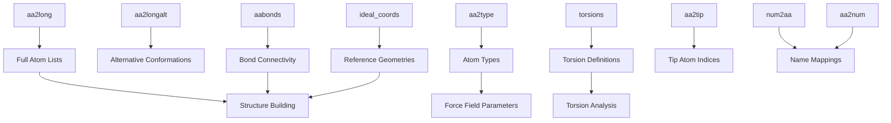

# Utilities and Optimization

> **Relevant source files**
> * [network/chemical.py](https://github.com/uw-ipd/RoseTTAFold2/blob/4b273b95/network/chemical.py)
> * [network/memory.py](https://github.com/uw-ipd/RoseTTAFold2/blob/4b273b95/network/memory.py)
> * [network/symmetry.py](https://github.com/uw-ipd/RoseTTAFold2/blob/4b273b95/network/symmetry.py)
> * [network/util.py](https://github.com/uw-ipd/RoseTTAFold2/blob/4b273b95/network/util.py)
> * [network/util_module.py](https://github.com/uw-ipd/RoseTTAFold2/blob/4b273b95/network/util_module.py)

This document covers the supporting utilities, memory management, and performance optimization components of RoseTTAFold2. These utilities provide essential functionality for neural network operations, geometric transformations, memory tracking, and chemical data handling that support the core prediction pipeline.

For detailed information about core neural network utilities, see [Core Utilities](/uw-ipd/RoseTTAFold2/6.1-core-utilities). For memory management and reporting tools, see [Memory Management](/uw-ipd/RoseTTAFold2/6.2-memory-management).

## System Architecture

The utilities and optimization system provides foundational support across multiple domains:

**Utility Architecture Overview**

Sources: [network/util_module.py L1-L613](https://github.com/uw-ipd/RoseTTAFold2/blob/4b273b95/network/util_module.py#L1-L613)

 [network/util.py L1-L409](https://github.com/uw-ipd/RoseTTAFold2/blob/4b273b95/network/util.py#L1-L409)

 [network/memory.py L1-L59](https://github.com/uw-ipd/RoseTTAFold2/blob/4b273b95/network/memory.py#L1-L59)

 [network/chemical.py L1-L572](https://github.com/uw-ipd/RoseTTAFold2/blob/4b273b95/network/chemical.py#L1-L572)

## Core Utility Functions

The system provides several categories of utility functions essential for neural network operations and geometric computations:

**Neural Network Utilities**

* **Weight Initialization**: `init_lecun_normal` and `init_lecun_normal_param` implement truncated normal initialization for stable training
* **Gradient Checkpointing**: `create_custom_forward` enables memory-efficient training by trading computation for memory
* **Dropout**: Custom `Dropout` class supports row/column-wise dropout for attention mechanisms
* **Distance Features**: `rbf` function generates radial basis function features for distance encoding

**Geometric Transformations**

* **Rigid Body Frames**: `rigid_from_3_points` constructs rotation matrices from three points
* **Torsion Calculations**: `th_dih` and `th_dih_v` compute dihedral angles efficiently
* **Rotation Matrices**: `make_rotX`, `make_rotZ`, and `make_rot_axis` generate rotation transformations
* **Coordinate Utilities**: Functions for centering, aligning, and transforming 3D coordinates

Sources: [network/util_module.py L10-L91](https://github.com/uw-ipd/RoseTTAFold2/blob/4b273b95/network/util_module.py#L10-L91)

 [network/util.py L42-L138](https://github.com/uw-ipd/RoseTTAFold2/blob/4b273b95/network/util.py#L42-L138)

## Graph Construction and Optimization

RoseTTAFold2 uses graph neural networks extensively, requiring efficient graph construction with optimized neighbor selection:

**Graph Construction Pipeline**

The graph construction process optimizes computational efficiency through:

* **Top-k Neighbor Selection**: `get_topk` identifies the k nearest neighbors based on distance plus sequence separation bias
* **Conditional Edge Creation**: Edges are added if residues are within `kmin` sequential positions OR within top-k spatial neighbors
* **Multi-node Support**: `make_graph_w_2nodes` creates graphs with separate backbone (BB) and sidechain (SC) nodes

Sources: [network/util_module.py L113-L268](https://github.com/uw-ipd/RoseTTAFold2/blob/4b273b95/network/util_module.py#L113-L268)

## All-Atom Coordinate Generation

The system includes sophisticated machinery for converting internal coordinates to full atomic structures:

**Coordinate Generation System**

The `XYZConverter` class orchestrates the conversion from backbone coordinates and torsion angles to full atomic coordinates using:

* **Frame Building**: Constructs local coordinate frames for each torsion
* **Rotation Composition**: Combines multiple rotations using tensor operations
* **Ideal Geometry**: Uses pre-computed ideal coordinates and reference angles
* **Masking**: Handles missing atoms and invalid torsions appropriately

Sources: [network/util_module.py L413-L612](https://github.com/uw-ipd/RoseTTAFold2/blob/4b273b95/network/util_module.py#L413-L612)

 [network/util.py L344-L409](https://github.com/uw-ipd/RoseTTAFold2/blob/4b273b95/network/util.py#L344-L409)

## Memory Management and Optimization

The system includes memory monitoring and optimization strategies critical for large protein structure prediction:

**Memory Optimization Strategies**

* **Usage Reporting**: `mem_report` provides detailed GPU memory usage analysis
* **Gradient Checkpointing**: Reduces memory footprint during backpropagation
* **Tensor Management**: Efficient tensor operations and storage patterns

The memory reporting system tracks:

* Individual tensor storage usage
* Data pointer deduplication to avoid double-counting
* GPU vs CPU memory distribution
* Large tensor identification (>128MB threshold)

Sources: [network/memory.py L6-L59](https://github.com/uw-ipd/RoseTTAFold2/blob/4b273b95/network/memory.py#L6-L59)

## Chemical Data Infrastructure

The system maintains extensive chemical knowledge required for protein structure calculations:

**Chemical Data Organization**

Key chemical data structures include:

* **Atom Mappings**: Complete atom lists for all 20 amino acids plus unknown/mask
* **Bond Topology**: Connectivity information for chemical graph construction
* **Ideal Coordinates**: Reference geometries for structure building
* **Torsion Definitions**: Chi angle and backbone torsion specifications

Sources: [network/chemical.py L6-L572](https://github.com/uw-ipd/RoseTTAFold2/blob/4b273b95/network/chemical.py#L6-L572)

## Symmetry Handling

For symmetric protein complexes, the system provides sophisticated symmetry detection and handling:

* **Symmetry Detection**: `get_symmetry` automatically identifies cyclic, dihedral, and polyhedral symmetries
* **Matrix Generation**: `symm_subunit_matrix` creates transformation matrices for symmetric arrangements
* **Coordinate Transformation**: Applies symmetry operations to generate symmetric coordinates

The symmetry system supports point groups including C_n (cyclic), D_n (dihedral), T (tetrahedral), O (octahedral), and I (icosahedral).

Sources: [network/symmetry.py L106-L710](https://github.com/uw-ipd/RoseTTAFold2/blob/4b273b95/network/symmetry.py#L106-L710)