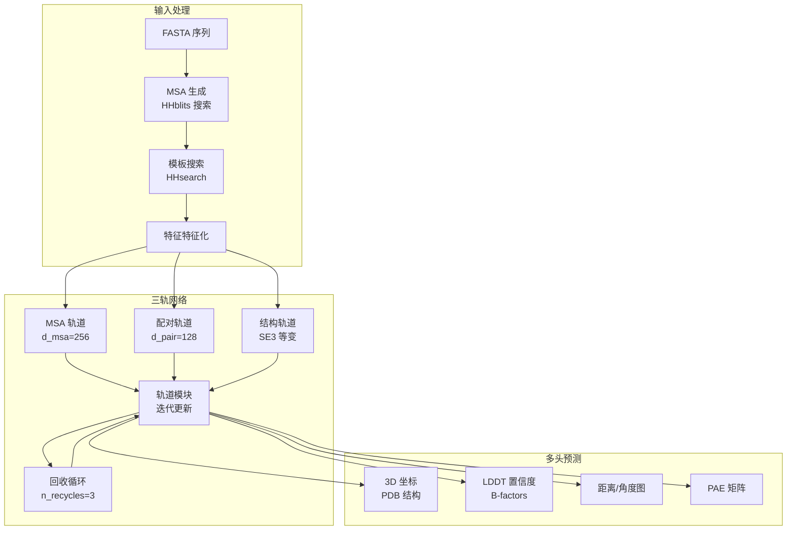

---
slug:1-overview
blog_type:normal
---


RoseTTAFold2 是一个先进的深度学习系统，用于 **3D 蛋白质结构预测**，相比其前身，它在精度提升、内存效率优化以及对复杂蛋白质组装体的支持方面取得了显著进展。该系统实现了一套复杂的 **三轨神经网络架构**，通过迭代优化过程同时处理多重序列比对（MSA）数据、残基对表示和 3D 坐标。RoseTTAFold2 专为单体蛋白质和多链复合物设计，利用来自海量序列数据库和结构模板的进化信息，仅凭氨基酸序列即可生成精确的原子模型。

来源：[README.md](README.md#L1-L5), [RoseTTAFoldModel.py](network/RoseTTAFoldModel.py#L1-L30)

## 核心架构

RoseTTAFold2 的根本创新在于其 **三轨设计**，即三个不同但相互关联的表示在迭代优化周期中共同演进：

- **MSA 轨道**：捕获多重序列比对中的进化信息，处理指示残基空间邻近性的共进化信号
- **配对轨道**：在 2D 矩阵中表示残基间关系，整合共进化和结构距离预测
- **结构轨道**：通过 SE(3)-等变 Transformer 层维护更新的 3D 原子坐标，确保旋转和平移不变性

这些轨道通过双向信息流进行通信，允许模型迭代优化其预测。**回收机制**将上一周期的预测反馈回网络，从而逐步提高坐标精度和置信度估计。

来源：[RoseTTAFoldModel.py](network/RoseTTAFoldModel.py#L30-L45), [Track_module.py](network/Track_module.py#L15-L25)

### 系统架构



## 关键特性和能力

RoseTTAFold2 整合了多项使其区别于其他结构预测方法的先进功能：

<CgxTip>SE(3)-等变 Transformer 网络是核心创新，它通过一个尊重分子结构物理对称性的复杂图神经网络，实现了对 3D 坐标的旋转不变性处理。</CgxTip>

### 预测能力

| 特性 | 描述 | 实现 |
|---------|-------------|----------------|
| **单体预测** | 单条蛋白质链结构预测 | 使用 HHblits 针对 UniRef30/BFD 数据库进行标准 MSA 生成 |
| **异源复合物** | 使用配对 MSA 进行的多链预测 | 通过 `make_paired_MSA_simple.py` 基于分类学的 MSA 配对 |
| **对称复合物** | Cn, Dn, T, I, O 对称群支持 | 使用 `symmids` 和 `symmRs` 参数进行对称感知预测 |
| **环状肽** | N-C 环化肽建模 | 用于环化拓扑结构的特殊 `-cyclize` 标志 |
| **模板整合** | 同源结构整合 | 针对 PDB100 数据库的 HHsearch |

### 性能优化

系统包含多项内存和计算效率改进：
- **梯度检查点** 以减少训练期间的内存占用
- **子裁剪** 技术用于配对对更新（`p2p_crop` 参数）
- **Top-k 邻居选择** 默认将结构更新限制为 1536 个残基
- **CPU 卸载** 选项适用于低显存环境（`-low_vram` 标志）
- **条带化参数** 用于大系统的高效内存计算

来源：[predict.py](network/predict.py#L31-L60), [predict.py](network/predict.py#L86-L100), [README.md](README.md#L3-L8)

## 输入处理流水线

预测工作流程始于全面的 **序列数据库搜索**，以提取进化信息。系统使用 HHblits 搜索两个主要数据库：用于特征明确序列的 **UniRef30_2020_06** (46GB)，以及用于更广泛覆盖的 **BFD** (272GB)。这些搜索生成具有深度迭代 E 值截断 (1e-10, 1e-6, 1e-3) 的多重序列比对 (MSA)，以平衡多样性和质量。

对于基于模板的建模，HHsearch 查询 **PDB100_2021Mar03** 数据库以识别结构同源物，当存在近缘同源物时，提供额外的约束以提高预测精度。MSA 生成脚本根据序列深度自动选择适当的数据库，过滤阈值为 90% 一致性和 75% 或 50% 覆盖率。

来源：[make_protein_msa.sh](input_prep/make_protein_msa.sh#L14-L18), [make_protein_msa.sh](input_prep/make_protein_msa.sh#L35-L60), [run_RF2.sh](run_RF2.sh#L22-L50)

### 项目结构

```
RoseTTAFold2/
├── network/                    # 核心神经网络实现
│   ├── RoseTTAFoldModel.py    # 具有三轨架构的主模型类
│   ├── predict.py             # 推理流水线
│   ├── Track_module.py        # 带有轨道交互的迭代模拟
│   ├── SE3_network.py         # SE(3)-等变 Transformer 包装器
│   ├── Embeddings.py          # 输入嵌入模块
│   ├── AuxiliaryPredictor.py  # 输出预测头
│   └── loss.py                # FAPE 和多组件损失
├── input_prep/                 # 数据预处理工具
│   ├── make_protein_msa.sh    # HHblits MSA 生成
│   └── make_paired_MSA_simple.py  # 多链 MSA 配对
├── SE3Transformer/            # 外部 SE(3)-等变网络
│   └── se3_transformer/       # 核心等变注意力模块
├── examples/                   # 示例输入 FASTA 文件
└── run_RF2.sh                 # 端到端预测脚本
```

## 模型配置和参数

RoseTTAFoldModule 定义了一套全面的超参数来控制网络架构和行为：

- **MSA 轨道维度** (`d_msa=256`)：用于进化信息的高容量表示
- **配对轨道维度** (`d_pair=128`)：高效的残基间关系编码
- **模板维度** (`d_templ=64`)：紧凑的结构模板表示
- **注意力头数**：MSA 轨道 8 个头，配对和模板轨道各 4 个头
- **块结构**：4 个额外块，36 个主块，4 个优化块用于深度处理
- **SE(3) 参数**：两种配置（full 和 topk），具有不同的通道深度和边特征

前向传播接受多个输入张量，包括 MSA 特征 (`msa_latent`, `msa_full`)、序列信息 (`seq`, `idx`)、模板数据 (`t1d`, `t2d`, `xyz_t`) 以及上一周期的输出用于回收。模型通过专门的头网络输出预测的 3D 坐标、置信度指标和辅助预测。

来源：[RoseTTAFoldModel.py](network/RoseTTAFoldModel.py#L12-L28), [predict.py](network/predict.py#L62-L86), [AuxiliaryPredictor.py](network/AuxiliaryPredictor.py#L1-L30)

## 输出和置信度指标

RoseTTAFold2 提供了超越坐标的丰富输出，使用户能够评估预测质量：

- **PDB 结构文件**，其 B-factors 编码了预测的 LDDT（局部距离差异测试）分数，指示每个残基的置信度
- **JSON 文件**，包含额外的元数据和置信度指标
- **NPZ 文件**，包含数值预测，包括：
  - 距离和角度分布
  - 用于域置信度的预测对齐误差 (PAE) 矩阵
  - LDDT 概率分布
  - 方向预测 (theta, phi, omega)

辅助预测器网络包括针对不同输出的专门头：`DistanceNetwork` 预测对称距离/omega 和非对称 theta/phi 角度，`LDDTNetwork` 提供局部置信度估计，`PAENetwork` 生成全局域置信度矩阵。

来源：[AuxiliaryPredictor.py](network/AuxiliaryPredictor.py#L11-L40), [AuxiliaryPredictor.py](network/AuxiliaryPredictor.py#L50-L65), [README.md](README.md#L55-L60)

## 安装和快速开始

设置过程涉及四个主要组件：conda 环境创建、SE(3)-Transformer 安装、模型权重下载和数据库准备。提供的 `RF2-linux.yml` conda 环境文件确保了不同系统间一致的依赖管理。

`run_RF2.sh` 脚本为完整的预测流水线提供了统一接口，处理 MSA 生成、模板搜索和模型推理。用户可以通过命令行选项指定多条链、为复合物启用 MSA 配对、定义对称群以及控制输出目录。

来源：[README.md](README.md#L7-L25), [run_RF2.sh](run_RF2.sh#L1-L20), [run_RF2.sh](run_RF2.sh#L100-L159)

<CgxTip>从 FASTA 到结构预测的完整端到端流水线通过 `run_RF2.sh` 自动化，该脚本协调 HHblits MSA 生成、HHsearch 模板检测和最终的 RoseTTAFold2 推理，无需人工干预中间步骤。</CgxTip>

## 下一步

要继续探索 RoseTTAFold2：

- [快速开始](2-quick-start)：通过分步示例学习运行你的第一个预测
- [环境设置](3-environment-setup)：详细的安装说明和依赖解析
- [三轨设计](6-three-track-design-msa-pair-and-3d-structure-tracks)：深入了解核心架构创新
- [SE(3)-等变 Transformer](7-se-3-equivariant-transformer-network)：了解旋转不变的神经网络
- [回收机制](8-recycling-mechanism-for-iterative-refinement)：探索迭代优化策略