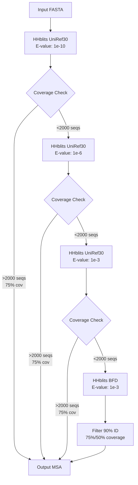
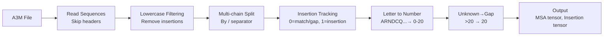

---
slug:10-msa-generation-and-featurization
blog_type:normal
---

本页面解释了 RoseTTAFold2 如何生成和处理多序列比对（MSAs），以提取用于蛋白质结构预测的进化信息。MSA 处理流水线将原始序列比对转化为丰富的特征表示，这些表示将输入到三轨道架构中。

## MSA 生成流水线

RoseTTAFold2 通过使用 HHblits 对 UniRef30 和 BFD 序列数据库进行迭代数据库搜索来生成 MSAs。`make_protein_msa.sh` 脚本协调这一过程，并采用逐步放宽的搜索标准。

该脚本对 UniRef30 执行三次迭代搜索，E-value 阈值逐渐增加（1e-10 → 1e-6 → 1e-3），并在每次迭代后应用 `hhfilter` 以保留与查询序列具有 90% 一致性且覆盖率为 75% 或 50% 的序列 [来源：input_prep/make_protein_msa.sh#L23-L27]。如果 UniRef30 无法产生足够的序列（75% 覆盖率下 >2000 条或 50% 覆盖率下 >4000 条），流水线将回退到更大的 BFD 数据库 [来源：input_prep/make_protein_msa.sh#L40-L64]。

<CgxTip>双重覆盖率阈值（75% 和 50%）提供了灵活性：更严格的 75% 覆盖率确保高质量的比对，而 50% 阈值允许在需要深度 MSA 时包含更远的同源序列。</CgxTip>

## 蛋白质复合物的配对 MSA 生成

在预测蛋白质复合物时，RoseTTAFold2 通过匹配不同链中具有相同分类学 ID（Taxonomic IDs）的序列来创建配对 MSAs。`make_paired_MSA_simple.py` 脚本通过读取单个链的 A3M 文件并组合共享相同进化起源的序列来执行此配对。

该算法读取每个 A3M 文件，提取查询序列和带 TaxID 标记的同源序列，然后通过连接所有链中匹配的序列来创建配对序列 [来源：input_prep/make_paired_MSA_simple.py#L24-L78]。不匹配的序列用间隙字符填充。输出根据具有匹配序列的链数进行排序，优先考虑深度保守的序列 [来源：input_prep/make_paired_MSA_simple.py#L137-L138]。

这种配对确保模型接收跨越相互作用链的共进化信号，这对于预测链间接触和复合物结构至关重要。

## MSA 解析与预处理

`parse_a3m()` 函数将 A3M 格式文件转换为适合神经网络处理的数值张量。此解析处理几个关键转换：

解析器区分大写字母（比对位置）和小写字母（插入），通过删除小写字母获得比对后的 MSA [来源：network/parsers.py#L26-L40]。对于多链复合物，可以使用 '/' 作为分隔符分割序列，每条链单独存储并在最后连接 [来源：network/parsers.py#L28-L45]。插入被跟踪为单独的信息：对于每个比对位置，解析器记录插入残基的数量 [来源：network/parsers.py#L46-L58]。

氨基酸字母使用字母表 "ARNDCQEGHILKMFPSTWYV-" 转换为整数（标准残基为 0-19，间隙/未知为 20）[来源：network/parsers.py#L63-L68]。

## MSA 特征化架构

`MSAFeaturize()` 函数是将原始 MSA 数据转换为丰富特征表示的核心转换。此过程在 `network/featurizing.py` 和 `network/data_loader.py` 中实现，后者支持用于迭代细化机制的多次回收迭代。

### 种子和额外序列选择

特征化将 MSA 分为两个流：

- **种子 MSA（latent MSA）**：限制为 `MAXLAT` 条序列（默认 128），始终包含查询序列加上随机选择的同源序列。这种紧凑的表示在 MSA 轨道中经过密集处理。
- **额外序列**：最多 `MAXSEQ` 条序列（默认 1024）提供额外的进化背景，而无需完整的 MSA 轨道处理开销。

种子序列采用复杂的 15% 掩码策略，该策略结合了多种 token 来源 [来源：network/featurizing.py#L60-L68]：

| 掩码类型 | 概率 | 描述 |
|--------------|-------------|-------------|
| 随机氨基酸 | 10% | 从 20 个残基中均匀采样 |
| 轮廓采样 | 10% | 从 MSA 位置频率中采样 |
| 原始残基 | 10% | 保留原始氨基酸 |
| 掩码 token | 70% | 替换为特殊的 "mask" token |

这种掩码策略提供了类似于掩码语言建模的训练信号，教导网络从进化和结构背景中预测被掩码的残基。

### 特征提取组件

特征化为种子和额外序列生成全面的特征：

**种子 MSA 特征（每个位置 48 个通道）**：
- One-hot 氨基酸：22 个通道（20 个残基 + 间隙 + 掩码）
- 聚类轮廓：22 个通道，来自将额外序列与种子序列聚类
- 插入统计：2 个通道（局部插入 + 平均聚类插入）
- 末端信息：2 个通道（N 端和 C 端标志）[来源：network/featurizing.py#L33-L36]

**额外序列特征（每个位置 25 个通道）**：
- One-hot 氨基酸：22 个通道
- 插入信息：1 个通道（arctan 变换）
- 末端信息：2 个通道 [来源：network/featurizing.py#L138-L140]

### 汉明距离聚类

额外序列使用汉明距离聚类到种子序列上，以高效捕捉进化关系。该算法通过将额外序列和种子序列的 one-hot 编码相乘来计算它们之间的一致性矩阵，然后将每个额外序列分配给其最近的种子 [来源：network/featurizing.py#L104-L109]。

聚类轮廓聚合分配给每个种子的所有额外序列的特征，并根据分配进行加权，并忽略掩码 token [来源：network/featurizing.py#L112-L118]。这种聚类在保留进化信息丰富性的同时降低了计算复杂性。

<CgxTip>插入统计使用 `arctan(x/3.0) * (2.0/π)` 进行变换，将动态范围从 0 压缩到 1，防止大的插入计数主导特征空间 [来源：network/featurizing.py#L124-L125]。</CgxTip>

## MSA 下采样与合并

### 大型 MSA 的块删除

对于超过 `BLOCKCUT` 阈值（默认 5 条序列）的 MSAs，`MSABlockDeletion()` 函数随机删除 MSA 中 30% 序列的块。这防止模型过度拟合非常深的 MSAs，并在序列多样性和计算效率之间保持平衡 [来源：network/data_loader.py#L49-L60]。

该函数选择 5 个随机起始位置，从每个位置开始删除序列块，并返回下采样的 MSA 和插入张量。

### 复合物和寡聚物的 MSA 合并

RoseTTAFold2 支持两种类型的 MSA 合并：

1. **异源寡聚物**（`merge_a3m_hetero`）：合并来自具有不同 TaxID 的不同蛋白质的 MSAs。查询序列被连接，额外序列在相反链上用间隙填充 [来源：network/data_loader.py#L511-L528]。
2. **同源寡聚物**（`merge_a3m_homo`）：在相同链上复制 MSA 信息。对于 n 聚体，查询序列重复 n 次，同源物分布在所有副本中 [来源：network/data_loader.py#L563-L578]。

这种合并使模型能够通过提供配对的进化信息来预测蛋白质复合物和对称寡聚物的结构。

## MSA 特征的回收支持

`data_loader.py` 中的 `MSAFeaturize()` 函数通过支持多次回收迭代（`MAXCYCLE` 参数，默认 4）扩展了 `featurizing.py`。对于每次迭代，该函数生成独立采样的种子序列和掩码位置，在迭代间创建批处理特征 [来源：network/data_loader.py#L88-L121]。

这允许三轨道架构中的回收机制在每个周期使用 MSA 的不同视图细化预测，从而提高收敛性和最终结构质量。

## 与数据加载器的集成

MSA 处理流水线与几个专门的数据加载器集成：

- `loader_pdb()`：加载带有 MSA、模板和结构信息的单链 PDB 示例，支持单链和同源寡聚物模式 [来源：network/data_loader.py#L778-L800]。
- `loader_complex()`：加载来自不同 TaxID 的配对 MSA 的异源寡聚复合物。
- `loader_fb()`：加载来自 AlphaFold 预测的蒸馏数据。

`featurize_single_chain()` 函数协调完整的特征提取流水线，调用 `MSAFeaturize()`、用于模板特征的 `TemplFeaturize()`，并应用残基裁剪以在训练期间管理内存 [来源：network/data_loader.py#L583-L620]。

## 关键参数和配置

| 参数 | 默认值 | 描述 |
|-----------|---------|-------------|
| MAXLAT | 128 | 种子 MSA 中的最大序列数 |
| MAXSEQ | 1024 | 最大额外序列数 |
| MAXCYCLE | 4 | 回收迭代次数 |
| BLOCKCUT | 5 | 块删除的最小序列数 |
| p_mask | 0.15 | 种子 MSA 的掩码概率 |

这些参数可通过参数系统配置，并可根据可用的计算资源和特定的预测任务进行调整。

来源：[input_prep/make_protein_msa.sh](input_prep/make_protein_msa.sh#L1-L87), [input_prep/make_paired_MSA_simple.py](input_prep/make_paired_MSA_simple.py#L1-L141), [network/parsers.py](network/parsers.py#L20-L109), [network/featurizing.py](network/featurizing.py#L1-L151), [network/data_loader.py](network/data_loader.py#L49-L230)

## 后续步骤

理解 MSA 特征化为探索如何在模型架构中使用这些特征奠定了基础。继续阅读 [基于模板的结构特征](11-template-based-structure-features) 以了解结构模板如何补充 MSA 信息，或继续阅读 [嵌入模块](12-embedding-modules-msa-template-pair-representations) 以查看这些 MSA 特征如何嵌入到神经网络中。