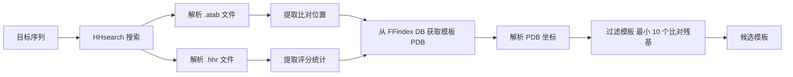
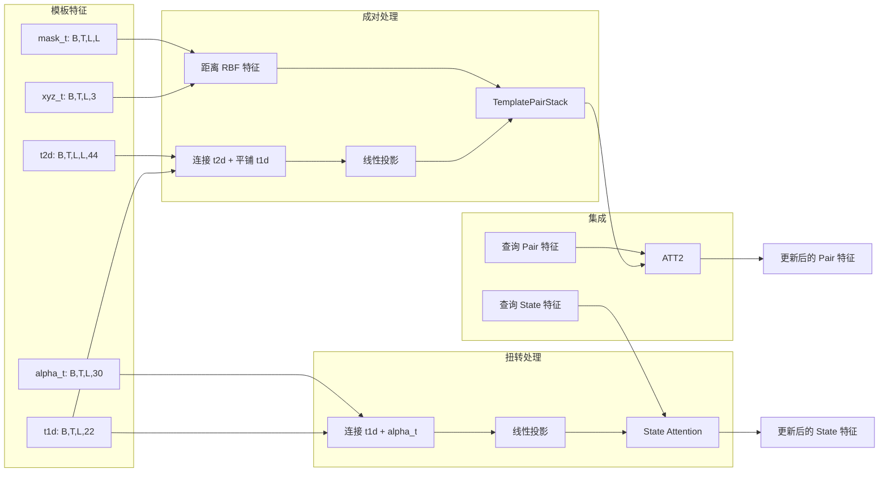

---
slug:11-template-based-structure-features
blog_type:normal
---

基于模板的结构特征为 RoseTTAFold2 提供了来自同源蛋白结构的进化和结构约束，当存在合适模板时，能显著提高预测准确性。这些特征编码了来自已知蛋白结构的距离图、取向角、残基级信息和置信度分数，使模型能够利用通过 HHsearch 等工具进行的同源搜索结果，从蛋白质数据库（PDB）中获取结构信息。

## 模板发现与解析

模板处理流程从解析 HHsearch 输出文件开始，这些文件包含目标序列与结构数据库中潜在模板结构之间的比对信息。系统读取 `.atab` 文件（包含位置评分的表格化比对信息）和 `.hhr` 文件（包含概率评分和比对统计数据的 HHsearch 命中结果），以识别并排序候选模板 [parsers.py#L172-L244](network/parsers.py#L172-L244)。

`parse_templates_raw` 函数从以 FFindex 数据库格式存储的 PDB 文件中提取模板信息，包括匹配的残基位置、比对置信度分数和实际 3D 坐标 [parsers.py#L245-L295](network/parsers.py#L245-L295)。每个模板都会经过过滤——剔除比对残基少于 10 个的模板，以确保有足够的结构信息用于有意义的推断。

模板选择过程为每个模板命中提取了几个关键统计数据：查询和模板位置、来自 HHsearch 的位置置信度分数，以及包括概率、E 值、同一性百分比、相似性评分和有效序列计数 (Neff) 在内的全局指标 [parsers.py#L172-L244](network/parsers.py#L172-L244)。这些统计数据指导预测过程中的模板排序和加权。

## 几何特征提取

模板结构经过几何变换，转换为 6D 坐标表示，以捕捉残基对之间的距离和取向信息。`get_coords6d` 函数从指定距离截止内的 Cβ-Cβ 对计算四个互补的几何描述符 [coords6d.py#L36-L81](network/coords6d.py#L36-L81)。

| 特征 | 描述 | 计算方法 |
|---------|-------------|-------------------|
| **距离** | Cβ-Cβ 欧几里得距离 | 使用 k-d tree 的 k 近邻搜索 |
| **Omega** | Ca-Cβ-Cβ-Ca 二面角 | 4 点二面角计算 |
| **Theta** | N-Ca-Cβ-Cb 二面角 | 4 点二面角计算 |
| **Phi** | Ca-Cβ-Cb 平面角 | 3 点角度计算 |

使用标准蛋白质几何从 N、Ca 和 C 坐标重建 Cβ 原子位置，从而在所有模板之间实现一致的坐标表示 [coords6d.py#L48-L50](network/coords6d.py#L48-L50)。k 维树能够在距离截止内进行高效的邻域搜索，避免对大蛋白进行 O(L²) 计算 [coords6d.py#L52-L58](network/coords6d.py#L52-L58)。

## 模板特征组合

模板特征被组织为两种主要表示形式：1D（每个残基）和 2D（每个残基对）张量 [Embeddings.py#L188-L196](network/Embeddings.py#L188-L196)。1D 模板特征 (t1d) 包含氨基酸类型信息（20 种标准氨基酸加空位共 21 维）和置信度分数（1 维），而 2D 特征 (t2d) 编码距离图分箱（37 个距离分箱）和取向信息（6 个角度）以及用于缺失或未比对区域的掩码通道（1 维）。

模板 2D 特征被离散化为 37 个距离分箱，覆盖从极短（<2.5 Å）到长距离（>31.5 Å）的各种空间范围，中间范围采用指数间距以捕捉对蛋白质折叠至关重要的细粒度距离信息 [Embeddings.py#L190-L191](network/Embeddings.py#L190-L191)。六个取向特征提供了超越纯距离测量的互补结构上下文，捕捉了残基对在 3D 空间中的相对排列。

<CgxTip>距离图分箱策略使用非线性间距方案——在原子堆积至关重要的短距离处使用紧密分箱，在较粗略约束即可满足的长距离处使用较宽分箱——从而在信息密度和计算效率之间实现最佳平衡。</CgxTip>

## 模板嵌入架构

`Templ_emb` 模块将原始模板特征转换为高维表示，这些表示与三轨架构（MSA、pair 和 3D 结构轨道）集成 [Embeddings.py#L187-L337](network/Embeddings.py#L187-L337)。该模块通过单独的通路处理成对几何信息和 1D 扭转角特征，然后再将它们与查询序列的 pair 和 state 表示合并。

成对特征通路首先将 2D 模板特征与每一对中两个残基的平铺 1D 特征连接起来，创建一个 88 维输入向量（44 来自 t2d + 22 来自左侧 t1d + 22 来自右侧 t1d）[Embeddings.py#L232-L236](network/Embeddings.py#L232-L236)。线性投影将其转换为模板嵌入维度（默认为 64），然后通过 `TemplatePairStack` 进行结构偏置的注意力处理。

## 结构偏置模板处理

`TemplatePairStack` 应用结构偏置注意力机制，利用提取的 RBF（径向基函数）距离特征作为结构偏置来处理模板成对特征 [Embeddings.py#L140-L186](network/Embeddings.py#L140-L186)。该堆栈包含多个块（默认为 2 个）的 pair-str-to-pair 注意力操作，其中注意力权重由来自模板结构的几何距离信息调制。

堆栈中的每个注意力块都包含源自 1D 模板信息的 state 特征，允许模型根据每个残基的模板特征对成对相互作用进行条件化处理 [Embeddings.py#L155-L156](network/Embeddings.py#L155-L156)。注意力机制使用多头架构（默认 4 个头）和隐藏维度（默认 16），以捕捉整个模板中的复杂结构模式。

<CgxTip>在推理过程中，模板处理模块采用内存高效的步进计算——以条带状处理模板矩阵而不是一次性处理——从而在不显著影响预测准确性的情况下减少大蛋白的内存占用。</CgxTip>

## 模板-查询集成

模板特征处理的最后阶段涉及通过交叉注意力机制将处理后的模板信息与查询序列不断演变的表示集成。对于 state 特征（1D 每个残基），模型在查询 state 和模板的 1D 特征（氨基酸类型和扭转角）之间应用注意力 [Embeddings.py#L272-L294](network/Embeddings.py#L272-L294)。这允许查询中的每个残基位置选择性地整合来自多个模板中相应位置的信息。

对于 pair 特征（2D 残基-残基相互作用），一个单独的注意力机制在查询 pair 表示和处理后的模板成对特征之间运作 [Embeddings.py#L296-L312](network/Embeddings.py#L296-L312)。这种交叉注意力使模型能够学习哪些模板结构约束与查询中的每个残基对最相关，并可能根据比对质量和置信度分数对不同的模板进行不同的加权。

集成使用残差连接，将注意力处理后的模板信息添加到现有的查询表示中 [Embeddings.py#L291-L293](network/Embeddings.py#L291-L293)。这种设计选择保留了查询自身的信息，同时允许源自模板的结构指导来调节预测，模型在训练过程中学习平衡这些互补的信息来源。

## 模板坐标 RBF 特征

系统从模板 Cα 坐标计算径向基函数 (RBF) 特征，以提供与离散化距离分箱互补的连续距离表示 [Embeddings.py#L248-L270](network/Embeddings.py#L248-L270)。这些 RBF 特征使用以各种距离为中心的 64 个基函数，将成对欧几里得距离转换为适合神经网络处理的平滑、可微分表示。

RBF 计算在推理过程中是内存高效的，应用步进计算来处理大模板，而无需同时在内存中保存完整的 L×L 距离矩阵 [Embeddings.py#L254-L257](network/Embeddings.py#L254-L257)。指示有效残基对的掩码应用于 RBF 特征，确保缺失或未比对的区域不会向预测提供虚假的结构信息。

## 后续步骤

提取并集成模板特征后，它们将输入到更广泛的模型架构中。要了解模板特征如何与其他信息流交互，请探索 [嵌入模块 (MSA、模板、Pair 表示)](12-embedding-modules-msa-template-pair-representations)。有关使用回收的结构信息完善预测的迭代过程，请参阅 [用于迭代完善的回收机制](8-recycling-mechanism-for-iterative-refinement)。