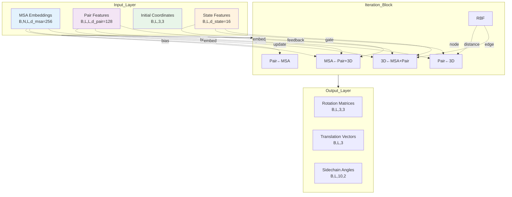

---
slug:13-track-module-design-and-interaction
blog_type:normal
---

本文档全面分析了 RoseTTAFold2 中的三轨架构，探讨了 MSA（多序列比对）、Pair（残基对）和 3D Structure（三维结构）轨道如何通过迭代细化相互作用，以实现高精度的蛋白质结构预测。该架构实现了复杂的信息流，每个轨道通过专门的注意力机制和 SE(3) 等变变换既接收来自其他轨道的信号，也为其他轨道提供信号。

来源：[Track_module.py](network/Track_module.py#L1-L841), [RoseTTAFoldModel.py](network/RoseTTAFoldModel.py#L52-L149)

## 架构概览

三轨设计代表了一项根本性的架构创新，使 RoseTTAFold2 能够对进化信息（MSA）、残基关系和空间几何（3D Structure）进行联合推理。该设计允许模型利用互补的信息来源，其中进化约束引导结构形成，而几何观察则辅助解释序列信号。

迭代模拟架构通过分层块结构协调这些交互。`IterativeSimulator` 实现了三个不同的阶段：额外块（4 次迭代，d_msa_full=64）、主块（12 次迭代，d_msa=256）和细化块（4 次迭代）。每个阶段都有特定的用途——额外块高效处理大型 MSA，主块执行深度特征集成，而细化块应用 SE(3) 等变变换进行最终的坐标优化。

来源：[Track_module.py](network/Track_module.py#L701-L841)

## 轨道交互机制

### 利用多轨偏置更新 MSA 轨道

`MSAPairStr2MSA` 模块实现了使用 Pair 和 3D 轨道信息更新 MSA 表示的基本机制。该模块采用有偏自注意力（biased self-attention），其中注意力偏置将 Pair 特征与从坐标导出的径向基函数（RBF）编码相结合，使 MSA 行能够在关注彼此时感知空间关系。

偏置准备过程将标准化的 Pair 特征与从 Ca-Ca 坐标计算出的嵌入式 RBF 距离特征拼接起来：`pair_rbf = norm_pair(pair) + emb_rbf(rbf_feat)`。该偏置调节行注意力中的权重，允许 MSA 中的进化模式受到当前结构假设的影响。此外，查询序列通过状态投影从 3D 轨道接收直接反馈：`state_proj = proj_state(norm_state(state))`，该反馈在每次迭代时被索引加到第一行 MSA 上。

前向传播遵循一致的模式：带偏置的行注意力 → 列注意力 → 前馈网络，所有操作均带有残差连接。在训练期间，行注意力应用 Dropout 正则化，而推理模式使用原位操作以提高内存效率。

来源：[Track_module.py](network/Track_module.py#L49-L130)

### MSA 到 Pair 的信息聚合

`MSA2Pair` 模块通过外积操作后跟线性投影，将 MSA 信息转换为 Pair 表示。该设计捕获了 MSA 深度维度上的共进化信号，通过平均序列位置来减少噪声并提取一致的模式。

计算遵循以下顺序：标准化 MSA → 分别投影左右维度 → 跨序列计算外积 → 对 MSA 深度求平均 → 投影到 Pair 维度。具体为：`out = proj_out(reshape(einsum('bsli,bsmj->blmij', proj_left(msa), proj_right(msa)/N)))`。初始化策略对于该模块至关重要——输出投影权重初始化为零，偏置也为零，确保初始的 MSA 到 Pair 信息流从零开始，并随着训练逐渐建立。这种残差设计允许模型学习何时以及有多少 MSA 信息应该影响 Pair 表示。

来源：[Track_module.py](network/Track_module.py#L297-L350)

### 使用三角形操作的 Pair 轨道演化

`PairStr2Pair` 模块使用三角形乘法操作和有偏轴向注意力实现核心的 Pair 轨道更新，使模型能够推理残基关系中的几何一致性。该模块接收 Pair 特征、RBF 距离编码和状态特征作为输入，产生更新后的 Pair 表示。

三角形乘法操作通过传出和传入的三角形操作捕获高阶几何关系。这些操作使信息能够沿残基对图中的三角形路径传播，从而强制执行一致性约束。有偏轴向注意力使用从坐标导出的偏置特征来调节这些更新，并由门控机制控制信息流：`gate = sigmoid(to_gate(einsum('bli,bmj->blmij', proj_left(state), proj_right(state))))`。该门控允许模型根据当前状态的置信度动态加权结构信息。

该模块支持条带（内存高效）和全矩阵操作。在条带模式下，操作应用于重叠的子块，并进行仔细的平均以保持跨块边界的连续性。该设计能够在有限的内存约束内处理更长的序列，同时保持 Pair 表示的全局一致性。

来源：[Track_module.py](network/Track_module.py#L132-L296)

## 具有 SE(3) 等变性的 3D 结构轨道

### 结构到结构变换

`Str2Str` 模块实现 SE(3) 等变坐标更新，确保应用于输入结构的几何变换导致预测输出发生相应的变换。该模块将 MSA 和 Pair 特征转换为图表示，应用 SE(3) Transformer 层，并生成旋转/平移更新。

节点特征将来自 MSA 轨道的查询序列与来自上一次迭代的 State 特征相结合：`node = norm_msa(msa[:,0])` 和 `node = embed_node1(seq) + embed_node2(state)`。边缘特征整合 Pair 表示与 RBF 距离编码和序列分离信息：`edge = embed_edge1(norm_pair(pair)) + embed_edge2(concat(rbf_feat, seqsep))`。图构建使用 top-k 邻居选择机制（`make_topk_graph`）来保持计算效率，同时保留局部结构上下文。

SE(3) Transformer 包装器应用多层等变操作，产生类型 0（标量）和类型 1（向量）特征。类型 1 特征被分离为平移分量（`Ts = offset[:,:,0,:] * 10.0`）和旋转分量（`Rs = Qs2Rs(normQ(cat(ones, Qs)))`），它们通过矩阵乘法与输入旋转矩阵组合。

来源：[Track_module.py](network/Track_module.py#L490-L618)

### 侧链角度预测

`SCPred` 模块预测主链和侧链扭转角作为 3D 轨道的最终输出。它以查询序列嵌入和更新的 State 特征作为输入，生成 10 个角度对（cos/sin 表示），覆盖 phi、psi、omega、chi1-4、Cb bend、Cb twist 和 CG 角度。这种全面的角度表示能够从主链坐标重建完整的原子细节。

来源：[Track_module.py](network/Track_module.py#L351-L410)

## 迭代块协调

### 单次迭代架构

`IterBlock` 在单次迭代中编排完整的轨道交互周期。它首先根据当前的 Ca 坐标结合序列分离编码计算 RBF 距离特征：`rbf_feat = rbf(cdist(xyz[:,rows,1], xyz[:,cols,1])) + pos(idx[:,rows], idx[:,cols])`。该距离特征作为所有轨道更新的共享资源。

该块按特定顺序执行操作：MSA 更新（使用 Pair 和 RBF 特征）→ 来自 MSA 的 Pair 更新 → 带三角形操作的 Pair 更新 → 3D 结构更新（使用 MSA、Pair 和 RBF 特征）。此顺序确保先前的更新为后续更新提供信息，从而在轨道间创建级联信息流。可以在训练期间启用梯度检查点以提高内存效率：`msa = checkpoint(msa2msa, msa, pair, rbf_feat, state, strides)`。

来源：[Track_module.py](network/Track_module.py#L619-L700)

### 多相位迭代模拟

`IterativeSimulator` 实现了完整的迭代细化过程，包含三个不同的阶段。额外块（默认 4，d_msa_full=64）以较低的维度处理额外的 MSA 序列，以提高计算效率。主块（默认 12，d_msa=256）以全维度执行深度特征集成。细化块（默认 4）应用 SE(3) 等变变换进行最终的坐标优化。

模拟在每次迭代时维护中间旋转矩阵（`R_s`）、平移向量（`T_s`）和侧链角度（`alpha_s`）的列表，从而支持基于集成的预测和不确定性估计。对于具有对称性的低聚复合物，模拟通过 `update_symm_subs` 和 `update_symm_Rs` 函数应用对称约束，确保预测的结构符合指定的对称操作。

<CgxTip>
在每次迭代前应用于旋转和平移矩阵的 detach 操作（`R_in = R_in.detach()`, `T_in = T_in.detach()`）对于训练稳定性至关重要。这些操作阻止梯度跨多次迭代流动，将每次迭代视为一个独立的优化步骤，同时通过特征表示保持信息流。
</CgxTip>

来源：[Track_module.py](network/Track_module.py#L701-L841)

## 轨道交互中的注意力机制

### 用于 Pair 更新的有偏轴向注意力

`BiasedAxialAttention` 模块实现绑定轴向注意力，其中注意力偏置源自坐标特征。该机制使 Pair 表示能够根据空间关系的调节关注行或列邻居。注意力计算遵循以下模式：`attn = einsum('bnihk,bnjhk->bijh', query, key) + bias`，其中键归一化包括除以序列长度（`key = key / L`）以进行绑定注意力。

门控机制允许动态控制信息流：`gate = sigmoid(to_g(pair))` 和 `out = gate * out`。这使得模型能够根据特征置信度选择性地合并信息。在推理期间，具有可配置步幅值的条带操作实现了对大序列的内存高效处理。

来源：[Attention_module.py](network/Attention_module.py#L419-L530)

### 带有 Pair 偏置的 MSA 行注意力

`MSARowAttentionWithBias` 模块允许 MSA 行在 Pair 特征的偏置下彼此关注。这使得 Pair 轨道中捕获的残基对关系能够为 MSA 中的进化模式提供信息。基于行的注意力机制对于检测跨序列位置的共进化信号特别有效，其中 Pair 偏置为这些进化模式提供了结构上下文。

来源：[Attention_module.py](network/Attention_module.py#L168-L283)

## 内存优化和计算效率

### 用于长序列的条带操作

轨道模块通过可配置的步幅参数支持条带操作，以实现长序列的内存高效处理。此模式处理序列的分块（由步幅定义），并仔细处理重叠和边界。例如，在 `MSA2Pair` 中：`for i in range((L-1)//STRIDE+1): rows = torch.arange(i*STRIDE, min((i+1)*STRIDE, L))`。low_vram 模式通过在计算期间将大型张量临时移动到 CPU 提供了额外的内存节省（在 Pair 操作前 `msa = msa.cpu()`，然后 `msa = msa.to(pair.device)`）。

来源：[Track_module.py](network/Track_module.py#L328-L349)

### 特征维度配置

该架构使用精心设计的维度参数，平衡表示能力与计算效率。默认配置包括主 MSA 轨道的 d_msa=256，额外 MSA 处理的 d_msa_full=64，Pair 表示的 d_pair=128，以及 3D 轨道节点特征的 d_state=16。这些维度反映了不同轨道的相对信息密度——Pair 轨道需要中等维度来高效捕获 L×L 关系，而 3D State 使用专注于局部结构信息的紧凑表示。

来源：[Track_module.py](network/Track_module.py#L620-L643)

| 参数 | 描述 | 默认值 | 用途 |
|-----------|-------------|---------------|---------|
| n_extra_block | 额外 MSA 处理迭代次数 | 4 | 高效处理额外的 MSA 序列 |
| n_main_block | 主迭代细化迭代次数 | 12 | 具有全维度的深度特征集成 |
| n_ref_block | 最终 SE(3) 细化迭代次数 | 4 | 具有 SE(3) 等变性的最终坐标优化 |
| d_msa | MSA 轨道特征维度 | 256 | 进化信息的丰富表示 |
| d_msa_full | 额外 MSA 轨道特征维度 | 64 | 大型 MSA 的高效处理 |
| d_pair | Pair 轨道特征维度 | 128 | 残基关系的平衡表示 |
| d_state | 3D 轨道节点特征维度 | 16 | 紧凑的结构状态表示 |

## 与模型管道的集成

轨道模块通过 `RoseTTAFoldModule.forward` 方法集成到更广泛的 RoseTTAFold2 管道中。在初始嵌入（MSA、pair、state、template）和循环连接之后，模拟器执行迭代细化：`msa, pair, R, T, alpha, state, symmsub = self.simulator(seq, msa_latent, msa_full, pair, xyz[:,:,:3], state, idx, ...)`。输出被馈送到辅助预测器中，包括距离图、PAE（预测对齐误差）、LDDT 置信度分数以及蛋白质复合物的结合/不结合预测。

<CgxTip>
来自所有迭代的旋转矩阵都被保留并堆叠（`R_s = torch.stack(R_s, dim=0)`），从而实现基于集成的预测，其中多个中间结构有助于最终输出。这种设计允许模型表示不确定性，并为下游分析提供多种结构假设。
</CgxTip>

来源：[RoseTTAFoldModel.py](network/RoseTTAFoldModel.py#L115-L149)

轨道模块架构代表了进化、关系和几何推理的复杂集成，使 RoseTTAFold2 能够通过互补信息轨道的迭代细化实现最先进的蛋白质结构预测精度。