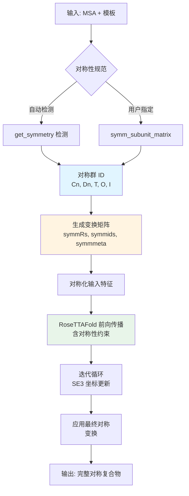
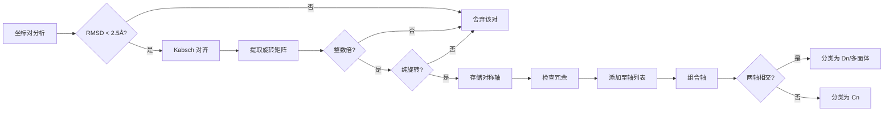

---
slug:15-symmetry-aware-prediction
blog_type:normal
---


RoseTTAFold2 融入了先进的对称感知预测功能，能够精确建模各种对称类型的蛋白质复合物。该系统既支持从结构数据中自动检测对称性，也支持用户指定对称性约束，从而使预测结果符合已知的生物学对称模式。

## 架构概述

对称感知预测系统通过多阶段流水线运行，该流水线在结构预测过程中检测、表示并应用对称性约束。该架构与 RoseTTAFold2 的三轨道设计（MSA、Pair 和 3D Structure 轨道）相结合，确保对称性约束在所有表示层级间保持一致的传播。



对称检测模块分析坐标几何以识别旋转对称轴，计算在对称相关亚基之间进行映射的变换矩阵，并通过 SE(3)-等变网络层传播这些约束。

来源: [network/symmetry.py](network/symmetry.py#L105-L220), [network/RoseTTAFoldModel.py](network/RoseTTAFoldModel.py#L52-L58)

## 对称性检测与分类

对称检测系统通过几何分析流水线，从结构坐标中自动识别蛋白质对称性。`get_symmetry()` 函数执行两轮分析：首先识别单个对称轴，然后组合轴以对完整的对称群进行分类。

### 检测算法

该算法系统性地检查坐标对以识别旋转对称操作：

1. **轴识别**: 使用 Kabsch 对齐寻找坐标集之间的最佳旋转，并通过 RMSD 阈值过滤（默认 `rms_cut=2.5` Å）

2. **旋转表征**: 从旋转矩阵中提取旋转角度和轴，验证整数倍对称性（`nfold_cut=0.1`），并确保没有显著平移的纯旋转（`trans_cut=2.0` Å）

3. **对称群分类**: 遵循多面体对称规则组合检测到的轴，以识别 Cn（循环）、Dn（二面）、T（四面体）、O（八面体）或 I（二十面体）对称性

检测利用几何约束来区分真正的生物学对称性与坐标伪影：



<CgxTip>
`angle_cut=0.05` 参数（约 3°）控制轴对齐检测的灵敏度，在减少误报与检测由实验噪声引起的微小对称偏差之间取得平衡。
</CgxTip>

来源: [network/symmetry.py](network/symmetry.py#L105-L220)

### 支持的对称群

| 对称类型 | 符号 | 亚基数 | 描述 | 变换数量 |
|---------------|----------|----------|-------------|---------------------|
| 非对称 | C1 | 1 | 无旋转对称性 | 1 |
| 循环 | Cn | n | 单个 n 重旋转轴 | n |
| 二面 | Dn | 2n | n 重轴 + n 个垂直 2 重轴 | 2n |
| 四面体 | T | 12 | 四个 3 重 + 三个 2 重轴 | 12 |
| 八面体 | O | 24 | 三个 4 重 + 四个 3 重轴 | 24 |
| 二十面体 | I | 60 | 六个 5 重 + 十个 3 重轴 | 60 |

系统基于特定的轴间角对多面体对称性进行分类：T（3 重+2 重位于 109.47°）、O（4 重+3 重位于 54.74° 或 3 重+2 重位于 35.26°）以及 I（5 重+2 重或 5 重+3 重位于特征角度）。

来源: [network/symmetry.py](network/symmetry.py#L145-L220), [network/symmetry.py](network/symmetry.py#L222-L400)

## 对称变换矩阵

`symm_subunit_matrix()` 函数为每个支持的对称群生成表示所有对称操作的完整变换矩阵。这些矩阵编码了旋转（如适用）和反射，将非对称单元映射到所有对称相关位置。

### 循环对称性 (Cn)

对于 n 重循环对称性，系统围绕 z 轴生成旋转矩阵：

```python
angles = torch.linspace(0, 2*np.pi, nsub+1)[:nsub]
Rs = generateC(angles)  # n 个旋转矩阵
```

变换矩阵通过 `(j-i) mod n` 旋转步骤将亚基 i 映射到亚基 j。偏移量估算将亚基放置在一个圆上：`D = est_radius / sin(π/n)`。

来源: [network/symmetry.py](network/symmetry.py#L7-L12), [network/symmetry.py](network/symmetry.py#L222-L244)

### 二面对称性 (Dn)

二面对称性结合了围绕主轴的 n 重旋转与 n 个垂直的 2 重轴：

```python
angles = torch.linspace(0, 2*np.pi, nsub+1)[:nsub]
Rs = generateD(angles)  # 2n 个旋转矩阵（包含 C2 反射）
```

变换矩阵在四个象限中组织 2n 个亚基，其中对称操作在象限内映射（Cn 操作）以及象限间映射（C2 操作）。

来源: [network/symmetry.py](network/symmetry.py#L16-L25), [network/symmetry.py](network/symmetry.py#L246-L270)

### 多面对称性 (T, O, I)

多面对称群使用带有硬编码变换矩阵的预计算旋转矩阵：

- **四面体 (T)**: 12 个操作，对称群 Td 包含反射
- **八面体 (O)**: 24 个操作，对称群 Oh 包含反射  
- **二十面体 (I)**: 60 个操作，对称群 Ih 包含反射

这些矩阵表示点群中所有唯一的对称操作，条目定义到小数点后 6 位以确保数值稳定性。

来源: [network/symmetry.py](network/symmetry.py#L272-L400)

## 与预测流水线的集成

### 模型接口

`RoseTTAFoldModule` 在其前向传播中接受对称参数：

```python
def forward(self, msa_latent=None, ..., symmids=None, symmsub=None, 
            symmRs=None, symmmeta=None, ...):
    if symmids is None:
        symmids = torch.tensor([[0]], device=xyz.device)  # 默认 C1
    oligo = symmids.shape[0]
```

- `symmids`: 对称群标识符矩阵（大小为 O×O，其中 O = 亚基数）
- `symmsub`: 将模板亚基映射到对称相关位置的索引
- `symmRs`: 所有对称操作的旋转矩阵 (O×3×3)
- `symmmeta`: 元数据，包括用于对称感知的邻域列表

来源: [network/RoseTTAFoldModel.py](network/RoseTTAFoldModel.py#L52-L58)

### 用户指定的对称性

预测接口接受 `symm` 参数用于显式指定对称性：

```python
pred.predict(inputs, out_prefix, symm="C3", ...)
```

特殊的伪对称符号 `X{n}` 创建 n 个副本用于寡聚体预测，而无需几何约束：

```python
# 创建具有独立链的三聚体预测
pred.predict(inputs, out_prefix, symm="X3", ...)
# 内部扩展为: msa_orig, ins_orig = merge_a3m_homo(msa_orig, ins_orig, 3)
```

这对于预测对称性未知或预期具有柔性的寡聚体非常有用。

来源: [network/predict.py](network/predict.py#L251-L320), [network/predict.py](network/predict.py#L320-L345)

### 对称化过程

预测流水线在多个阶段应用对称变换：

1. **MSA 扩展**: `merge_a3m_homo()` 跨对称等效位置扩展 MSA 特征
2. **模板对称化**: 模板坐标和掩膜跨亚基复制
3. **初始坐标**: 起始坐标经变换以反映对称性
4. **前向传播约束**: 网络通过 SE3-等变层维持对称性
5. **最终组装**: 预测的非对称单元坐标经变换生成完整复合物

```python
# 对称化初始坐标
xyz_prev, symmsub = find_symm_subs(xyz_prev[:,:L], symmRs, symmmeta)
Osub = symmsub.shape[0]
xyz_t = xyz_t.repeat(1, 1, Osub, 1, 1)
```

来源: [network/predict.py](network/predict.py#L340-L360), [network/predict.py](network/predict.py#L560-L580)

## 使用对称性约束进行训练

在训练期间，`featurize_homo()` 函数使用自动对称检测准备同源寡聚体样本：

```python
symmgp, symmsubs = get_symmetry(xyz, mask)
nsubs = len(symmsubs) + 1
```

系统处理几种训练场景：

1. **对称寡聚体**: 对于 Cn/Dn 对称性，在所有亚基上裁剪一致区域以保持对应关系
2. **非对称二聚体**: 视为 C1 情况，预测完整二聚体而无对称约束
3. **残基裁剪**: 在所有亚基上选择相同的残基位置以确保一致性
   ```python
   crop_idx = get_crop(L, mask[0,:L], device, params['CROP']//cropsub, unclamp=False)
   crop_idx_complete = torch.cat([crop_idx + i*L for i in range(nsub)])
   ```

训练使用对称感知裁剪来平衡计算效率与维持界面区域：
- C1: cropsub=2
- Cn: cropsub=min(3, n)
- Dn: cropsub=min(5, 2n)
- 多面体: cropsub=6

来源: [network/data_loader.py](network/data_loader.py#L625-L760)

## 输出生成

预测完成后，通过将对称变换应用于预测的非对称单元来组装完整的对称复合物：

```python
best_xyzfull = torch.zeros((B, O*Lasu, 27, 3))
best_xyzfull[:, :Lasu] = best_xyz[:, :Lasu]
for i in range(1, O):
    best_xyzfull[:, (i*Lasu):((i+1)*Lasu)] = 
        torch.einsum('ij,braj->brai', symmRs[i], best_xyz[:, :Lasu])
```

输出包括：
- 所有对称相关链的完整坐标
- 跨对称拷贝传播的置信度分数
- 链内和链间接触的预测对齐误差 (PAE)
- 带有适当链注释和代表置信度的 B 因子的 PDB 文件

来源: [network/predict.py](network/predict.py#L580-L605)

## 实际应用

对称感知预测实现了几个重要的用例：

1. **生物复合物建模**: 精确预测具有已知对称性的同源寡聚复合物（例如，病毒衣壳、酶复合物）
2. **界面一致性**: 确保对称等效界面在几何上是一致的
3. **计算效率**: 仅预测非对称单元，减少计算需求
4. **模板整合**: 组合覆盖不同对称相关亚基的部分模板

要获得对称感知预测的最佳结果，建议查阅 [三轨道设计](6-three-track-design-msa-pair-and-3d-structure-tracks) 以了解对称约束如何通过网络架构传播，以及 [SE(3)-等变 Transformer 网络](7-se-3-equivariant-transformer-network) 以理解在坐标更新期间如何维持几何约束。