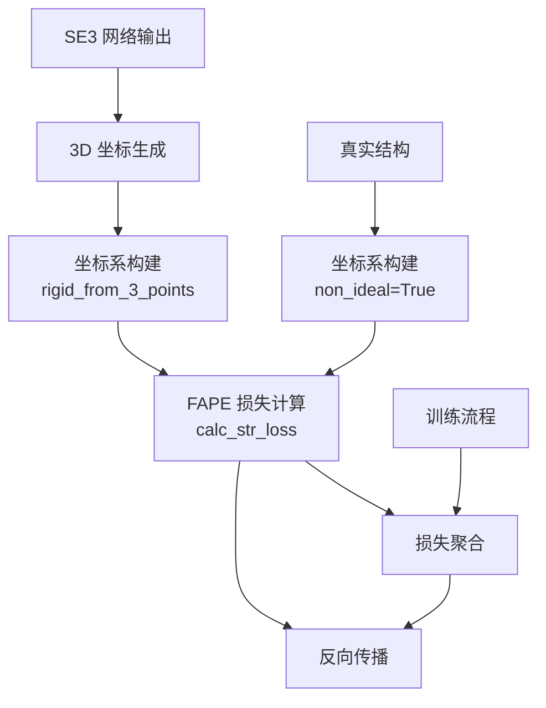

---
slug:16-fape-frame-aligned-point-error-loss
blog_type:normal
---


帧对齐点误差（FAPE）损失是一种旋转不变的几何损失函数，通过在局部坐标系中比较预测的原子位置与真实位置来衡量结构精度。这种方法使得蛋白质结构预测的精确训练不受整个分子全局旋转和平移的影响。

## 数学基础

FAPE 损失通过将原子坐标从全局笛卡尔空间转换到局部残基坐标系，然后在此帧对齐表示中计算预测点与真实点之间的距离来运作。对于每个残基，利用主链 N、Cα 和 C 原子构建一个局部坐标系，该坐标系随蛋白质结构移动。

数学公式遵循以下模式：

```
FAPE = (1/Z) × mean(min(‖Rᵀ(x - T) - Rₙₐₜᵀ(xₙₐₜ - Tₙₐₜ)‖, d_clamp))
```

其中 R、T 是定义局部坐标系的旋转矩阵和平移向量，x 表示原子坐标，d_clamp 限制大误差的最大贡献，以防止异常值主导。

## 坐标系生成

FAPE 损失的基础在于利用主链原子构建稳健的局部坐标系。`rigid_from_3_points()` 函数利用 N、Cα 和 C 位置实现了这一点，为每个残基创建标准正交基向量：

来源：[util.py](/network/util.py#L75-L103)

```python
def rigid_from_3_points(N, Ca, C, non_ideal=False, eps=1e-8):
    # 从三个主链原子创建标准正交基
    v1 = C - Ca
    v2 = N - Ca
    e1 = v1 / (torch.norm(v1, dim=-1, keepdim=True) + eps)
    u2 = v2 - (torch.einsum('bli, bli -> bl', e1, v2)[...,None] * e1)
    e2 = u2 / (torch.norm(u2, dim=-1, keepdim=True) + eps)
    e3 = torch.cross(e1, e2, dim=-1)
    R = torch.cat([e1[...,None], e2[...,None], e3[...,None]], axis=-1)
    return R, Ca  # 旋转矩阵和原点
```

坐标系构建创建了一个右手坐标系，其中 e1 从 Cα 指向 C，e2 位于 N-Cα-C 平面内，e3 与两者正交。这提供了一个一致的局部参考坐标系，能够捕捉每个残基的局部结构几何特征。

## FAPE 损失实现

### 主链 FAPE 计算

`calc_str_loss()` 中的主要实现专门处理主链原子，这是蛋白质折叠的核心结构损失：

来源：[loss.py](/network/loss.py#L62-L110)

```python
def calc_str_loss(pred, true, logit_pae, mask_2d, same_chain, 
                  negative=False, d_clamp=10.0, d_clamp_inter=30.0, 
                  A=10.0, gamma=1.0, eps=1e-6):
    '''
    计算主链 FAPE 损失
    输入:
        - pred: 预测坐标 (I, B, L, n_atom, 3)
        - true: 真实坐标 (B, L, n_atom, 3)
    输出: str loss
    '''
    # 获取预测值和真实值的帧对齐点向量
    t_tilde_ij = get_t(true[:,:,:,0], true[:,:,:,1], true[:,:,:,2], non_ideal=True)
    t_ij = get_t(pred[:,:,:,0], pred[:,:,:,1], pred[:,:,:,2])
    
    # 计算对齐向量之间的欧几里得距离
    difference = torch.sqrt(torch.square(t_tilde_ij-t_ij).sum(dim=-1) + eps)
    
    # 应用距离截断（链内 vs 链间）
    clamp = torch.where(same_chain.bool(), d_clamp, d_clamp_inter)
    clamp = clamp[None]
    difference = torch.clamp(difference, max=clamp)
    
    # 归一化并应用掩码
    loss = difference / A
    mask = mask_2d if not negative else mask_2d * same_chain
    loss = (mask[None]*loss).sum(dim=(1,2,3)) / (mask.sum()+eps)
    
    # 在循环迭代中应用指数加权
    w_loss = torch.pow(torch.full((I,), gamma, device=pred.device), 
                      torch.arange(I, device=pred.device))
    w_loss = torch.flip(w_loss, (0,))
    w_loss = w_loss / w_loss.sum()
    tot_loss = (w_loss * loss).sum()
    
    return tot_loss, loss.detach()
```

<CgxTip>距离截断参数（链内 d_clamp=10.0Å，链间 d_clamp_inter=30.0Å）防止大的结构误差主导损失，允许模型专注于局部结构精度，同时仍然惩罚全局错误折叠。</CgxTip>

### 帧对齐向量计算

`get_t()` 函数计算残基对之间的帧对齐向量：

来源：[loss.py](/network/loss.py#L54-L60)

```python
def get_t(N, Ca, C, non_ideal=False, eps=1e-5):
    I,B,L = N.shape[:3]
    Rs, Ts = rigid_from_3_points(N.view(I*B,L,3), Ca.view(I*B,L,3), 
                                 C.view(I*B,L,3), non_ideal=non_ideal, eps=eps)
    Rs = Rs.view(I,B,L,3,3)
    Ts = Ts.view(I,B,L,3)
    t = Ts[:,:,None] - Ts[:,:,:,None]  # 从残基 i 到残基 j 的向量
    return einsum('iblkj, iblmk -> iblmj', Rs, t)  # 变换到局部坐标系
```

该实现计算所有残基对之间的位移向量，并将其旋转到源残基的局部坐标系中，产生用于比较的帧不变表示。

### 通用 FAPE 计算

`compute_FAPE()` 中更通用的实现提供了核心数学运算：

来源：[loss.py](/network/loss.py#L262-L269)

```python
def compute_FAPE(Rs, Ts, xs, Rsnat, Tsnat, xsnat, Z=10.0, dclamp=10.0, eps=1e-4):
    # 将点变换到局部坐标系
    xij = torch.einsum('rji,rsj->rsi', Rs, xs[None,...] - Ts[:,None,...])
    xij_t = torch.einsum('rji,rsj->rsi', Rsnat, xsnat[None,...] - Tsnat[:,None,...])
    
    # 计算截断距离
    diff = torch.sqrt(torch.sum(torch.square(xij-xij_t), dim=-1) + eps)
    loss = (1.0/Z) * (torch.clamp(diff, max=dclamp)).mean()
    
    return loss
```

该函数直接实现了 FAPE 公式，将任意点集变换到局部坐标系并计算它们的帧不变距离。

## 在训练流程中的集成

FAPE 损失通过 `Trainer.calc_loss()` 方法集成到训练流程中，该方法结合了多个损失组件：

来源：[train_multi_deep.py](/network/train_multi_deep.py#L231-L240)

```python
# 结构损失 - 主链 FAPE
if unclamp: 
    tot_str, str_loss, pae_loss = calc_str_loss(pred, true, logit_pae,
                                               mask_2d, same_chain, 
                                               negative=negative,
                                               A=10.0, d_clamp=None)
else:
    tot_str, str_loss, pae_loss = calc_str_loss(pred, true, logit_pae,
                                               mask_2d, same_chain, 
                                               negative=negative,
                                               A=10.0, d_clamp=10.0)
tot_loss += (1.0-w_all)*w_str*tot_str
```

训练支持截断和非截断版本，默认配置使用距离截断以防止大误差在训练早期主导。

## 关键设计特性

### 循环迭代加权

实现对循环迭代应用指数加权，更加重视发生结构精修的后续迭代。加权因子 `gamma`（默认 1.0）控制这种衰减：

来源：[loss.py](/network/loss.py#L95-L97)

```python
w_loss = torch.pow(torch.full((I,), gamma, device=pred.device), 
                  torch.arange(I, device=pred.device))
w_loss = torch.flip(w_loss, (0,))
w_loss = w_loss / w_loss.sum()
```

### 掩码策略

FAPE 损失采用复杂的掩码来处理缺失区域和链边界：

- **Mask_2d**：指示有效残基对的 2D 成对掩码
- **Same_chain**：区分链内和链间对的布尔掩码
- **Negative mode**：在负样本（非相互作用蛋白质）上训练时，仅考虑链内对

### 参数配置

关键 FAPE 参数及其典型值：

| 参数 | 默认值 | 用途 |
|-----------|---------|---------|
| `d_clamp` | 10.0 Å | 最大链内误差贡献 |
| `d_clamp_inter` | 30.0 Å | 最大链间误差贡献 |
| `A` | 10.0 | 归一化缩放因子 |
| `gamma` | 1.0 | 循环迭代加权 |
| `eps` | 1e-6 | 数值稳定性常数 |

<CgxTip>链内（10Å）与链间（30Å）不同的截断值反映了与局部折叠相对于结构域间相互作用相关的不同距离尺度，允许损失在不同的范围内适当地加权结构精度。</CgxTip>

## 架构背景

FAPE 损失在 RoseTTAFold2 更广泛的三轨道架构内运作：



FAPE 损失接收来自 SE3 网络的预测坐标，并将其与真实结构进行比较，两种表示在比较前都被转换到各自的局部坐标系中。

## FAPE 损失的优势

FAPE 损失为蛋白质结构预测提供了几个关键优势：

1. **旋转不变性**：通过在局部坐标系中运作，损失对整个结构的全局旋转不敏感，纯粹专注于局部几何精度。

2. **距离截断**：防止异常误差主导训练，使模型能够首先专注于局部结构保真度，然后再解决全局拓扑结构。

3. **多尺度敏感性**：链内和链对的不同截断值允许适当地加权局部折叠相对于结构域排列。

4. **迭代精修**：循环迭代的指数加权强调了后续周期中改进的预测。

5. **掩码计算**：高效处理缺失区域和链边界，使得能够在部分结构和多链复合物上进行训练。

这些特性的组合使 FAPE 损失特别适合于训练蛋白质结构预测模型，这些模型必须同时学习局部主链几何和全局三级结构。

## 后续步骤

要了解 FAPE 损失如何与其他训练目标集成，请探索 [多组件损失（距离、角度、LDDT、PAE）](17-multi-component-loss-distance-angle-lddt-pae) 中的综合损失架构。如需深入了解生成由 FAPE 评估的坐标的结构预测流程，请参阅 [使用 SE3 层生成坐标](14-coordinate-generation-with-se3-layers)。