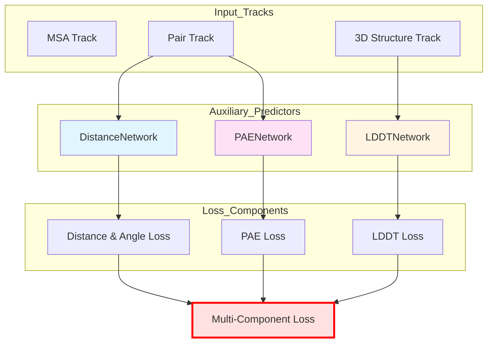

---
slug:17-multi-component-loss-distance-angle-lddt-pae
blog_type:normal
---

RoseTTAFold2 采用了一种复杂的多组件损失函数，结合了几何、结构和置信度估计损失。这种复合损失同时优化主链结构预测和辅助置信度指标，使模型能够生成准确的蛋白质结构，并提供可靠的残基间和残基内置信度估计。

## 架构概述

多组件损失通过专用的辅助网络整合了四种不同的预测模态，这些网络在不同的特征表示上运行。距离和角度预测利用来自 Pair 轨道的成对表示，而 LDDT 利用来自 3D 轨道的结构状态特征，PAE 则在成对距离信息上运行以预测残基间对齐误差。

## 距离和角度损失

距离和角度损失组件评估 6D 坐标预测的准确性——包括残基间距离、主链二面角 (omega) 和极向角度 (theta, phi)。这些预测共同编码了残基对之间的完整相对几何关系。

### 6D 坐标表示

6D 坐标捕获残基对之间的四个几何参数：(1) Cβ-Cβ 距离，(2) ω 二面角 (Ca-Cb-Cb-Ca)，(3) θ 二面角 (N-Ca-Cb-Cb)，以及 (4) φ 平面角 (Ca-Cb-Cb)。这些坐标通过 [network/coords6d.py](network/coords6d.py#L36-L81) 中的 `get_coords6d` 函数计算，该函数从 N、Ca、C 主链原子重建 Cβ 位置，并计算指定距离阈值内残基对之间的空间关系。

### DistanceNetwork 架构

[network/AuxiliaryPredictor.py](network/AuxiliaryPredictor.py#L5-L36) 中的 `DistanceNetwork` 类实现了用于对称和非对称角度预测的双重投影头。对称头预测距离 (37 个 bin) 和 omega (37 个 bin) 分布，通过 logits 平均强制执行成对对称性，而非对称头预测 theta (37 个 bin) 和 phi (19 个 bin) 而无对称约束。这种设计反映了物理现实：距离和 omega 角在残基对之间是对称的，而极坐标取决于所选的参考系。

### 损失计算

距离-角度损失通过 [network/loss.py](network/loss.py#L44-L52) 中的 `calc_c6d_loss` 计算，该函数对四个角度分量中的每一个独立应用交叉熵损失。对于每个分量，损失进行掩码处理以考虑缺失的残基，并且在负训练情况（非相互作用链）中，忽略链间相互作用。来自所有四个分量的损失值作为堆叠张量返回，用于下游加权。

<CgxTip>
DistanceNetwork 中投影层权重的零初始化对于稳定训练至关重要。这确保网络从均匀预测开始，逐渐学习专门的分布，而不会对任何特定距离或角度范围产生初始偏差。
</CgxTip>

### 预测 Bin

距离预测使用跨越距离范围的 37 个 bin，而角度分布根据角度类型离散化为不同数量的 bin。Bin 离散化使模型能够输出概率分布而非点估计，这自然地编码了预测不确定性，并支持基于预测置信度的下游损失加权。

来源：[network/AuxiliaryPredictor.py](network/AuxiliaryPredictor.py#L5-L36), [network/loss.py](network/loss.py#L44-L52), [network/coords6d.py](network/coords6d.py#L36-L81)

## LDDT 损失

局部距离差分测试 (LDDT) 损失通过将预测的原子间距离误差与真实 LDDT 分数进行比较，来优化每残基置信度估计。该组件确保模型学习准确预测结构的哪些区域是可靠的。

### LDDTNetwork 架构

[network/AuxiliaryPredictor.py](network/AuxiliaryPredictor.py#L54-L77) 中的 `LDDTNetwork` 通过具有层归一化和 ReLU 激活的两层 MLP 架构处理单轨道特征（3D 结构状态）。网络在 50 个 bin 上输出 logits，表示范围从 0 到 1 的 LDDT 分数，这些 logits 被置换为形状 (B, n_bin, L) 以与损失计算兼容。该架构对隐藏层使用 Kaiming 初始化，对最终投影使用零初始化，反映了其他辅助预测器的设计理念。

### 基于 CA 的 LDDT 计算

[network/loss.py](network/loss.py#L569-L594) 中基于 CA 的 LDDT 实现仅使用 Cα 原子评估主链几何结构，提供整体折叠准确性的快速评估。对于真实结构中彼此距离在 15Å 内的每个残基对，算法计算预测的 Cα-Cα 距离与真实距离之间的绝对差值。该差值在四个距离 bin（0.5Å、1.0Å、2.0Å、4.0Å）上进行阈值处理，每个 bin 对最终 LDDT 分数贡献 25%。每残基 LDDT 通过对有效配对的成对分数进行平均计算，然后对整个蛋白质进行平均以产生全局指标。

### 包含预测损失的全原子 LDDT

[network/loss.py](network/loss.py#L596-L641) 中的综合全原子 LDDT 实现将基于 CA 的方法扩展到每个残基的所有 14 个标准重原子。该函数从完整的原子结构计算真实的 LDDT 值，并同时评估 LDDT 预测网络的准确性。预测损失通过将真实 LDDT 值离散化为 50 个 bin 并对网络预测的 bin 概率应用交叉熵损失来计算。该双重用途函数返回预测损失（用于反向传播）和真实 LDDT 值（用于监控和验证）。

<CgxTip>
LDDT 计算中的 15Å 距离截止将损失函数集中在局部结构准确性上，这对于对接和界面预测等下游应用至关重要。该阈值确保全局域移动不会过分惩罚其他方面准确的局部结构。
</CgxTip>

### 掩码策略

LDDT 损失计算实现了复杂的掩码以处理缺失数据和训练场景。成对掩码排除：(1) 真实结构中超过 15Å 的残基对，(2) 涉及缺失原子的对，(3) 同一残基内的对，以及 (4) 在负训练情况中，链间对。这确保损失仅评估真实结构信息可用且相关的区域。

来源：[network/AuxiliaryPredictor.py](network/AuxiliaryPredictor.py#L54-L77), [network/loss.py](network/loss.py#L569-L594), [network/loss.py](network/loss.py#L596-L641)

## PAE 损失

预测对齐误差 (PAE) 损失通过训练模型估计当结构最佳叠加时残基对之间的预期对齐误差，来优化残基间置信度预测。该组件对于评估全局折叠可靠性和识别潜在的域级误差至关重要。

### PAENetwork 架构

[network/AuxiliaryPredictor.py](network/AuxiliaryPredictor.py#L100-L112) 中的 `PAENetwork` 提供了从成对特征到 PAE bin 预测的轻量级单层投影。网络在 64 个 bin 上输出 logits，跨度从 0.5Å 到 32Å 的误差范围（每个 bin 间距 0.5Å）。与其他辅助预测器一样，它使用零初始化权重以确保从均匀初始预测开始的稳定训练。

### PAE 损失计算

PAE 损失集成在 [network/loss.py](network/loss.py#L62-L111) 的 `calc_str_loss` 函数中，该函数共同计算主链 FAPE (Frame-Aligned Point Error) 损失和 PAE 预测损失。FAPE 组件通过比较预测和真实主链坐标框架来量化结构准确性，而 PAE 组件训练置信度估计器。

PAE 标签生成过程计算所有循环迭代中预测结构和真实结构之间的真实对齐误差。对于每个残基对，算法从最终循环迭代中提取最佳对齐框架并将其应用于所有中间预测。PAE 标签计算为框架对齐后对应点之间的最小距离，这捕获了 PAE 网络应该预测的真实误差。

### 与结构损失的集成

PAE 损失展示了与结构训练目标的复杂集成。FAPE 损失使用跨循环迭代的指数加权（由 gamma 参数控制），给予后期、更精细的预测更高的重要性。相比之下，PAE 损失使用最终迭代的对齐来评估所有中间预测，创建了一个丰富的训练信号，教导模型在多个细化阶段预测对齐误差。

### 距离限制和链处理

FAPE 组件实现了依赖距离的限制以限制大误差的影响。链内对使用默认的 10Å 限制，而链间对使用 30Å，反映了跨链的域移动通常更大的预期。对于负训练情况（非相互作用链），损失仅评估链内对，确保模型不学习预测不正确的相互作用。

来源：[network/AuxiliaryPredictor.py](network/AuxiliaryPredictor.py#L100-L112), [network/loss.py](network/loss.py#L62-L111)

## 损失集成和加权

完整的多组件损失在 [network/train_multi_deep.py](network/train_multi_deep.py#L150-L332) 中 Trainer 类的 `calc_loss` 方法中组装。该函数协调所有损失组件的评估，采用适当的加权和掩码策略。

### 损失组件摘要

| 组件 | 权重参数 | 描述 | 关键函数 |
|-----------|-----------------|-------------|--------------|
| 距离和角度 | `w_dist` (默认 1.0) | 6D 坐标准确性 | `calc_c6d_loss` |
| LDDT | `w_lddt` (默认 1.0) | 每残基置信度 | `calc_allatom_lddt_w_loss` |
| PAE | `w_pae` (默认 1.0) | 残基间对齐误差 | 集成在 `calc_str_loss` 中 |
| 主链 FAPE | `w_str` (默认 1.0) | 主链结构准确性 | `calc_str_loss` |
| 全原子 FAPE | `w_all` (默认 0.5) | 全原子准确性 | `compute_FAPE` |
| 扭转角 | `w_str` (默认 1.0) | 侧链构象 | `torsionAngleLoss` |

### 损失计算流程

损失计算遵循精心编排的顺序，利用共享的中间计算。首先，使用主链原子评估基于坐标的损失 (FAPE, PAE)。接下来，重建全原子结构以进行全原子 FAPE 和 LDDT 评估。最后，使用重建的原子坐标计算辅助损失（扭转角、键几何、基于物理的项）。

### 掩码协调

所有损失组件使用协调的掩码策略来处理缺失数据和特殊训练场景。`mask_2d` 张量识别有效的残基对，`mask_BB` 识别有效的主链残基，`mask_crds` 识别有效的原子。对于负训练情况（蛋白质-蛋白质相互作用负样本），`same_chain` 张量确保损失仅评估链内相互作用，防止模型学习不正确的链间接触。

来源：[network/train_multi_deep.py](network/train_multi_deep.py#L150-L332)

## 训练动态

多组件损失函数在训练迭代中演变，不同组件在学习的不同阶段占主导地位。

### 早期训练动态

在早期训练期间，距离和角度损失通常占主导地位，因为模型学习建立正确的粗粒度几何结构。这些损失的交叉熵公式即使在预测远未正确时也能提供强梯度，使折叠拓扑结构能够快速改进。

### 中期细化

随着训练的进行，FAPE 和 LDDT 损失对于细化结构细节变得越来越重要。跨循环迭代的指数加权鼓励模型专注于改进后期迭代，而 LDDT 预测损失在结构准确性提高时教授置信度估计。

### 后期专业化

在训练的最后阶段，基于物理的损失（Lennard-Jones、氢键）和扭转角损失微调原子级细节。PAE 损失继续为置信度估计提供信号，确保对局部和全局不确定性的准确预测。

### 监控和验证

训练器返回包含所有组件损失和指标（包括真实 LDDT 分数）的综合损失向量用于监控。这 enables 详细分析哪些损失组件正在驱动优化并识别潜在的故障模式。验证周期在训练周期内跟踪总损失和单个组件。

来源：[network/train_multi_deep.py](network/train_multi_deep.py#L150-L332), [network/train_multi_deep.py](network/train_multi_deep.py#L673-L752)

## 后续步骤

了解了多组件损失架构后，读者应详细探索 [FAPE (Frame-Aligned Point Error) Loss](16-fape-frame-aligned-point-error-loss) 中的 FAPE 损失实现，以了解如何量化主链结构准确性。对于实际应用，[LDDT and PAE Confidence Estimation](21-lddt-and-pae-confidence-estimation) 解释了如何在结构评估和模型选择中使用这些置信度预测。完整的训练流水线在 [Training Pipeline with Distributed Data Parallel](19-training-pipeline-with-distributed-data-parallel) 中描述。