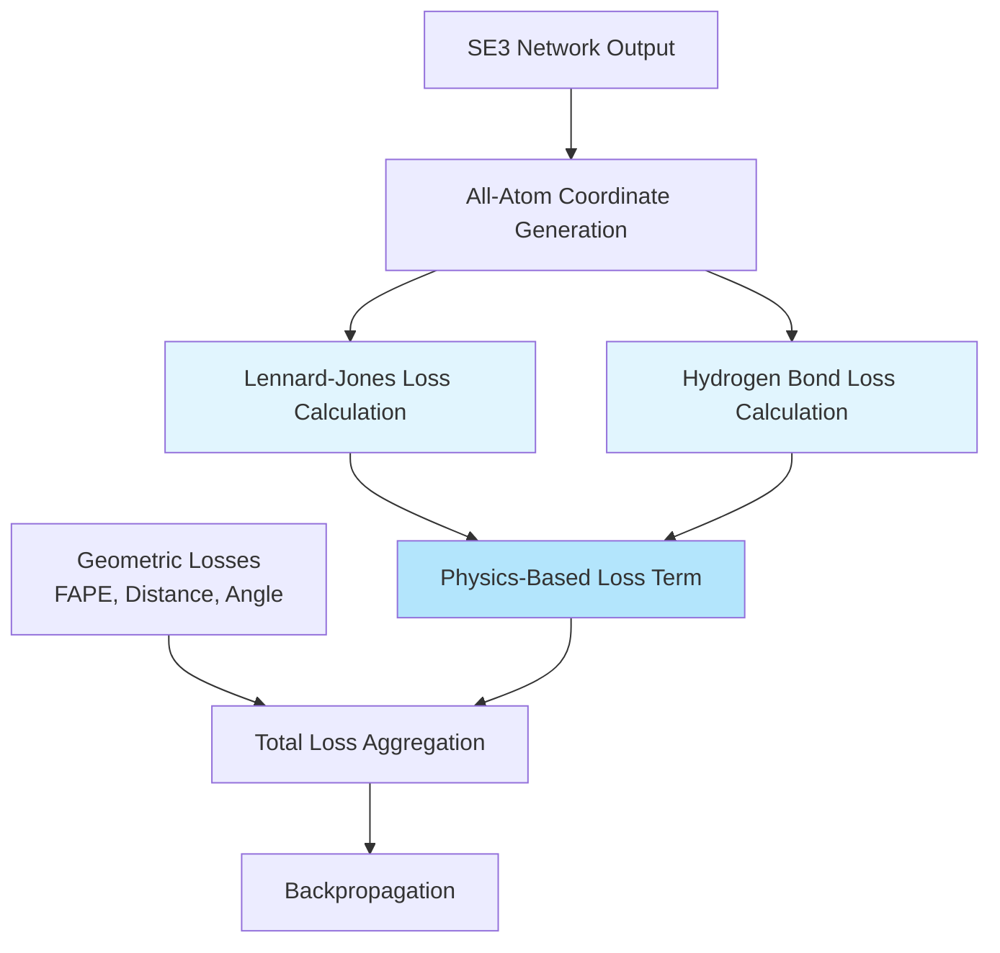
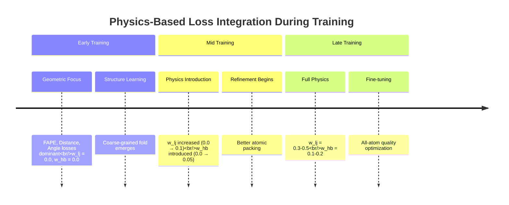

---
slug:18-physics-based-losses-lennard-jones-hydrogen-bonds
blog_type:normal
---


本页面记录了 RoseTTAFold2 在训练过程中基于物理的能量项实现。Lennard-Jones 和氢键损失弥补了数据驱动的结构预测与基础物理化学原理之间的差距，鼓励模型学习符合物理现实的原子相互作用。这些损失通过强制执行对稳定蛋白质结构必不可少的适当范德华堆积和氢键模式，补充了几何和基于距离的损失。

## 架构集成

基于物理的损失在训练流程的全原子级别运行，集成在 SE(3) 网络生成 3D 坐标之后、最终损失聚合之前。Lennard-Jones 势能惩罚原子冲突，同时奖励适当的范德华接触，而氢键损失则明确模拟稳定二级和三级结构的方向性静电相互作用。



基于物理的损失从最终循环迭代接收预测坐标，并应用源自 Rosetta 力场参数的参数化能量函数。与主要的 FAPE 和距离损失相比，这些损失在训练早期通常权重较低，但为细粒度的原子堆积提供了关键的正则化。

来源：[network/train_multi_deep.py](network/train_multi_deep.py#L314-L327), [network/loss.py](network/loss.py#L365-L567)

## Lennard-Jones 势能损失

### 数学公式

Lennard-Jones 损失实现了带有线性切换函数的修正 12-6 势能，以处理标准 LJ 势能在极短距离下变得数值不稳定的情况。势能函数定义为：

```
ljE = epsilon × [(σ/d)^12 - 2 × (σ/d)^6]
```

其中 σ (sigma) 代表组合的范德华半径，ε (epsilon) 代表相互作用原子对的组合势阱深度。实现在 `lj_lin × σ` 以下的距离处添加了线性修正项，以确保平滑的梯度：

```python
linpart = dist < lj_lin * sigma
deff[linpart] = lj_lin * sigma[linpart]
# Linear correction term
ljE[linpart] += epsilon[linpart] × (-12×sd12 + 12×sd6) × (dist - deff)
```

线性切换点由 `lj_lin=0.75` 控制，该值决定了势能惩罚原子冲突的剧烈程度。较小的值会产生更激进的冲突惩罚。

来源：[network/loss.py](network/loss.py#L370-L388)

### 参数系统和原子类型

Lennard-Jones 势能使用来自 Rosetta 的 `fa_atr`（吸引）和 `fa_rep`（排斥）项的原子特定参数。20 种标准氨基酸中的每一种都使用原子特定的 σ 和 ε 值进行参数化：

| 参数 | 描述 | 来源 |
|-----------|-------------|--------|
| `ljlk_parameters[seq, atom, 0]` | σ (sigma) - 范德华半径 | [network/chemical.py](network/chemical.py) |
| `ljlk_parameters[seq, atom, 1]` | ε (epsilon) - 势阱深度 | [network/chemical.py](network/chemical.py) |
| `lj_correction_parameters[seq, atom, 0]` | 氢键受体标志 | [network/train_multi_deep.py](network/train_multi_deep.py#L133) |
| `lj_correction_parameters[seq, atom, 1]` | 氢键供体标志 | [network/train_multi_deep.py](network/train_multi_deep.py#L133) |
| `lj_correction_parameters[seq, atom, 2]` | 氢原子标志 | [network/train_multi_deep.py](network/train_multi_deep.py#L133) |
| `lj_correction_parameters[seq, atom, 3]` | 二硫键能力标志 | [network/train_multi_deep.py](network/train_multi_deep.py#L133) |

原子对的组合参数使用 Lorentz-Berthelot 组合规则计算：
- σij = σi + σj (算术平均)
- εij = √(εi × εj) (几何平均)

来源：[network/loss.py](network/loss.py#L434-L449)

### 特殊距离修正

该实现包括针对生物学相关相互作用的几种特殊距离修正：

**氢键修正**：当潜在的氢键供体和受体相互作用时，范德华距离被调整为 `lj_hb_dis=3.0` Å，允许比标准非键合接触更接近的距离：

```python
use_hb_dis = ljcorr[seq[si],ai,0]*ljcorr[seq[sj],aj,1] + ljcorr[seq[si],ai,1]*ljcorr[seq[sj],aj,0]
ljrs[use_hb_dis] = lj_hb_dis
```

**羟基供体修正**：对于既可作为供体又可作为受体的 OH 基团，使用特定的距离 `lj_OHdon_dis=2.6` Å：

```python
use_ohdon_dis = ljcorr[seq[si],ai,0]*ljcorr[seq[si],ai,1]*ljcorr[seq[sj],aj,0] 
              + ljcorr[seq[si],ai,0]*ljcorr[seq[sj],aj,0]*ljcorr[seq[sj],aj,1]
```

**氢-氢修正**：当包含氢原子时 (`use_H=True`)，H-H 相互作用对适当的供体-受体对使用 `lj_hbond_hdis=1.75` Å。

**二硫键修正**：对于能够形成二硫键的半胱氨酸-半胱氨酸对，排斥项 (σ) 设置为零，允许模拟共价键的极近距离：

```python
potential_disulf = ljcorr[seq[si],ai,3]*ljcorr[seq[sj],aj,3]
ljss[potential_disulf] = 0.0
```

来源：[network/loss.py](network/loss.py#L425-L449)

### 掩蔽和排除策略

Lennard-Jones 损失使用复杂的掩蔽来避免计算无关或可能产生误导的相互作用的能量：

**自相互作用排除**：排除下三角对：
```python
idxes1r = torch.tril_indices(L,L,-1)
mask[idxes1r[0],:,idxes1r[1],:] = False
```

**残基内排除**：同一残基内的原子对被掩蔽，除非被 >3 个化学键隔开：
```python
mask[idxes2r,:,idxes2r,:] *= num_bonds[seq,:,:] > 3  # intra-residue
```

**残基间排除**：相邻残基对遵循类似的基于键的排除：
```python
mask[idxes2r[:-1],:,idxes2r[1:],:] *= (
    num_bonds[seq[:-1],:,2:3] + num_bonds[seq[1:],0:1,:] + 1 > 3
)
```

**二硫键对排除**：CYS-CYS 对完全从 LJ 计算中排除，以避免惩罚共价二硫键：
```python
is_CYS = (seq == aa2num['CYS'])
is_CYS_pair = is_CYS[:,None]*is_CYS[None,:]
mask *= ~is_CYS_pair.view(L,1,L,1)
```

**链隔离**：对于负训练样本（诱饵），忽略链间相互作用：
```python
if negative:
    mask *= same_chain.bool()[:,None,:,None]
```

<CgxTip>
使用 `num_bonds[seq] > 3` 的基于键的排除策略对于防止 LJ 损失惩罚共价键合或 1,3-相互作用原子至关重要。这种排除反映了物理力场设计，其中键合项与非键合范德华相互作用分开处理。
</CgxTip>

来源：[network/loss.py](network/loss.py#L390-L421)

### 逐残基聚合模式

Lennard-Jones 损失可以由 `reswise` 参数控制的两种模式下运行：

**逐原子模式** (`reswise=False`，默认)：返回所有成对相互作用的归一化和：
```python
if normalize:
    return torch.sum(ljval) / torch.sum(aamask[seq])
else:
    return torch.sum(ljval)
```

**逐残基模式** (`reswise=True`)：按残基对聚合能量，返回 L×L 矩阵，对于识别有问题的残基-残基接触非常有用：
```python
if reswise:
    ljval_res = torch.zeros_like(mask.float())
    ljval_res[si,ai,sj,aj] = ljval
    ljval_res = ljval_res.sum(dim=(1,3))  # Sum over atoms
    ljval_res = ljval_res + ljval_res.permute(1,0)  # Symmetrize
    return ljval_res.sum(dim=-1)
```

来源：[network/loss.py](network/loss.py#L453-L464)

## 氢键损失

### 几何模型概述

氢键损失实现了一个方向性势能，奖励最佳的 D-H···A (供体-氢···受体) 几何形状。与简化的基于距离的氢键评分不同，该模型明确考虑了三个几何自由度：

1. **距离 (AH)**：受体-氢分离
2. **受体角 (AHD)**：受体-氢-供体之间的角度
3. **基角 (BAH)**：涉及受体基原子的角度，以考虑杂化

总氢键能量计算为：
```
E_hb = E_distance(AH) + E_angle(AHD) + E_hybrid(BAH, hybridization)
```

来源：[network/loss.py](network/loss.py#L466-L567)

### 特定杂化处理

该损失处理三种不同的杂化状态，每种都需要不同的几何处理：

| 杂化 | 典型原子 | 角度处理 | 特殊处理 |
|--------------|---------------|-------------------|------------------|
| **SP2** | 羰基 O，芳香 N，平面羰基 C | 带有 χ 修正的单个 BAH 角 | 实现依赖于 BAH 的各向异性 |
| **SP3** | Sp3 N (胺)，sp3 O (醇) | 双 BAH 角 (B 和 B₀) | 两个基向量的 Softmax 组合 |
| **RING** | 芳香杂环 | 平均基向量 (Bₘ) | 单个平均基角 |

杂化状态在 `hbtypes[seq, atom, 2]` 中编码，使用来自评分模块的 `HbHybType` 枚举。

来源：[network/loss.py](network/loss.py#L509-L559)

### 多项式评估框架

氢键能量分量使用 9 次多项式计算，并在距离边界处进行钳位：

```python
def evalpoly(ds, xrange, yrange, coeffs):
    v = coeffs[...,0]
    for i in range(1,10):
        v = v * ds + coeffs[...,i]
    minmask = ds < xrange[...,0]
    v[minmask] = yrange[minmask][...,0]  # Clamp to minimum
    maxmask = ds > xrange[...,1]
    v[maxmask] = yrange[maxmask][...,1]  # Clamp to maximum
    return v
```

多项式按氢键类型对存储在 `hbpolys[donor_type, acceptor_type]` 中，距离、角度和杂化项具有单独的系数集。每个多项式具有相关的范围和钳位参数 `[x_min, x_max]` 和 `[y_min, y_max]`。

来源：[network/loss.py](network/loss.py#L471-L479)

### SP2 杂化：χ 各向异性

对于 SP2 杂化受体（羰基氧、芳香氮），该损失实现了基于平面外二面角（χ 或 B₀BAH）的复杂各向异性修正：

```python
BAH = torch.acos(cosBAH)
B0BAH = get_dih(B0_xs[:,hyb==HbHybType.SP2], B_xs[:,hyb==HbHybType.SP2], 
                A_xs[:,hyb==HbHybType.SP2], H_xs)
```

该修正使用分段函数，根据 χ 调制基角惩罚：

- **区域 1** (BAH > 120°)：使用基于余弦调制因子 H = 0.5 × (cos(2χ) + 1) 的最大值 和基线 之间的插值
- **区域 2** (BAH 在过渡区)：实现宽度为 `l = 0.357` 的外部上升函数
- **区域 3** (BAH < 120° - l)：常数基线值

这种各向异性考虑了羰基孤对电子的首选方向性，其中氢键大致垂直于羰基平面接近。

<CgxTip>
带有 `hb_sp2_outer_width` 参数的 SP2 各向异性实现控制了模型执行孤对电子方向性的严格程度。默认值 0.357 提供了一个平滑的过渡区，在严格的几何偏好与对观察到的结构变异的容忍度之间取得平衡。
</CgxTip>

来源：[network/loss.py](network/loss.py#L541-L559)

### SP3 杂化：Softmax 组合

SP3 受体（胺、醇）由于四面体对称性具有两个等效的基原子。该损失计算两个基向量的能量并使用软最大值组合它们：

```python
cosBAH1 = cosangle(B_xs, A_xs, H_xs)    # Using base atom B
cosBAH2 = cosangle(B0_xs, A_xs, H_xs)   # Using base atom B₀
Esp3_1 = polys[...,2,0] * evalpoly(cosBAH1, ...)
Esp3_2 = polys[...,2,0] * evalpoly(cosBAH2, ...)
Es[:,hyb==HbHybType.SP3] += torch.log(
    torch.exp(Esp3_1 * hb_sp3_softmax_fade) 
    + torch.exp(Esp3_2 * hb_sp3_softmax_fade)
) / hb_sp3_softmax_fade
```

`hb_sp3_softmax_fade=2.5` 参数控制软最大值的锐度，决定了模型优先选择两个基角中较好者的严格程度。

来源：[network/loss.py](network/loss.py#L517-L532)

### 能量压缩函数

为了防止氢键损失过度惩罚边缘相互作用，对中间能量值（在 -0.1 和 +0.1 之间）应用压缩函数：

```python
tosquish = torch.logical_and(Es > -0.1, Es < 0.1)
Es[tosquish] = -0.025 + 0.5 * Es[tosquish] - 2.5 * torch.square(Es[tosquish])
Es[Es > 0.1] = 0.  # Cap positive energies
```

该二次函数：
- 压缩有利和不利之间的过渡区域
- 将下限设置在 -0.025（略微有利）
- 将不利能量上限限制在 0.0
- 保留强有利能量 (< -0.1)

这种设计防止氢键损失对模糊相互作用产生大梯度，同时为形成良好的氢键保持强指导。

来源：[network/loss.py](network/loss.py#L561-L563)

## 训练配置和加权

### 损失权重参数

基于物理的损失通过独立的权重参数集成到训练损失中，这些参数可以在训练期间调整：

```python
def calc_loss(..., w_lj=0.0, w_hb=0.0, lj_lin=0.75, use_H=False, ...):
    # ... other loss calculations
    
    # LJ potential
    lj_loss = calc_lj(seq[0], pred_all[0,...,:3], self.aamask, same_chain[0],
                     self.ljlk_parameters, self.lj_correction_parameters, 
                     self.num_bonds, lj_lin=lj_lin, use_H=use_H)
    if w_lj > 0.0:
        tot_loss += w_lj * lj_loss
    
    # Hydrogen bond
    hb_loss = calc_hb(seq[0], pred_all[0,...,:3], self.aamask, 
                      self.hbtypes, self.hbbaseatoms, self.hbpolys)
    if w_hb > 0.0:
        tot_loss += w_hb * hb_loss
```

**关键配置参数**：

| 参数 | 默认值 | 描述 | 典型训练计划 |
|-----------|---------|-------------|--------------------------|
| `w_lj` | 0.0 | Lennard-Jones 损失权重 | 从 0 逐渐增加到 0.1-0.5 |
| `w_hb` | 0.0 | 氢键损失权重 | 通常保持较低 (0-0.2) |
| `lj_lin` | 0.75 | 线性切换阈值 | 降低（例如 0.75→0.6）以进行更严格的冲突检测 |
| `use_H` | False | 包含氢原子 | 使用全原子结构进行微调时启用 |

0.0 的默认权重反映了基于物理的损失通常在训练后期引入，此时模型已经从 FAPE 和距离损失中学到了粗粒度结构。

来源：[network/train_multi_deep.py](network/train_multi_deep.py#L154-L327)

### 坐标选择和掩蔽

基于物理的损失对特定的坐标子集进行操作：

**仅骨架模式**（默认）：仅使用骨架原子 (N, CA, C) 进行 LJ 和氢键评估：
```python
lj_loss = calc_lj(seq[0], pred_all[0,...,:3], ...)  # First 3 atoms are N, CA, C
hb_loss = calc_hb(seq[0], pred_all[0,...,:3], ...)
```

这种方法将基于物理的损失集中在骨架几何和堆积上，这些从 cryo-EM 和 X 射线数据中学习更可靠。

**全原子模式**：当使用预测的侧链坐标时，每个残基可以包含所有 14 个重原子：
```python
lj_loss = calc_lj(seq[0], pred_all[0,...,:14], ...)  # All heavy atoms
```

**侧链冲突掩蔽**：如果真实侧链导致显着的 LJ 能量（高于 `clashcut`），则将其掩蔽，防止模型从低质量侧链密度中学习：
```python
lj_nat = calc_lj(seq[0], true[0,..., :3], ..., reswise=True, atom_mask=xs_mask[0])
mask_clash = (lj_nat < clashcut) * mask_BB[0]
xs_mask[:,:,5:] *= mask_clash.view(1,L,1)  # Ignore clashed side-chains
```

来源：[network/train_multi_deep.py](network/train_multi_deep.py#L196-L205, L314-L327)

### 参数初始化和存储

Trainer 类从 `network/chemical.py` 初始化所有基于物理的损失参数：

```python
class Trainer:
    def __init__(self, ...):
        # Atom-level parameters
        self.ljlk_parameters = ljlk_parameters
        self.lj_correction_parameters = lj_correction_parameters
        self.hbtypes = hbtypes
        self.hbbaseatoms = hbbaseatoms
        self.hbpolys = hbpolys
        
        # Structural parameters
        self.num_bonds = num_bonds
        self.aamask = allatom_mask
```

这些参数源自 Rosetta 力场并编码：
- 原子范德华半径和势阱深度 (LJ)
- 氢键供体/受体分类
- 杂化状态和基原子索引
- 氢键评分的多项式系数

来源：[network/train_multi_deep.py](network/train_multi_deep.py#L129-L137), [network/chemical.py](network/chemical.py#L93-L167)

## 与其他损失组件的关系

### 与几何损失的互补性

基于物理的损失与主要的几何损失发挥着不同的作用：

| 损失类型 | 主要目标 | 空间尺度 | 物理基础 |
|-----------|------------------|---------------|---------------|
| **FAPE** | 将预测的框架与天然结构对齐 | 局部到全局 | 基于框架的距离 |
| **距离/角度** | 残基间几何 | 中等到长 | 统计势 |
| **LJ** | 原子堆积 | 短程 | 范德华力 |
| **H-Bond** | 方向性静电 | 短到中 | 静电相互作用 |

基于物理的损失对于以下方面特别有价值：
1. **原子细节细化**：优化侧链堆积和骨架冲突
2. **立体化学强制执行**：确保符合物理现实的原子重叠
3. **二级结构稳定**：奖励适当的氢键网络
4. **异常值检测**：识别仅靠几何损失不足的有问题区域

来源：[network/train_multi_deep.py](network/train_multi_deep.py#L150-L332)

### 与训练阶段的集成



来源：[Training Pipeline documentation](19-training-pipeline-with-distributed-data-parallel)

## 高级考虑因素

### 负训练（诱饵）

对于负训练样本（错误结构），基于物理的损失在受限模式下运行：

```python
if negative:
    mask *= same_chain.bool()[:,None,:,None]
```

此限制防止 LJ 和氢键损失惩罚诱饵中的链间接触，这些接触可能任意差。损失完全专注于链内物理，确保模型不会从故意的不良示例中学习错误的堆积模式。

来源：[network/loss.py](network/loss.py#L407-L409)

### 氢包含策略

包含氢原子 (`use_H=True`) 显著增加了 LJ 损失的计算成本和复杂性，但提供了对氢键几何和空间位阻冲突的更细粒度控制。该实现：

1. 扩展原子掩蔽以包括氢位置（全原子表示中的原子 14-26）
2. 对 H 键 H···H 相互作用应用氢-氢距离修正
3. 将成对相互作用数量增加约 2-3 倍

此模式通常保留用于最终微调，使用可以可靠推断或从中子晶体学获得的高分辨率结构。

来源：[network/loss.py](network/loss.py#L397-L398, L438-L443)

### 键长和角度协同

基于物理的损失与显式键几何损失协同工作，以强制执行适当的立体化学：

```python
blen_loss, bang_loss = calc_BB_bond_geom(pred[-1,:,:], idx)
if w_blen > 0.0:
    tot_loss += w_blen * blen_loss
if w_bang > 0.0:
    tot_loss += w_bang * bang_loss
```

键几何损失 (`w_blen`, `w_bang`) 强制执行局部共价几何，而 LJ 和氢键损失强制执行原子级别的非键合相互作用。这种分层方法——共价几何 → 非键合物理 → 三级结构——反映了物理力场设计，并确保每个空间尺度都获得适当的指导。

来源：[network/train_multi_deep.py](network/train_multi_deep.py#L307-L311), [network/loss.py](network/loss.py#L326-L335)

## 实现说明

### 计算效率考虑

基于物理的损失涉及 N 个原子的 O(N²) 成对计算，这对于大蛋白质来说变得昂贵。实现了几种优化：

1. **稀疏对选择**：仅计算非零掩码条目：
   ```python
   si, ai, sj, aj = mask.nonzero(as_tuple=True)
   ds = torch.sqrt(torch.sum(torch.square(xs[si,ai]-xs[sj,aj]), dim=-1) + eps)
   ```

2. **距离阈值**：氢键损失仅计算 `threshold_distance=6.0` Å 内的对

3. **骨架优先策略**：默认仅对每个残基的 3 个骨架原子进行操作，在保持核心物理指导的同时提供大幅加速

<CgxTip>
在训练大型蛋白质（>500 个残基）时，考虑将基于物理的损失保持在降低的权重或限制为仅骨架模式，直到模型在几何损失上表现出稳定的收敛。如果不仔细管理，LJ 计算的二次缩放可能会主导计算成本。
</CgxTip>

来源：[network/loss.py](network/loss.py#L422-L423, L469)

### 数值稳定性

两个损失实现都包含广泛的数值保护措施：

- **Epsilon 值**：距离计算使用 `eps=1e-8` 防止除以零
- **裁剪**：余弦值在 acos 之前被裁剪为 `[-0.999, 0.999]` 以避免 NaN
- **线性切换**：LJ 线性区域防止 dist → 0 时的无限梯度
- **能量上限**：氢键压缩函数限制最大惩罚

这些保护措施确保即使在预测结构在训练早期包含严重原子重叠时也能获得稳定的梯度。