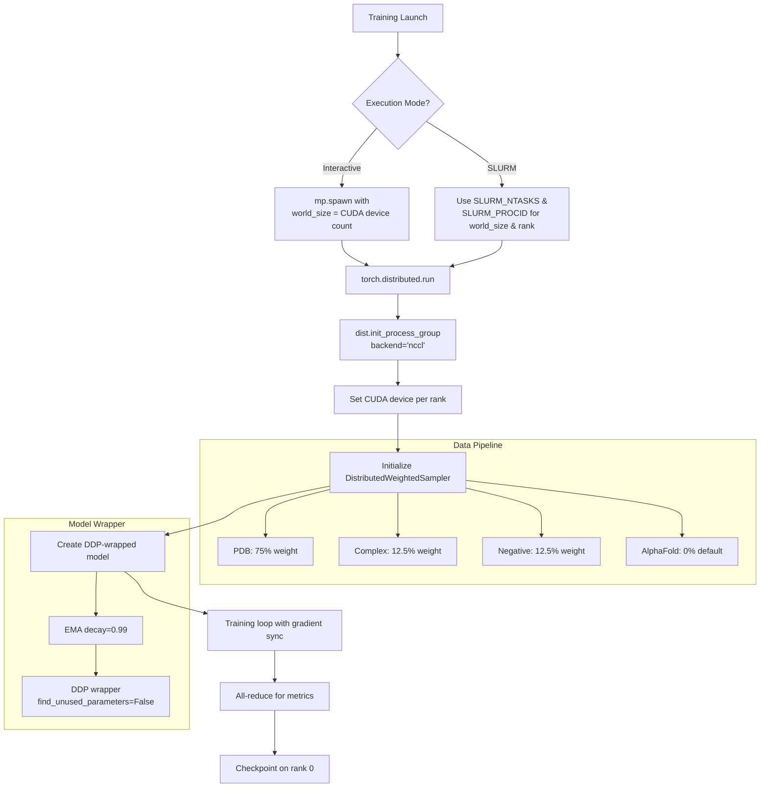
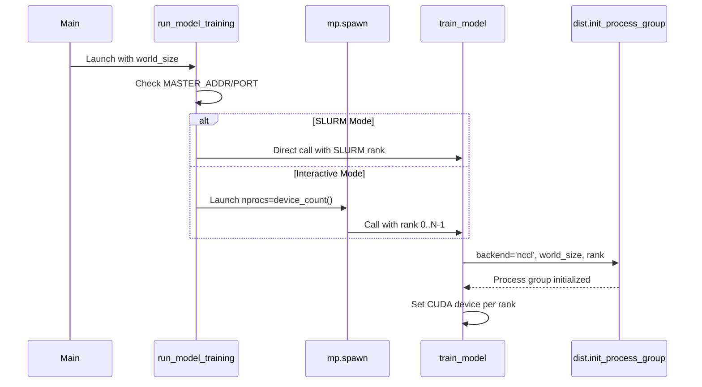
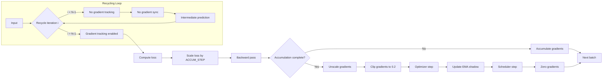

---
slug:19-training-pipeline-with-distributed-data-parallel
blog_type:normal
---

RoseTTAFold2 采用 PyTorch 的分布式数据并行（DDP）框架来实现高效的多 GPU 训练，支持单节点内多 GPU 扩展或通过 SLURM 跨多节点扩展。本文档探讨了架构设计、初始化过程以及关键优化，这些因素使得三轨道 RoseTTAFold 模型能够进行具有指数移动平均（EMA）权重更新的可扩展训练。

## 分布式训练架构

分布式训练系统围绕两种不同的执行模式构建：单节点上的交互式多 GPU 训练和基于 SLURM 的多节点训练。该架构利用 PyTorch 的 NCCL 后端在 GPU 之间进行高效的梯度同步，并采用自定义加权采样策略来平衡不同的训练数据来源，包括 PDB 结构、AlphaFold 蒸馏模型、蛋白质复合物和负样本。

训练流程的核心是 `train_multi_deep.py` 中的 `Trainer` 类，它负责编排整个分布式训练过程。`run_model_training` 方法作为主入口，检测训练是通过 SLURM 还是交互模式启动的，并相应地初始化分布式进程组。
来源: [train_multi_deep.py](/network/train_multi_deep.py#L398-L413)

## 进程初始化与环境设置

分布式训练需要在初始化前正确配置进程环境变量。如果未指定关键环境变量，系统会自动设置默认值，其中 `MASTER_ADDR` 默认为 'localhost'，`MASTER_PORT` 派生自训练配置。对于通过 SLURM 进行的多节点训练，这些必须在提交脚本中设置，以启用正确的节点间通信。

初始化逻辑区分了 SLURM 启动的作业和交互式会话。当通过 SLURM 启动时，每个 GPU 对应一个单独的进程，world size（全局进程数）由 `SLURM_NTASKS` 环境变量决定，rank（进程排名）来自 `SLURM_PROCID`。在交互模式下，系统使用 `torch.multiprocessing.spawn` 为每个可用的 GPU 启动一个进程，自动管理 rank 分配。
来源: [train_multi_deep.py](/network/train_multi_deep.py#L398-L413)

## 分布式数据采样策略

训练数据通过 `DistributedWeightedSampler` 类中实现的复杂加权采样策略分布到各个 GPU。该采样器管理具有不同采样优先级的多样化训练数据集，确保所有分布式工作节点在各种结构预测任务上都有均衡的接触。

采样器支持四种不同的数据来源，并具有可配置的采样比例：
- **PDB 结构**：默认占训练样本的 75%（当 fb_fraction=0, compl_fraction=0.25 时）
- **蛋白质复合物**：默认占训练样本的 12.5%
- **负样本复合物**：默认占训练样本的 12.5%
- **AlphaFold 蒸馏模型**：可配置比例（默认 0%）

每种数据类型采用基于长度的加权，长度在 256-512 之间的蛋白质获得更高的采样概率，并进行归一化以确保在训练集中的公平表示。这种策略防止了训练过程中偏向非常长或非常短的蛋白质。
来源: [data_loader.py](/network/data_loader.py#L1094-L1167), [data_loader.py](/network/data_loader.py#L400-L438)

| **Dataset** | **Default Fraction** | **Weight Calculation** | **Purpose** |
|-------------|---------------------|------------------------|-------------|
| PDB structures | 75% | (1/512) × clamp(len, 256, 512) | Main structural predictions |
| Protein complexes | 12.5% | (1/512) × clamp(total_len, 256, 512) | Complex formation modeling |
| Negative complexes | 12.5% | (1/512) × clamp(total_len, 256, 512) | Discriminative learning |
| AlphaFold models | 0% | (1/512) × clamp(len, 256, 512) | Distillation from AF2 |

采样器使用以 epoch 编号作为种子的生成器来实现 epoch 感知的混洗，确保了跨工作节点的可重现数据排序。每个 GPU 通过对混洗后的索引进行跨步接收总训练样本的确定性子集：`indices = indices[self.rank:self.total_size:self.num_replicas]`。这种方法保证了在分布式系统中每个样本在每个 epoch 只被处理一次。
来源: [data_loader.py](/network/data_loader.py#L1125-L1160)

## 带有 EMA 的模型并行化

RoseTTAFold 模型在封装到 PyTorch 的 DDP 包装器之前，先被指数移动平均（EMA）跟踪器包装。`EMA` 类维护模型参数的影子副本，这些副本使用指数衰减更新：`shadow_variable -= (1 - decay) × (shadow_variable - variable)`。衰减率为 0.99 时，影子模型跟踪训练权重的平滑版本，这通常在推理时提供更好的泛化能力。

EMA 包装器实现了关键的训练/验证模式切换：在训练期间，前向传播使用实时模型权重以启用梯度计算；在验证期间，它使用 EMA 影子权重进行评估。这种设计确保模型检查点既包含最终训练状态（用于潜在恢复），也包含稳定的 EMA 状态（用于推理）。
来源: [train_multi_deep.py](/network/train_multi_deep.py#L60-L103)

<CgxTip>
DDP 包装器使用 `find_unused_parameters=False` 初始化以进行性能优化。这要求所有模型参数都参与前向/后向传播。如果你修改后的架构有未使用的参数，请将其设置为 True（会有性能损失）或从模型中删除未使用的参数。
</CgxTip>

DDP 初始化为每个 GPU 创建一个进程组，并具有自动设备放置功能：`gpu = rank % torch.cuda.device_count()` 确保了即使在 rank 可能超过本地 GPU 数量的多节点场景中也能正确绑定设备。模型首先移动到适当的 GPU，用 EMA 包装，然后用指定设备 ID 的 DDP 包装，以便进行高效的梯度缩减。
来源: [train_multi_deep.py](/network/train_multi_deep.py#L480-L488)

## 带有梯度同步的训练循环

训练循环实现了复杂的梯度累积和混合精度训练，以在保持数值稳定性的同时最大化吞吐量。每次训练迭代通过 RoseTTAFold 架构处理可变数量的循环迭代（1-4 个周期），其中中间的循环步骤在不跟踪梯度的情况下执行，以减少内存占用和计算成本。

关键优化模式涉及使用 `no_sync()` 上下文管理器进行选择性梯度同步。对于除了最后一次循环之外的所有循环迭代，模型在不跨 GPU 同步梯度的情况下执行前向/后向传递。只有最后一次循环迭代才会触发跨整个计算图的梯度同步和反向传播。这种方法结合梯度累积，使得有效批量大小能够超过 GPU 内存容量。
来源: [train_multi_deep.py](/network/train_multi_deep.py#L752-L820)

训练循环结合了几个关键的优化：
- **混合精度训练**：使用 `torch.cuda.amp.autocast` 和 bfloat16 精度进行前向传递，减少内存需求并提高计算吞吐量
- **梯度裁剪**：在反缩放后以 0.2 范数阈值进行裁剪，防止梯度爆炸
- **梯度累积**：在更新前累积 `ACCUM_STEP` 批次的梯度，允许更大的有效批量大小
- **EMA 更新**：影子 EMA 模型在每次优化器步骤后更新：`shadow_params[name].sub_((1. - 0.99) × (shadow_params[name] - param))` 来源: [train_multi_deep.py](/network/train_multi_deep.py#L770-L820)

## 损失计算与同步

损失计算聚合了 RoseTTAFold 架构中的多个预测目标，包括距离/方向预测、掩码序列恢复、结合剂置信度、全原子结构准确性以及各种基于物理学的项。每个损失分量根据配置参数进行加权，从而允许对训练目标进行细粒度控制。

至关重要的是，训练损失在每个 epoch 结束时使用 `dist.all_reduce()` 操作在所有 GPU 上进行平均。这种同步确保了分布式系统中一致的梯度统计数据，并能够进行准确的损失监控。All-reduce 操作使用 SUM 运算聚合来自所有 rank 的张量，然后除以 `counter × world_size` 得到全局平均值。
来源: [train_multi_deep.py](/network/train_multi_deep.py#L150-L349), [train_multi_deep.py](/network/train_multi_deep.py#L856-L872)

<CgxTip>
损失计算假设批量大小为 1（在第 152 行断言），多 GPU 扩展是通过梯度累积而不是真正的小批量处理实现的。这种设计选择适应了蛋白质结构的可变长度性质和内存密集型 SE(3) transformer 操作。
</CgxTip>

## 检查点管理

检查点仅在 rank 0 上执行，以避免文件系统争用并确保状态一致。系统保存两种类型的检查点：'best' 检查点（当验证损失改善时保存）和 'last' 检查点（在每个 epoch 后保存）。两种检查点类型都包含完整的训练状态：epoch 编号、优化器状态、调度器状态、AMP 缩放器状态和模型权重。

重要的是，检查点保存的是 EMA 影子模型权重（`ddp_model.module.shadow.state_dict()`），而不是实时模型权重，因为影子权重提供更好的推理性能。对于 'last' 检查点，同时保留影子和实时模型状态，以便在需要时能够完全恢复训练。来源: [train_multi_deep.py](/network/train_multi_deep.py#L489-L527)

## 配置和命令行参数

训练过程接受众多配置参数，这些参数被组织成逻辑组：训练参数（批量大小、学习率、epochs）、数据加载参数（最大序列长度、模板计数、分辨率截止值）、模型架构参数（层数、特征维度）和损失权重（不同预测目标的权重）。

关键的分布式训练参数包括：
- `--port`：用于 DDP 通信的 TCP 端口（默认 12319，应随机化）
- `--interactive`：交互式多 GPU 模式与 SLURM 模式的标志
- `--accum`：梯度累积步数（默认 1）
- `--batch_size`：每 GPU 批量大小（默认 1）
- `--seed`：用于可重现性的随机种子

学习率调度使用带预热的步进衰减，初始化为 1000 个预热步长，每 15000 步以 0.95 的速率衰减。此调度由 `get_stepwise_decay_schedule_with_warmup()` 管理，它实现了一个 lambda 调度器，在预热期后指数级降低学习率。
来源: [arguments.py](/network/arguments.py#L1-L185), [scheduler.py](/network/scheduler.py#L154-L181)

| **Parameter** | **Default** | **Description** |
|---------------|-------------|-----------------|
| --port | 12319 | DDP communication port (randomize for parallel jobs) |
| --batch_size | 1 | Per-GPU batch size |
| --lr | 1.0e-3 | Initial learning rate |
| --num_epochs | 200 | Total training epochs |
| --accum | 1 | Gradient accumulation steps |
| --interactive | False | Interactive mode (vs SLURM) |
| --maxcycle | 4 | Maximum recycling iterations |

## 下一步

要全面了解 RoseTTAFold2 分布式训练流程，请探索以下相关文档主题：

- [Three-Track Design: MSA, Pair, and 3D Structure Tracks](6-three-track-design-msa-pair-and-3d-structure-tracks) - 了解正在训练的模型架构
- [FAPE (Frame-Aligned Point Error) Loss](16-fape-frame-aligned-point-error-loss) - 深入研究主要的结构损失函数
- [Multi-Component Loss (Distance, Angle, LDDT, PAE)](17-multi-component-loss-distance-angle-lddt-pae) - 多目标损失计算的详细信息
- [Memory Optimization Strategies](23-memory-optimization-strategies) - 训练期间管理 GPU 内存的技巧
- [Multi-GPU Training Configuration](25-multi-gpu-training-configuration) - 硬件和软件设置指南