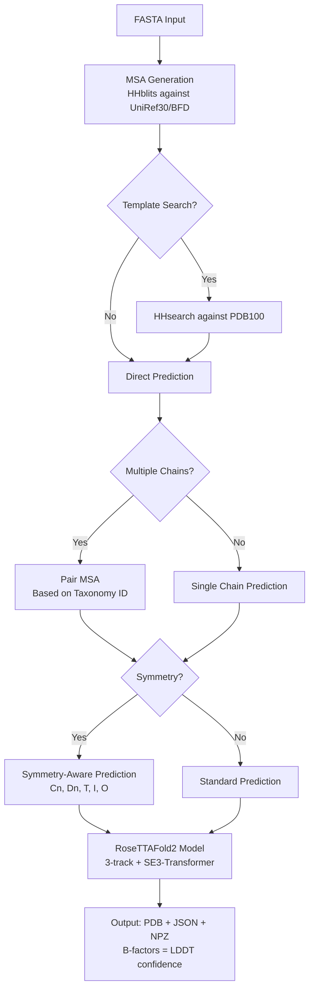

---
slug:2-quick-start
blog_type:normal
---


RoseTTAFold2 (RF2) 是一个先进的蛋白质结构预测系统，它采用三轨神经网络架构，并利用 SE(3)-equivariant transformers 从氨基酸序列预测原子结构。本指南将帮助你在几分钟内完成首次预测。


## 安装

### 前置条件

在安装 RoseTTAFold2 之前，请确保你具备以下条件：
- 支持 CUDA 的 GPU（推荐 NVIDIA，计算能力 7.0+）
- CUDA 12.1 工具包
- Conda 包管理器
- 至少 400 GB 的可用磁盘空间用于存储数据库

### 第 1 步：克隆仓库

首先克隆官方仓库：

```bash
git clone https://github.com/uw-ipd/RoseTTAFold2.git
cd RoseTTAFold2
```

来源：[README.md](README.md#L14-L15)

### 第 2 步：创建 Conda 环境

创建一个包含所有必需依赖项的专用 conda 环境：

```bash
conda env create -f RF2-linux.yml
conda activate RF2
```

该环境包含 Python 3.10、支持 CUDA 12.1 的 PyTorch 2.2、DGL、PyTorch Geometric 以及用于序列比对的 HH-suite [RF2-linux.yml](RF2-linux.yml#L1-L20)。

### 第 3 步：安装 SE3-Transformer

NVIDIA 的 SE(3)-Transformer 是进行等变神经网络操作的关键组件。请从包含的子目录中进行安装：

```bash
cd SE3Transformer
pip install --no-cache-dir -r requirements.txt
python setup.py install
cd ..
```

SE3Transformer 包（v1.2.0）提供了进行 3D 坐标预测所需的几何深度学习基础模块 [SE3Transformer/setup.py](SE3Transformer/setup.py#L3-L11)。

来源：[README.md](README.md#L21-L25), [SE3Transformer/setup.py](SE3Transformer/setup.py#L3-L11)

### 第 4 步：下载预训练权重

下载预训练模型权重（约 2 GB）：

```bash
cd network
wget https://files.ipd.uw.edu/dimaio/RF2_jan24.tgz
tar xvfz RF2_jan24.tgz
cd ..
```

这些权重（RF2_jan24.pt）已在 PDB 上进行训练，可为蛋白质结构预测提供最先进的准确性 [README.md](README.md#L27-L29)。

### 第 5 步：下载序列和结构数据库

RoseTTAFold2 需要三个主要数据库用于 MSA 生成和模板搜索：

**UniRef30 (46 GB)** - 综合蛋白质序列数据库
```bash
wget http://wwwuser.gwdg.de/~compbiol/uniclust/2020_06/UniRef30_2020_06_hhsuite.tar.gz
mkdir -p UniRef30_2020_06
tar xfz UniRef30_2020_06_hhsuite.tar.gz -C ./UniRef30_2020_06
```

**BFD (272 GB)** - 用于深度 MSA 覆盖的 Big Fantastic Database
```bash
wget https://bfd.mmseqs.com/bfd_metaclust_clu_complete_id30_c90_final_seq.sorted_opt.tar.gz
mkdir -p bfd
tar xfz bfd_metaclust_clu_complete_id30_c90_final_seq.sorted_opt.tar.gz -C ./bfd
```

**结构模板 (~14 GB)** - 用于同源建模的 PDB100 数据库
```bash
wget https://files.ipd.uw.edu/pub/RoseTTAFold/pdb100_2021Mar03.tar.gz
tar xfz pdb100_2021Mar03.tar.gz
```

来源：[README.md](README.md#L31-L43)

## 理解预测工作流程

在运行预测之前，了解 RoseTTAFold2 的端到端管道非常重要：



该管道涉及四个主要阶段：MSA 生成、模板搜索（可选）、复合物的 MSA 配对，以及带有可选对称性约束的结构预测 [run_RF2.sh](run_RF2.sh#L31-L159)。

## 运行你的首次预测

### 基础单体预测

激活你的环境并导航至示例目录：

```bash
conda activate RF2
cd examples
```

对于简单的单链蛋白质预测，运行：

```bash
../run_RF2.sh rcsb_pdb_7UGF.fasta -o 7UGF
```

此命令根据 FASTA 序列预测含溴结构域蛋白质（107 个残基）的结构 [README.md](README.md#L52-L54), [examples/rcsb_pdb_7UGF.fasta](examples/rcsb_pdb_7UGF.fasta#L1-L3)。

**预期输出：**
- `rf2out/models/model_final.pdb` - 预测的 3D 坐标
- `rf2out/models/model_final.json` - 额外的准确性指标
- `rf2out/models/model_final.npz` - 数值预测数据

PDB 文件中的 B-factors 代表预测的 LDDT（局部距离差异测试）得分，指示每个残基的置信度 [README.md](README.md#L70-L72)。

来源：[run_RF2.sh](run_RF2.sh#L31-L159), [README.md](README.md#L52-L54)

### 多链复合物预测

对于具有多条链的蛋白质复合物，使用 `--pair` 标志基于分类学 ID 匹配生成配对的 MSA：

```bash
../run_RF2.sh rcsb_pdb_8HBN.fasta --pair -o 8HBN
```

这通过配对来自两条链的 MSA 来预测异源二聚体复合物（MEX67-MTR2 mRNA 输出因子）[README.md](README.md#L58-L60), [examples/rcsb_pdb_8HBN.fasta](examples/rcsb_pdb_8HBN.fasta#L1-L5)。

配对的 MSA 方法通过基于共同进化历史比对来自两个伙伴的同源序列来提高准确性 [run_RF2.sh](run_RF2.sh#L105-L112)。

### 高级预测选项

#### 对称性感知预测

对于对称复合物，指定对称群（Cn, Dn, T, O, I）：

```bash
../run_RF2.sh rcsb_pdb_7YTB.fasta --symm C6 -o 7YTB
```

此示例通过在结构生成过程中应用对称性约束来预测 C6 对称的同源二聚体 [README.md](README.md#L64-L66)。

对于对称异源寡聚物（例如 A₃B₃ 复合物），结合对称性和配对使用：

```bash
../run_RF2.sh rcsb_pdb_7LAW.fasta --symm C3 --pair -o 7LAW
```

来源：[README.md](README.md#L64-L72), [network/predict.py](network/predict.py#L28)

#### 基于模板的预测

使用 hhsearch 启用模板搜索以结合结构同源信息：

```bash
../run_RF2.sh your_protein.fasta --hhpred -o output_name
```

这将针对 PDB100 数据库执行同源搜索，并使用顶级模板指导结构预测 [run_RF2.sh](run_RF2.sh#L41-L47)。

## 命令行选项参考

`run_RF2.sh` 脚本接受多个选项以自定义预测：

| 选项 | 描述 | 示例 |
|--------|-------------|---------|
| `-o, --outdir` | 输出目录名称 | `-o my_prediction` |
| `-s, --symm` | 对称群 (Cn, Dn, T, I, O) | `--symm C2` |
| `-p, --pair` | 为多链复合物配对 MSA | `--pair` |
| `-h, --hhpred` | 启用模板搜索 | `--hhpred` |

可以提供多个 FASTA 文件用于多链预测。该脚本会自动拆分多序列 FASTA 文件并分别处理每条链 [run_RF2.sh](run_RF2.sh#L77-L104)。

## 理解输出文件

RoseTTAFold2 生成三个主要的输出文件：

**model_final.pdb** - 包含原子坐标的标准 PDB 格式。B-factor 列包含预测的 LDDT 置信度得分（越高表示越确信）。

**model_final.json** - 包含额外指标的 JSON 格式，包括：
- 预测对齐误差（PAE）矩阵
- 结构域间置信度得分
- 模板使用信息

**model_final.npz** - 压缩的 NumPy 数组，包含用于高级分析的原始预测数据 [network/predict.py](network/predict.py#L1-L100)。

<CgxTip>
预测质量很大程度上取决于 MSA 深度。MSA 中有效序列超过 2000 的蛋白质通常能达到更高的准确性。检查 `rf2out/log/` 中的日志文件以监控 MSA 生成进度。
</CgxTip>

## 常见问题故障排除

**问题：CUDA 内存不足**
- 解决方案：在直接调用 `predict.py` 时使用 `-nseqs` 和 `-nseqs_full` 参数以减少 MSA 采样
- 替代方案：在 `predict.py` 中启用 `-low_vram` 标志以开启低显存模式

**问题：MSA 生成缓慢**
- 原因：大型蛋白质（>500 个残基）针对 BFD 进行搜索
- 解决方案：确保有足够的 RAM（推荐 64 GB）并调整 `run_RF2.sh` 中的 CPU 计数（第 18 行）[run_RF2.sh](run_RF2.sh#L18)

**问题：尽管 MSA 深度深但预测效果差**
- 检查：使用 `--hhpred` 启用模板搜索
- 考虑：如果蛋白质形成寡聚物，请尝试不同的对称群

## 后续步骤

既然你已经运行了首次预测，可以探索以下主题：

- **[环境设置](3-environment-setup)** - 详细的硬件要求和高级安装选项
- **[数据库下载](4-database-downloads)** - 完整的数据库设置，包含备用来源和验证步骤
- **[模型权重安装](5-model-weights-installation)** - 模型权重选项、验证和故障排除
- **[三轨设计](6-three-track-design-msa-pair-and-3d-structure-tracks)** - 深入探究 RoseTTAFold2 的创新架构
- **[SE(3)-Equivariant Transformer 网络](7-se-3-equivariant-transformer-network)** - 理解几何深度学习基础

对于生产工作流和批处理，考虑直接使用 `network/predict.py` 并配合自定义参数，以对预测设置进行细粒度控制 [network/predict.py](network/predict.py#L28-L52)。