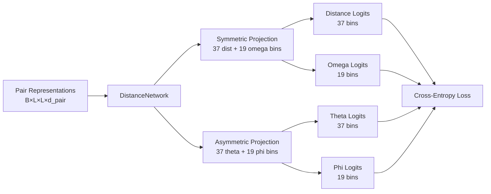

---
slug:20-distance-and-angle-prediction
blog_type:normal
---


RoseTTAFold2 中的距离和角度预测作为一个关键的辅助任务，在训练过程中提供中间结构监督。该组件作用于配对表示轨道，预测残基间的几何约束，从而引导 3D 坐标生成过程。6D 坐标系通过距离和三个角度分量捕获了残基对之间的完整方向关系，使模型能够学习全面的结构模式。

## 架构概述

距离和角度预测架构的核心是 `DistanceNetwork` 类，它将配对表示转换为四个几何维度上的概率预测。该模块作为一个监督学习组件，接收来自迭代模拟器的丰富配对特征，并输出残基间关系的结构化预测。

来源：[network/AuxiliaryPredictor.py](network/AuxiliaryPredictor.py#L5-L36), [network/RoseTTAFoldModel.py](network/RoseTTAFoldModel.py#L43-L43)

预测流程如下：



## 6D 坐标系

RoseTTAFold2 采用了一套复杂的 6D 坐标表示，编码了残基对之间的平移和旋转关系。这种表示捕获了重建相对定位所需的完整几何关系，而不依赖于全局坐标系。

### 组件定义

| 坐标 | 物理含义 | 公式 | 分箱数 | 对称性 |
|------------|-----------------|---------|------|----------|
| **Distance (距离)** | Cβ-Cβ 欧几里得距离 | ∥Cbᵢ - Cbⱼ∥ | 37 | 对称 (i↔j) |
| **Omega** | Ca-Cβ-Cβ-Ca 二面角 | ω = dihedral(Caᵢ, Cbᵢ, Cbⱼ, Caⱼ) | 19 | 对称 (i↔j) |
| **Theta** | N-Ca-Cβ-Cβ 二面角 | θ = dihedral(Nᵢ, Caᵢ, Cbᵢ, Cbⱼ) | 37 | 非对称 (i→j) |
| **Phi** | Ca-Cβ-Cβ 平面角 | φ = angle(Caᵢ, Cbᵢ, Cbⱼ) | 19 | 非对称 (i→j) |

来源：[network/kinematics.py](network/kinematics.py#L138-L174), [network/coords6d.py](network/coords6d.py#L36-L80)

坐标计算涉及利用理想化几何从骨架 N、Ca、C 原子重建 Cβ 位置，然后计算最大距离阈值（DMAX=20.0Å）内所有残基对的四个几何描述符。

### Cβ 重建

Cβ 位置是基于理想化肽几何，通过固定的线性变换从骨架坐标推导出来的：

```
Cb = -0.58273431 × (b × c) + 0.56802827 × b - 0.54067466 × c + Ca
```

其中 b = Ca - N 和 c = C - Ca 代表骨架键向量。

来源：[network/coords6d.py](network/coords6d.py#L46-L50)

## 网络架构

### DistanceNetwork 实现

`DistanceNetwork` 使用双投影架构来分别处理对称和非对称预测：

**对称投影（距离和 Omega）：**
- 单线性层：`proj_symm: d_pair → 37 + 19`
- 强制对称性：`logits_symm = logits_symm + logits_symm.permute(0,2,1,3)`
- 确保 (i,j) 和 (j,i) 对的预测完全相同

**非对称投影（Theta 和 Phi）：**
- 单线性层：`proj_asymm: d_pair → 37 + 19`
- 不需要强制对称性
- 有向预测捕获从 i 到 j 的方向

来源：[network/AuxiliaryPredictor.py](network/AuxiliaryPredictor.py#L5-L35)

### 参数初始化

所有投影层使用零初始化策略以提供稳定的训练梯度：

```python
nn.init.zeros_(self.proj_symm.weight)
nn.init.zeros_(self.proj_symm.bias)
nn.init.zeros_(self.proj_asymm.weight)
nn.init.zeros_(self.proj_asymm.bias)
```

这种初始化确保预测从接近均匀分布开始，允许模型在训练期间逐渐学习有意义的几何模式。

来源：[network/AuxiliaryPredictor.py](network/AuxiliaryPredictor.py#L14-L19)

## 标签生成

### 坐标转换流程

训练标签是通过系统的转换流程从真实结构生成的：

1. **提取骨架坐标**：从实验结构中提取 N、Ca、C 原子
2. **重建 Cβ 位置**：使用理想化几何变换
3. **计算成对几何**：计算所有残基对的 dist、omega、theta、phi
4. **距离过滤**：仅包含 Cβ-Cβ 距离 < DMAX (20.0Å) 的残基对
5. **离散化分箱**：将连续值转换为离散分箱索引

来源：[network/kinematics.py](network/kinematics.py#L138-L174)

### 分箱策略

连续几何值使用固定分箱范围进行离散化：

**距离分箱：**
- 范围：2.0Å 至 20.0Å
- 37 个分箱（约 0.49Å/分箱）
- 将范围外的距离钳制在分箱边界上

**角度分箱：**
- 范围：-π 至 +π 弧度
- 36 个分箱（10°/分箱）用于 theta
- 18 个分箱（20°/分箱）用于 omega 和 phi
- 同时编码 sin 和 cos 分量以实现旋转不变性

来源：[network/kinematics.py](network/kinematics.py#L6-L11)

### 基于模板的特征

模板结构通过 `xyz_to_t2d` 提供额外的距离和方向特征，该函数将模板坐标处理为具有以下内容的 2D 映射：
- 独热编码的距离（37 个分箱）
- Sin/cos 编码的方向（6 个值：每个角度 2 个）
- 有效性掩码

这些模板特征在距离预测之前被整合到配对表示中。

来源：[network/kinematics.py](network/kinematics.py#L176-L200)

## 损失计算

### 交叉熵损失公式

距离和角度预测使用多任务交叉熵损失进行训练：

```python
loss = nn.CrossEntropyLoss(reduction='none')(logit_s[i], label_s[...,i])
loss = (mask_2d * loss).sum() / (mask_2d.sum() + eps)
```

该公式：
- 为每个几何分量（共 4 个）计算独立损失
- 应用成对掩码以排除无效残基对
- 按有效残基对数量归一化以实现稳定训练

来源：[network/loss.py](network/loss.py#L44-L51)

### 链间处理

对于蛋白质复合物预测，损失计算区分链内和链间残基对：

**正样本（天然复合物）：**
- 对所有有效残基对（包括链内和链间）计算完整损失

**负样本（诱饵复合物）：**
- 仅对链内残基对计算掩码损失
- 防止在非相互作用系统中学习虚假的链间相互作用

这种差异化掩码策略确保模型学习天然界面几何结构，同时避免随机链向带来的混淆。

来源：[network/train_multi_deep.py](network/train_multi_deep.py#L165-L172)

## 模型集成

### 前向传播集成

距离预测模块集成到主要的 RoseTTAFoldModel 前向传播中：

1. **配对表示生成**：模拟器输出丰富的配对特征 (B×L×L×d_pair)
2. **距离预测**：`self.c6d_pred(pair)` 处理配对特征
3. **Logit 提取**：返回 dist、omega、theta、phi 的 4 个张量
4. **损失计算**：与离散化的真实标签进行比较
5. **反向传播**：梯度流经整个网络

来源：[network/RoseTTAFoldModel.py](network/RoseTTAFoldModel.py#L130-L131)

### 回收机制

在迭代优化期间，来自每个回收步骤的距离预测都会受到监督：

```python
# 应用于所有回收步骤（通常 3-4 个周期）
logit_s[i]  # 来自周期 i 的预测
label_s     # 真实标签（所有周期相同）
```

这种多阶段监督鼓励模型在回收迭代中逐步优化几何预测，随着 3D 结构变得更加精细，后期的周期通常表现出更高的准确性。

来源：[network/train_multi_deep.py](network/train_multi_deep.py#L739-L745)

<CgxTip>
距离预测损失权重（默认 `w_dist=1.0`）在几何监督与其他损失组件之间取得平衡。调整此值会影响模型学习中间结构约束与最终 3D 准确性的相对强度。增加此权重通常会提高残基间接触准确性，但可能会以骨架精度为代价。</CgxTip>

## 训练配置

### 损失权重

多组件损失函数结合了距离预测和其他辅助任务：

```python
w_dist=1.0   # 距离和角度预测权重
w_aa=1.0     # 掩码氨基酸预测权重
w_str=1.0    # FAPE 结构损失权重
w_all=0.5    # 全原子结构损失权重
w_pae=1.0    # 预测对齐误差权重
w_lddt=1.0   # LDDT 置信度预测权重
```

`w_dist` 参数控制 6D 几何监督相对于基于坐标的损失的贡献。默认值 (1.0) 提供了平衡的训练，但对于特定应用，调优可能是有益的。

来源：[network/train_multi_deep.py](network/train_multi_deep.py#L150-L156)

### 准确性指标

在验证期间，距离预测准确性使用以下指标衡量：

1. **Top-L 精度**：在前 L 个预测接触中正确预测的比例
2. **接触数比较**：预测接触分布与参考接触分布的对比
3. **逐分箱准确性**：每个距离分箱的分类准确性

这些指标提供了与最终结构质量相关性良好的中间监督信号，特别是对于残基间接触预测。

来源：[network/train_multi_deep.py](network/train_multi_deep.py#L334-L364)

## 下一步

理解距离和角度预测为探索其他辅助预测组件奠定了基础：

- **[LDDT 和 PAE 置信度估计](21-lddt-and-pae-confidence-estimation)** - 了解 RoseTTAFold2 如何预测每个残基和残基间的置信度分数
- **[多组件损失](17-multi-component-loss-distance-angle-lddt-pae)** - 探索距离预测在训练期间如何与其他损失组件集成
- **[三轨道设计](6-three-track-design-msa-pair-and-3d-structure-tracks)** - 了解距离预测在配对轨道上运行的架构背景