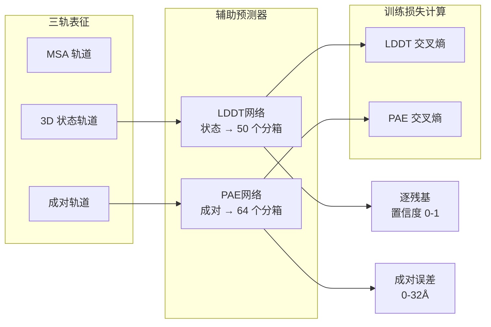

---
slug:21-lddt-and-pae-confidence-estimation
blog_type:normal
---


RoseTTAFold2 采用两种互补的置信度评估指标——局部距离差异测试（LDDT）和预测对齐误差（PAE）——来量化残基级别和成对级别的预测可靠性。这些辅助预测源于三轨架构的学习表征，为下游应用（如结构选择和实验解读）提供了必要的质量评估。

## 架构基础

置信度评估模块直接集成到 RoseTTAFold2 的三轨设计中，每个预测器从不同的信息轨道中消费专门的表征。LDDT 网络作用于包含 SE(3) 等变特征的 3D 状态轨道，而 PAE 网络消费通过注意力机制和三角形乘法机制捕获残基间关系的成对表征。



## LDDT 网络架构

LDDT 预测网络采用三层前馈架构，将 SE(3) 等变状态表征转换为分箱为 50 个离散类别的逐残基置信度分数，覆盖范围 [0, 1]。该网络架构通过顺序的 ReLU 激活和归一化实现渐进的特征提取，并精心设置权重初始化以确保稳定的训练动态。

**网络结构：**
- **输入：** 状态张量 (B, L, d_state)，其中 d_state = 16（SE3 输出维度）
- **第 1 层：** LayerNorm → Linear(d_state, 128)，使用 Kaiming 初始化
- **第 2 层：** Linear(128, 128)，使用 ReLU 激活
- **输出：** Linear(128, 50)，使用零初始化的权重/偏置

最终投影层的零初始化策略至关重要——它鼓励网络在从结构特征学习判别模式之前，最初预测均匀的置信度分布。前向传播在前两次线性变换后应用顺序的 ReLU 激活，生成 50 个置信度分箱的 logit 分布，随后在损失计算期间转换为概率。

来源：[network/AuxiliaryPredictor.py](network/AuxiliaryPredictor.py#L54-L73), [network/RoseTTAFoldModel.py](network/RoseTTAFoldModel.py#L39)

## PAE 网络架构

与深度 LDDT 网络相比，PAE 预测器采用最小化架构，仅包含单个线性投影，从成对表征投影到 64 个分箱，覆盖 0.5Å 到 32Å、间隔为 0.5Å 的预期对齐误差。这种设计反映了 PAE 网络的作用，即编码成对误差关系，这些关系已在迭代模拟过程中通过注意力机制和三角形乘法操作隐式地捕获在成对表征中。

**网络结构：**
- **输入：** 成对张量 (B, L, L, d_pair)，其中 d_pair = 128
- **输出：** Linear(d_pair, 64)，使用零初始化的权重/偏置

PAE 预测的成对性质要求网络生成 (B, L, L, 64) 的 logits，其中每个位置 (i, j) 编码了当残基 i 与残基 j 对齐时的预测对齐误差。这种对称性内在于成对表征的结构中，因此无需在网络架构中显式强制执行对称性。

来源：[network/AuxiliaryPredictor.py](network/AuxiliaryPredictor.py#L100-L110), [network/RoseTTAFoldModel.py](network/RoseTTAFoldModel.py#L43)

## LDDT 计算与损失函数

训练框架实现了两种互补的 LDDT 计算：用于监测骨架准确性的基于 CA 的变体，以及用于全面结构评估的全原子变体。基于 CA 的 LDDT 作为训练期间的跟踪指标，而全原子 LDDT 通过分箱预测的交叉熵分类直接贡献于损失函数。

**基于 CA 的 LDDT：**
基于 CA 的计算评估预测坐标与真实 CA 坐标之间的距离一致性，跨越四个距离阈值：0.5Å、1.0Å、2.0Å 和 4.0Å。对于 15Å 内的每个残基对，算法计算低于每个阈值的距离差比例，然后对所有有效对的这些比例取平均值。逐残基 LDDT 分数表示其所有有效相互作用伙伴的平均值。

**全原子 LDDT：**
全原子计算将此框架扩展到所有 14 个标准蛋白质原子（N, CA, C, O 和侧链原子）。该实现为预测结构和真实结构计算成对距离矩阵，然后评估跨越相同四个距离阈值的一致性。计算包含多种掩码策略：
- 距离掩码：仅考虑 15Å 内的原子对
- 原子掩码：排除缺失或无效的原子
- 残基掩码：排除残基内原子对
- 链掩码（用于负样本）：排除非相互作用链之间的链间对

<CgxTip>全原子 LDDT 损失使用交叉熵分类而非回归，通过将置信度预测视为 50 路分类问题而非连续回归任务，提高了训练稳定性。</CgxTip>

来源：[network/loss.py](network/loss.py#L569-L641), [network/train_multi_deep.py](network/train_multi_deep.py#L275-L282)

## PAE 计算与损失函数

PAE 损失计算发生在结构损失框架（`calc_str_loss`）内，尽管具体的 PAE 分箱和交叉熵实现遵循类似于距离图预测损失的模式。在推理期间，预测的 PAE logits 经历 softmax 变换，随后进行分箱加权平均，将 64 分箱分类输出转换为连续误差值。

**PAE 解分箱：**
推理过程对每个残基对的 64 个分箱应用 softmax，然后使用从 0.5Å 到 32Å、间隔为 0.5Å 的分箱中心计算期望值。此操作将分类概率分布转换为适用于可视化和分析的连续误差估计。

```
PAE_bins = [0.5, 1.0, 1.5, ..., 32.0]  # 64 个分箱
PAE_continuous = Σ(PAE_bins × softmax(logits))
```

PAE 预测提供了关于相对结构域方向置信度的有价值信息，并识别出对齐不确定性较高的区域——这对于多结构域蛋白质和蛋白质复合物特别有用，因为不同的结构元件可能表现出不同的预测可靠性。

来源：[network/predict.py](network/predict.py#L138-L146), [network/loss.py](network/loss.py#L62-L70)

## 训练集成

置信度评估模块与结构预测损失（FAPE、扭转角）、距离图预测和掩码标记预测一起集成到多组件损失框架中。每个损失组件接收独立的权重参数，允许对训练动态进行细粒度控制。

**损失组件权重：**
- `w_lddt`：全原子 LDDT 损失权重（默认 1.0）
- `w_pae`：PAE 损失权重（默认 1.0）
- `w_str`：结构损失权重（默认 1.0）
- `w_dist`：距离图损失权重（默认 1.0）

训练流水线在每次回收迭代中计算 LDDT 和 PAE 损失，并在预测寡聚复合物时应用对称性感知处理。对于对称操作，置信度预测被重新映射以匹配通过对称性感知结构确定的亚基对应关系，确保预测结构与其置信度估计之间的一致性。

全原子 LDDT 计算需要使用预测的扭转角和骨架框架进行全原子坐标重建。此重建过程发生在 LDDT 损失计算之前，允许网络学习反映骨架和侧链预测准确性的置信度估计。

来源：[network/train_multi_deep.py](network/train_multi_deep.py#L150-L310), [network/train_multi_deep.py](network/train_multi_deep.py#L673-L752)

## 推理与输出格式

在推理期间，置信度预测器在完成所有回收迭代后与最终结构预测一起生成其输出。`RoseTTAFoldModule` 返回 LDDT logits 作为其输出元组的一部分，预测流水线随后处理这些 logits 以进行可视化和模型排序。

**输出维度：**
- LDDT：(B, L, 50) logits → 转换为 (B, L) 概率
- PAE：(B, L, L, 64) logits → 转换为 (B, L, L) 连续误差

置信度估计实现了多种实际应用：对来自多个模型的替代结构预测进行排序（选择具有最高平均 LDDT 的模型）、识别不可靠区域以进行实验验证（低 LDDT 分数）以及评估结构域方向置信度（显示结构域间对齐不确定性的 PAE 热图）。

来源：[network/RoseTTAFoldModel.py](network/RoseTTAFoldModel.py#L126-L149), [network/RoseTTAFoldModel.py](network/RoseTTAFoldModel.py#L130-L135)

## 置信度评估组件摘要

| 组件 | 输入 | 输出 | 分箱/范围 | 损失函数 |
|-----------|-------|--------|-------------|---------------|
| LDDT 网络 | 状态 (B, L, 16) | Logits (B, L, 50) | 50 个分箱 [0, 1] | 交叉熵 |
| PAE 网络 | 成对 (B, L, L, 128) | Logits (B, L, L, 64) | 64 个分箱 [0.5, 32Å] | 交叉熵 |
| 基于 CA 的 LDDT | CA 坐标 | 逐残基分数 | 连续 (0-1) | 仅监测 |
| 全原子 LDDT | 全原子坐标 | 逐残基分数 | 连续 (0-1) | 分类损失 |

<CgxTip>置信度评估模块需要全原子重建以准确计算 LDDT，确保侧链预测质量对置信度估计做出贡献，而不仅仅依赖于骨架准确性。</CgxTip>

来源：[network/AuxiliaryPredictor.py](network/AuxiliaryPredictor.py#L54-L137), [network/loss.py](network/loss.py#L569-L650)

## 后续步骤

要加深对 RoseTTAFold2 完整训练流水线和损失函数的理解，请探索以下相关页面：

- **[FAPE (帧对齐点误差) 损失](16-fape-frame-aligned-point-error-loss)** — 了解与 PAE 协同训练坐标预测的主要结构损失函数
- **[多组件损失（距离、角度、LDDT、PAE）](17-multi-component-loss-distance-angle-lddt-pae)** — 全面概述所有损失组件如何在训练期间集成
- **[三轨设计：MSA、成对和 3D 结构轨道](6-three-track-design-msa-pair-and-3d-structure-tracks)** — 了解为置信度评估模块提供输入的架构基础
- **[使用 SE3 层生成坐标](14-coordinate-generation-with-se3-layers)** — 了解如何生成 LDDT 预测所使用的 3D 状态表征