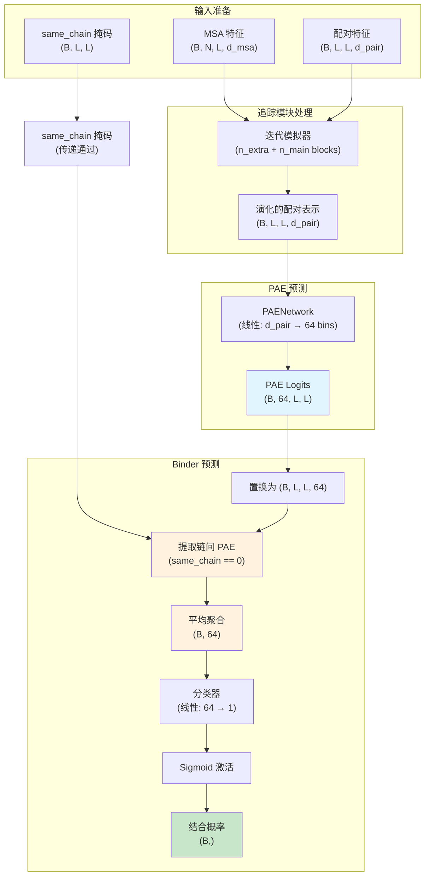

---
slug:22-binder-network-for-complex-formation
blog_type:normal
---


Binder Network 是 RoseTTAFold2 中一个专门的神经网络组件，用于预测两个或多个蛋白质链是否形成稳定的复合结构。该模块利用模型注意力输出中的预测对齐误差（PAE）信息来进行二元结合预测，从而实现单体验证和复合结构形成评估。

## 架构设计

Binder Network 作为一个轻量级分类器运行，专门处理不同蛋白质链之间的 PAE 分布。与 RoseTTAFold2 中处理单链特征或全对相互作用的其他辅助预测器不同，Binder Network 仅专注于**链间**误差模式。

**核心架构**：该网络采用流线型设计，包含单个线性投影层，后接 sigmoid 激活函数。这种设计是刻意的——通过学习识别链间残基对中的特征误差模式，网络能够有效区分真实的蛋白质-蛋白质界面与非相互作用链构型。PAE logits（每个残基对 64 个 bin）通过线性层处理，输出单个 logit，然后通过 sigmoid 生成 0 到 1 之间的结合概率。

来源：[AuxiliaryPredictor.py](network/AuxiliaryPredictor.py#L114-L135)，[RoseTTAFoldModel.py](network/RoseTTAFoldModel.py#L48-L49)

## 网络实现

### BinderNetwork 类结构

`BinderNetwork` 模块继承自 PyTorch 的 `nn.Module`，实现了前馈分类架构。初始化接受两个参数：`n_hidden`（默认 64，当前未使用）和 `n_bin_pae`（默认 64，匹配 PAE bin 计数）。核心组件是一个线性层 `self.classify`，输入维度为 `n_bin_pae`，输出维度为 1。

**前向传播**：在推理过程中，网络接收形状为 `(B, 64, L, L)` 的 PAE logits 和形状为 `(B, L, L)` 的二元 `same_chain` 掩码。PAE 张量被置换为 `(B, L, L, 64)` 以进行逐对处理。关键操作通过索引 `same_chain == 0` 仅提取链间 PAE 信息，然后对所有链间残基对求平均，生成单个 64 维向量。这种聚合捕获了整体链间误差特征，同时对链长度和残基顺序保持不变。`nan_to_num()` 函数处理单链输入可能产生 NaN 值的边缘情况。

**分类层**：聚合的链间 PAE 向量通过线性分类器生成单个 logit，经 sigmoid 变换得到最终结合概率。权重和偏置初始化为零，遵循 RoseTTAFold2 在中性状态下启动辅助预测器的模式，以便在训练期间从数据中学习。

来源：[AuxiliaryPredictor.py](network/AuxiliaryPredictor.py#L114-L135)

## 与 RoseTTAFold2 流水线的集成

### PAE 预测依赖关系

Binder Network 位于计算流水线中 PAE 预测网络的下游。`PAENetwork` 类首先从配对表示特征（处理后形状为 `(B, d_pair, L, L)`）生成 64 bin PAE 分布。这发生在 RoseTTAFoldModel 前向传播的第 134 行，产生 `logits_pae`，作为 Binder Network 的主要输入。

**配对表示**：配对特征通过迭代追踪模块包含关于残基间关系的演化信息。这些编码了空间约束、进化耦合和结构先验，使能够进行准确的 PAE 预测。PAENetwork 将这些丰富的配对特征投影到 64 个距离 bin 的误差概率分布中。

来源：[AuxiliaryPredictor.py](network/AuxiliaryPredictor.py#L100-L112)，[RoseTTAFoldModel.py](network/RoseTTAFoldModel.py#L134-L137)

### same_chain 掩码生成

`same_chain` 掩码是一个关键的二元矩阵，用于区分链内和链间残基对。该掩码在数据准备期间构建，并根据预测场景而变化。对于单链输入，它是全 1 的方阵；对于多链复合物，它具有块状结构，其中对应于同链残基的块标记为 1，链间块标记为 0。

**构建逻辑**：在预测流水线（predict.py 第 403-410 行）中，通过遍历链来构建掩码。对于每个链段，对角块设置为 1。这创建了保留链内关系的块对角模式。掩码随后通过模型前向传播，以通知辅助预测有关链边界的信息。

**训练数据加载**：data_loader.py 中的 `loader_complex` 函数演示了如何准备复合训练样本。对于异源寡聚体，读取并合并来自两条链的 MSA（`merge_a3m_hetero`），同时跟踪链边界。`chain_idx` 矩阵（第 935-937 行）显式编码链成员身份：如果残基 i 和 j 属于同一条链，则 `chain_idx[i,j] = 1`，否则为 0。该矩阵在训练期间直接成为 `same_chain` 输入。

来源：[predict.py](network/predict.py#L403-L410)，[data_loader.py](network/data_loader.py#L935-L937)，[data_loader.py](network/data_loader.py#L857-L968)

## 推理与输出

### 模型前向传播集成

在模型执行期间，Binder Network 在迭代模拟完成后被调用。RoseTTAFoldModel.py 第 137 行的前向传播序列显示了顺序：首先是 PAE 预测，然后使用 PAE 输出和 same_chain 掩码进行 Binder 预测。结果 `p_bind` 是形状为 `(B,)` 的张量，包含每个批次元素的结合概率。

**循环机制**：Binder 预测受益于 RoseTTAFold2 的循环机制。在多个循环迭代中，配对表示和 PAE 预测变得越来越准确，从而产生更精细的结合概率估计。最终结合分数取自最后一个循环迭代，该迭代具有最收敛的结构信息。

**输出处理**：在预测流水线（predict.py 第 510 行）中，模型返回 `p_bind` 以及其他辅助预测。虽然当前代码中未显式写入输出文件（第 595-601 行显示仅保存 dist、lddt 和 pae），但结合概率可编程获取，用于蛋白质复合预测任务中的决策制定。

来源：[RoseTTAFoldModel.py](network/RoseTTAFoldModel.py#L134-L148)，[predict.py](network/predict.py#L510-L601)

## 复合预测的数据处理

### 复合数据加载流水线

训练 Binder Network 需要成对的蛋白质相互作用正负样本。`loader_complex` 函数为异源寡聚复合物实现了专门的加载逻辑。它接受参数，包括链长度 `L_s`、分类学 ID、组装信息和指示加载真实相互作用对还是非相互作用的诱饵的 `negative` 标志。

**MSA 合并策略**：对于具有匹配分类学 ID 的真实复合物，函数尝试加载保留链间共进化信息的成对 MSA。否则，加载单条链的 MSA 并使用 `merge_a3m_hetero` 合并，该方法在跟踪链边界的同时连接序列。此合并过程对于向模型提供捕获链间约束的进化信息至关重要。

**模板处理**：每条链的模板独立加载（第 888-896 行），然后合并。值得注意的是，第二条链的模板在连接之前经过随机旋转和平移（`random_rot_trans`），以防止模型依赖模板定位信息进行界面预测。这强制从 MSA 共进化和内部表示动态中学习界面模式。

**负样本**：`negative` 标志触发加载非相互作用的蛋白质对。这些是从不同生物体（不同 taxID）且无已知相互作用的蛋白质中随机采样的。对于负样本，插入信息被清零（第 880 行）以避免偏差，空间裁剪使用 `get_complex_crop` 而非专注于界面的 `get_spatial_crop`（第 941-944 行）。这确保网络学习区分真实相互作用与随机蛋白质共现。

来源：[data_loader.py](network/data_loader.py#L857-L968)，[data_loader.py](network/data_loader.py#L510-L560)

### 链索引掩码使用

由 `loader_complex` 生成的 `chain_idx` 矩阵（在第 968 行返回）在训练期间成为 `same_chain` 输入。该二元掩码使模型能够在整个架构中区分链内和链间残基对。在 FAPE 损失计算中（loss.py 第 62-100 行），same_chain 掩码用于应用不同的距离钳位阈值：链内对使用 `d_clamp`，链间对使用 `d_clamp_inter`（通常较大，30Å），以适应蛋白质界面的预期几何结构。

来源：[loss.py](network/loss.py#L62-L100)，[data_loader.py](network/data_loader.py#L935-L968)

## 架构图



## 操作流程

```mermaid
flowchart TD
    Start([复合预测输入]) --> LoadMSA[加载成对/独立 MSA]
    LoadMSA --> MergeMSA[合并 MSA 并跟踪链]
    MergeMSA --> LoadTempl[为每条链加载模板]
    LoadTempl --> ApplyTransform[对链 2 应用随机变换]
    ApplyTransform --> GenMask[生成 same_chain 掩码<br/>块对角矩阵]
    GenMask --> Iter[迭代循环<br/>追踪模块更新]
    Iter --> PAE[PAENetwork 预测误差分布]
    PAE --> Binder[BinderNetwork 分类]
    Binder --> Extract[提取链间 PAE]
    Extract --> Aggregate[平均聚合为 (64,) 向量]
    Aggregate --> Linear[线性分类层]
    Linear --> Sigmoid[Sigmoid → 概率]
    Sigmoid --> Output([结合概率 p_bind])
    
    style Extract fill:#fff3e0
    style Aggregate fill:#fff3e0
    style Output fill:#c8e6c9
```

## 训练考虑

### 正负样本平衡

有效的 Binder Network 训练需要平衡接触相互作用和非相互作用的蛋白质对。data_loader.py 中的 `DatasetComplex` 类和 `DistilledDataset` 包含复合加载器，采用混合正复合物、负样本和其他数据类型的采样策略。`loader_complex` 中的 `negative` 标志（第 857 行）控制加载的类型，能够构建具有受控类别平衡的训练批次。

**负样本生成**：非相互作用对从具有不同分类学 ID 的蛋白质中采样，降低了自然相互作用的可能性。这些样本接受与正样本相同的处理流水线（MSA 合并、模板处理），但进行修改（如清零插入信息）以防止模型利用伪影。网络必须学会识别共进化信号和界面兼容几何模式的缺失。

来源：[data_loader.py](network/data_loader.py#L999-L1167)

### 损失函数与优化

虽然代码库在检查的文件中未显式显示专用的 Binder Network 损失，但网络通过标准二元交叉熵损失（由 sigmoid 输出暗示）与其他组件一起训练。权重和偏置的零初始化（第 125-126 行）确保网络以中性预测开始（平衡 sigmoid 的 p=0.5），需要训练信号将预测推向正确的标签。

**训练流水线集成**：Binder Network 参与训练流水线中描述的多任务训练。在每次迭代期间，模型生成包括 `p_bind` 在内的预测，与真实标签（相互作用对为 1，非相互作用为 0）进行比较。梯度更新调整分类器权重以提高判别准确性，而上游 PAENetwork 和追踪模块学习生成更具信息性的链间 PAE 模式以进行结合预测。

来源：[AuxiliaryPredictor.py](network/AuxiliaryPredictor.py#L122-L126)，[RoseTTAFoldModel.py](network/RoseTTAFoldModel.py#L134-L148)

## 应用场景

### 蛋白质复合预测

Binder Network 的主要应用是评估预测的多链结构是否代表生物学相关的复合物。在复合预测任务中，用户输入多条链的 MSA，RoseTTAFold2 生成 3D 坐标和包括结合概率在内的辅助预测。高 p_bind 分数表明预测的界面是真实的，而低分数可能表明非相互作用链或建模错误。

**界面验证**：结合概率作为预测界面的验证指标。在蛋白质对接或同源建模场景中，研究人员可以使用 p_bind 对替代模型进行排序，选择合理的复合结构，或识别潜在的假阳性相互作用。当实验验证数据不可用时，这特别有价值。

### 单体质量评估

对于单链预测（同源二聚体除外），Binder Network 自然产生中性或低结合概率，因为不存在链间对。这种行为可用于检测输入数据中意外的链融合，或验证单体预测未意外建模虚假的链间接触。

来源：[predict.py](network/predict.py#L510-L601)

Binder Network 对链间 PAE 聚合的专注（对所有 same_chain=0 位置进行平均池化）使其对链长度和界面大小的变化具有鲁棒性。通过对所有链间对进行平均，而不是专注于局部界面特征，网络捕获了链间误差模式的全局一致性，从而表征真实相互作用与随机链构型。

## 参数配置

### 网络超参数

Binder Network 配置极简但有效：

| 参数 | 默认值 | 描述 |
|-----------|---------------|-------------|
| `n_bin_pae` | 64 | PAE bin 数量，必须与 PAENetwork 输出匹配 |
| `n_hidden` | 64 | 当前未使用，为未来扩展保留 |
| 权重初始化 | 零 | 收敛的中性起点 |
| 偏置初始化 | 零 | 收敛的中性起点 |

这种配置的简洁性反映了网络作为专门分类器处理已处理的 PAE 特征的角色，而非特征提取模块本身。所有复杂性和表示能力都位于上游 PAENetwork 和追踪模块中。

来源：[AuxiliaryPredictor.py](network/AuxiliaryPredictor.py#L115-L120)

## 后续步骤

为了全面理解 RoseTTAFold2 中的复合形成预测，建议探索以下相关主题：

- [PAE 和 LDDT 置信度估计](21-lddt-and-pae-confidence-estimation) 以了解为 Binder Network 提供数据的 PAE 预测机制
- [距离和角度预测](20-distance-and-angle-prediction) 以了解其他辅助预测器及其集成
- [输入处理](10-msa-generation-and-featurization) 以了解如何准备和合并多条链的 MSA
- [追踪模块设计与交互](13-track-module-design-and-interaction) 以了解配对表示如何通过迭代处理演化
- [训练流水线](19-training-pipeline-with-distributed-data-parallel) 以了解如何采样复合训练样本以及如何优化多任务损失