---
slug:23-memory-optimization-strategies
blog_type:normal
---


RoseTTAFold2 实施了一套全面的内存优化技术，以实现在不同显存容量的 GPU 上进行蛋白质结构预测。这些策略对于在处理大型蛋白质序列时应对三轨架构（MSA、pair 和 3D 结构轨）的计算需求至关重要。该优化框架通过响应可用硬件资源的自适应算法，在内存效率与模型性能之间取得平衡。

## 内存分析与监控

RoseTTAFold2 内存管理的基础是一个复杂的分析系统，可实时监控 GPU 和 CPU 张量存储的使用情况。`network/memory.py` 中的 `mem_report()` 函数对内存中分配的所有 PyTorch 张量进行全面分析，并根据设备类型和大小阈值进行筛选 [network/memory.py#L6-L59](network/memory.py#L6-L59)。

```python
def mem_report():
    '''Report the memory usage of the tensor.storage in pytorch
    Both on CPUs and GPUs are reported'''
```

该分析系统通过 `data_ptr()` 方法跟踪唯一的数据指针，防止重复计算共享内存。对于 CUDA 张量，报告器会筛选并仅显示超过 128 MB 的重要分配，从而为最消耗内存的组件提供集中诊断。这使开发人员能够在模型开发和优化过程中识别内存瓶颈。

## 梯度检查点

RoseTTAFold2 采用 PyTorch 梯度检查点作为核心策略，以减少在昂贵的迭代细化阶段的内存消耗。`IterBlock.forward()` 方法支持 `use_checkpoint` 参数，该参数将每个主要操作封装在检查点上下文中 [network/Track_module.py#L671-L678](network/Track_module.py#L671-L678)。

<CgxTip>Checkpointing 通过在前向传播期间不存储中间激活值，而是在反向传播期间重新计算它们，以额外的计算时间换取内存节省。对于默认配置中的 48 个主迭代块，这将激活存储的峰值内存从 O(depth) 降低到 O(1)。</CgxTip>

检查点封装了四个关键操作：
- **MSA-to-MSA 更新**：带有 pair 偏置的 MSA 行/列注意力
- **MSA-to-Pair 更新**：从 MSA 到 pair 表示的外积注意力
- **Pair-to-Pair 更新**：三角形乘法和轴向注意力操作
- **Structure-to-Structure 更新**：SE(3) 等变 Transformer 计算

该技术在训练阶段特别有价值，因为训练期间必须保留完整的计算图以进行反向传播，但它同样也能使在内存受限设备上进行推理受益。

## 分条和分块计算

为了处理 pair 表示的二次方内存需求（L×L 张量，其中 L 是序列长度），RoseTTAFold2 实施了分条处理，将计算划分为可管理的块。`get_striping_parameters()` 函数定义了每种操作类型的步幅值，在低显存模式下可进行大幅度的缩减 [network/predict.py#L96-L136](network/predict.py#L96-L136)。

| Operation | Default Stride | Low VRAM Stride | Memory Reduction |
|-----------|----------------|-----------------|------------------|
| MSA2MSA | 1024 | 256 | 4× |
| MSA2Pair | 1024 | 256 | 4× |
| Pair2Pair | 1024 | 256 | 4× |
| Str2Str | 1024 | 256 | 4× |
| BiasedAxial | 512 | 128 | 4× |
| TriMult | 512 | 128 | 4× |

该实现通过按步幅大小的块迭代序列索引，在子集上计算操作并组装结果来处理张量。例如，当指定步幅时，`FeedForwardLayer.forward()` 方法会分块应用转换 [network/Attention_module.py#L33-L45](network/Attention_module.py#L33-L45)：

```python
if STRIDE>0 and STRIDE<L:
    out = torch.zeros_like(src)
    for i in range((L-1)//STRIDE+1):
        cols = torch.arange(i*STRIDE, min((i+1)*STRIDE, L), device=src.device)
        out_i = self.norm(src[...,cols,:])
        out_i = self.linear2(self.dropout(F.relu(self.linear1(out_i))))
        out[...,cols,:] = out_i.to(dtype=dtype)
    src = out
```

对于原本会具体化完整 pair 矩阵的操作，此方法将内存复杂度从 O(L²) 转变为 O(L×stride)。

## 低显存模式

`low_vram` 参数激活了一组协调的内存节省策略，协同工作以最小化峰值 GPU 内存使用量。在 `IterBlock.forward()` 中，当启用低显存模式且模型处于评估模式时，MSA 张量会在昂贵的 pair-to-pair 操作之前临时转移到 CPU 内存，随后再恢复 [network/Track_module.py#L683-L688](network/Track_module.py#L683-L688)。

```python
if (low_vram and not self.training):
    msa = msa.cpu()  # temporarily move msa to CPU to free more memory for p2p
pair = self.pair2pair(pair, rbf_feat, state, strides, crop)
rbf_feat = None  # free memory
if (low_vram and not self.training):
    msa = msa.to(pair.device)
```

`predict.py` 中的推理管道还会根据低显存标志调整张量加载，将某些源自模板的特征保留在 GPU 之外，直到需要时才加载 [network/predict.py#L466-L467](network/predict.py#L466-L467)。这种分阶段加载策略防止了那些可能仅在后续回收迭代中才需要的特征产生不必要的内存消耗。

## Pair-to-Pair 裁剪

对于即使采用分条处理也不足以应对的超大序列，RoseTTAFold2 通过 `PairStr2Pair.subblock()` 方法为 pair 操作实施裁剪策略 [network/Track_module.py#L172-L215](network/Track_module.py#L172-L215)。该方法将 L×L pair 矩阵划分为固定大小的重叠子块，独立处理每个子块，并通过平均合并结果。

```mermaid
flowchart TD
    A[Pair Matrix L×L] --> B[Divide into Crop×Crop blocks]
    B --> C[Process each block with offset handling]
    C --> D[Index-add results to output matrix]
    D --> E[Track visitation counts]
    E --> F[Divide by counts for averaging]
    F --> G[Final updated pair matrix]
```



子块算法仔细处理块超出序列边界时的边缘情况，使用 `torch.clamp()` 计算有效偏移量。每个块的贡献通过 `index_add_()` 操作累加，并使用并行计数矩阵跟踪每个位置更新的次数。最终结果通过将累加值除以访问计数进行归一化，确保对不同重叠级别的区域进行一致处理。

## 输入序列裁剪

在训练和推理期间，RoseTTAFold2 应用序列裁剪以限制内存需求。`data_loader.py` 中的 `get_crop()` 函数随机选择最多达到指定裁剪大小的连续子序列，并可选择偏向 N 端区域 [network/data_loader.py#L440-L459](network/data_loader.py#L440-L459)。

默认的 256 个残基的裁剪大小可以通过命令行参数调整 [network/arguments.py#L43-L44](network/arguments.py#L43-L44)。对于蛋白质复合物，`get_complex_crop()` 在确保每条链保持最小表示的同时，将裁剪预算分配给多条链 [network/data_loader.py#L461-L487](network/data_loader.py#L461-L487)。该策略能够在保持计算资源在可行范围内的同时，处理大型多蛋白质组装体。

## 混合精度和张量管理

RoseTTAFold2 在推理期间利用 PyTorch 的自动混合精度 (AMP) 功能，将主前向传播封装在 `torch.cuda.amp.autocast(True)` 中 [network/predict.py#L509-L530](network/predict.py#L509-L530)。该模型还显式地将 MSA 张量转换为半精度格式以进一步节省内存 [network/predict.py#L504-L505](network/predict.py#L504-L505)。

```python
with torch.cuda.amp.autocast(True):
    logit_s, _, _, logits_pae, p_bind, xyz_prev, alpha, symmsub, pred_lddt, msa_prev, pair_prev, state_prev = self.model(...)
```

推理管道包括通过张量卸载和缓存清理进行的显式内存管理。在回收迭代之间，MSA 和 pair 表示使用 `.cpu()` 调用转移到 CPU 内存 [network/predict.py#L534-L535](network/predict.py#L534-L535)，同时调用 `torch.cuda.empty_cache()` 释放未使用的 GPU 内存 [network/predict.py#L545](network/predict.py#L545)。这可以防止在通常的 3-4 次回收迭代中内存累积。

<CgxTip>半精度张量（16 位而非 32 位）的结合为数值特征提供了大约 2 倍的内存减少，而 CPU 卸载策略确保了仅当前操作主动需要的张量保留在 GPU 内存中。</CgxTip>

## 内存优化配置

下表总结了控制 RoseTTAFold2 中内存优化行为的关键参数和标志：

| Parameter | Type | Default | Purpose |
|-----------|------|---------|---------|
| `--crop` | Integer | 256 | 训练/推理期间的最大序列长度 |
| `--low_vram` | Boolean | False | 激活全面的内存节省模式 |
| `--subcrop` | Integer | -1 | Pair-to-pair 块大小（如果为 -1 则禁用） |
| `--topk` | Integer | -1 | 结构模块的 Top-k 图大小（如果为 -1 则禁用） |
| `use_checkpoint` | Boolean | False | 启用梯度检查点 |
| `nseqs` | Integer | 256 | 种子 MSA 序列的数量 |
| `nseqs_full` | Integer | 2048 | 额外 MSA 序列的数量 |

这些参数可以组合使用，将模型性能从高端 GPU（24GB+）扩展到消费级显卡（8-12GB），而对预测精度的影响最小。

## 自适应内存管理

RoseTTAFold2 的内存优化框架展示了复杂的自适应行为，根据序列长度、可用内存和训练/推理模式自动调整计算模式。分条处理、检查点和低显存策略的集成提供了一种多层方法，可以根据资源约束进行选择性应用。

该架构能够从单链蛋白质扩展到大型复合物，同时保持合理的内存占用。对于生产部署，推荐的方法是从默认参数开始，如果发生内存不足错误则启用 `--low_vram`，然后根据需要调整裁剪大小和步幅参数以适应目标硬件。

## 后续步骤

要全面了解实现这些优化的计算架构，请参阅 [三轨设计：MSA、Pair 和 3D 结构轨](6-three-track-design-msa-pair-and-3d-structure-tracks) 文档。要探索内存管理最关键的迭代细化周期，请参阅 [迭代细化的回收机制](8-recycling-mechanism-for-iterative-refinement) 部分。