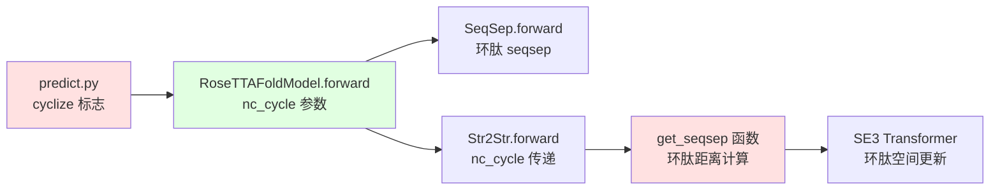

---
slug:24-cyclic-peptide-prediction
blog_type:normal
---


RoseTTAFold2 中的环肽预测解决了肽链的结构建模难题，这类肽链的 N 端和 C 端共价连接，形成闭环拓扑结构，这从根本上改变了对残基之间空间关系的计算和解释方式。该实现在序列间隔编码和坐标生成机制中引入了专门的修改，以便在整个迭代结构预测流程中强制执行环肽约束。

## 核心架构与设计

环肽预测功能通过 `nc_cycle`（非环循环）参数实现，该参数贯穿三轨架构，修改序列间隔计算以解决线性肽链中首尾残基之间的拓扑不连续性。当 `cyclize=True` 时，系统将肽链视为一个闭环，其中残基 0 与残基 L-1 相邻，这从根本上改变了距离和角度关系的编码与处理方式。

```mermaid
flowchart TB
    A[输入: 环肽序列] --> B{cyclize 标志?}
    B -->|True| C[启用环肽模式]
    B -->|False| D[标准线性模式]
    C --> E[MSA 生成与特征化]
    D --> E
    E --> F[序列间隔编码<br/>包含环肽拓扑]
    F --> G[三轨处理<br/>MSA | Pair | 3D 结构]
    G --> H[环肽感知坐标更新]
    H --> I[迭代循环<br/>包含环肽约束]
    I --> J[最终环肽结构<br/>包含 N-C 键闭合]
    
    style C fill:#e1f5ff
    style F fill:#fff4e1
    style H fill:#fff4e1
```

### 环肽拓扑的序列间隔编码

基础修改发生在 `Track_module.py` 中的 `SeqSep` 类中，该类计算成对表示的相对位置编码。对于环肽，序列间隔计算会环绕序列边界，将肽链视为环面拓扑而非线性链。

来源：[Track_module.py](network/Track_module.py#L28-L48)

该实现应用模运算来计算序列间隔：`(seqsep + L//2) % L - L//2`，这确保了残基 0 和残基 L-1 之间的间隔被计算为 -1 而不是 L-1，正确反映了它们在环肽结构中的空间邻近性。这种环绕处理在保持间隔有界范围的同时，在特征编码中维持了正确的空间关系。

### 与三轨架构的集成

环肽拓扑参数在三轨架构中传递，在多个处理阶段修改行为：

1. **MSA 轨**：序列间隔编码影响注意力机制和协同进化信号提取
2. **Pair 轨**：修改后的相对定位影响成对距离和方向预测
3. **结构轨**：SE(3) Transformer 操作融合环肽感知的空间关系

参数流展示了环肽约束的系统性集成：



来源：[RoseTTAFoldModel.py](network/RoseTTAFoldModel.py#L52-L58), [Track_module.py](network/Track_module.py#L533-L587)

## 用法与配置

### 命令行界面

环肽预测通过预测管道中的 `-cyclize` 标志激活，可以通过直接 Python 接口或通过包装脚本调用。

**直接 Python 调用：**

```bash
python network/predict.py \
    -inputs input.a3m \
    -prefix output_prefix \
    -cyclize \
    -n_recycles 4 \
    -n_models 1
```

**predict.py 中的参数指定：**
`cyclize` 参数在参数解析器中定义为布尔标志，默认为 `False`，进行环肽建模时需要显式激活。

来源：[predict.py](network/predict.py#L49-L50), [predict.py](network/predict.py#L251-L255)

### 模型前向传播集成

`nc_cycle` 参数贯穿整个模型前向传播，从 `Predictor.predict()` 方法开始，该方法将 `cyclize` 传递给 `run_prediction()`，随后传递给模型的前向方法。这种参数流确保所有下游组件在一致的环肽拓扑感知下运行。

来源：[predict.py](network/predict.py#L528), [predict.py](network/predict.py#L444)

## 技术实现细节

### 序列间隔计算

环肽的核心算法修改发生在 `Str2Str` 类中的序列间隔计算中：

**线性肽链：** `seqsep = idx2[:,None,:] - idx[:,:,None]`  
**环肽：** `seqsep = ((idx2[:,None,:] - idx[:,:,None]) + L//2) % L - L//2`

环肽版本将间隔范围以零为中心，最大幅度为 L/2，确保首尾残基之间的间隔被正确识别为最小（在环肽拓扑中相邻）而不是最大（在线性拓扑中远离）。

来源：[Track_module.py](network/Track_module.py#L37-L41)

### SE(3) Transformer 修改

在 `Str2Str.forward()` 方法中，`nc_cycle` 参数被传递给 `get_seqsep()`，该函数计算用于边特征构建的序列间隔嵌入。这些边特征为驱动 SE(3) Transformer 更新坐标和方向的 top-k 图构建提供信息。

环肽感知的边特征确保：
1. 空间注意力模式考虑 N 端到 C 端的邻近性
2. 图构建正确识别跨越环肽边界的邻居
3. 坐标更新在迭代优化期间遵守闭环拓扑

来源：[Track_module.py](network/Track_module.py#L565-L592)

### 环肽约束下的循环

在迭代循环期间，环肽参数在所有循环迭代中保持一致性。模型在改进的同时保持环肽拓扑感知，允许 N-C 端闭合从学习的结构模式中自然产生，而不是被人为强制执行。

来源：[predict.py](network/predict.py#L495-L543), [RoseTTAFoldModel.py](network/RoseTTAFoldModel.py#L96-L98)

## 架构考虑与限制

### 与对称感知预测的交互

环肽预测独立于对称感知预测功能运行。`cyclize` 标志强制单条链内的 N-C 端连接性，而 `symm` 参数对非对称单元的多个副本应用旋转对称操作。这些功能解决不同的拓扑约束，可以独立使用或组合使用于复杂的环状寡聚体。

来源：[predict.py](network/predict.py#L40-L41), [predict.py](network/predict.py#L252-L253)

### 坐标生成与闭合

环肽拓扑通过 SE(3) Transformer 层影响坐标生成，这些层预测每个残基的旋转和平移。序列间隔编码确保靠近 N 端和 C 端的残基的坐标更新考虑它们的空间邻近性，促进环肽结构的自然闭合，而不需要在损失函数中显式的键长约束或闭合惩罚。

来源：[Track_module.py](network/Track_module.py#L599-L617)

### MSA 处理考虑

环肽由于非规范连接性和可能的环排列，通常给 MSA 生成带来独特的挑战。当前实现假设输入 MSA 以线性形式正确对齐，环肽拓扑强制执行发生在结构预测期间而不是 MSA 特征化期间。

来源：[predict.py](network/predict.py#L276-L306)

## 性能与最佳实践

### 预测质量指标

预测环肽时，监控标准置信度指标：
- **预测 LDDT (pLDDT)**：每残基置信度分数，在输出 PDB 文件中显示为 B 因子
- **预测对齐误差 (PAE)**：残基间距离精度估计
- **RMSD 收敛**：循环迭代之间的变化表明稳定化

N-C 端闭合质量可以通过检查 N 端（残基 0，N 原子）和 C 端（残基 L-1，C 原子）之间的距离来评估，在高质量的环肽预测中，该距离应接近典型的肽键长度（~1.33 Å）。

### 推荐配置

**对于小型环肽（≤ 20 个残基）：**
```bash
python network/predict.py \
    -inputs peptide.a3m \
    -prefix cyclic_peptide \
    -cyclize \
    -n_recycles 6 \
    -nseqs 256 \
    -nseqs_full 2048
```

**对于大型环肽（> 20 个残基）：**
```bash
python network/predict.py \
    -inputs large_peptide.a3m \
    -prefix large_cyclic \
    -cyclize \
    -n_recycles 8 \
    -nseqs 512 \
    -nseqs_full 4096 \
    -low_vram
```

增加循环迭代通常可以改善具有挑战性的环肽拓扑的收敛性，而 `low_vram` 标志允许在内存受限的硬件上预测更大的环肽。

来源：[predict.py](network/predict.py#L42-L48), [predict.py](network/predict.py#L96-L137)

<CgxTip>
环肽预测功能于 2024 年 5 月引入，代表了 RoseTTAFold2 灵活架构的专门应用。为了对含有非标准氨基酸或翻译后修饰的环肽获得最佳结果，请确保正确的化学参数化，并考虑在结构数据库中存在同源环肽时提供模板结构。
</CgxTip>

## 未来开发考虑

当前实现为环肽结构预测奠定了基础。潜在的增强可能包括：
- N-C 端闭合的显式键几何约束
- MSA 生成中的环排列检测
- 环肽拓扑验证的专门损失组件
- 与环肽和约束肽的小分子配体预测集成

## 后续步骤

要了解更广泛的架构背景：
- **三轨设计**：在 [三轨设计：MSA、Pair 和 3D 结构轨道](6-three-track-design-msa-pair-and-3d-structure-tracks) 中了解 MSA、Pair 和 3D 结构轨道
- **坐标生成**：在 [使用 SE3 层生成坐标](14-coordinate-generation-with-se3-layers) 中探索基于 SE(3) Transformer 的坐标更新
- **循环机制**：在 [迭代优化的循环机制](8-recycling-mechanism-for-iterative-refinement) 中理解迭代优化
- **对称功能**：在 [对称感知预测](15-symmetry-aware-prediction) 中与对称感知预测进行比较